# 最大似然(ML)与 REML

> 原文：<https://towardsdatascience.com/maximum-likelihood-ml-vs-reml-78cf79bef2cf?source=collection_archive---------3----------------------->

## [生命科学的数理统计和机器学习](https://towardsdatascience.com/tagged/stats-ml-life-sciences)

## 基于限制最大似然的线性混合模型

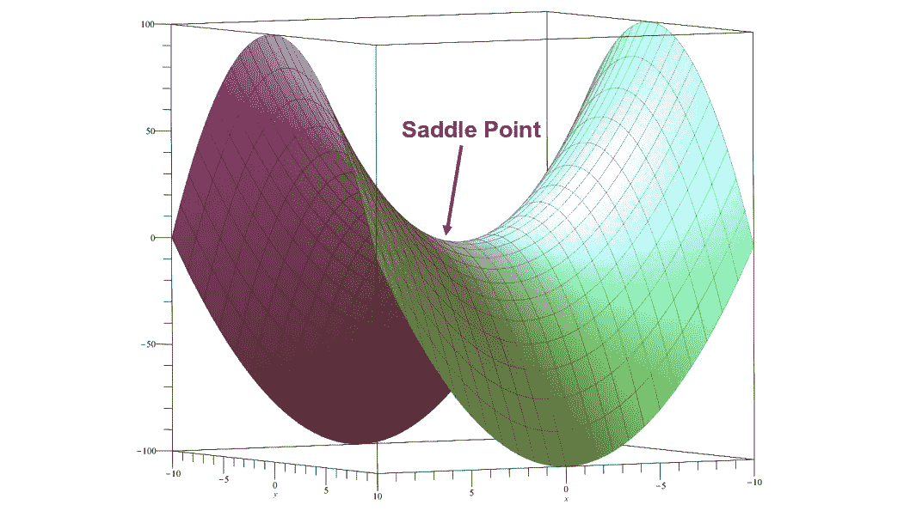

作者图片

这是来自专栏 [**生命科学的数理统计和机器学习**](https://towardsdatascience.com/tagged/stats-ml-life-sciences?source=post_page---------------------------) 的第十九篇文章，我试图以简单的方式解释生物信息学和计算生物学中使用的一些神秘的分析技术。这是致力于线性混合模型(LMM)系列的最后一篇文章。之前我们讲过 [**线性混合模型如何工作**](/how-linear-mixed-model-works-350950a82911) ，如何从 R 中的**最大似然(ML)** 原理出发，从零开始推导并编程 [**线性混合模型**](/linear-mixed-model-from-scratch-f29b2e45f0a4) 。今天我们将讨论**限制最大似然(REML)** 的概念，它为什么有用，以及如何将其应用于线性混合模型。

# 最大似然有偏方差估计量

受限最大似然( **REML** )的思想来源于认识到最大似然(ML)给出的方差估计量是有偏的。什么是估计量，它以何种方式存在偏差？估计量只是模型参数的近似值/估计值。假设统计观测值服从正态分布，如果要对观测值进行汇总，需要估计两个参数: *μ* (均值)和 *σ* (方差)。原来最大似然(ML)给出的**方差估计量**是**有偏的**，即我们从 ML 模型得到的值高估或者**低估了** **真实方差**，见下图。

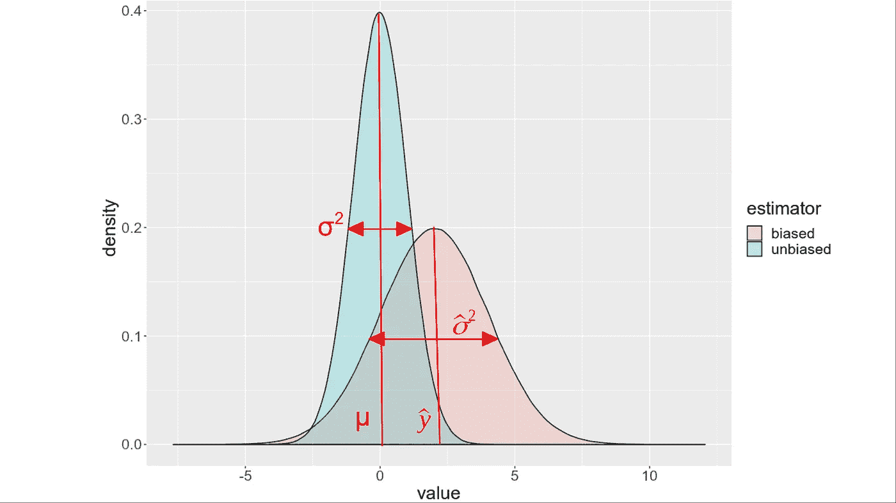

有偏与无偏估计量的图解。作者图片

在实践中，当我们例如使用 ML 求解一个[线性回归](https://en.wikipedia.org/wiki/Linear_regression)模型时，我们很少考虑方差估计量中的偏差，因为我们通常对线性模型的**系数感兴趣，即** **平均值**，并且经常没有意识到我们并行地估计**另一个**拟合参数，即方差。在这种情况下，方差被认为是所谓的 [**干扰参数**](https://en.wikipedia.org/wiki/Nuisance_parameter) ，这不是我们主要关心的。

为了证明 ML 确实给出了有偏方差估计量，考虑一个简单的一维情况，其中变量 *y* = ( *y* 1， *y* 2，…， *yN* )遵循正态分布。

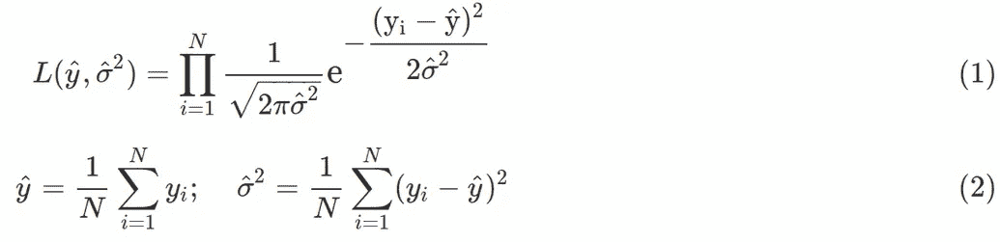

最大似然，等式。(1)，导致均值和方差的估计量，方程。(2)、推导请到我的 [github](https://github.com/NikolayOskolkov/REML) 查看笔记本。为了证明等式中的方差估计量。(2)有偏，我们将推导方差估计量的期望值，并证明它不等于方差的真值*，σ* 。为此，我们首先重新安排方差估计量，方程。(2)通过将未知的真实均值 *μ* 显式地包括到等式中:

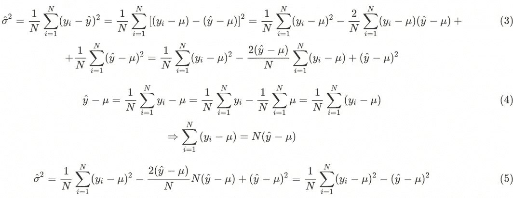

最后，让我们计算方差估计量的期望值:

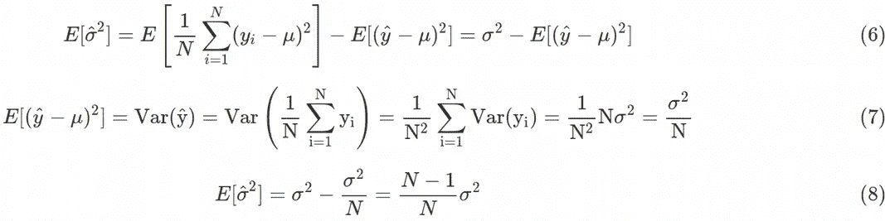

这里我们可以看到，ML 方差估计值的**期望值不等于真实方差 *σ* ，尽管它在大样本量时接近真实方差。因此，ML 给出的方差估计量**向下偏移**，即**低估了真实方差**。当 N > > 1 时，偏差似乎可以忽略不计，直到我们认识到等式。(8)是针对一维数据获得的。使用高维数据，这是现实世界中的典型问题，我们可以得到方差的严重有偏估计，因为它可以被导出，例如查看精彩的教程[这里的](https://people.csail.mit.edu/xiuming/docs/tutorials/reml.pdf)，对于 k 维数据，方差估计的期望值采用以下形式:**

因此，当维数 *k* 接近样本数/统计观测值*，N* 时，ML 低估真实方差的问题变得尤其尖锐。我们得出结论，在**高维**空间中，最大似然(ML)原理只在极限 *k* < < *N* 中起作用，而**有偏** **结果**可以在***k*≈*N****中得到。*这种偏见需要被考虑进去，这正是 REML 发挥作用的地方。

# 基于 REML 的线性混合模型

ML 的**有偏方差估计量的问题似乎是由于我们使用了一个**未知的均值估计量**来计算方差估计量。相反，如果我们确保对数似然函数**不包含任何关于均值**的信息，我们可以针对方差分量对其进行优化，并获得一个**无偏方差估计量**。这就是受限最大似然法(REML)的本质。在这种情况下，**平均值(不像 ML 的方差)**被认为是一个**干扰参数**，应该以某种方式从等式中移除。从对数似然函数中去除关于平均值的信息的一种方法是计算一个**边际概率**，即**对平均值**上的对数似然进行积分。在之前的帖子 [**LMM 从零开始**](/linear-mixed-model-from-scratch-f29b2e45f0a4) 中，我们看到了对于处理高维数据的多元分析，Eq 的扩展。(1)由**给出的多元高斯分布**:**

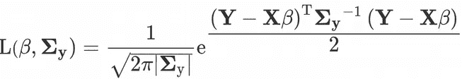

其中**σ**y**是方差-协方差矩阵，它是等式中简单残差方差的推广。(1).这里，我们将对多元高斯分布(对数似然)取对数，并对平均值*、β* 的对数似然进行积分，得到方差分量的**无偏估计值**。因此，我们需要计算以下积分:**

**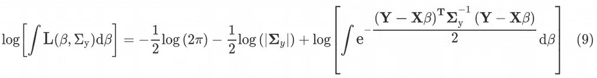**

**为此我们将使用**鞍点**方法( [**拉普拉斯近似**](https://en.wikipedia.org/wiki/Laplace%27s_method) )。在这种方法中，由于指数函数在方程的第三项积分下。(9)下降非常快，这足以计算指数*、指数* ( *f* ( *β* ))中函数 *f* ( *β* )的**最大值**中的积分，这将对指数做出最大贡献，并因此对等式(1)中的积分做出最大贡献。(9)，并因此的可能性。通过 *f* ( *β* 表示指数中的函数，我们可以在均值估计点附近通过泰勒级数展开**来近似它:****

**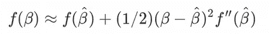**

**这里**线性项为零**是因为 [**极值条件**](https://en.wikipedia.org/wiki/Maxima_and_minima) 。这里，我们假设在现实中，真实均值的似然性是最大的，但是估计量离真实均值不远，因此可以执行泰勒级数展开。回到等式的第三项。(9)，并且将指数中的函数表示为 *f* ( *β* )，围绕均值估计量的泰勒级数展开给出:**

****

**其中 **|…|** 是行列式的符号。等式中的前两项。(12)是我们在 [**LMM 从无到有**](/linear-mixed-model-from-scratch-f29b2e45f0a4) (Eq。(10)在那篇文章中)。相比之下，**第三项**来自 REML 方法。人们可以把这个额外的项看作是一个**惩罚模型** ( [脊/套索/弹性网](https://en.wikipedia.org/wiki/Lasso_(statistics)))中的一个惩罚(或偏差)，我们在线性回归(或 LMM)模型中的系数上加了一个**约束**。让我们来看看这个来自 REML 的**附加项如何影响**玩具数据集**的线性混合模型(LMM)的解决方案，该模型是在 [LMM 从零开始](/linear-mixed-model-from-scratch-f29b2e45f0a4)帖子中介绍的。****

# **LMM 通过 REML 的玩具数据集**

**为了简单起见，我们只考虑了 **4 个数据点**: 2 个来自个人#1，另外 2 个来自个人#2。此外，这 4 个点分布在两种情况之间:**未治疗和治疗**，请参见下图。在处理栏中，0 表示未处理，1 表示已处理。**

**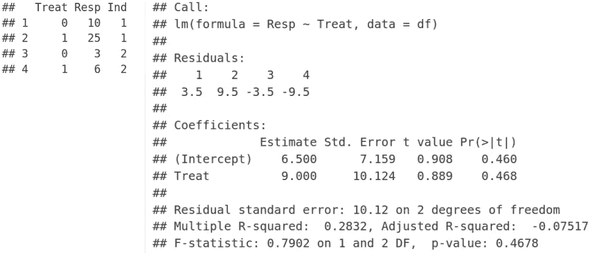****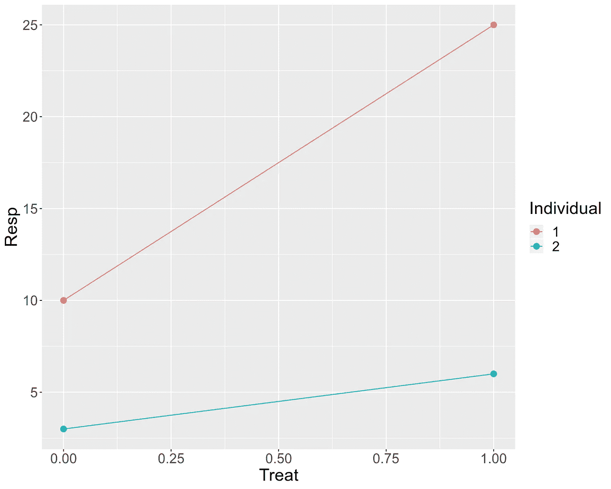**

**我们使用 LMM 拟合数据，使用 **lme4** R 包中的 **lmer** 函数对斜率和截距进行**固定效应，对截距进行**随机效应。包括考虑分组因子 **Ind** (个体 ID)的随机效应截距，我们还需要为 **lmer** 函数使用特殊的语法 **(1 | Ind)** 。现在，我们可以使用**限制最大似然(REML)** 方法来拟合 LMM 模型，为此，我们指定 **REML = TRUE** :**

**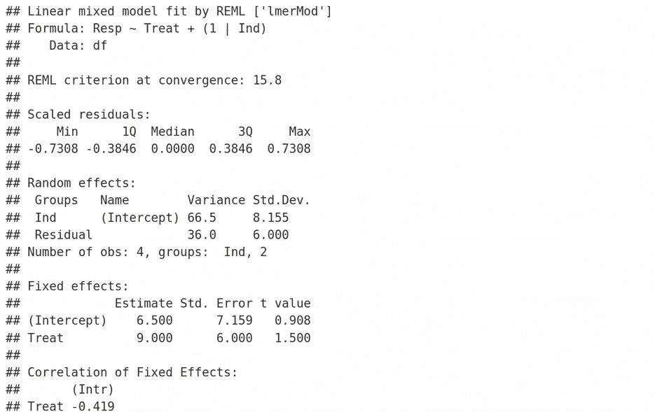**

**请注意**共有的**和**剩余标准差**、 **8.155** 和 **6.0** ，我们在上一篇文章中分别表示为 ***σs*** 和 ***σ*** 。我们将在稍后为 LMM 实施 REML 解决方案时重现这些值。正如我们在之前的[LMM _ 从头开始](/linear-mixed-model-from-scratch-f29b2e45f0a4)教程中看到的，知道数据点 y11，y12，y21，y22 的坐标，方程中的前两项。(12)可以计算为:**

**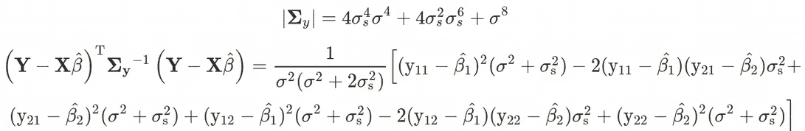**

**等式中的第三项。(12)也可以从**解析导出**，因为我们既知道 **X** 、**设计矩阵**，也知道逆方差协方差矩阵**σ**y。下面我们呈现一个来自 [Maple 软件](https://www.maplesoft.com/)的截图，其中显示等式(1)中的第三项。(12)采取的形式:**

**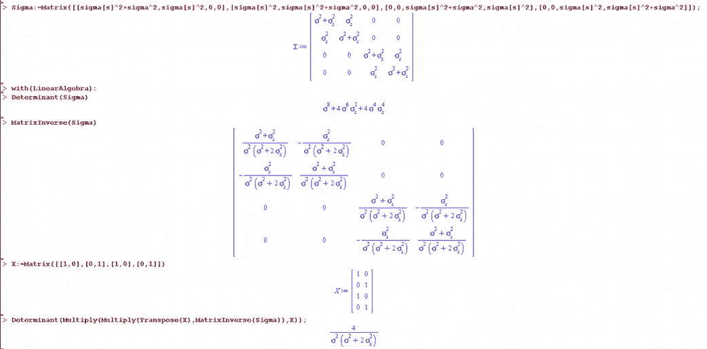**

**因此，等式中的第三项。(12)有以下简单的表达式:**

**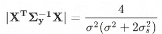**

**因此，我们现在可以在限制最大似然(REML)近似中最小化对数似然函数，即当对数似然等式。(12)函数不包含任何关于平均值 *β，*的信息，即这**不再是优化**的参数，而是具有固定/估计值 *β* 1=6， *β* 2=15.5，这是[之前找到的](/linear-mixed-model-from-scratch-f29b2e45f0a4)。现在，一切都准备好执行对数似然函数 Eq 的**数值最小化**。(12)关于 REML 近似中的 *σs* 和 *σ* :**

**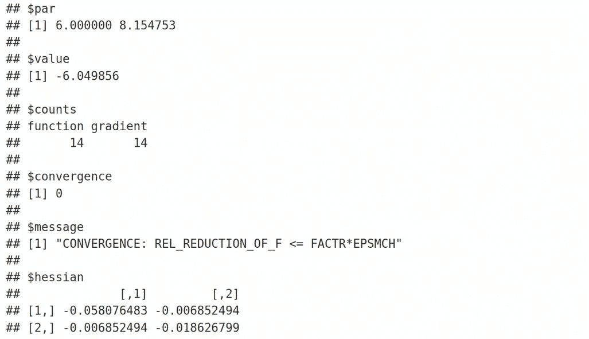**

**通过对数似然函数的最小化，我们获得了***= 6.00****和***【σs】*= 8.155**，这正是我们通过 lmer 函数以及 **REML = TRUE** 获得的标准偏差。我们复制了**随机效应残差方差 *σ* ，并在本帖中分享了**最大似然(REML =假)**和**受限最大似然(REML =真)**的数据点方差 *σs*** 。而且，我们已经用 R 从头开始推导并编码了它，干得好！***

# ***摘要***

***在本文中，我们了解到最大似然(ML) **方差估计量是有偏的，特别是对于高维数据**，由于使用了未知的均值估计量。限制最大似然(REML)通过在最小化对数似然函数之前首先移除关于均值估计器的所有信息来解决这个问题。我们成功地复制了 lmer 报告的 REML = TRUE 的方差分量，并使用 r 从头推导和编码了 REML。***

***在下面的评论中，让我知道哪些来自生命科学的分析技术对你来说似乎是 T42 特别神秘的，我会在以后的文章中尽量涉及它们。检查我的 [Github](https://github.com/NikolayOskolkov/REML) 上的帖子中的代码。请在媒体 [Nikolay Oskolkov](https://medium.com/u/8570b484f56c?source=post_page-----78cf79bef2cf--------------------------------) 关注我，在 Twitter @NikolayOskolkov 上关注我，并在 [Linkedin](http://linkedin.com/in/nikolay-oskolkov-abb321186?source=post_page---------------------------) 上关注我。在下一篇文章中，我们将讨论**如何在 UMAP 空间聚集**，敬请关注。***