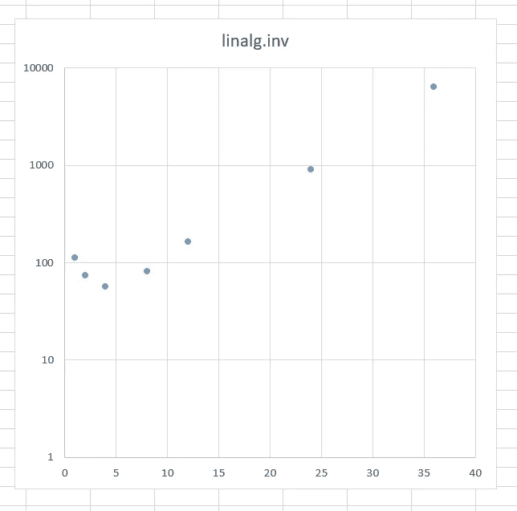
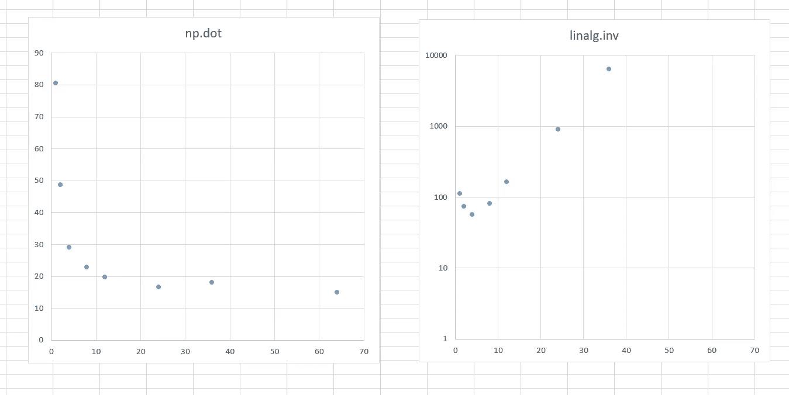

# 64 核服务器会比我的笔记本电脑慢 100 倍吗？

> 原文：<https://towardsdatascience.com/may-a-server-with-64-cores-be-100x-slower-than-my-laptop-e648f6e69c0e?source=collection_archive---------41----------------------->

## 这里没有剧透；-)

# 是

很久以前，我在 Twitter 上问是否有人能帮我解决一个令人困惑的问题。我使用的一个工具利用了 *scipy* 线性代数软件包来执行计算。大部分时间都花在了运行 [*pinv*](https://numpy.org/doc/stable/reference/generated/numpy.linalg.pinv.html) 函数上，这使得计算逆矩阵。 *scipy.linalg* 模块中有四个函数可以计算逆矩阵: *pinv* 、 *pinv2* 、 *pinvh、*和 *inv* 。前三种使用不同的方法计算伪逆矩阵，最后一种是显式计算逆矩阵，它们产生或多或少相同的结果(一般在舍入误差范围内)。在本地笔记本电脑上的测试表明， *pinv* 是最慢的实现， *pinv2* 次之，然后是 *pinvh，*和 *inv* 最快。事实上，它比 pinv 快了 15 倍。这意味着，如果我们在工具的源代码中用 *inv* 替换 *pinv* ，我们的代码运行速度也会提高 15 倍！

*旁注:如果事先不知道* [*逆是否存在*](https://stackoverflow.com/questions/49357417/why-is-numpy-linalg-pinv-preferred-over-numpy-linalg-inv-for-creating-invers) *，不建议使用 inv。但是在我们的例子中，它几乎总是存在的，所以 inv 可以用作默认选项，我们仍然可以使用 pinv2 作为后备。*

*Sidenote 2:如果你正在使用 numpy，那么请注意 numpy 和 scipy 在命名上有不同的约定。numpy pinv 或多或少相当于 scipy pinv2，所以不要与下面 tweet 中的命名混淆。*

我们的代码花了 8 个小时在真实世界的数据集上完成。让它在 30 分钟内运行的机会太好了，不能不尝试！但是，意想不到的事情发生了。在本地， *inv* 是最快的方法，但是在服务器上却非常慢！

其余 3 个伪逆实现的时序符合我们的预期。但是 *inv* 就是不符合预期:

Twitter 的智慧给了我三个同样好的主意:

对目标进行优化编译很重要，所以 Niko 的建议可能非常真实。阵列的[内存布局](https://eli.thegreenplace.net/2015/memory-layout-of-multi-dimensional-arrays/)也非常重要。如果你曾经使用过 *numba* 来优化你的代码(我曾经使用过)，你可能已经体验过，当 *numpy* 数组在内存中正确定位时，你的代码变得有多快，所以 Moritz 的建议看起来也不错。然而，Petar 的建议很奇怪。我的意思是，它不可能*可能是*，一个备受尊敬的基于 C 的 BLAS 包会以这样一种方式编写，它会在服务器上失败，*可能吗？*

我想你已经可以猜到，接下来发生了什么。

重新编译毫无用处。记忆布局也与本案无关。结果是， *inv* 存在一些并发问题。可以指定，[BLAS 可以使用多少个线程](https://github.com/xianyi/OpenBLAS#setting-the-number-of-threads-using-environment-variables)。下面是应用于测试数据的 *inv* 的执行时间，作为线程数量的函数(注意，y 轴是对数):

你可以看到，执行时间是如何下降的，然后*突然*在大约五个内核之后开始增长。更有趣的是，随着越来越多的内核被使用，执行时间呈指数增长。

## 因此，我们的解决方案是限制内核数量，让代码运行得更快

奇怪的是，并非所有的数学函数*和*都是如此！虽然 *inv* 已经减速，但 *np.dot* 的表现与预期一致。当提供更多内核时， *np.dot* 的执行时间变得更短，直到在 10-15 个内核左右达到饱和:

最后，作为折衷，我们将代码中使用的内核数量限制为 6 个。在我们的代码中，第二耗时的函数 *np.dot* 在使用六个内核时已经足够快了。对于 *scipy inv，*这是最佳解决方案。

我们实现了 15 倍的速度提升吗？不幸的是，没有。 *pinv* 实际上并没有占用所有的代码执行时间，而且还有其他部分没有受到这个变化的影响。但是我们仍然通过替换代码中的两个字符来节省*几个小时*的执行时间。要是一直这么简单就好了。

# 结论

*   使用 profiler 测量您的代码和您正在使用的包的代码的执行时间。
*   试着找到一行或一个函数，它至少需要 10-20%的运行时间。
*   如果你能加快速度。
*   为不可预见的后果做准备*，*拥抱它们，并把它们作为学习新东西的机会*。*
*   *总是在生产环境中测试你的代码。*

— —

在[**Twitter**](https://twitter.com/siberianpython)(*siberianpython*)上连接以获取更多技术主题和帖子，或者在 [**LinkedIn**](https://www.linkedin.com/in/dmitrii-borisevich/) 上连接。