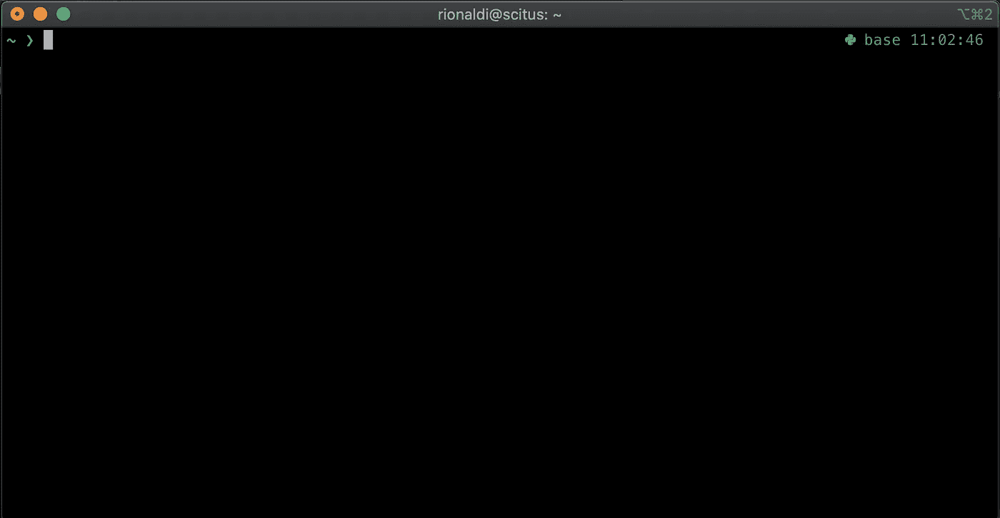
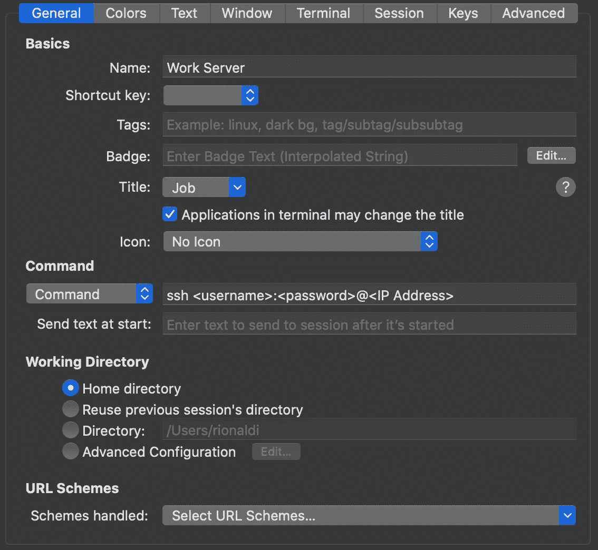
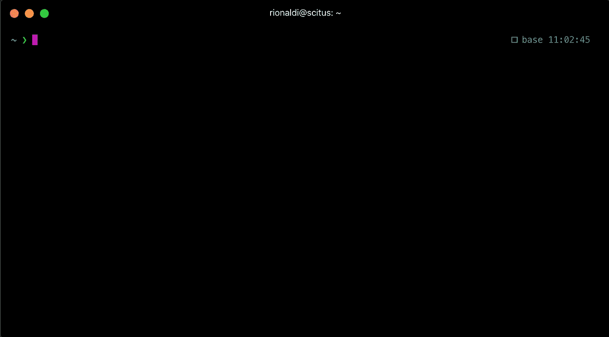
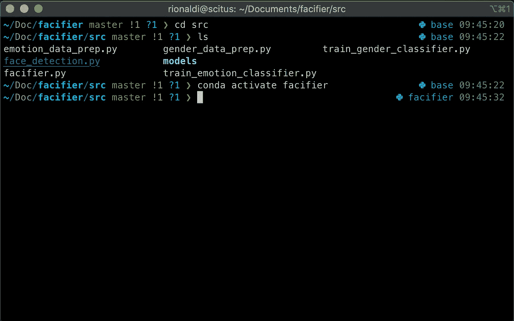

# 也许是时候升级你的终端体验了

> 原文：<https://towardsdatascience.com/maybe-its-time-to-upgrade-your-terminal-experience-a9e12b2af77?source=collection_archive---------30----------------------->

## 学习机

## 默认的 MacOS 终端不适合你，也不适合任何人


安东尼·加兰德在 Unsplash[上的照片](https://unsplash.com?utm_source=medium&utm_medium=referral)

你买过床垫吗？

让我告诉你我与臭名昭著的床垫推销员打交道的经历。

推销员会说服你买一些你并不真正需要的东西，或者你确实需要的更贵的东西。

就我个人而言，我喜欢安静地购物。这意味着我不希望在我浏览的时候有售货员跟着我。然而，几乎不可能找到一家没有销售人员的床垫商店。

一旦你听到一个推销词，你就会意识到所有的都是完全一样的。几乎就像你反复看的电影剧本。

*“我们的床对你的脊椎有好处。”*

想想如果你睡在劣质床垫上，你以后会有多少医疗账单

“如果你不能享受金钱，那么拥有金钱又有什么意义呢？”

不过，在某一点上，其中一个投球很突出。

> “你每天花多少时间坐在车里？两个小时？你的车多少钱？同样，你每天在床上花多少时间？”

然后他展示了一个价值 5000 美元的床垫。

不过，我不是来告诉你买一个 5000 美元的床垫的。

我从那个推销中学到的是，你应该更加关注你在日常生活中实际使用的东西。

如果你是软件工程师、机器学习工程师或数据科学家，很有可能:

1.  你用苹果电脑
2.  你大部分时间都在使用终端

我相信，改善您日常使用的整个终端体验是一项很好的投资，从长远来看是值得的。

话虽如此，你还在用默认的 MacOS 终端吗？

# 终点站

有很多流行的终端替代品。我尝试过其中的一些，下面是我会推荐给朋友们的。

## [iTerm2](https://iterm2.com/)

迄今为止 MacOS 终端最强大的替代品。



iTerm2(图片由作者提供)

乍一看，它与默认终端非常相似。但是，它具有许多终端和其他终端替代品所不具备的功能。

在我看来，最突出的一个特征是侧面。

作为一名开发人员，大部分时间你将访问远程服务器来使用它们。每台服务器都有唯一的 IP 地址，你不想记住每台服务器的 IP 地址。

您可以在 ssh 配置文件`~/.ssh/config`中创建一个条目，如下所示:

```
Host work_server
    HostName <IP address>
    User <username>
```

然后，你可以简单地输入`ssh work_server`，而不是一遍又一遍地手工输入 IP 地址。

在 iTerm2 中，您可以为每台机器创建一个概要文件。下面是 ssh 到服务器的简单配置文件的设置。



iTerm2 配置文件设置(图片由作者提供)

之后，您只需从下拉菜单中选择配置文件，打开一个新的终端选项卡，您已经通过 ssh 连接到该机器。

这只是我如何使用配置文件的一个用例，这个特性还有很多其他的用例。

你为每个项目使用不同的 conda 环境吗？创建一个概要文件来直接打开项目的工作目录并运行命令`conda activate environment`来节省您的时间。

有一点需要注意，如果您没有使用 ssh 的概要文件，您需要将命令改为 Login Shell，然后在`Send text at start`字段添加命令。您也可以通过用`;`分隔来运行多个命令

对于默认的启动目录，你可以把`cd /path/to/workdir`放在`Send text at start`里面或者在`Directory`部分指定。

想让你的流量更快吗？使用热键指定快捷键来打开配置文件，如⌘^A.

## [超级](https://hyper.is/)

您喜欢开箱即用的漂亮终端吗？这可能是适合你的。



超级(作者图片)

Hyper 是 MacOS 最好看的终端替代品，使用 HTML、CSS 和 JS 构建。

Hyper 区别于其他终端的一个显著特征是它的插件。它有大量专为 Hyper 定制的插件。这里有一个名为 [*awesome-hyper*](https://github.com/bnb/awesome-hyper)

你可以很容易地安装插件，甚至通过编辑`~/.hyper.js`配置文件来改变主题或配色方案。

有很多有趣的插件，比如`hypergoogle`可以让你直接通过 Hyper 搜索谷歌。它会打开一个新的浏览器窗口，所以你不用担心在终端里浏览网页。`hyper-spotify`将在终端顶部或底部显示 Spotify 上当前播放的歌曲，并让您控制它，这对于不想一直呆在终端中的开发人员来说是完美的。

不幸的是，Hyper 没有 iTerm2 那样的 Profiles 特性。这是一个非常好且功能强大的终端，但是配置文件的便利性不断将我拉回 iTerm2。

## *优秀奖:*[](https://github.com/alacritty/alacritty)

*Alacritty 为自己是“现存最快的终端模拟器”而自豪。秘密？他们使用 GPU 来启动终端，与其他终端相比，这使得渲染速度非常快。*

*坏处呢？它消耗很多能量。*

*如果你总是在办公桌前工作，并且你的机器总是与充电线相连，那么它可能看起来没有那么糟糕。另一方面，如果你有时在舒适的沙发上工作，一旦你的笔记本电脑底部变热，电池需要更频繁地充电，你就会很快变得不舒服。*

*最重要的是，Alacritty 也不支持像 iTerm2 这样的概要文件，所以它不适合我。*

*不过这取决于你的主要关注点。如果你是所有关于速度和电池消耗不是一个问题，那么无论如何，这是一个给你的。*

# *定制您的终端*

*既然您已经选择了终端，是时候开始定制它们了。*

*无论你选择哪种终端，定制都应该适用于任何一种终端，即使你决定使用与上面列出的完全不同的终端。*

*这里有一个我用来安装家酿、zsh、oh-my-zsh 和 powerlevel10k 的快速脚本。*

*安装 homebrew、zsh、oh-my-zsh 和 powerlevel10k 的自动脚本*

*复制命令并逐行执行是可以的，因为只有几行。*

*您还可以将内容复制并保存到一个名为`terminal_upgrade.sh`的文件中，然后在目录中打开终端`cd`，并使用该命令授予执行权限。*

```
*chmod +x terminal_upgrade.sh*
```

*之后，执行这个命令来运行脚本。*

```
*./terminal_upgrade.sh*
```

*请注意，它不能自动安装 powerlevel10k 主题，请阅读 Powerlevel10k 部分以获得进一步的说明。*

*我将在下面的章节中详细介绍每一项。*

## *公司自产自用*

```
*/bin/bash -c "$(curl -fsSL https://raw.githubusercontent.com/Homebrew/install/master/install.sh)"*
```

*自制软件对于任何使用 MacOS 的开发者来说都是必不可少的。它是一个软件包管理器，允许你直接从终端安装很多东西。*

*几乎所有的主流软件包都可以通过自制软件安装，而且你可以通过安装自制的木桶来安装更多的东西。*

```
*brew install cask*
```

*甚至你可以通过家酿啤酒桶安装 iTerm2。*

```
*brew cask install iterm2*
```

*简而言之，这是一个必须拥有的包管理器，就像 Linux 中的`apt`。*

## *zsh*

```
*brew install zsh zsh-completions*
```

*如果 iTerm2 是 Terminal 的替代品，那么 zsh 就是 bash 的替代品。*

*Z shell 的简称，它构建在 sh (Bourne Shell)之上，就像它的对应物 bash (Bourne Again Shell)一样。*

*它有一些小的改进，比如不需要输入`cd`来浏览文档。*

*我很少使用这个特性，因为不是所有的终端都使用 zsh，所以使用`cd`是一个很好的实践，即使你知道 zsh 不需要它。*

*然而，您应该使用 zsh 的主要原因是因为 oh-my-zsh。*

## *[哦我的 zsh](https://github.com/ohmyzsh/ohmyzsh)*

```
*sh -c “$(curl -fsSL https://raw.githubusercontent.com/robbyrussell/oh-my-zsh/master/tools/install.sh)"*
```

*Oh-my-zsh 是 zsh 的一个框架，它使得为 zsh 安装和管理插件变得更加容易。*

*就像 Hyper 的插件一样，oh-my-zsh 的插件是在一个文件中定义的。在本例中，它是`~/.zshrc`文件。*

*需要注意的一点是，这是一个与 Hyper 完全不同的插件管理器。Hyper 和 oh-my-zsh 都可以使用，只要记住 Hyper 的插件在`~/.Hyper.js`中定义，oh-my-zsh 的插件在`~/.zshrc`中*

*这是 oh-my-zsh 的著名插件列表[，以及 oh-my-zsh](https://github.com/ohmyzsh/ohmyzsh/wiki/Plugins-Overview) 的主题列表[。](https://github.com/ohmyzsh/ohmyzsh/wiki/Themes)*

*要安装你想要的插件，只需把它放在 oh-my-zsh 配置文件的`plugins=()`行中。*

*对于主题，您可以在指定行`ZSH_THEME=...`中指定您想要使用的主题，这将我们带到最后一点。*

## *[功率级 10k](https://github.com/romkatv/powerlevel10k)*

```
*cd $ZSH_CUSTOM/themesgit clone [https://github.com/romkatv/powerlevel10k.git](https://github.com/romkatv/powerlevel10k.git) --depth 1*
```

*Powerlevel10k 是其前身(Powerlevel9k)的更快版本，并包含更多功能。*

*简而言之，这是我的终端主题。*

*在运行脚本在`$ZSH_CUSTOM/themes`目录中克隆 Powerlevel10k 之后，您需要编辑`~/.zshrc`中定义`ZSH_THEME`的代码行，如下所示。*

```
*ZSH_THEME=powerlevel10k/powerlevel10k*
```

*通过执行以下命令，重新加载 zsh 以使更改生效*

```
*source ~/.zshrc*
```

*它应该会启动 Powerlevel10k 配置向导。如果没有运行`p10k configure`来手动启动向导，并按照屏幕上的指示选择您想要的终端外观。*

*如果你的 oh-my-zsh 中有很多插件，当你第一次打开终端时，可能需要一段时间来加载插件。Powerlevel10k 有*即时提示*功能，让你在后台加载插件的同时开始使用终端。*

## *恭喜*

*你现在正式成为增强型 MacOS 终端俱乐部的成员。你盯着平庸的期末会议的日子已经一去不复返了。*

*如果你安装了上面列出的所有东西，你的终端应该是这样的。*

**

*最终结果(图片由作者提供)*

*如果您在 Powerlevel10k 中选择不同的定制选项，看起来可能会有所不同，但总体而言是相似的。就我个人而言，我喜欢它显示活跃的 Conda 环境和存储库的活跃分支的方式。*

*仅仅拥有一个漂亮的终端不会让你成为一个更好的程序员，但它肯定会帮助你成为一名程序员。这是我的另一篇文章，可以帮助你掌握终端。*

*[](https://medium.com/swlh/the-one-tool-that-every-machine-learning-engineer-should-master-68aecd920b0) [## 每个机器学习工程师都应该掌握的工具

### 你每天都在使用它，没有注意。

medium.com](https://medium.com/swlh/the-one-tool-that-every-machine-learning-engineer-should-master-68aecd920b0) 

它展示了如何轻松地在终端内部链接程序，创建自己的自定义命令，以及一些您可能使用过也可能没有使用过的有用命令。

最后要注意的是，定制你的终端没有错。这是你的终端，不是别人的。

我上面列出的一切都是我从开始数据科学家的职业生涯以来，一直对自己的终端做的事情。你的需求可能和我的不同，这完全没问题。

你如何定制你的终端并不重要，但我希望它能让你意识到默认的 MacOS 终端有多糟糕。

你知道罗宾·夏尔马说过，“拥有你的终端。提升你的生活"还是别的什么？* 

**《学习机》是一系列关于我所学到的东西的故事，我认为这些故事很有趣，值得分享。有时也是关于机器学习的基础。* [*获得定期更新*](https://chandraseta.medium.com/subscribe) *上新故事和* [*成为中等会员*](https://chandraseta.medium.com/membership) *阅读无限故事。**

*[](https://chandraseta.medium.com/membership) [## 成为媒体成员—里奥纳尔迪·钱德拉塞塔

### 作为一个媒体会员，你的会员费的一部分会给你阅读的作家，你可以完全接触到每一个故事

chandraseta.medium.com](https://chandraseta.medium.com/membership)*