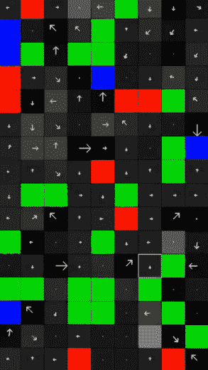
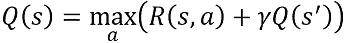
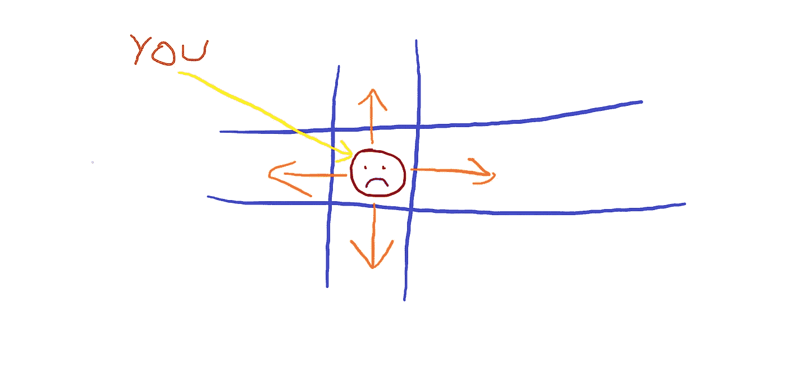
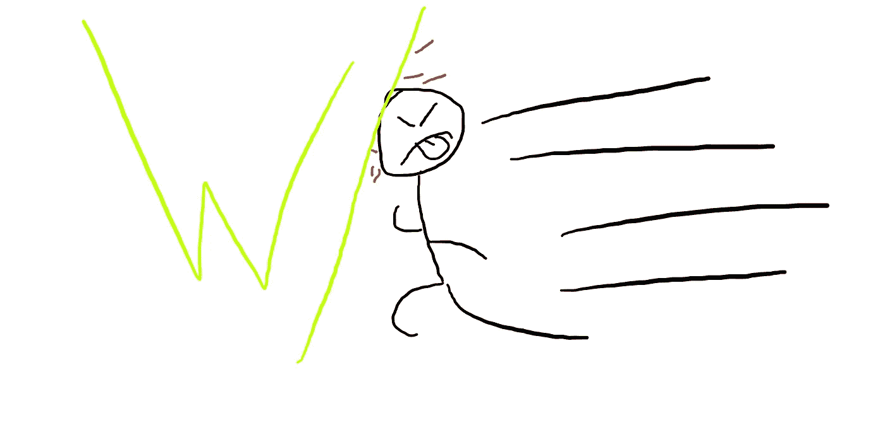
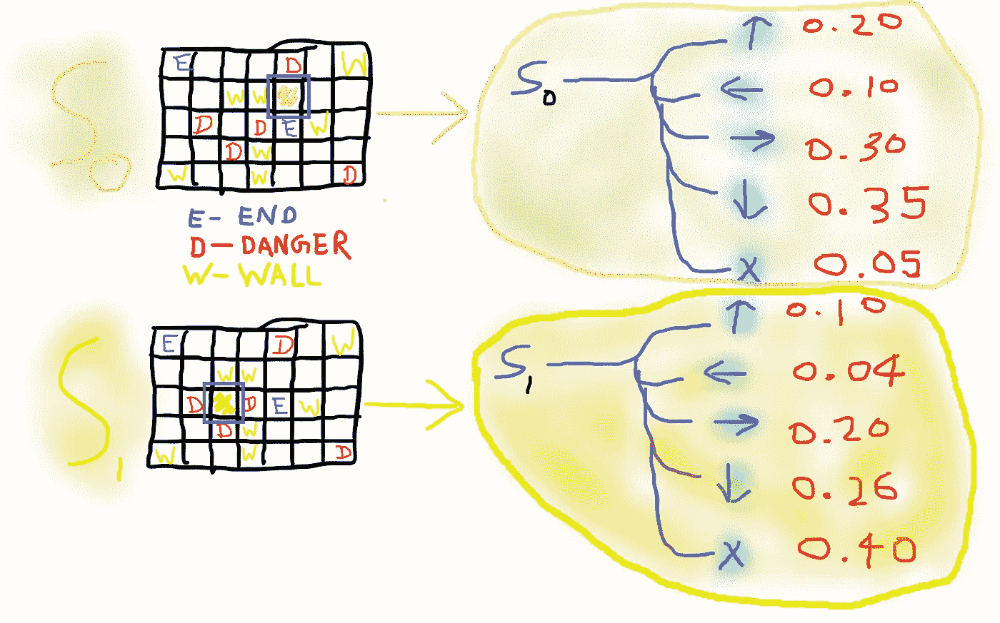
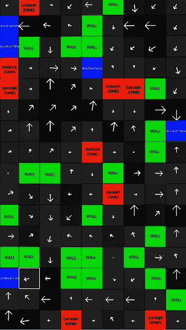
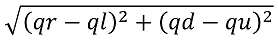

# 使用朴素强化学习的迷宫求解器

> 原文：<https://towardsdatascience.com/maze-rl-d035f9ccdc63?source=collection_archive---------15----------------------->

> 这是一个简短的迷宫求解游戏，我使用 numpy 和 opencv 用 python 从头开始写的(不到 260 行)。代码链接包含在最后。

箭头显示学习到的策略随着训练而改进。假设一个代理从任何地方开始，它应该能够跟随从它的位置的箭头，这应该引导它到最近的*目的地街区。*

我写这篇文章是为了理解 *Q-Learning* 的基本原理，并从头开始在代码中直接应用理论概念。如果你想用*强化学习*弄脏你的手，就跟着来吧！

**游戏目标-**

找到最佳移动策略，该策略将代理从任何*起点(显示在左边的黑灰色阴影中)*移动到最近的*目的地* *(蓝色左右)*箱子，同时避开*危险区域(红色)*和*墙壁(绿色)*箱子。

一个“策略”可以被认为是一组“智能运动”规则，代理学习如何在它的环境中导航。在这种情况下，它们被可视化为箭头(如左侧所示)。这是通过 **Q-Learning** 完成的。

**意义-**

你可能会问，制作这样的游戏人工智能在实际应用中是否有意义，这是公平的。实际上，这些都是玩具问题，它们的解决方案被设计成具有广泛的适用性。

*例如，当前的迷宫求解示例可以进一步扩展为占用网格中的自主导航，以到达最近的电动汽车充电站。*

# **Q 学习算法和 Q 表方法-**

Q-Learning 以贝尔曼方程为中心，寻找当前状态下每个动作的 *q 值*。寻找最优策略需要多次递归求解这个方程。

贝尔曼方程。这可以递归求解，以获得给定代理当前状态的不同动作的“Q 值”或“质量值”。

本文中将只解释与该实现相关的贝尔曼方程的主要部分。关于贝尔曼方程的更深入的基础知识，请查阅参考文献[1]。

## 什么是 Q 值？

想象你是一个不幸的人，被困在一个简单的 2D 世界里，就像下面这样-

对，就是你。你很难过。橙色箭头指示您可以在这个 2D 世界中进行的置换。

你看起来很悲伤。你应该害怕。谁愿意生活在 2D 的世界里呢？

嗯……让我们笑一笑，好吗？🎃

考虑到你唯一能做的移动就是左边图片中的橙色箭头(和一个无操作操作)，你必须找到去最近出口的路。

考虑到这些条件，在任何给定的阶段，你都必须对这些行动中的一个做出决定。为了做到这一点，你的大脑会考虑很多因素，对行动进行内部“排序”。这可能包括像-

*   最近的出口在哪里？
*   *有危险区域吗？*
*   *博伊的 dem 墙在哪里？*
*   这里为什么变热了？(我们将通过讨论每次代理什么都不做时增加小额奖励来达到这个目的)

现在你是一个高级人，隐式地处理这些，并为你在该点可以采取的每个动作(上、下、左、右、无操作)分配一个*质量值*或一个 *Q 值*。

但是你怎么能让计算机做到呢？

简单来说，你以某种方式给你可能遇到的每种情况下的每个动作分配一个数字 q 值。然而，这是*幼稚的*方法；如标题所述，我们将坚持这一点。对于更高级的东西，有大量的其他文章，你应该看看。

> 就像我们人类如何基于现实生活经验形成对“好”和“坏”行为的感知一样，代理人必须以类似的方式接受训练。

现在，这给我们带来了下面的问题-

## 什么是 Q 表？

简单地说，这是对*经验*的记忆——比方说，每次你必须在环境中做出决定和采取行动时，你都要更新和查询。

*你与 Q-table 关系的准确可视化表示显示在左侧。*

现在，为了建立 Q 表，你需要收集关于这个世界的信息。它需要知道危险区域，它可能会撞到的墙壁，以及几乎所有能帮助你不至于很快死去的东西(就像生命本身一样)。

> 为了做到这一点，让我们假设你可以死一千次。是的，牺牲对于科学是必要的。

有了这个，你将从随机地点开始，开始随机漫游，直到你开始形成对周围世界的感知。这种看法是由你四处漫游时所遇到的事情形成的。

你想避免痛苦。从这个意义上来说，在某些情况下的行为会带来-ve 回报。因此，无论何时你遇到他们，你都要在 Q 表中“记下他们”。

例如，你可能会撞上一堵墙——这很糟糕，因为你在流血。现在你要记住，在那种情况下，无论你做了什么让你流血的事，都不应该重复。

有时，你甚至会遇到大火肆虐的危险地带🔥🧨，只要你一踩上去，它就会结束你的生命。这比流血更糟糕，这将通过为这种经历分配一个更有价值的奖励值来量化。

现在为了生活中更好的事情。

同样，你也将记录下在迷宫中发生的所有*好的*事情*(当你收到+ve 奖励时)*。嗯，在这种情况下，只有一件好事会发生-**E S C A P E**

这听起来像是另一种死法，但是让我们假装它更有趣，因为它听起来和死亡不一样。

为了做到这一切，您将基本上构建一个表，存储在环境中的每个可能场景中执行每个动作的 q 值(请记住，这是有原因的*天真的*)。

> 在给定状态下，给定操作的 q 值越高，意味着您(代理)采取该操作的可能性越大。

下面显示了两种不同的状态，以及您(代理)在这些状态下可以执行的每个操作的示例 *q 值*。

在每种状态下，代理都位于棋盘世界中的方框区域。对于每个状态，右边显示的是代理可以采取的不同动作(从上到下分别为向上、向左、向右、向下、无操作)以及从 Q 表中导出的 Q 值。

然后，q 值作为采取下一步行动的指南，以最大化整体回报(这意味着逃避)。在此*天真*场景中，每一步都将依次执行以下操作-

1.  查询 Q-table，获取与您在当前状态下可以执行的不同操作相关的值。
2.  采取与最高 *q 值*相关的措施。
3.  记录新的状态和收到的奖励，并使用*贝尔曼公式*更新 Q 表。我们很快就会到这里。
4.  转到步骤 1。

# 学习可视化

最终学习到的在迷宫世界中可视化呈现的 Q 表。它是使用 numpy 在代码库中从头开始实现的。

给定定义的所有状态转换规则(在这种情况下，给定迷宫世界的基本性质，这是非常简单的)，在足够次数的重复这些迭代之后，代理根据应该在迷宫的每个位置执行的不同动作构建“*矢量场图*”，以便在最短时间内到达最近的目的地。

左边显示的是 Q 表的最终学习表示。

通过获得每个位置的不同 q 值的矢量和来可视化箭头。例如，如果我们有以下上、左、右、下的 q 值— *qu，ql，qr，qd*

然后，箭头在 2D 平面*(水平为 X 轴，垂直为 Y 轴)*上将使其 *x 分量*为 *qr-ql* 和 *y 分量*为 *qd-qu*

箭头的长度是这个向量的范数，用下面的公式得到

> 因此，如果你从迷宫中的任何一个地方开始，你都可以沿着箭头方向，避开墙壁和危险区域，到达最近的目的地。

# 探索迷宫时更新 Q 表-

这是问题中更具挑战性的部分之一，它极大地影响了你多快能得到甜蜜的释放(这不是死亡，让我们记住这一点，哈哈)。

## 基本上，这是一个问题—

> *你在给定的状态下采取最高 q 值的行动，随后，你在一个新的状态中结束(让我们希望简单，你现在不会死)。*
> 
> 接下来，您需要在 Q 表中记录您的行动是否让您更接近最近的目的地。你怎么能这样做？

你在这里要做的就是-

1.  *为每个动作定义的新旧状态下的现有 q 值。它们可能已经被随机初始化或者从先前的迭代中获得。*
2.  从旧状态进入新状态所获得的奖励。
3.  *您为从旧状态进入新状态而执行的操作。*

H 如果将来遇到旧状态，您会如何更改您获得的现有 Q 表值以做出更好的决策？

这是*非常基本的问题*，在这种情况下由贝尔曼方程回答-

贝尔曼方程。这可以递归求解，以获得给定代理当前状态的不同动作的“Q 值”或“质量值”。

以下是变量定义-

*   **一个**就是动作。
*   **s** 和**s’**分别是旧状态和新状态。
*   **𝛾** 是*贴现因子*，一个介于 0 和 1 *之间的常数。你需要这个来优先考虑当前的回报，而不是预期的未来回报。*
*   **Q(s)** 是你刚刚采取的从旧状态 **s** 到达新状态的动作 **a** 的 Q 值。
*   **Q(s’)**是新状态**s’**下的最大 Q 值。
*   **R(s，a)** 是你执行 **a** 从 **s** 过渡到**s’**立即获得的奖励。

> 最大术语是这里的秘方。这使得方程迭代通过每一个 **a** ，直到获得 **max** 项中表达式的最大值。它最终返回那个值 **q** 和相应的动作 **a** 。

从状态 **s** 执行的每个动作 **a** 都可能导致每次迭代的新状态**s’**。因此，每次都选择在**s’**处定义的 q 值的最大值*来计算 **max** 内的表达式。*

> 一旦获得了值 Q 和 **a** ，则在状态 **s** 下为动作 **a** 定义的 Q 表值将被 **q** 覆盖。

在我们的例子中，这个表示是*值函数(如果您没有得到这个，请不要担心；好吧，我刚刚在你身上拉了个吴恩达😈)*。

# 在迷宫中运行代理-

## 你终于成功了，恭喜你！下面是我的 meme page @ml.exe 给你的独家 RL meme，你值得拥有 bud。

别担心，健康的自恋不会要你的命。

> 经过足够次数的贝尔曼方程迭代后，你会收敛到每个状态下每个动作的最佳 q 值。
> 
> 当您想要运行代理时，只需从任意一个种子点开始，盲目地执行具有最高 q 值的动作。你会到达最近的目的地。

然而，要做到这一点，有一些注意事项

奖励政策应该精心设计。这意味着应该为每个状态下的每个行为分配正确的奖励值。由于这种情况非常简单，所以像下面这样的简单方案效果很好-

*   *discount_factor = 0.5*
*   *default_reward = -0.5*
*   *wall_penalty = -0.6*
*   *win_reward = 5.0*
*   *lose_reward = -10.0*

*默认 _ 奖励*是什么都不做而获得的奖励。还记得我们在本文开头问自己的一个基本问题吗？”；嗯，在这里。分配一个小的负面奖励鼓励代理人寻求行动来结束它的痛苦，而不是像一块肥胖的猪油一样无所事事。

*wall_penalty* 是从你现在的状态做动作时撞到墙得到的奖励。每当你撞上一堵墙，你就停留在原来的位置，同时获得这个“奖励”🤣。

*赢 _ 奖励*和*输 _ 奖励*不言自明。

如果你进入了任何一个危险区域，你就输了一局。在死亡时，你在格子上随机选择的位置重生。

在代码库中，您可以尝试奖励，看看它如何影响解决方案的收敛。

# 结论

如果您正确理解了本文中引用的步骤，您将能够完全理解我为实现所有这些而从头编写的代码库。你可以在这里找到它-

 [## ironhide23586/naive-dqn-maze

### 迷宫求解器使用朴素强化学习和 Q 表构造这是 Q 学习的一个实现…

github.com](https://github.com/ironhide23586/naive-dqn-maze) 

代码写出了代理培训和学习的视频，如下面的 YouTube 视频所示。你可以创造复杂多变的随机世界。

*如果您觉得这很有帮助，请随时关注我，获取更多即将发布的文章:)*

我是以下出版物的编辑，该出版物发表了与 AI & ML 在地球数字地图绘制中的使用相关的技术文章。请随时关注以保持更新:)

 [## 数字制图中的机器学习和人工智能

### 策划尖端人工智能和人工智能研究文章，来自从事设备、边缘、云和混合领域工作的行业科学家…

medium.com](https://medium.com/ai-ml-cv-in-enriching-digital-maps-navigation) 

# 参考文献-

1.  [https://medium . com/analytics-vid hya/bellman-equation-and-dynamic-programming-773 ce 67 fc 6a 7](https://medium.com/analytics-vidhya/bellman-equation-and-dynamic-programming-773ce67fc6a7)
2.  【https://www.instagram.com/ml.exe 
3.  [https://github.com/ironhide23586](https://github.com/ironhide23586)
4.  [https://www.youtube.com/user/mick23586](https://www.youtube.com/user/mick23586)

## 临时演员-

*   我也是一名音乐家。如果你喜欢金属和/或说唱——我的声音云简介在 https://soundcloud.com/souham-biswas
*   在[https://www.twitch.tv/souham](https://www.twitch.tv/souham)的常规聊天和游戏直播

> 谢谢:)