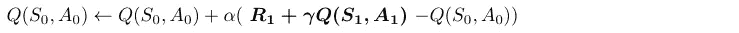

# MC 控制和时间差分方法

> 原文：<https://towardsdatascience.com/mc-control-methods-50c018271553?source=collection_archive---------22----------------------->

## [深度强化学习讲解— 14](https://towardsdatascience.com/tagged/deep-r-l-explained)

## 常数- *α MC 控制，Sarsa，Q 学习*


在这个*[*深度强化学习解释*](https://torres.ai/deep-reinforcement-learning-explained-series/)*系列的新帖子中，我们将改进蒙特卡罗控制方法来估计上一个帖子中提出的最优策略。在之前的蒙特卡罗控制算法中，我们收集了大量片段来构建 Q 表。然后，在 Q 表中的值收敛之后，我们使用该表来提出改进的策略。**

**然而，蒙特卡罗预测方法**可以一集接一集地逐步实现**，这就是我们在本文中要做的。即使在 Q 表中的值准确地逼近动作值函数之前更新了策略，这种较低质量的估计仍然具有足够的信息来帮助提出连续更好的策略。**

**此外，可以在每个时间步**更新 Q 表** **，而不是使用时间差方法等到剧集结束**。我们也将在本帖中回顾它们。**

> **[本出版物的西班牙语版本](https://medium.com/aprendizaje-por-refuerzo/6-obtenci%C3%B3n-de-pol%C3%ADticas-%C3%B3ptimas-87267b32df00)**

**[](https://medium.com/aprendizaje-por-refuerzo/6-obtenci%C3%B3n-de-pol%C3%ADticas-%C3%B3ptimas-87267b32df00) [## 6.优化政策委员会

### 访问第 6 页的自由介绍

medium.com](https://medium.com/aprendizaje-por-refuerzo/6-obtenci%C3%B3n-de-pol%C3%ADticas-%C3%B3ptimas-87267b32df00) 

# 蒙特卡洛控制的改进

在[之前的帖子](/monte-carlo-methods-9b289f030c2e)中，我们已经介绍了蒙特卡罗控制算法如何收集大量剧集来构建 Q 表(**策略评估**步骤)。然后，一旦 q-表非常接近动作-值函数 *qπ* ，算法就使用该表来提出改进的策略**t27】ππ**即*ϵ*-相对于 q-表(表示为***【ϵ-greedy(q】***)而言是贪婪的，这将产生比原始策略 ***π*** 更好的策略

也许在每集之后更新 Q 表**会更有效率？**是的，我们可以修改政策评估步骤，在每次互动后更新 Q 表。然后，更新的 Q 表可以用于改进策略。然后，新策略可用于生成下一集，以此类推:


恒定αMC 控制算法

在每一集之后更新策略(而不是等到 Q 表的值从许多集完全收敛之后才更新策略)的 MC 控制算法的最流行变体是**常数αMC 控制。**

## **恒αMC 控制**

在 MC 控制的这个变体中，在**策略评估**步骤期间，代理收集**一集**


使用最近的策略 *π* 。当情节在时间步 *T* 中结束后，对于每个时间步 *t* ，相应的状态-动作对 *(St，At)* 使用以下**更新等式**进行修改:


其中 *Gt* 是在时间步 *t* 的返回，而 *Q(St，At)* 是对应于状态 *St* 和动作*在*的 Q 表中的条目。

一般来说，这个更新等式背后的基本思想是，Q-table 的 *Q* ( *St* ，处的*)元素包含如果环境处于状态 *St* 并且代理在*处选择动作*时代理对预期回报的估计。然后，如果回报 *Gt* 不等于包含在 *Q(St，At )* 中的预期回报，我们“推送”Q(St，At )* 的值，使其与回报 *Gt* 稍微一致一些。我们对 *Q(St，At )* 的改变幅度由超参数 ***α*** 控制，该超参数**充当更新步骤的步长**。

我们应该始终将 *α* 的值设置为大于零且小于(或等于)一的数字。在最外层的情况下:

*   如果 *α* =0，则动作值函数估计永远不会被代理更新。
*   如果 *α* =1，那么每个状态-动作对的最终估计值总是等于代理经历的最后一次返回。

## ε贪婪策略

在[之前的帖子](/monte-carlo-methods-9b289f030c2e)中，我们提出，当我们的 Q 表近似不好时，随机行为在训练开始时更好，因为它为我们提供了关于环境状态的更均匀分布的信息。然而，随着我们训练的进行，随机行为变得低效，我们希望使用我们的 Q 表近似来决定如何行动。为此，我们在[之前的文章](/monte-carlo-methods-9b289f030c2e)中介绍了ε贪婪策略，这是一种混合了两种极端行为的方法，使用概率超参数 *ϵ* 在随机策略和 q 策略之间切换。通过改变 *ϵ* ，我们可以选择随机动作的比率。

我们将定义**策略是*ϵ*-贪婪**关于动作值函数估计 *Q* 如果对于每个状态，

*   在概率为 1-*ϵ*的情况下，代理人选择贪婪行为，并且
*   利用概率 *ϵ* ，代理从可用(非贪婪和贪婪)动作集合中随机一致地选择一个动作*。*

所以ϵ越大，你就越有可能选择一个不贪婪的行为。

为了构造一个策略 *π* ，即*ϵ*-相对于当前动作值函数估计 *Q* 是贪婪的，数学上我们将设置策略为


如果动作 *a* 最大化 *Q* ( *s* ， *a* )。其他


对于每个 *s* ∈S 和 *a* ∈A( *s* )。

在这个等式中，因为所有概率的总和需要为 1，所以包含了最优行动的额外项*ϵ*/∣a(*s*)∣(∣a(*s*)∣是可能行动的数量)。请注意，如果我们对执行所有非最优行动的概率求和，我们将得到(∣A(s)∣−1)×ϵ/∣A(s)∣，并将其加到 1-*ϵ*+*ϵ*/∣a(*s*)∣，最优行动的概率，总和为 1。

## 设置ε的值

请记住，为了保证 MC 控制收敛到最优策略*π*∑，我们需要确保条件**贪婪于无限探索的极限**(在之前的帖子中介绍过)确保代理继续探索所有时间步长，并且代理逐渐探索更多和探索更少。我们提出了满足这些条件的一种方法是修改 *ϵ* 的值，当指定一个 *ϵ* 贪婪策略时，使其逐渐衰减。

通常的做法是从 *ϵ* = 1.0 (100%随机动作)开始，然后慢慢减小到某个小值 *ϵ* > 0(在我们的例子中我们将使用 *ϵ* = 0.05)。通常，这可以通过引入值接近 1 的因子 *ϵ-decay* 来获得，该因子在每次迭代中乘以ϵ。

## 伪代码

我们可以用这个用于常数- *α* MC 控制算法的伪代码来总结前面所有的解释，它将指导我们实现该算法:


# 一个简单的 MC 控制实现

在这一节中，我们将按照上一篇文章中介绍的伪代码编写一个 constant-𝛼 MC 控制的实现，它可以帮助代理恢复 21 点环境中的最优策略。

> *本帖的* [*全部代码可以在 GitHub*](https://github.com/jorditorresBCN/Deep-Reinforcement-Learning-Explained/blob/master/DRL_13_14_Monte_Carlo.ipynb)*[*上找到，使用此链接*](https://colab.research.google.com/github/jorditorresBCN/Deep-Reinforcement-Learning-Explained/blob/master/DRL_13_14_Monte_Carlo.ipynb) *可以作为一个 Colab 谷歌笔记本运行。**

## *21 点环境下的 MC 控制算法*

*在之前的帖子中，我们实施了一个策略，如果玩家*的纸牌总数超过 21 点环境中的 18 张，那么这个玩家*几乎总是被粘住。在这种情况下，函数`generate_episode`使用程序员定义的策略对一集进行采样。*

*这里，MC 控制算法将估算并返回最佳策略，连同 Q 表，而不是由程序员硬编码的策略:*

```
*env = gym.make('Blackjack-v0')
num_episodes=1000000
alpha = 0.02
eps_decay=.9999965
gamma=1.0policy, Q = MC_control(env, num_episodes, alpha, eps_decay, gamma)*
```

*具体来说，`policy`是一个字典，它的关键字对应于一个状态`s`(一个 3 元组，指示玩家当前的总数、庄家的面朝上的牌以及玩家是否有可用的 a)，并且对应条目的值指示代理在观察到该状态之后按照该策略选择的动作。*

*记住由函数返回的另一个字典，Q-table `Q`，是一个字典，其中字典中给定条目的键对应于一个状态`s`，并且相应条目的值包含一个维数等于动作数量的数组(在我们的例子中是 2 维)，其中每个元素包含每个动作的估计动作值。*

*作为输入，该 MC 控制算法具有以下参数:*

*   *`env`:开放 AI 健身房环境实例。*
*   *`num_episodes`:生成的剧集数。*
*   *`alpha`:更新步长的步长参数。*
*   *`eps_decay`:ε参数更新的衰减因子。*
*   *`gamma`:贴现率。*

## *设置ε的值*

*在开始编程之前，基于前面介绍的伪代码的代码需要花点时间来看看我们如何修改 *ϵ* 的值，使其在指定 *ϵ* 贪婪策略时逐渐衰减。记住，这对于保证 MC 控制收敛到最优策略*π*∑是很重要的。*

*使用以下代码设置每一集的 *ϵ* 的值，并使用`print`监控其演变，我们可以检查选择`eps_decay` = `0.9999965` 是否可以获得 *ϵ:* 的逐渐衰减*

```
*eps_start=1.0
eps_decay=.9999965
eps_min=0.05epsilon = eps_start
for episode in range(num_episodes):
            epsilon = max(epsilon*eps_decay, eps_min)
            if episode % 100000 == 0: print(“Episode {} 
               -> epsilon={}.”.format(episode, epsilon))*
```

**

*在进入剧集循环之前，我们将 epsilon 的值初始化为 1。然后，对于每一集，我们通过将ε乘以值`eps_decay`来略微衰减ε的值。我们不希望 Epsilon 变得太小，因为我们希望在整个过程中不断确保 at leans 进行少量的探索。*

## *主要功能*

*让我们开始根据前面给出的伪代码编写一个代码。伪代码之后的第一件事是将 Q 表中的所有值初始化为零。所以`Q`被初始化为一个空的数组字典，其中包含环境中的动作总数:*

```
*nA = env.action_space.n
Q = defaultdict(lambda: np.zeros(nA)*
```

*之后，我们在剧集上循环`num_episodes`，然后对于每一集，我们计算相应的 *ϵ，*相对于 q 表的最近估计构造相应的 *ϵ-* 贪婪策略，然后使用那个 *ϵ* 贪婪策略生成一集。最后，我们使用之前给出的更新等式来更新 Q 表:*

```
*for episode in range(1, num_episodes+1):
       epsilon = max(epsilon*eps_decay, eps_min)
       episode_generated=generate_episode_from_Q(env,Q,epsilon,nA)
       Q = update_Q(env, episode_generated, Q, alpha, gamma)*
```

*在完成剧集循环后，使用以下代码计算对应于最终 Q 表的策略:*

```
*policy=dict((state,np.argmax(actions)) \ 
            for state, actions in Q.items())*
```

*也就是说，该策略为每个状态指示要采取的动作，该动作恰好对应于 Q 表中具有最大动作值的动作。*

*参见 [GitHub](https://github.com/jorditorresBCN/Deep-Reinforcement-Learning-Explained/blob/master/DRL_13_14_Monte_Carlo.ipynb) 获取我们恒α MC 控制方法的主要算法的完整代码。*

## *使用 Q 表和ε贪婪策略生成剧集*

*相应的 *ϵ-* 贪婪策略的构造和使用该*ϵ*-贪婪策略的一集生成都包含在前面代码中实例化的`generate_episode_from_Q` 函数中。*

*该函数将环境、Q 表的最近估计、当前ε的值和动作的数量作为输入。作为输出，它返回一集。*

*代理将使用ε-greedy 策略来选择操作。我们已经使用 Numpy 的`random.choice`方法实现了这一点，该方法将一组可能的动作和对应于 Epsilon 贪婪策略的概率作为输入。对应于*ϵ*-贪婪策略的行动概率的获取将使用以下代码完成:*

```
*def get_probs(Q_s, epsilon, nA):
    policy_s = np.ones(nA) * epsilon / nA
    max_action = np.argmax(Q_s)  
    policy_s[max_action] = 1 — epsilon + (epsilon / nA)
    return policy_s*
```

*如果你看一下`get_probs`的函数代码，它实现了上一节详述的ε-贪婪策略。*

*显然，如果状态不在 Q-table 中，我们使用`action_space.sample().` 随机选择一个动作。该函数的完整代码按照ε-greedy 策略生成情节，编码如下:*

```
*def generate_episode_from_Q(env, Q, epsilon, nA):
    episode = []
    state = env.reset()
    while True:
          probs = get_probs(Q[state], epsilon, nA)
          action = np.random.choice(np.arange(nA), p=probs)     \
                   if state in Q else env.action_space.sample()
          next_state, reward, done, info = env.step(action) 
          episode.append((state, action, reward))
          state = next_state
          if done:
             break
    return episode*
```

## *更新 Q 表*

*一旦有了情节，我们只需查看每个状态动作，然后应用更新等式:*

**

*编程这个等式的代码是*

```
 *def update_Q(env, episode, Q, alpha, gamma):
    states, actions, rewards = zip(*episode)
    discounts=np.array([gamma**i for i in range(len(rewards)+1)])
    for i, state in enumerate(states):
           old_Q = Q[state][actions[i]]
           Q[state][actions[i]] = old_Q + alpha   \
                   (sum(rewards[i:]*discounts[:-(1+i)]) — old_Q)
    return Q*
```

## *绘图状态值函数*

*如前一篇文章中的示例，我们可以获得相应的估计最佳状态值函数，并绘制它:*

**

*记住，有两个图对应于我们是否有可用的 a。*

*通过对这篇文章和前一篇文章的图形进行简单的可视化分析，我们可以看到，用这里给出的 MC 控件获得的策略更好，因为 state-value 值高得多。*

# *时差学习*

*蒙特卡罗(MC)方法的主要缺点之一是代理必须等到一集结束才能获得实际回报(经验回报)，然后才能更新价值函数估计并对其进行任何改进。这意味着蒙特卡洛具有非常可靠的收敛性质，因为它朝着实际回报 G 更新价值函数估计，这是真实价值函数的**无偏估计**。*

*然而，虽然实际收益 G 是相当精确的估计，但它也是真值函数的**高方差估计**。这是因为实际收益在同一轨迹上累积了许多随机事件；所有的行动，所有的下一个状态，所有的奖励都是随机事件。这意味着实际回报收集并混合了多个时间步长的所有随机性。这就是为什么我们说，在蒙特卡洛，实际回报是无偏的，但方差很大。*

*此外，由于实际回报的高方差，蒙特卡洛的样本效率可能非常低。所有这些随机性都变成了噪音，只能通过大量的轨迹和实际回报样本来缓解。减少高方差问题的一种方法是，不使用实际回报，而是估计回报，并从未完成的情节中学习。*

*理查德·萨顿在 1988 年的一篇研究论文中提出了这种方法，称为时间差(TD)。这篇文章表明，虽然 MC 等方法使用预测和实际回报之间的差异来计算误差，但 TD 能够使用时间上连续的预测之间的差异(因此得名时间差学习)。*

*这一发现对强化学习方法的进步产生了巨大的影响，TD 学习是 SARSA、DQN 等技术的前身，我们将在本系列的后面介绍这些技术。*

*应该注意的是，这些方法中使用的估计回报是一个*有偏估计*，因为我们使用*一个估计*来计算*一个估计*。这种用估计值更新估计值的方式被称为**自举**(我们将在本系列的后面讨论)，与动态编程方法有一定的相似性。*

*尽管这是一种有偏差的估计方法，但它的方差也比蒙特卡罗方法低得多。这是因为 TD 目标仅取决于单个行动、单个转变和单个奖励，因此累积的随机性要小得多。因此，TD 方法通常比 MC 方法学得快。*

# *时间差分法*

*正如我们已经介绍过的，称为时间差分(TD)学习的方法是蒙特卡罗(MC)思想和动态规划(DP)思想的结合。像 MC 方法一样，TD 方法可以直接从原始经验中学习，而不需要环境动态的模型。然而，像 DP 一样，TD 方法部分地基于其他学习的估计来更新估计，而不等待最终结果。*

*请记住，在**一个完整事件**之后，蒙特卡洛控制的更新方程为:*

**

*在这个更新等式中，我们从 Q 表中查找当前估计值 *Q* ( *St* ， *At* )，并将其与我们在访问状态-动作对后实际经历的回报 *Gt* 进行比较。我们使用新回归 *Gt* 来使我们的 Q 表更精确一点。TD 方法和 MC 方法之间唯一真正的区别是 TD 方法**在每个时间步更新 Q 表，而不是等到剧集结束**。*

*有三种主要的变体，称为 Sarsa、Sarsamax 和 Expected Sarsa，它们实现了更新等式的三个版本。除了这个新的更新步骤，所有其余的代码都与我们在蒙特卡罗控制方法中看到的相同。让我们看看他们每一个人。*

## *萨尔萨*

*使用这种方法，我们首先在构造相应的ε贪婪策略时将所有动作值初始化为零。然后，代理开始与环境交互，并接收第一个状态 *S0* 。接下来，它使用策略来选择动作 *A0* 。紧接着，它收到一个奖励 *R1* 和下一个状态 *S1* 。然后，代理再次使用**相同的策略**来选择下一个动作 *A1* 。在该序列之后*

**

*该方法更新对应于先前状态-动作对的动作值 Q 表。然而，我们没有使用回报作为更新 Q 表的替代估计，而是使用直接奖励 *R1* 和下一个状态动作对 *Q* ( *S1* ， *A1)* 的贴现值之和乘以伽马因子:*

**

*更一般地表达的更新方程是:*

**

*请记住，除了这个新的更新步骤之外，其余的代码与我们在蒙特卡洛控制案例中所做的是相同的。特别是，我们将使用 *ϵ-greedy(Q)* 策略来选择每个时间步的行动。*

*下面，读者可以找到一个总结了所解释内容的总体方案:*

**

## *萨尔萨玛克斯*

*另一种 TD 控制方法是 Sarsamax **，**也称为 **Q-Learning** ，其工作原理与 de Sarsa 略有不同。*

*这种方法从 Sarsa 的动作值和策略的相同初始值开始。代理收到初始状态 *S0* ，第一个 *A0* 动作仍然从初始策略中选择。但是接下来，在收到奖励 *R1* 和下一个状态 *S1* 之后，不是使用**相同的策略**来选择下一个动作 *A1 (t* 他使用ε贪婪策略选择的动作)，w **e 会在选择下一个动作**之前更新策略。*

*特别地，对于估计，我们将考虑使用贪婪策略的动作，而不是ε贪婪策略。这意味着将使用使给定操作的 Q(s，a)值最大化的操作。因此，Sarsamax 的更新公式为:*

**

*其中我们依赖于这样的事实，即对应于一个状态的贪婪动作恰好是最大化该状态的动作值的动作。*

*因此，在我们使用**贪婪动作**更新时间步长 0 的动作值之后，我们使用与我们刚刚更新的动作值相对应的**ε贪婪策略**选择 A1。当我们收到奖励和下一个状态时，这种情况会继续。然后，我们执行与之前相同的操作，使用贪婪操作更新对应于 S1 和 A1 的值，然后使用对应的ε贪婪策略选择 A2，依此类推。遵循与 sarsa 相同的模式化，它可以直观地总结为:*

**

## *预期 Sarsa*

*更新方程的最终版本预计为 Sarsa。Sarsamax 在所有可能的下一个状态-动作对的所有动作中取最大值，而 Expected Sarsa 使用下一个状态-动作对的期望值，其中期望值考虑了代理从下一个状态中选择每个可能动作的概率:*

**

*下面是三个 TD 更新方程(和 MC)的总结:*

**

*如果 *ϵ* 的值按照[贪婪极限与无限探索](/monte-carlo-methods-9b289f030c2e) **(** GLIE)条件衰减，并且步长参数 *α* 足够小，则所有三种 TD 方法收敛到最优动作值函数*q*∫(并因此产生最优策略*π*∫)。*

## *自举方法*

*请注意，TD 方法部分基于其他估计来更新它们的估计。他们从猜测中学习猜测，他们*引导*。在 TD 方法中，从状态-动作对开始的回报是估计的，而在 MC 中，我们使用确切的回报 *Gt* 。*

> *RL 中的自举可以理解为“将更新步骤*中的估计值用于估计值的同类*”。*

*MC 方法和一步 TD 方法都不总是最好的。n 步自举方法统一了 MC 方法和 TD 方法，概括了这两种方法，从而可以根据需要从一种方法平滑地转换到另一种方法，以满足特定任务的需求。这些方法超出了本系列的范围，但是，如果读者对进一步的细节感兴趣，他或她可以从理查德 s 萨顿和安德鲁 g 巴尔托的教材 [**强化学习:简介**](http://www.incompleteideas.net/book/the-book-2nd.html) 的第 5 章开始。*

## *政策内与政策外方法*

*让我们使用这些提出的方法来深入研究强化学习中广泛使用的方法分类概念之一:基于策略的方法和不基于策略的方法。*

*我们说 Sarsa 和预期 Sarsa 都是**策略上的** TD 控制算法。在这种情况下，经过评估和改进的相同(*ϵ*-贪婪)策略也用于选择动作。*

*另一方面，Sarsamax 是一种**非策略**方法，其中被评估和改进的(贪婪)策略不同于用于选择动作的(ϵ*ϵ*-贪婪)策略。*

# *下一步是什么？*

*我们已经到达这篇文章的结尾了！。到目前为止，我们已经介绍了在一个小表(Q 表)中表示动作值的解决方法。[在下一篇文章](/deep-q-network-dqn-i-bce08bdf2af)中，我们将向您介绍**使用神经网络**来扩展我们可以通过强化学习解决的问题的规模和复杂性的想法。下期帖子再见！*** 

# **深度强化学习讲解系列**

****由** [**UPC 巴塞罗那理工**](https://www.upc.edu/en) **和** [**巴塞罗那超级计算中心**](https://www.bsc.es/)**

**一个轻松的介绍性[系列](https://torres.ai/deep-reinforcement-learning-explained-series/)以一种实用的方式逐渐向读者介绍这项令人兴奋的技术，它是人工智能领域最新突破性进展的真正推动者。**

**[](https://torres.ai/deep-reinforcement-learning-explained-series/) [## 深度强化学习解释-乔迪托雷斯。人工智能

### 本系列的内容](https://torres.ai/deep-reinforcement-learning-explained-series/) 

# 关于这个系列

我在五月份开始写这个系列，那是在巴塞罗那的封锁期。老实说，由于封锁，在业余时间写这些帖子帮助了我 [**#StayAtHome**](https://twitter.com/hashtag/StayAtHome?src=hashtag_click) 。感谢您当年阅读这份刊物；它证明了我所做的努力。

**免责声明** —这些帖子是在巴塞罗纳封锁期间写的，目的是分散个人注意力和传播科学知识，以防对某人有所帮助，但不是为了成为 DRL 地区的学术参考文献。如果读者需要更严谨的文档，本系列的最后一篇文章提供了大量的学术资源和书籍供读者参考。作者意识到这一系列的帖子可能包含一些错误，如果目的是一个学术文件，则需要对英文文本进行修订以改进它。但是，尽管作者想提高内容的数量和质量，他的职业承诺并没有留给他这样做的自由时间。然而，作者同意提炼所有那些读者可以尽快报告的错误。**