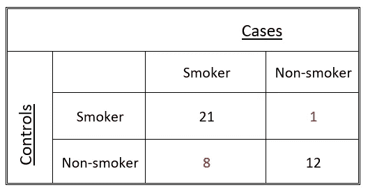
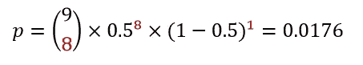
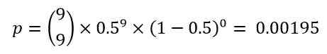
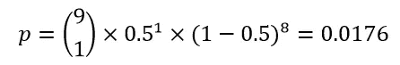
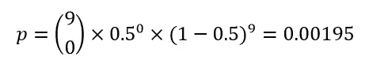
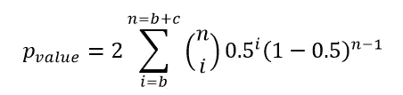
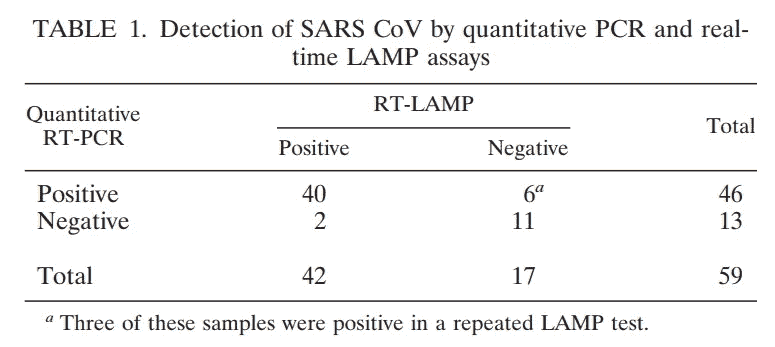

# McNemar 使用 Python 从头开始的精确测试:SARS-CoV-1 诊断测试性能评估

> 原文：<https://towardsdatascience.com/mcnemars-exact-test-from-scratch-with-python-evaluation-of-sars-cov-1-diagnostic-test-performance-327f355ba72a?source=collection_archive---------26----------------------->

这篇文章是关于 McNemar 的精确测试及其在 Python 中的实现。在我们讲述如何用 Python 从头开始执行测试之前，我想先从 McNemar 的精确测试的指示和测试理论开始。我们将使用 2003 年 SARS 冠状病毒流行的真实数据作为例子。最后，我们希望通过与使用 Python 内置函数获得的结果进行比较来验证我们的结果。

McNemar 的精确检验是一种统计检验，用于 2x2 表中相关的二进制数据。McNemar 的精确检验是与配对 t 检验等价的二分检验，后者应用于连续变量。该测试由美国心理学教授奎因·麦克尼马尔于 1947 年发表。McNemar 精确测试在医疗保健领域的常见应用是数据集，其中包含相关(如匹配)对。这些包括前后测试研究、病例对照研究(如双生子研究)和诊断测试的统计比较。

为了介绍测试背后的数学原理，我想用一个简单的例子:假设我们想检验吸烟和肺癌之间是否有联系。因此，我们根据年龄和肺癌家族史将 42 名肺癌患者(=病例)与 42 名对照者(=对照)进行匹配。接下来，我们获得 84 个人中每个人的吸烟状况。我们得到下表:

在 42 对配对中，有 21 对健康个体(=对照)和肺癌患者(=病例)都是吸烟者，8 对肺癌患者是吸烟者但对照不是，12 对两者都不吸烟，1 对癌症患者不吸烟但对照吸烟。

*注意:这不是一个“典型的”列联表，因为单元格反映的是成对而不是个体！因此，我们不能使用通常的列联表分析，如皮尔逊的卡方检验或费希尔的精确检验，它们都假设独立样本！*

这 21 对病例和对照组都暴露于危险因素，没有提供关于吸烟和肺癌之间联系的信息。类似地，12 对病例和对照组都没有暴露于危险因素，没有提供进一步的信息。

McNemar 的测试只使用了表中两个不一致单元格的数据(“病例吸烟者|对照非吸烟者”和“病例非吸烟者|对照吸烟者”)。如果吸烟状况和肺癌之间没有联系，我们会直觉地认为不一致的配对在这两个细胞中大致相等地分布。换句话说，如果我们感兴趣的变量相互独立(=零假设)，不和谐对可能以相等的机会落入一个不和谐细胞或另一个不和谐细胞( *p=0.5* )。

在零假设下观察到两个细胞中 9 个不一致对的特定分布的概率可以用二项式计算。在我们的例子中，我们得到:

在假设检验中，我们通常感兴趣的是在零假设下观察到特定结果的概率——或者更极端的结果。本研究中更极端的不一致对分布对应于“吸烟者|对照非吸烟者”中的 9 对和“非吸烟者|对照吸烟者”中的 0 对:

McNemar 的检验通常是双边检验，因为从理论上讲，所有不一致的配对也可以在表格的“非吸烟者|控制吸烟者”一方找到。这就是为什么我们还要加上

和

我们首先计算的两个概率导致 0.0176+0.00195+0.0176+0.00195 = 0.039 的双侧 p 值。因此，在本例中，我们在 0.05 的显著性水平上拒绝独立性的零假设。

我们可以简化 p 值的计算，正如数学上所示

b 和 c 是表中不一致细胞的计数。

McNemar 的精确检验是一种非参数检验，必须与 McNemar 的卡方检验相区别，卡方检验使用二项分布的卡方近似值。像 Fisher 精确检验一样，McNemar 精确检验适用于任何样本量，但对于稀疏数据是强制性的。一般的经验法则是，只要不一致对的数量少于 10，就使用精确检验。

## McNemar 对 Python 的精确测试:

2002 年底，一种新的病毒性疾病，后来被称为严重急性呼吸系统综合症(SARS)，出现在中国东南部，并迅速蔓延到全世界 8000 多人，造成 774 人死亡。由于全球的努力，这种病毒可能最终在 2004 年被控制住。导致 2002 年爆发的病毒(SARS-CoV-1)在基因上与导致 2019 年冠状病毒疾病疫情(新冠肺炎)的新型冠状病毒病毒密切相关。

冠状病毒有着典型的*冠*状表面突刺([来源:BSIP SA/Alamy 股票图片](https://www.nature.com/articles/d41587-020-00002-2)

2000 年代初遏制 SARS 传播的一项关键措施是快速发现人类 SARS 病例。像今天一样，定量 RT-PCR 检测是检测 SARS 冠状病毒最敏感的诊断工具。然而，基于 PCR 的方法的一个主要缺点是需要非便携式的实验室环境。这可能导致 RT-PCR 在偏远地区不可行。反转录环介导扩增试验(RT-LAMP)是基于 PCR 的方法的一种更快和逻辑上更简单的替代方法，可用于偏远地区的疾病爆发。

为了比较两种方法(定量 RT-PCR 与 RT-LAMP)的检出率，研究人员进行了以下[研究](https://www.ncbi.nlm.nih.gov/pmc/articles/PMC1169087/) ⁴:回顾性 59 例 SARS 确诊病例的鼻咽抽吸物分别用两种方法进行检测。获得了下表:

(表格经[作者](https://sph.hku.hk/en/about-us/faculty-and-staff/academic-staff/poon,-lit-man-leo) ⁴许可转载)

乍一看，我们可以看到 RT-LAMP 正确地将 42/59=71 %的吸出物识别为病例，相比之下，RT-PCR 中为 46/59=78 %。看着这些数据，我们可能会被误导，认为 RT-LAMP 可能具有较差的检测率。

我们现在想使用 Python 来找出两种诊断测试在检出率方面是否有显著差异。由于我们处理的是二元结果(“阳性/阴性”)，并且两种诊断试验分别在同一鼻咽抽吸物上重复进行，因此我们必须使用麦克内马试验。不和谐对的和等于 2+6=8。正如我们对不一致的观测数是< 10, we have to use McNemar’s *确切的*检验一样。

在 Python 中，我们从导入一些有用的库开始:

…并插入我们的数据:

然后，我们使用 while 循环来计算相应的二项式概率，就像我们在前面的例子中所做的那样。

这些二项式概率的总和就是我们的 p 值:

Statsmodels 是一个 Python 模块，它提供了一个内置函数[来直接应用 McNemar 的精确测试:](https://www.statsmodels.org/stable/generated/statsmodels.stats.contingency_tables.mcnemar.html)

正如我们所看到的，statsmodels 的函数和我们自己的 Python 代码都给出了 p 值 0.29，这基本上就是原始论文中报告的值。⁴ 作者得出结论，彼此的检出率总体上没有统计学意义。今天，在全球努力阻止新冠肺炎病毒的过程中，除了基于 PCR 的检测外，还使用基于 LAMP 的方法。⁵

完整的 jupyter 笔记本可以在我的 [GitHub](https://github.com/BundleOfKent/McNemarsExactTest_fromscratch) 上找到！

## **参考文献**:

1.  奎恩·麦克内马(1947 年 6 月 18 日)。“关于相关比例或百分比之间差异的抽样误差的说明”。*心理测量学*
2.  成对二元数据的评估。*骨骼放射学* **40，**1–4(2011)。[https://doi.org/10.1007/s00256-010-1006-1](https://doi.org/10.1007/s00256-010-1006-1)
3.  李帕特丽夏。(2017).DNA 扩增领域:移过 PCR，LAMP 来了。分子生态学资源。17.138–141.10.1111/1755–0998.12548.
4.  Poon LL，Wong BW，Chan KH，等。严重急性呼吸综合征冠状病毒检测的实时逆转录酶 PCR 和实时环介导扩增试验的评估。 *J 临床微生物学*。2005;43(7):3457–3459.2005 年 7 月 43 日至 3459 日
5.  沈敏哲，，叶佳伟，Abdu Ahmed Abdullah AL-maskri，于康，苏增，，冠状病毒核酸检测的新进展和展望，药物分析杂志，
    2020，ISSN 2095–1779，[https://doi.org/10.1016/j.jpha.2020.02.010](https://doi.org/10.1016/j.jpha.2020.02.010)。

 [## 麦克内马试验

### 在统计学中，麦克内马检验是一种用于成对名义数据的统计检验。它适用于 2 × 2 偶然性…

en.wikipedia.org](https://en.wikipedia.org/wiki/McNemar%27s_test)