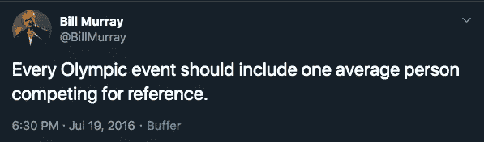

# 我(电脑)有一天说得很好

> 原文：<https://towardsdatascience.com/me-a-computer-talk-pretty-one-day-9f4ca0265137?source=collection_archive---------37----------------------->

## 为什么语言对我们来说如此简单，对计算机来说却如此困难

照片由 [Unsplash](https://unsplash.com?utm_source=medium&utm_medium=referral) 上的[尼克·费因斯](https://unsplash.com/@jannerboy62?utm_source=medium&utm_medium=referral)拍摄

考虑下面的句子(例子取自 Gibson 和 Warren 2004):

*   顾问声称该提案取悦了谁？
*   顾问想知道哪个建议让谁满意？

如果我让你说哪个句子是格式良好的，你可能会说第一句是，第二句不是。在语言学中，我们会说第一个符合语法，第二个不符合语法。然而，语法性并不总是像“这一个有效”和“这一个无效”那样简单。在许多情况下，包括我自己的 BA 论文，人们会被要求在一个尺度上对一个句子的语法性进行评级(在我的研究中，我要求受试者在 1 到 7 的尺度上对句子进行评级，这是相对标准的)。

我提出语法这个概念的原因是为了强调语言的一个重要方面，它的模糊性。人们可能会看着同一个句子，得出截然不同的判断。一个人可能会说，“是啊，听起来是一个非常好的句子，”另一个人可能会说，“这个句子完全没有意义，”另一个人可能会说，“嗯，在特定的上下文中，或者如果有特定的重音模式，它可能有意义。”虽然我们肯定有一些规则，关于什么可以和不可以创建一个格式良好的句子，我们不能总是肯定地说，如果一个给定的句子明确违反或不违反规则。此外，在某些情况下，一个句子可能不违反规则，但其结构具有较高的处理成本。这也是为什么语言学家仍然试图确定句子产生的规则。

语言比我们想象的要复杂得多。不仅在我们解释单词和句子的方式中存在歧义(即[词汇](https://plato.stanford.edu/entries/ambiguity/#LexiAmbi)和[结构](https://plato.stanford.edu/entries/ambiguity/#SyntAmbi)歧义)，而且在构成规则违反的内容中也存在歧义。也就是说，为什么表面上看起来并没有那么复杂呢？这些限制说明了为什么对一台处理绝对值和数字的计算机来说是困难的。那么，为什么它对我们来说如此自然？

[https://twitter.com/BiIIMurray/status/755545329563475968](https://twitter.com/BiIIMurray/status/755545329563475968)

如果你像我一样，花太多时间看迷因，你可能会也可能不会在某个时候看到这条推文。现在想象一下，你有一个奥林匹克花样滑冰运动员，在他们的整个舞蹈中做跳跃和转身，而且通常很优雅。然后你有像我这样的人，她已经很多年没有滑冰了，在她的芭蕾课上表现得非常糟糕，她紧紧抓住围墙，当我试图做一些跳跃的时候，她可能会变脸。

当然，花样滑冰运动员可以轻松地做脚尖旋转，我甚至不知道那会是什么样子，因为花样滑冰运动员大部分时间都在训练。换句话说，一个复杂的动作对他们来说很简单，因为他们已经做了很长时间了。这就是莫拉维克悖论，对我们来说最简单的东西对计算机来说却是最困难的。语言的产生和理解对我们来说很简单，因为我们已经交谈了几千年。另一方面，我们**刚刚**开始教计算机这么做。

在我以前的一篇帖子中，我谈到了[我们应该如何使用人工智能来帮助我们，而不是取代我们](https://medium.com/@katec125/why-the-robots-arent-going-to-take-your-job-but-will-probably-be-your-coworkers-d00a9997ae41?source=friends_link&sk=415f7427b1e6c0c8ff0afc53dc4a372a)。我讨论了几个原因，但另一个重要的原因是，我们真的不太相信我们人类的能力。仅仅因为像语言这样的东西对我们来说很容易，并不意味着它很容易，这是我们在 NLP 领域学到的一课。我们的大脑已经成型并进化了数千年。当然，虽然我们希望创新和发展技术，但我们不应该渴望完全取代人类，因为这需要大量的工作。我们已经有了一个非常好的轮子，为什么还要重新发明轮子呢？如果我们想高效地使用时间和资源，就让我们建造能和轮子一起工作的东西，而不是取代轮子。

[1]吉布森、爱德华和泰莎·沃伦。"远距离依存关系中中间语言结构的阅读时间证据."语法 7，第 1 号(2004):55–78。

[2]森奈特、亚当，《歧义》，*《斯坦福哲学百科全书》*(2016 年春季版)，爱德华·n·扎尔塔(ed .)，URL =<https://Plato . Stanford . edu/archives/SPR 2016/entries/ambiguity/>。

[3]哈默，阿什利。2018."莫拉维克悖论解释了为什么对人工智能来说简单的事情是最难的."Curiosity.com。2018 年 6 月 11 日。https://curiosity . com/topics/mora vecs-paradox-is-why-the-easy-stuff is-hard-for-artificial-intelligence-curiosity/。