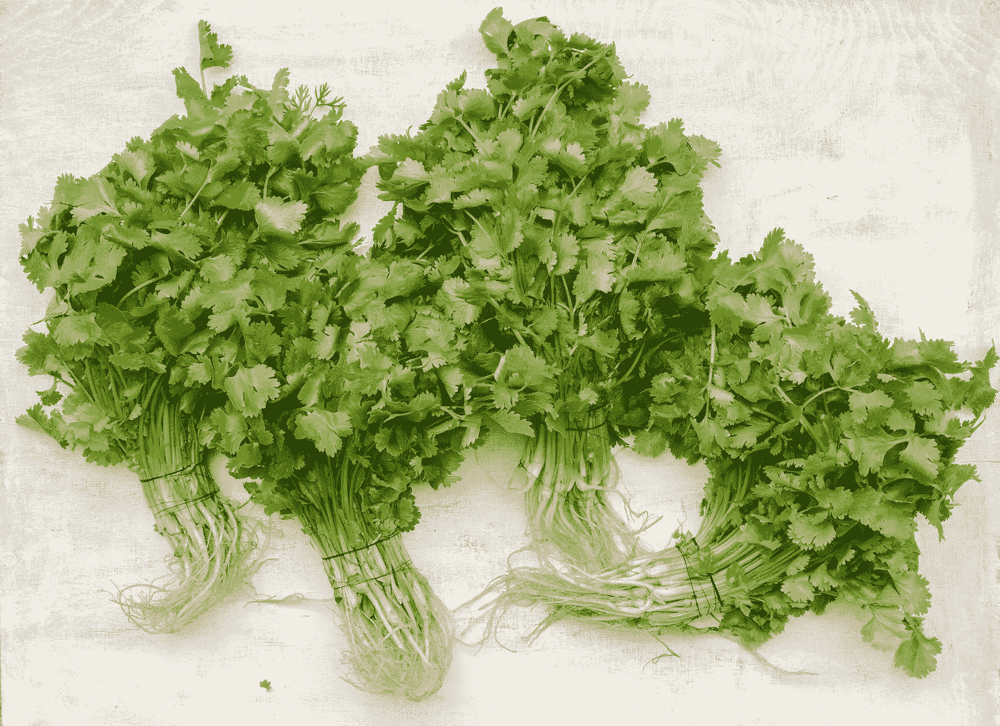
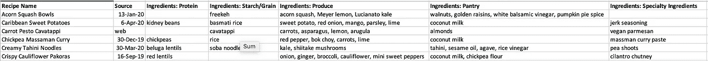
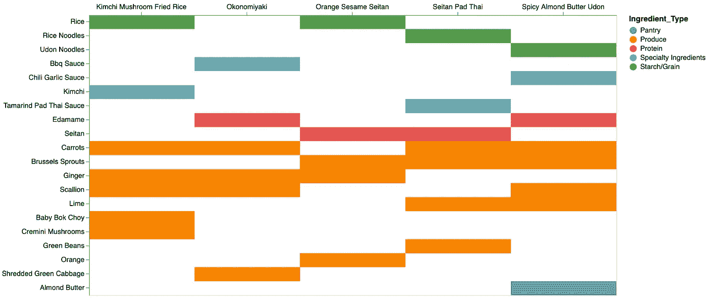
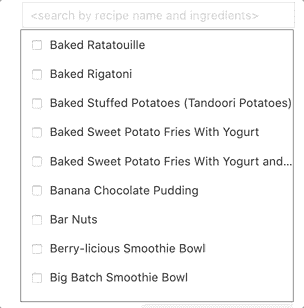
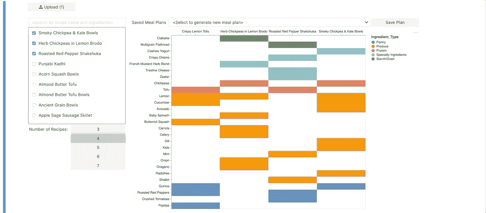
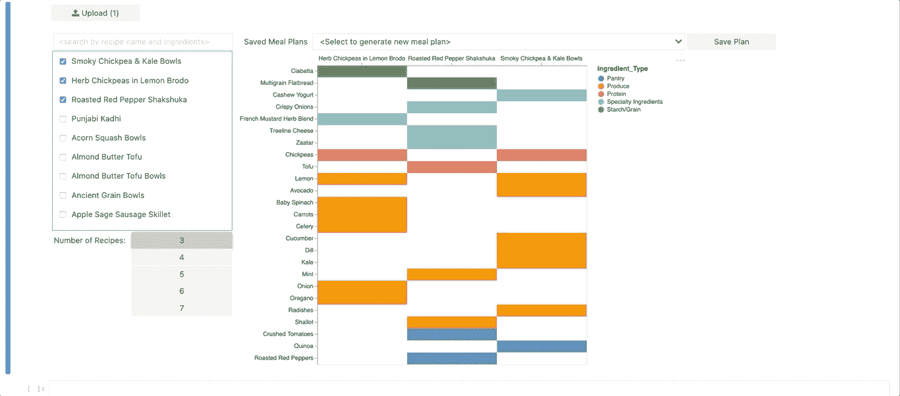

# 膳食计划的数据可视化方式

> 原文：<https://towardsdatascience.com/meal-planning-the-data-visualization-way-83dc8cf91d96?source=collection_archive---------41----------------------->

## 一个简单的应用程序，帮助你计划一周的膳食，重点是减少浪费和简化购物旅行。

由[斯潘塞·戴维斯](https://unsplash.com/@spencerdavis?utm_source=unsplash&utm_medium=referral&utm_content=creditCopyText)在 [Unsplash](https://unsplash.com/s/photos/meal?utm_source=unsplash&utm_medium=referral&utm_content=creditCopyText) 上拍摄的照片。除非另有说明，所有其他图片均由作者提供。

周日通常是我家的购物日，所以周日下午早些时候通常听起来有点像这样:

> 我们能至少做两次披萨吗？

> 我厌倦了豆子…

> 我们应该做豆子和米饭！还有咖喱。还要点寿司！

> 米饭太多了…

事实上，选择一周的食物是在每个人的偏好、我们的预算和一堆关于健康选择的意见之间的平衡。此外，我们还希望购物变得简单，而不必购买大量会被浪费的东西(看看你，一捆捆的香菜)。

有罪的一方。托马什·奥尔谢夫斯基在 [Unsplash](https://unsplash.com/s/photos/coriander?utm_source=unsplash&utm_medium=referral&utm_content=creditCopyText) 上的照片。

因此，我构建了一个小的[应用](https://mybinder.org/v2/gh/MattJBritton/MealPlanner/master?urlpath=lab/tree/app.ipynb)，它可以生成膳食计划建议，并可视化食材之间的重叠。因为你上传了自己的食谱数据文件，你可以选择如何对配料进行分类，因此该应用程序可以帮助优化对你来说重要的东西。例如:

*   通过购买大量的一种将在多种食谱中使用的配料来省钱
*   减少食物浪费
*   选择不同种类的谷物、蔬菜、香料等来满足每个人
*   如果你是素食者或纯素食者，摄入不同种类的蛋白质

## 想象一份膳食计划

这里的技术并不复杂。基本上，该应用程序获取一个文件，其中包含食谱列表、相关元数据(如 URL)和按类别列出的配料列表。看起来是这样的:

我们的“配方盒”文件样本。

你挑选一个感兴趣的初始食谱开始，然后算法会将新食谱添加到膳食计划中，直到你有 5 个(或者你想要的任何数量)。下一个食谱是由*交集超过并集*选择的——到目前为止，一个食谱与膳食计划中所有配料共享的配料数除以所有配料数。然后这个公式被稍微随机化，所以我们得到的食谱有一些共同点，但不是十种不同版本的西班牙海鲜饭。

我intersection over union 实际上与我在黑暗的前 app 时代做膳食计划的思维过程非常接近。因此，我设计了输出来可视化每个食谱中哪些成分是共同的或独特的。

一个饮食计划的例子。

In 配料由配方文件中指定的“类别”着色。这就很容易看出我们是否有各种各样的蛋白质，蔬菜，谷物，或者其他什么。可以想象，你可以根据每种商品最便宜/最容易买到的杂货店来设置类别，或者根据节食疗法所使用的类别来设置类别。

上面我看到两餐有米饭，两餐有面条，还有一餐没有任何碳水化合物。也许我想为此买面包？一顿饭没有蛋白质，所以也许我想在食谱上加点东西。我们在多种食谱中使用几种蔬菜，所以大量购买是有意义的。大葱也是“每捆太多，很难冷冻，所以它们最终会变坏”这一类别中的常见罪犯，所以在三个食谱中使用它们是很好的。

## 该应用程序

该应用程序构建于 Jupyter Lab 之上，使用 Jupyter 小部件进行控制。

你可以按名称和成分搜索食谱。

你可以改变每周的食谱数量，并获得新的饮食计划建议。

您可以保存膳食计划，稍后再返回。

最后，将鼠标悬停在菜谱上，会显示其名称和元数据。我们用这个作为食谱或者食谱所在的 URL，但是你也可以添加烹饪，卡路里或者减肥中心的点数等等。

**入门**

你可以在 [Binder](https://mybinder.org/v2/gh/MattJBritton/MealPlanner/master?urlpath=lab/tree/app.ipynb) 上访问这个应用，或者从 [GitHub](https://github.com/MattJBritton/MealPlanner) 上克隆它。唯一需要的是一份你喜欢做的食谱文件。我们的有 300 多行，花了几个小时翻阅食谱来创建。或者，默认情况下，应用程序会加载一个从 [Spoonacular API](https://spoonacular.com/food-api) 中提取的食谱样本文件。您可以使用 *get_sample_recipes.py* 脚本获得任意多的食谱，尽管注意免费层每天有几百个的限制。你需要一个免费的 API 密匙来完成这项工作。如果你想探索新的美食和食物，这是一个不错的选择，因为 Spoonacular 的食谱来自各种美食网站和博客。

> 如果这个工具对你有用，请在评论中告诉我！