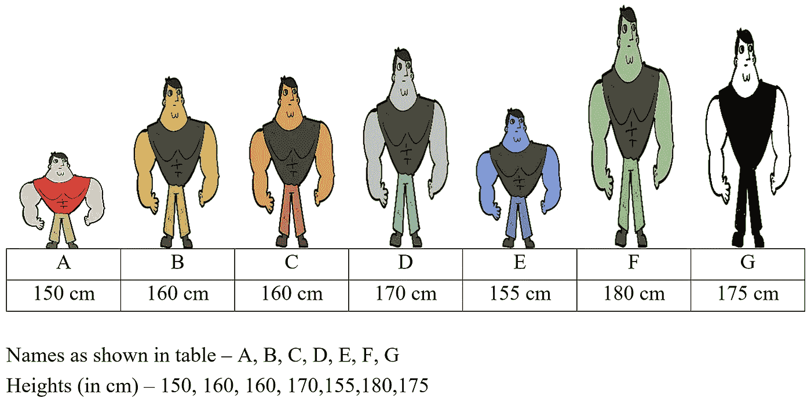
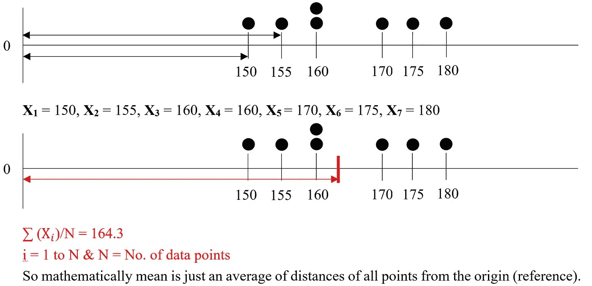
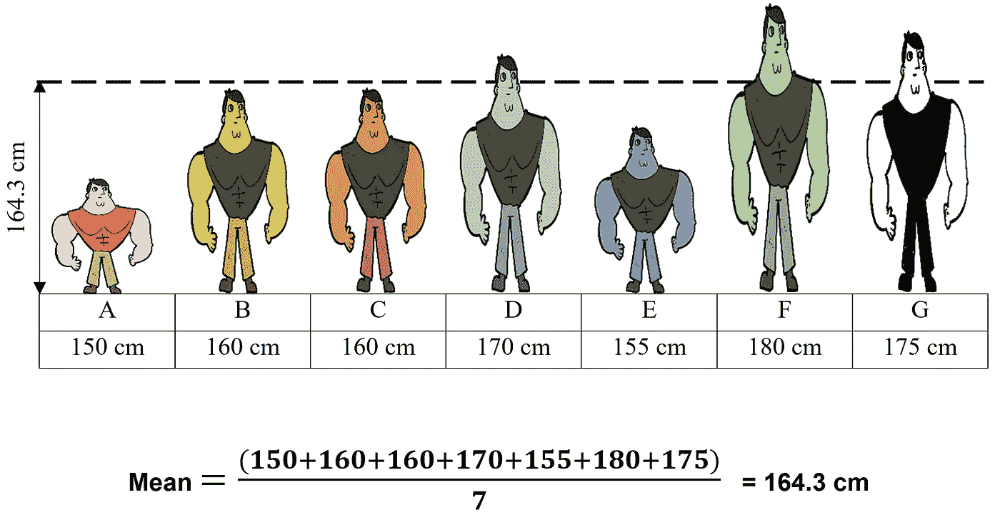
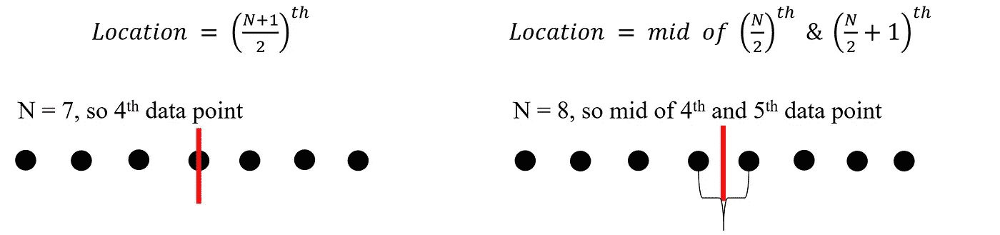
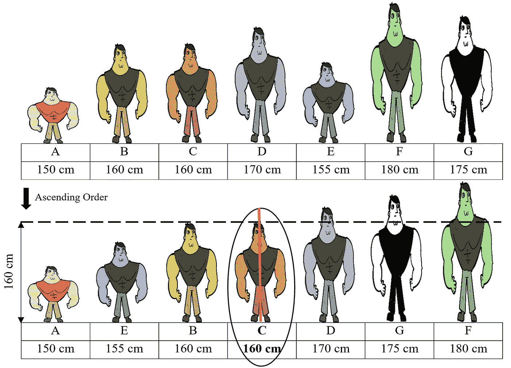
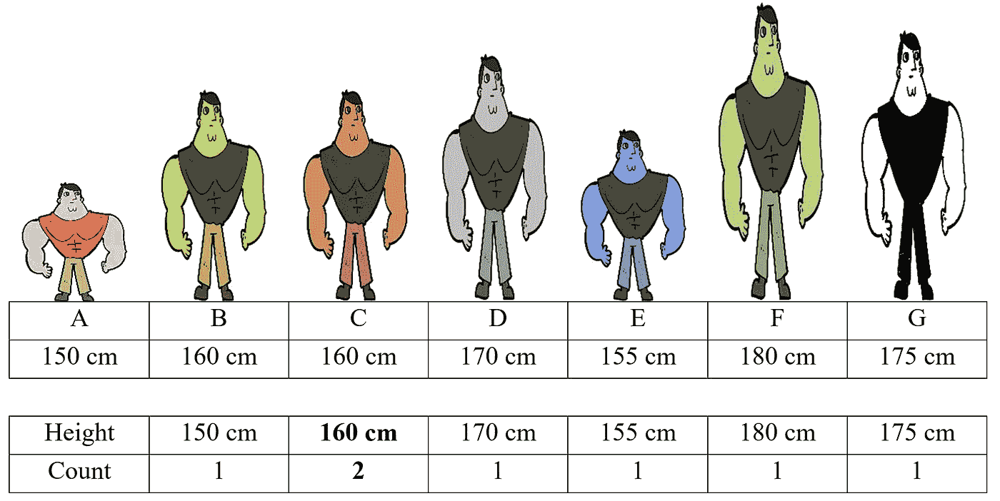
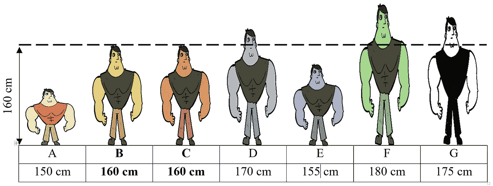
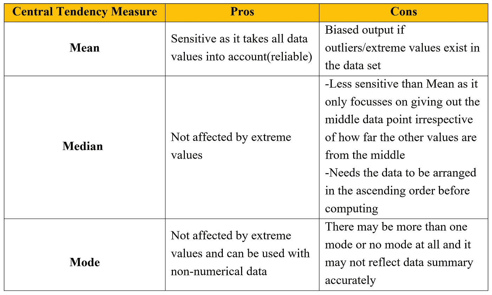

# 均值、中值和众数——何时使用哪个集中趋势指标？

> 原文：<https://towardsdatascience.com/mean-median-mode-which-central-tendency-measure-to-use-when-9fb3ebbe3006?source=collection_archive---------21----------------------->

> 为了将数据集表示为 1 个数字的汇总，我们使用集中趋势度量。存在三种集中趋势度量，即均值、中值和众数。当只有一个(均值)可以完成工作时，为什么需要这三个度量？这就是这篇博客的全部内容，随着这篇博客的结束，你将能够回答这个臭名昭著的问题——选择哪一个&什么时候？由于每一个都有自己的优点和缺点，相同的将被详细阐述，以建立概念清晰。

让我们从视觉表现开始，以便更好地解释这些概念:

**使用的数据集——七个健美运动员的身高(假定为离散系列)*

(图片由作者提供)

现在，我们将使用平均值、中值和众数来计算这些数据的集中趋势。

在计算之后，我们将确定当一个新的数据点被添加到数据中时，这些集中趋势度量中的每一个是如何表现的，这将进一步使我们能够理解每个集中趋势度量的重要性以及对于不同条件的应用适用性。

> ***我们先来计算一下这个数据的均值:***

150，160，160，170，155，180，175——这些数字反映了什么？

如果我们试着把它们放在一条数轴上，每个点除了离一个参考点的距离之外什么也不是(在这种情况下=0)

(图片由作者提供)

(图片由作者提供)

> **开始计算该数据的中值**:

**步骤:**

1.  按升序排列数据点
2.  一半数据点位于上侧，另一半位于下侧的横截面分割是中间值测量。想象一下，您正试图使用分隔符将数据点分成两半
3.  如果数据点计数为奇数，则有一个中心值位于分隔符上，这就是中值本身，否则位于分隔符两侧的两个点的平均值就是中值

(图片由作者提供)

(图片由作者提供)

对于给定的数据集，N 是奇数(7 个数据点),从上图可以明显看出，在分隔符数据点 C 的上方和下方有 50% (3)个观察值(也可以是 B，因为两者具有相同的值)。所以这个数据的中间值是 160 厘米。

> **开始计算该数据的模式:**

这个是最容易计算的，只需要确定数据中每个数据点出现的频率，频率最高的就是数据的模式。当数据是非数字时，也可以使用这种方法。

(图片由作者提供)

由于有两个身高 160 cm 的健美运动员，这意味着该数据集的模式将是 160 cm。

(图片由作者提供)

现在进入最重要的讨论，为什么需要这三个集中趋势的测量而不是只有一个？

为了得到一个一位数的汇总(集中趋势)，总是希望用这一个度量得到整个数据的无偏反映。但是，在下面的练习中，我们会注意到，有时均值本身无法保持无偏，并且该度量是数据的错误反映。

继续使用相同的健美运动员数据，我将添加一个外部数据点，并通知集中趋势测量的变化:

我已经向数据集添加了一个健美运动员(H )(身高= 200 厘米)

(图片由作者提供)

> 之前平均值= 164.3 厘米(7 次观察)
> 
> 平均后= 168.75 厘米(8 次观察)

> 前中值= 160 厘米(7 次观察)
> 
> 后中值= 162.5 厘米(8 次观察)

**在计算中值之前，不要忘记按升序排列数据*

> 之前的模式= 160 厘米(7 次观察)
> 
> = 160 厘米后的模式(8 次观察)

# 注意事项:

与中位数和众数相比，平均值对数据集的任何大的增加都非常敏感。中位数变化很小，而众数则完全没有变化。到现在为止，你将开始得到为什么会想到这些措施的提示，一个简单明了的答案是作为处理他们先天偏见的最佳可行替代方案(我们刚刚展示了上面的一个例子)。

让我们总结一下这三种方法的优缺点:

(图片由作者提供)

我希望现在您已经清楚地了解了使用哪种中心趋势度量以及何时使用。这篇文章到此结束，请关注更多即将到来的博客。

谢谢！！！