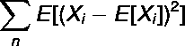
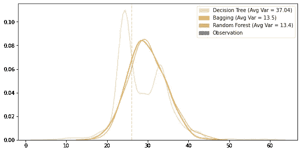
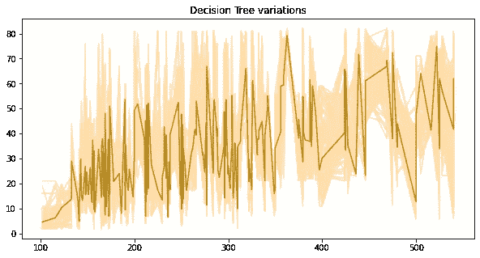
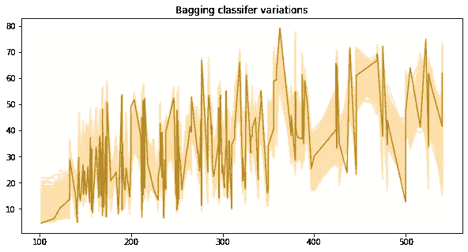
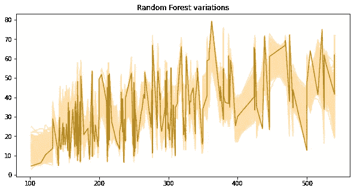
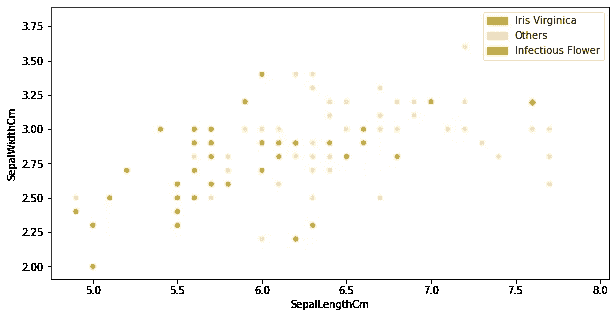
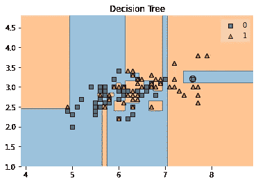
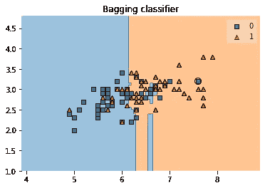

# 如何度量一个统计模型的方差？

> 原文：<https://towardsdatascience.com/measure-variance-of-statistical-model-e3b4725095b6?source=collection_archive---------33----------------------->

## 作为数据科学家，我们经常强调偏差-方差权衡。但是在比较模型的时候，我们需要量化方差。

由 Pritesh Sudra 在 Unsplash 上拍摄的图像

本文假设您理解并知道如何构建回归或分类模型。

任何统计模型的误差都由三部分组成——偏差、方差和噪声。通俗地说，偏差是预测准确性的倒数。方差指的是预测展开的程度。另一方面，噪声是无法系统表达的随机波动。

然而，上述定义是模糊的，我们需要从数学的角度来考察它们。在本文中，我将强调方差——困扰我们模型的更令人困惑的恶魔。

# 关于方差的一个简短注记

当我们允许我们的模型灵活地无用地学习训练数据的复杂关系时，它就失去了概括的能力。大多数情况下，这种灵活性是通过特征提供的，即当数据具有大量特征时(有时多于观测值)。这也可能是由于复杂的神经网络架构或过小的训练数据集。

由此产生的是一个也学习训练数据中的噪声的模型；因此，当我们试图根据看不见的数据做出预测时，模型就失灵了。

> 方差也是同一观测在模型的不同“实现”中的预测差异的原因。**我们稍后将使用这一点来寻找方差的精确值。**

# 数学解释

设 *Xᵢ* 为模型 *M* 根据观察值 *i.* 做出的预测总体。如果我们取大小为 *n* 值的样本，方差将为:

这是我们已经知道的事情。然而，我们需要计算总体的方差(相当于生成它的统计模型的方差),我们还没有完全做到这一点。在此之前，我们需要了解一个概念——bootstrap 重采样。

请注意，这个方差公式假设模型的结果是一个连续变量—这发生在回归中。在分类的情况下，结果是 0/1，因此，我们必须不同地测量方差。你可以在这篇[论文](https://dl.acm.org/doi/10.5555/647288.721421)中找到对此的解释。

## 自举重采样

通常，我们无法访问整个人口来计算统计数据，如方差或均值。在这种情况下，我们利用自举子样本。

> bootstrapping 的原理表明，如果我们从大小为 *n* 的样本中抽取大量大小为 *n* **的子样本，并替换为**，那么它就是从原始总体中抽取这些样本的近似值。

我们找到每个子样本的样本统计量，并取它们的平均值来估计总体的统计量。我们获取的子样本数量仅受时间和空间约束的限制；然而，你拿的越多，你的结果就越准确。

## 模型的实现

设 *M* 为我们的统计模型。 *M* 的实现是从输入到输出的映射。当我们在一个特定的输入上训练 M 时，我们获得了模型的一个具体实现。通过在来自输入数据的子样本上训练模型，我们可以获得更多的实现。

## 最后…

我们可以将这两个概念结合起来，通过引导训练数据来获得模型的实际方差的估计，从而获得模型的多个实现。

现在让我们将方差公式转化为模型 *M* 对*观察*X 的算法。

1.  从训练数据中抽取一个 bootstrap 子样本。
2.  在子样本上训练 *M* 并生成观测值 *X* 的预测 *Pₓ* 。
3.  重复第 1 步和第 2 步 n 次*。*
4.  使用方差公式*计算 *Pₓ* 的所有值的方差。*

我们可以对更多的观察重复这一过程，并报告平均方差。

# 回归模型的方差

我使用了一个数据集来预测混凝土的抗压强度，单位为兆帕(兆帕)。

## 单点分析

我们评估不同模型的单个样本外观察的预测方差(通过 bootstrapping 获得)。

引导子样本数= 1000

正如预期的那样，bagging 和 random forest 模型比它们的基础模型(即决策树)变化更小。在所有模型中，预测值在实际值处达到峰值；然而，决策树分布是双峰的，并且更加分散。

## 分散分析

我们可以使用散点图比较所有样本外观察的模型的总体变化。

样本数量= 1000

较暗的金线代表实际值。再一次，决策树的预测更多的是分散在这条线上。

# 分类模型的方差

对于分类任务，我将使用修改后的鸢尾数据集来预测该花是否是海滨鸢尾(1 或 0)。我还添加了一种传染性的花，伪装成鸢尾。

## 灵敏度分析

基础模型对错误的观察(圆圈)更敏感，如在决策区域中所见。换句话说，它试图对训练数据中的噪声进行建模。

分类器的决策边界

# 奖金代码

这是一个基于 bootstrap 子采样计算方差的实现。

从 mlxtend 库中的 bias_variance_decomp()扩展而来

# 一锤定音

在比较两个或更多模型时，测量和模拟误差是很重要的。当你考虑升级到合奏时，这一点尤其重要。

还要注意，方差较低的模型不一定是更准确的模型(还记得有偏差的权衡吗？).偏差以类似的方式测量。