# 可变性和 z 分数的测量。为什么、何时以及如何使用它们？

> 原文：<https://towardsdatascience.com/measures-of-variability-and-z-scores-why-when-and-how-to-use-them-a552005cc1a1?source=collection_archive---------11----------------------->

## 方差、标准差、变异系数、IQR 和 z 值的公式和示例

照片由[罗斯季斯拉夫·乌祖诺夫](https://www.pexels.com/ro-ro/@rostislav-uzunov-3145660?utm_content=attributionCopyText&utm_medium=referral&utm_source=pexels)在[像素](https://www.pexels.com/ro-ro/fotografie/abstract-imagini-abstracte-sticla-pahar-5011647/?utm_content=attributionCopyText&utm_medium=referral&utm_source=pexels)上拍摄

内容

1.  **简介**
2.  **范围**
3.  **四分位间距**
4.  **差异**
5.  **标准偏差**
6.  **变异系数**
7.  **Z 分数**
8.  **结论**

# **简介**

为什么可变性的测量很重要？他们能给我们提供什么？

可变性是指数据的“分散”程度，以及每个分数与其他分数的差异程度。例如，让我们想想某个特定商店的顾客及其年龄。在运动服装和装备商店的例子中，最频繁的购买者可能来自较年轻的年龄组，数据集中在后者周围。然而，在超市的情况下，我们可能会注意到它的顾客可能属于不同的年龄组，在这种情况下数据更加分散。

最常见的可变性测量方法，尤其用于定量和连续数据，包括:

*   **范围**
*   **四分位数和四分位数间距**
*   **方差和标准差**

为此，我还将添加关于**变异系数**的信息，这在希望比较不同数据集之间的可变性时很有用，以及 **z 分数**，这也称为标准分数，因为它们帮助我们了解某些数据分数离平均值有多远，特别是当我们希望将它们与同一分布或另一分布中的分数进行比较时。

每一种方法都有相应的公式和一些例子来说明它的用法。

# 范围

该范围是数据集中最高分和最低分之间的差值。

在本例中，范围是最高分 98 和最低分 11 之间的差值。可以看出，计算起来是非常容易的。然而，它也很容易受到异常值的影响，在本例中为 11、25 和 98。这就是我们计算 IQR 或四分位间距的原因。

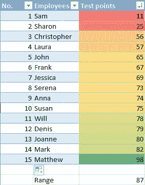

# 四分位间距

四分位数来自四分之一。并且四分位范围表示包含在特定分布中的中间 50%分数的范围。

IQR =第 75 百分位(Q3) —第 25 百分位(Q1)

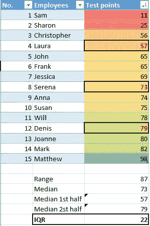

作者的图像标题

要计算 IQR，需要经过以下步骤:

1.  将数据从最小到最大排序。
2.  找出中位数(Q2)，在上例中是 73。
3.  计算下半部分(Q1)和上半部分(Q3)数据的中位数，在我们的例子中是:Q1 = 57，Q3 = 79。执行此操作时，不要包括最中心的值 Q2(在本例中为 73)。
4.  从上半部中值 Q3 减去下半部中值 Q1。在上面的例子中，**中间 50%的分数具有 22 分的范围，包含在 57 分和 79 分**之间。

在进行 k-均值聚类之前，IQR 有时用于市场细分分析和剔除异常值。

# 差异

方差是说明一组分数有多少可变性的度量。它可以计算为每个数字与其平均值的平方偏差的平均值。

或者，为了更好地理解公式，让我们换一种说法。方差是平方和(平均值偏差平方和的简称)除以总体或样本中分数/数据点的数量。

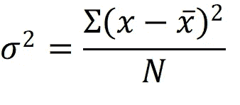

人口方差公式

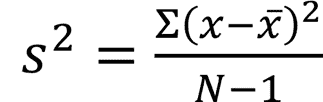

样本方差公式

尽管我们可以使用电子表格或其他工具来计算它，但最好是理解它们的公式以及其中包含的内容，以便更好地了解在什么情况下它们可以提供有用的见解。

# 标准偏差

标准差(方差的平方根)很有用，因为它可以用与原始度量相同的单位显示可变性。使用它比使用方差更有帮助。例如，如果我们测量一组样本人口身高数据的可变性，标准差有助于我们从方差单位到厘米和米。

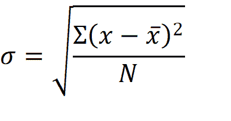

总体标准差公式

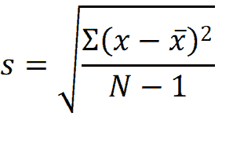

样本的标准偏差公式

当看下面的例子时，也可以理解使用方差和标准差之间的区别，对于这个例子，我使用了 5 只狗的高度。320.213 方差单位对我们的样本没有太多说明，也很难解释。另一方面，这里的标准差用英寸表示，在上下文中更容易看到。样本狗之间 17 英寸的差异表明我们从不同大小的群体中选择了狗。

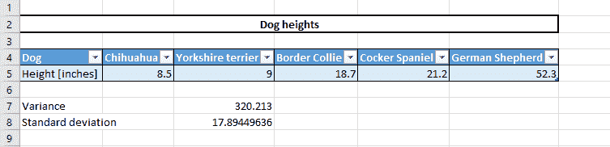

由作者完成的图像标题

# **变异系数**

变异系数或相对标准偏差可以通过将标准偏差除以平均值来计算。并且当希望比较两个或更多数据集之间的可变性时使用它。

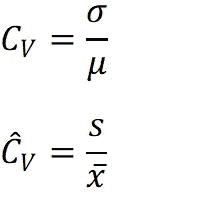

总体和样本的变异系数公式

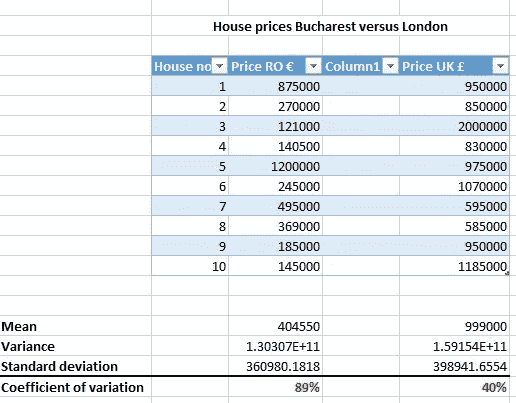

我在上面的例子中使用了罗马尼亚布加勒斯特和英国伦敦的房价。价格用两种不同的硬币来表示，欧元和英镑。在这种情况下，如果我们想要比较两个数据集之间的可变性，标准差是没有用的。但这可以在变异系数的帮助下成功完成，变异系数在数据集之间是通用的。

# z 分数

z 分数或标准分数在将数据放入上下文中时特别有用。

为了计算它，我们需要平均值和标准偏差，因为我们将比较分数与平均值和标准偏差的偏差。要计算分数的(x) z 分数，我们首先从中减去平均值，然后将结果除以标准差，如下所示。

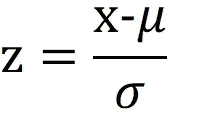

人口的 z 得分公式

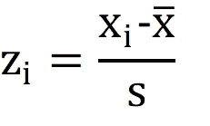

样本的 z 分数公式

如何解读结果？

*   z-score = 0，分数(x)正好是平均值；
*   z 得分为正，得分(x)高于平均水平；
*   z 分数为负，分数(x)低于平均值。

z 分数可用于比较同一分布之间或不同分布之间的分数。

现在让我们看一个例子。一家公司的雇员接受了一项能力倾向测试，他们获得了不同的分数。从下表中我们可以看到，乔安妮和马克获得了最高分(91 分和 88 分)，而萨姆获得了最低分(49 分)。如果我们计算 z 分数，我们也将知道每个分数低于或高于平均值多少。

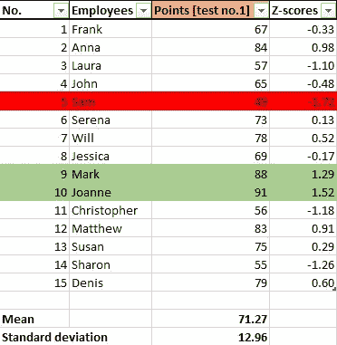

作者的图像标题

但是，如果对所有员工进行第二次测试，并且我们希望看到，例如，那些在上次测试中表现不佳的员工是否随着时间的推移而有所改善。我们再次查看 Sam 的案例，注意到他在第二次测试中获得了更高的分数。这可能会让我们认为他的表现有所提高。然而，如果我们计算 z 分数，我们将得到一个不同的结果。事实上，他的表现略有下降。这可以用以下事实来解释:总体而言，其余员工的绩效有所提高，这导致了平均值的提高，同时也是由于可变性的降低(标准偏差降低)。这就是背景有时会产生影响的原因。

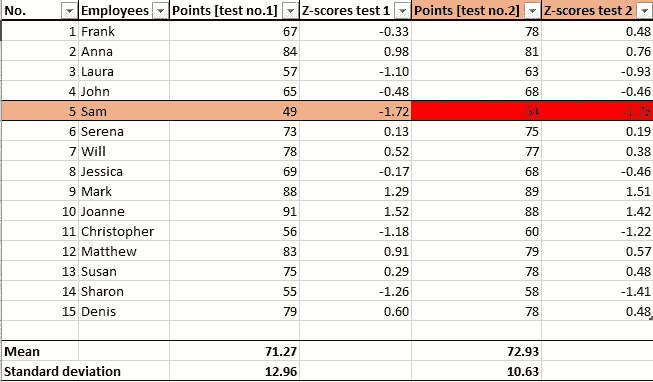

作者的图像标题

# 结论

当我们希望用数字来描述数据时，可变性和 z 分数的度量与集中趋势和相关性的度量一起可以为我们服务。它们都是所谓的描述统计学的一部分。

我希望这篇文章是统计学系列文章的开始，因为我了解了不同的概念，并试图用我自己的例子更好地探索它们。所以，请让我知道你是否想看到某些话题。或者如果你认为这篇文章应该增加一些东西。

 [## 在欧洲，现在是成为数据科学家或数据管家的最佳时机

### 为什么欧盟计划培训 50 多万名数据科学家和数据管理员

towardsdatascience.com](/now-is-the-best-time-to-be-a-data-scientist-or-a-data-steward-in-europe-618143a80dd0)  [## 造福社会的数据科学

### 超越我们想看什么类型的电影，到我们想生活在什么类型的世界。资源、示例和…

towardsdatascience.com](/data-science-for-social-good-a88838bc8ed0)  [## 用于社会公益的数据科学:免费开放数据的最佳来源

### 类型、优势以及在哪里可以找到它们

towardsdatascience.com](/data-science-for-social-good-best-sources-for-free-open-data-5120070caf02)