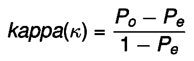
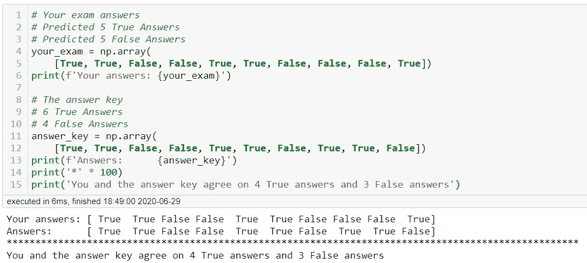
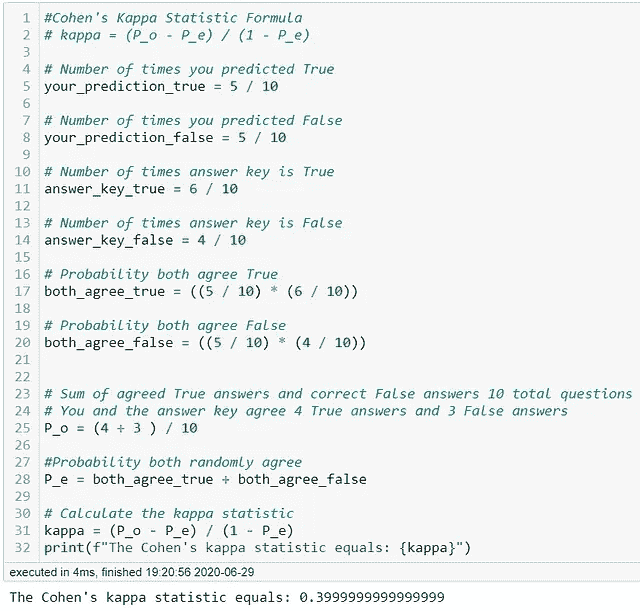
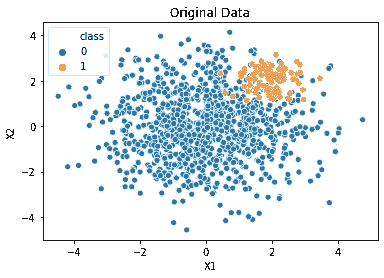
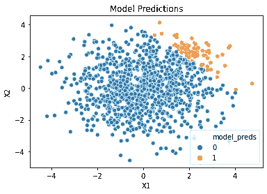
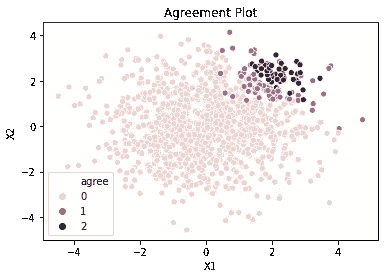
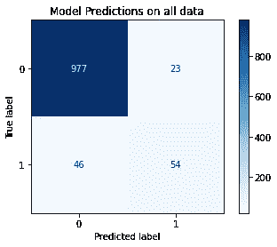
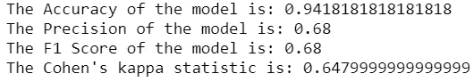

# 与 Cohen 的 Kappa 统计量的测量一致性

> 原文：<https://towardsdatascience.com/measuring-agreement-with-cohens-kappa-statistic-9930e90386aa?source=collection_archive---------44----------------------->

## 这个鲜为人知的指标可以帮助您更好地评估模型在不平衡数据上的表现

对我来说，许多最有趣的分类用例是识别异常值。异常值可能是你收件箱里的一封垃圾邮件，对一种极其罕见的疾病的诊断，或者一个有着非凡回报的股票投资组合。由于这些实例是离群值，很难收集足够的数据来训练一个如何发现它们的模型。有些人把他们的整个职业生涯都奉献给了创造策略来对抗不平衡的数据。改天我会在另一篇博客中提出这些策略。

每个人对什么是准确和误差都有很强的直觉。这和我们在学术生涯中使用的评分系统是一样的。准确率是正确答案占全部问题的比例。错误是错误答案占全部问题的比率。这些指标适用于理想的数据集，而现实世界中并不存在这种数据集。

> 准确性悖论的一个例子是，如果一个人有 99%的机会没有特定的疾病，那么预测没有人患有该疾病的模型将是 99%准确的。

## 手动计算 Cohen 的 kappa 统计量

科恩的 kappa 统计很容易理解，不会成为准确性悖论的牺牲品。请听我解释技术术语。 **Pₒ是评分者之间观察到的一致** **。Pₑ是评分者得出相同答案的假设机会。**1 级将是你的模型预测，2 级可能是你的 y_test 数据(答案)。

科恩卡帕统计公式

让我们用一个简单的例子来手工计算 Cohen 的 kappa 统计量。你在一次只有对错答案的考试中得了 7 分。老师有答案(y_test 数据)。为了计算你的预测和答案之间的一致性，我们必须找到 Pₒ和 Pₑ.首先，为了找到 Pₒ，我们加入正确答案的协议。

例题的设置和计算

我们现在已经计算出 kappa 统计值为 0.4，并且 [Sci-kit learn](https://scikit-learn.org/stable/modules/generated/sklearn.metrics.cohen_kappa_score.html) 确认了该值。kappa 统计范围从-1 到 1。最大值 1 表示两个评分者完全一致。值为 0 等于达成协议的随机几率。所以我们的值 0.4 意味着我们略有一致。根据具体情况，这可能是可以接受的，也可能是不可以接受的。例如，在确定患者是否患有癌症时，您可能希望模型的 kappa 统计值高得多。

## 科恩卡帕统计可视化

我创建了两个类不平衡的点簇，比例为 10:1。这种类别失衡问题可能会导致诸如错误和准确性等指标的问题。左边的图像是我们创建的数据，右边的图像是我们的模型预测数据的方式。

原始创建的数据和我们模型的预测

该模型对 25%的数据进行训练，然后该模型对整个数据进行预测，以便于比较。你可以清楚地看到我们回归的决策边界在哪里。

在上图中，对应于 0 和 2 的点是两个模型在类别上一致的值。值为 1 意味着模型和数据具有不同的类标签。

如果你熟悉混淆矩阵，1 的值就是所有的误报和漏报。0 和 2 表示所有的真阳性和真阴性。

显示所有值的混淆矩阵

**结论**

Cohen 的 kappa 统计对模型的评分比其他任何指标都要严格。值为 0.648 意味着模型和测试数据基本一致。这个统计很简单，因为它可以比较你的模型。在不平衡的数据集上尝试一下吧！

> *感谢你花时间阅读我的博客。下面链接的 my GitHub 中提供了该笔记本的全部细节。如果您有任何问题或有建设性的批评，请随时联系我！*
> 
> *我的 GitHub 库**:*[https://github.com/bsamaha/Cohen-s-Kappa/tree/master](https://github.com/bsamaha/Cohen-s-Kappa/tree/master)
> 
> *领英:*[*www.linkedin.com/in/blake-samaha-54a9bbaa*](http://www.linkedin.com/in/blake-samaha-54a9bbaa)
> 
> *推特:@Mean_Agression*