# 测量和计算普利特维采湖国家公园的河流流量

> 原文：<https://towardsdatascience.com/measuring-and-calculating-streamflow-at-the-plitvice-lakes-national-park-678223318191?source=collection_archive---------51----------------------->

克罗地亚普利特维采湖国家公园的普利特维采溪流

## 介绍

水流(或流量)描述了单位时间内沿着溪流或河流流动的水量，通常以立方米每秒[m /s]或立方英尺每秒[ft /s]为计量单位。它可能是水循环中最重要的元素。通常，它是通过将渠道横截面中的水面积乘以该特定横截面中的平均速度来计算的，也称为“速度-面积”方法。

*Q = A * v*

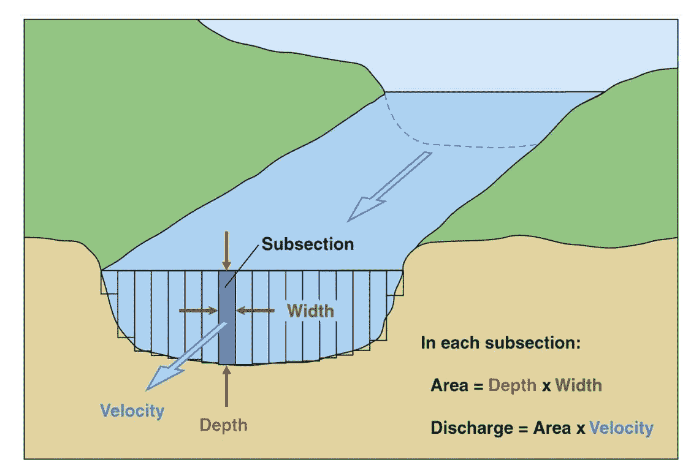

图一。“速度-面积”方法的可视化(来源:[1])

本文介绍了克罗地亚普利特维采湖国家公园普利特维采河和萨尔图克河的流量测量和计算。水文测量是“普利特维采湖国家公园普利特维采河流域水文地质调查”项目的一部分。

[**普利特维采湖**](https://np-plitvicka-jezera.hr/en/) 是克罗地亚最古老(1949 年 4 月 8 日宣布成立)和最大(300 公里)的国家公园。它位于 Lika-Senj 县，位于西部和西北部的 Mala Kapela 山脉和东南部的 Lič ka Plješ ivica 山脉之间。普利特维采湖于 1979 年 10 月 26 日被列入联合国教科文组织世界遗产名录，得到了国际认可[2]。普利特维采湖的独特之处在于，该湖泊系统有 16 个已命名的湖泊，还有几个较小的未命名湖泊。

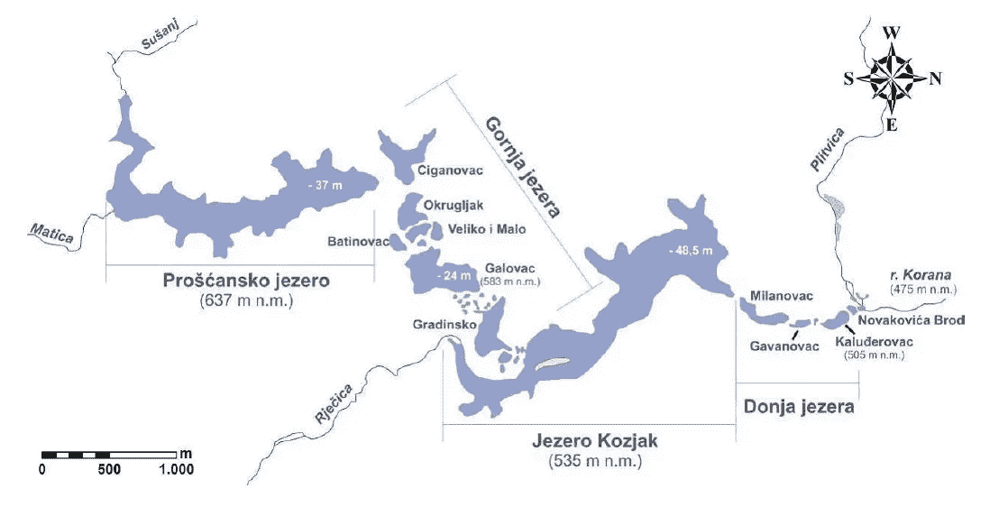

图二。普利特维采湖湖泊系统(资料来源:meaki h .，以普利特维采湖国家公园为例的岩溶水资源保护模型，博士论文，2011 年)

图 3。克罗地亚普利特维采湖国家公园

首先，将介绍现场测量过程以及三个横截面的测量数据(水流速度),而第二部分则侧重于开发 Python 3 脚本来计算河流流量的过程。

## 现场测量

现场测量使用海流计进行，这是一种通过机械、倾斜、声学或电学手段进行流量测量的装置。对于该测量，使用来自 Seba Hydrometrie 的电磁电流计。具体来说，FlowSens 单轴电磁流量计。它可以以 0.5%的精度测量-5 至+5 米/秒的流速(仅针对正流量进行校准)。

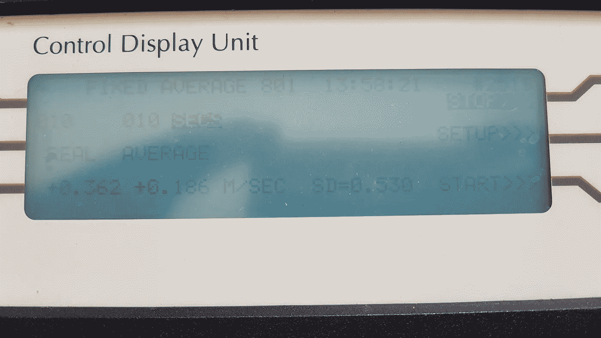

图 4。801 型单轴电磁流量计—主机(*图片由作者*提供)

在测量之前，重要的一步是找到一个合适的测量点。有几个推荐指南，即来自美国地质调查局(Rantz 等人，1982 年)。

*   *测量点上游和下游约 300 英尺的河道是直的。*

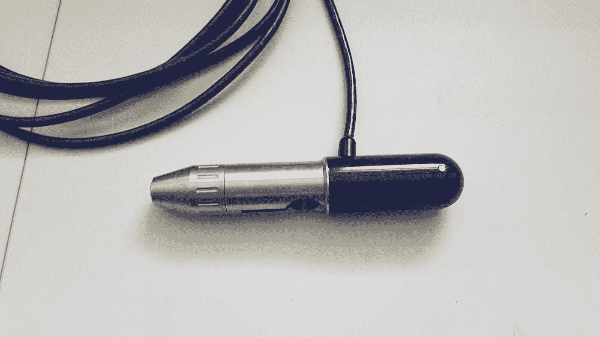

图 5。801 型单轴电磁流量计—圆柱形传感器单元(*图片由作者*提供)

*   *在所有阶段，总流量都被限制在一个单一的通道内。也没有地下或地下水流绕过场地。*
*   *场地附近的河床不受冲刷和填充。它也没有水生植物。*
*   河道的两岸是永久性的。那里没有灌木丛，高度足以容纳洪水。
*   河道有不变的自然控制。这些控制点是基岩露头或低流量条件下的稳定浅滩。在高流量期间，控制是渠道收缩或瀑布或瀑布，在所有阶段都不浸没。
*   *在极低水位时，现场上游有一个水池。这将确保记录极低的流量，并避免与高流量相关的高速度。*
*   *测量位置远离与另一条河流的汇合处或潮汐影响，以避免对河流水位测量产生任何可能的影响。*
*   *在测量点附近，可测量所有阶段的流量。*
*   *该场地可用于测量场地的安装、操作和维护。*

在大多数情况下，检查所有建议的点几乎是不可能的，尤其是在较小的溪流中，比如那些向普利特维采湖供水的溪流。他们水井位于复杂的地形和树木繁茂的地区。所以主要的重点是找到一个尽可能直的，容易到达的地点，尽可能少的植物和碎片。此外，对于这个特定的项目，需要在某些区域进行测量，因为项目的主要目标是发现由于喀斯特地形导致水“流失”的河段。

当在感兴趣的段中找到合适的位置时，我们将设置横截面并测量河流的宽度。我们用了一根 20 米的卷尺。此外，卷尺还可作为流量计操作员的定位点，以便在相等的分段中进行测量，即所谓的分段(图 1。)在每个分段中，操作者进行几次测量，每次在不同的深度，其中测量的次数取决于该分段的深度。此外，还有几种经验方法，即可以在深度 0.6 处的 1 个点进行测量，对于非常浅的河流，可以在深度 0.2 和 0.8 处的 2 个点进行测量，等等。

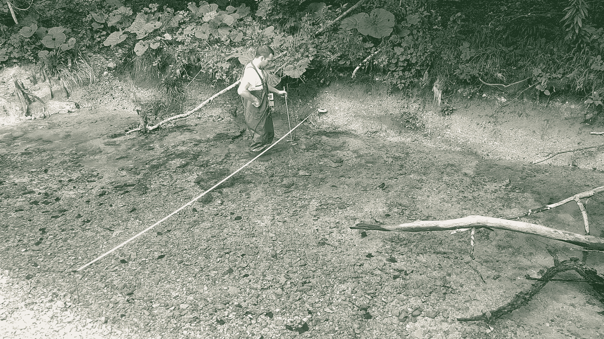

图 6。Petar，我的朋友和学生，操作流量计(*图片由作者*)

在本次分析中，我们采用的方法是，通过计算算术平均值，对每个分段的测量速度进行平均。

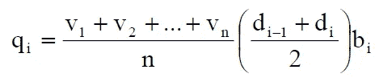

接下来，通过对分段 ***i-1*** 和 ***i+1*** 处的深度求和并除以 2，计算每个分段 *i* 处的平均深度。这个平均深度乘以每个子部分的宽度得到子部分的面积。然后将每个分区的平均速度乘以分区面积，得出每个分区 ***qi*** 的流量。将这些分段流量相加，得出断面总流量 ***Q*** 。

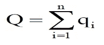

## 测量数据示例

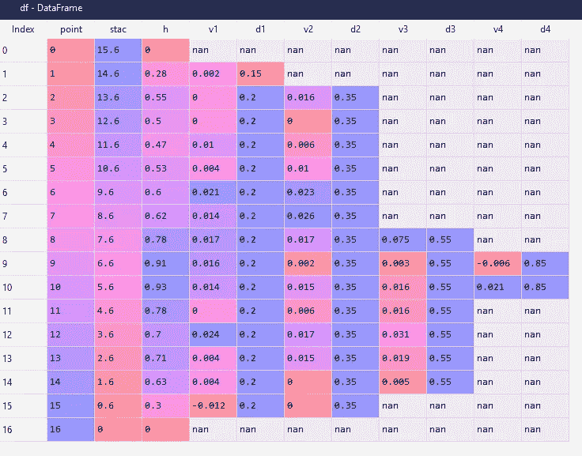

图 7。测量数据示例数据框架—横断面图 1—普利特维察河

我们用表格(在纸上)记下测量的数据。 ***点*** 列代表测量点，而*是距河岸的距离，单位为米。 ***h*** 为每个分段的深度。 ***v1*** 至 ***vn*** 为各分段不同深度测得的速度*米/秒*，而 ***d1*** 至 ***dn*** 为*米*内的深度。数据帧的大小和形状取决于横截面的几何形状和大小。展示的示例是最宽的横截面，宽度为 15.6 *米*。*

## *流量的计算*

*为了计算每个横截面的流量，编写了一个简单的 python 脚本。我将简要地解释它是如何工作的。*

*首先，我们导入依赖项，在这种情况下，我们需要 numpy 和 pandas。我们用数据定义 excel 文件的文件路径。由于我们有几个横截面，每个横截面都在 excel 中的单独工作表中，我们使用 pandas 函数“read_excel”读取文件，并将其存储到字典中，其中键是工作表名称，值是包含数据的 pandas dataframe。*

*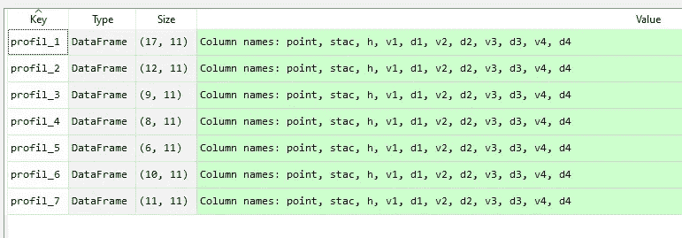*

*图 8。测量数据字典(7 个条目，7 个横截面)*

*接下来，定义用于计算平均分段速度、分段宽度和面积、分段流量以及横截面面积和流量的函数。*

*首先，以厘米为单位的列被转换成米，空的单元格被填充-999。*

*接下来我们要计算平均分段速度。条件相当简单。所以比如我们只有一次测量，深度***【D1】****不同于-999，但是测量深度 ***d2*** 不存在，所以是-999，平均速度就是 1 次单次测量的速度。如果我们有例如 3 次测量，深度 ***d3*** 存在，但深度 ***d4*** 不存在，那么 ***d4*** 就是-999。我希望这个类比是清楚的🙂。此外，如果深度 ***h*** 为 0，速度也为 0，因为该点代表河流两侧的海岸线。这一原理是可行的，因为自然的溪流总是有这样的形状(图 7。).**

**在下一步中，计算分段宽度。每个分段的宽度等于从测量点到下一个点和前一个点的一半距离的总和(图 9。)例如，子部分 II 中的子部分宽度等于到点 I 的距离的一半+到点 III 的距离的一半。同样，分段宽度的起点和终点等于到最近点(图 9 中的点 I 和 VII)的距离的一半。).这里我们用熊猫。DataFrame.shift 获取上一个和下一个距离的值( ***df.stac*** )。**

**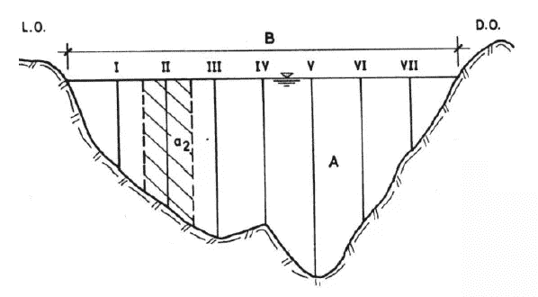**

**图 9。计算截面宽度的原理(来源:[3])**

**接下来，我们计算分段面积。这里我们需要考虑到，没有一个天然河床具有规则的形状，因此，要考虑一些近似的情况。在实践中，每个分段的平均深度是通过平均前一个和下一个分段的深度来计算的，类似于分段宽度。此外，第一个和最后一个子部分的深度是根据起点和终点计算的。我们再次使用熊猫。DataFrame.shift 得到上一点深度和下一点深度的值( ***df.h*** )。**

**每个分区的平均流量通过平均流速和分区面积相乘计算得出。此外，当深度为零时，没有流量，因此，对于海岸线点，我们将 streamflow 设置为零。**

**接下来，计算 ***宽度******面积*** 和总截面 ***流量 Q*** 。同样，返回 ***数据帧*** 和 ***宽度******面积*** 和 ***总 Q*** 。**

**我们用一个字典理解调用这个函数，以便再次得到一个字典名为 ***results_Q*** 以截面(剖面)名称为关键字，以及一个由此产生的元组 ***dataframe*** ， ***width*** ， ***area*** 和 ***total Q*** 作为值。**

**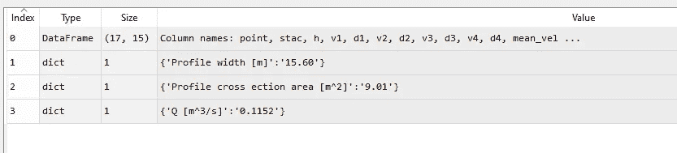**

**图 10。数据帧的结果元组和具有计算值的字典**

**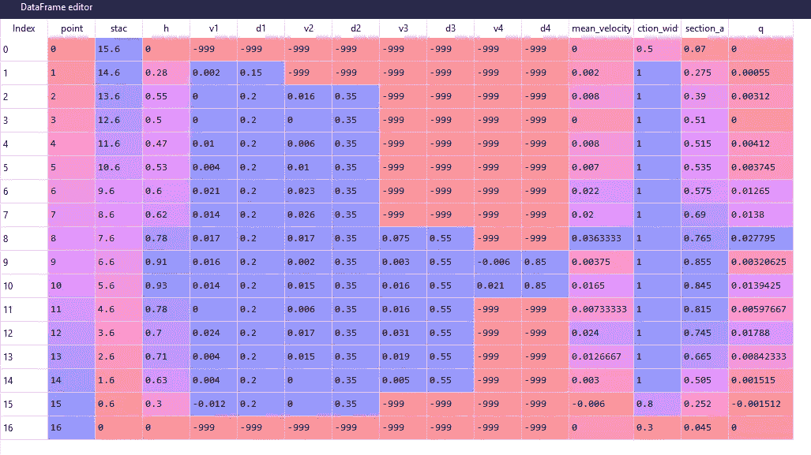**

**图 11。结果数据帧**

**数字结果如图 10 和 11 所示。索引 2 和 3 包含最重要的结果，剖面横截面面积和总横截面流量 q。对于该特定横截面，我们计算出横截面面积为 9.01 m，总流量为 **0.115 m /s** ，或 **115 l/s** 。**

## **可视化**

**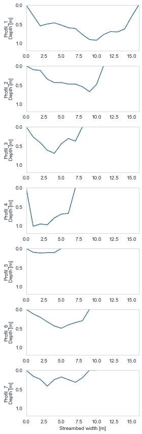**

**图 11。河床横截面的可视化(作者)**

**假设我们想看看河床的横断面是什么样子。我们可以定义一个函数，使用线图在 y 轴上显示沿横截面测得的深度，而沿 x 轴显示距河岸的距离。**

**这种图对于比较通过该过程测量的不同横截面非常有用，对于比较下游河床的变化也非常有用。**

**我要强调的是，在这个例子中，测量不是从最上游的站开始的。**

**点 5 (Plitvica stream well)和点 6 (Sartuk stream well)位于最上游，点 7 位于 Sartuk 和 Plitvica 汇合处之后，紧接着是点 1、2、3 和 4。4 号点位于[大瀑布](https://www.plitvice-lakes.info/waterfalls/veliki-slap-waterfall/)之前。**

**另一个选项是显示横截面速度。因此，我们定义了一个创建网格的函数，并对计算出的分段速度的空间分布进行插值。这样，我们可以直观地检查通过横截面的流量分布。**

**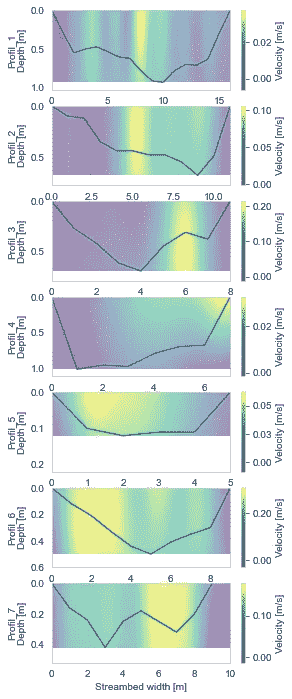**

**图 12。横截面速度可视化(作者)**

# **结论**

**测量溪流或河流的流量在水文学中非常重要。在这个项目中，对河流流量的测量应能让我们了解测量到的水流失发生的确切位置。**

**本文介绍了从测量到计算流速和计算断面总流量的全过程。在第一部分中，讨论了现场任务和原理，而第二部分集中于整个过程的计算和自动化。另外，还提供了可视化数据的代码。**

**如果你喜欢这篇文章或者你对水文学感兴趣，请随时关注我的 [medium](https://medium.com/@Karlo_Leskovar) 和 [LinkedIn](https://www.linkedin.com/notifications/) 。干杯！**

**参考**

**[1] Turnipseed，D.P .和 Sauer，V.B .，2010 年，*测量站流量测量*:美国地质调查技术和方法第 3 册，第 3 章。A8，87 p。**

**[2]普利特维采湖国家公园官方网站，[https://NP-plitvicka-jez era . HR/en/about-the-Park/general-information/](https://np-plitvicka-jezera.hr/en/about-the-park/general-information/)**

**[2]ugaj，R: *Hidrologija* ，萨格勒布大学采矿、地质和石油工程学院，萨格勒布，2000 年**