# 衡量变化

> 原文：<https://towardsdatascience.com/measuring-change-54bb44e26a14?source=collection_archive---------29----------------------->

## 集中趋势测度和扩散测度背后的真正含义

作者图片(地点:新泽西马纳斯泉水库[https://www.instagram.com/gauravkantgoel/](https://www.instagram.com/gauravkantgoel/)

让我们做一个思考实验。想象一下，你周围的世界刚刚冻结。什么都没有改变。一切都停滞了。有什么是有意义的吗？你能学到什么吗？没什么。一个停止的世界相当于一个没有的世界！世界因为“变”而存在。行星的自转和公转，物种的进化，经济的增长或衰退，人口力学，股票市场的涨跌……..每个现象的核心都有一个“改变”的概念。

如果你进行一次大的概括，你会发现人类所有的知识都是关于识别、理解、测量和操纵自然界发生的变化。任何关于现象的知识都会大致试图回答以下问题:

> 有变化吗？哪些事情在改变？
> 
> 一件事的变化会影响到其他人吗？
> 
> 如何衡量这种变化？有没有一个规则可以解释和表达这种变化？可以用来预测未来的变化吗？

当你在观察或研究一个现象时，你关注的是相关的事物。这些东西被称为“ ***变量*** ”，因为它们“变化”或者它们“改变”。它们经历的“变化”或“变异”取决于它们是什么样的变量。

# **定量还是定性**

作者图片

从根本上说，所有变量(或所有数据)只能有两种类型: ***定量或定性***

有些事情你可以衡量“大小”或“价值”，如速度、距离、体积、体重、身高、收入等。这些是数值，对这些变量执行算术运算(如加或减)是有意义的。数量变量通常有度量单位，如千克、美元、年等。

另一方面，有些变量描述了一些事情。例如人名、地名、性别、种族或动物种类等等。对这些变量的算术运算没有意义。你不能增加或减少性别或类别。这些变量通常没有单位。请注意，定性变量也可以采用数值，如 PIN 码或社会安全号，但您不会想要添加 PIN 码或 SSN。这毫无意义。

现在想想任何数据值。该值可以是定量的，也可以是定性的。*数量变量*也叫“连续”变量。本质上，它们代表了一个被测量的“量”。例如重量。它是“连续的”,因为值可以是任何值。例如 50 公斤，50.1 公斤，52 公斤，52.5 公斤…几乎任何事情。

*定性变量*也被称为“分类变量”。本质上，它们代表一个“组”或一个“类别”,值将属于该组或类别的一个固定集合。例如，性别—(男性或女性)，医学检验结果(阳性或阴性)

> 变量的类型(定量或定性)将决定可以进行的分析类型。

让我们来看一些可以用来描述或理解这些变量变化的操作。

# 集中趋势测量

图片作者(【https://www.instagram.com/gauravkantgoel/】T4)

每当事情发生变化时，我们表达或总结这些变化的自然倾向是什么？平均而言，人们会倾向于找到“**”*”***。(双关语:)

计算“平均值”是我们在分析数据时自然产生的最直观的事情。假设你想知道一个击球手有多好？(在板球比赛中)给你他在最后 10 场比赛中得分的分数。

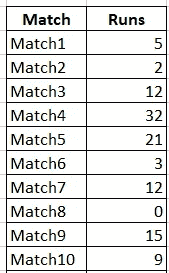

为了衡量他的表现或者判断这个球员有多好或者有多差，难道你没有一瞬间的冲动去计算 10 场比赛的平均得分吗？你不能仅仅孤立地看每场比赛的比分就做出决定或推论。你需要一个代表数字来反映它。而自然的倾向是找出“平均”。

我们很多人都没有意识到，但是有很多方法可以衡量“平均”。这些测量被称为*“集中趋势测量”。*

## 平均:

大多数时候，当人们谈论平均水平时，他们实际上是指“平均水平”:)

平均值就是所有给定数字的总和除以有多少个数字。

在我们的例子中，平均值是(5+2+12+32+21+3+12+0+15+9)/10，得出 11.1

你可以说“mean”是“average”的一种。还有其他类型吗？

## 中位数:

假设这个球员在另一场比赛中获得了惊人的 400 分！

现在得出的平均值是:46.45

在这种情况下，平均值可能会产生误导，因为在所有比赛中，该球员的得分都远低于 46.45。因为只有一场比赛他得了 400 分，总的来说有点失真。这样的数据点称为异常值。在这种情况下，衡量平均值的更好方法是“中值”，即数据值的中间点。在我们的示例中，我们将对所有数据值进行排序，并选择中间的一个。

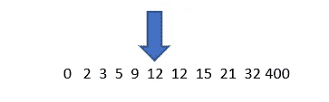

中位数是 12，在这种情况下，这是一个更合适的“平均”度量。

## **模式:**

“平均值”的一个不太为人所知的度量是众数，众数是我们的数据集中出现频率最高的数据值。在我们的例子中，“12”重复了两次。所以众数是 12。均值和中值用于定量变量，而众数便于定性变量。计算性别、肤色等定性变量的平均值或中值是没有意义的。比方说，在我们的例子中，我们有一个列，它告诉我们某场比赛是球队赢了还是输了。

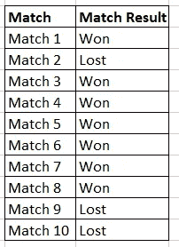

在这种情况下，变量“匹配结果”的模式是“赢”，因为“赢”出现了 7 次，而“输”只出现了 3 次。

我们可以说，就“平均”而言，该团队正在获胜。

> “平均值”、“中值”和“众数”是三种对平均值的度量，它们给出了关于数据“中心性”的概念。

但是，在分析或总结数据时，平均值是否提供了足够的信息？我们还能做更多的事情。

# 差异量数

图片作者(【https://www.instagram.com/gauravkantgoel/】T2)

除了找出一个数据集的平均值之外，我们还可以看看数据被分散了多少。或者换句话说，数据集中有多少“可变性”。让我们通过一个例子来理解它。到目前为止，我们一直在关注单个玩家的分数。假设，我们已经得到了所有 10 场比赛中 2 名球员的得分。我们必须比较这些分数，并试图了解这些球员在相互比较中的表现。

下面是数据集:

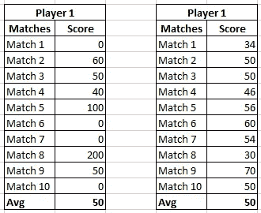

两位运动员的平均成绩都是 50 分。那么怎么才能比较呢？一个微妙的事情是检查这些球员在比赛中的平均表现如何。一个球员比其他人得分更稳定吗？一个球员在几场比赛中得分很高，而在其他比赛中得分很低吗？这些玩家在不同比赛中的“**分数如何变化？**

## **范围**

检查分数如何变化的一个非常基本的指标是计算每个玩家的分数范围。

> 范围就是数据中最大和最小观察值之间的差值。

玩家 1 的范围= 200–0(最高分-最低分)= 200

玩家 2 的范围= 70–30 = 40

看起来参与人 1 比参与人 2 的得分范围更大。这意味着参与人 1 的分数比参与人 2 的分数更具多样性。如果我们仔细观察参与人 1 的数据，会发现存在异常值。在一些比赛中，这个球员得分特别高，比如 200 分，而在一些比赛中，他什么也没得分(0 分)。Range 可以度量值分布的范围，但它对异常值很敏感。

## 四分位数间距(IQR):

克服范围不足的一个方法是以某种方式排除异常值并构建一个“迷你范围”。一个这样的标准是“四分位间距”。我们按升序对数据进行排序，并将数据值分成 4 组(四分位数)。然后我们只考虑中间的 50%的值。这给了我们四分位间距。

参与人 1 的 IQR:

0 0 0 0 40 50 50 50 100 200

我们有 10 分。下四分位数的位置是 n/4 = 3(四舍五入后)

上四分位数的位置是 3n/4 = 8(四舍五入后)

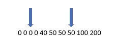

IQR 是(8 号位得分—3 号位得分)

IQR = 50–0 = 50

参与人 2 的 IQR:

30 34 46 50 50 50 54 56 60 70

我们有 10 分。下四分位数的位置是 n/4 = 3(四舍五入后)

上四分位数的位置是 3n/4 = 8(四舍五入后)

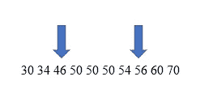

IQR 是(8 号位得分—3 号位得分)

IQR = 56–46 = 10

一种叫做“盒须”图的特殊图形被用来显示范围。

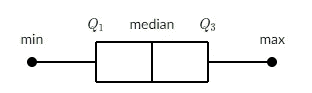

对于给定的数据属性，它显示 5 个指标:

1.  最小值
2.  最大值
3.  中位数
4.  四分位数 1
5.  四分位数 3

让我们通过绘制方框图和胡须图来比较两位玩家的得分:

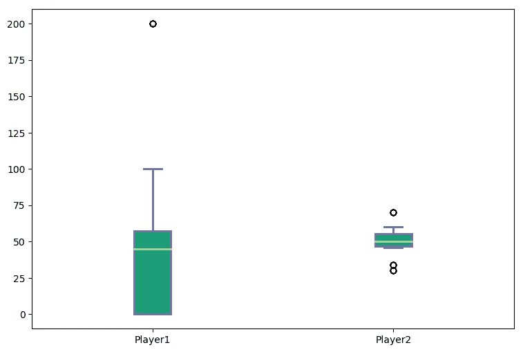

从上图可以明显看出，与参与人 2 相比，参与人 1 有更多的变化。两个玩家的中值或平均值是相同的，但是玩家 1 的分数比玩家 2 的分数差很多。我们可以说参与人 1 不如参与人 2“一致”。尽管玩家 1 的最高分即 200 比玩家 2 的最高分(70)高得多，但是他在得分上并不一致。

判断一个玩家表现的更有效的方法是找出一个玩家偏离其“平均”分数的程度。偏差越大，玩家的一致性越差。偏差越小，一个球员就越稳定。

## 差异

方差是一个简单的度量，它表示数据属性与其平均值的“偏差”。你**不需要**记住下面的方差公式:

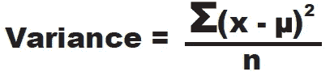

请记住，我们试图找出一个数据属性中有多少变化。因此，我们可以采取以下简单的步骤:

1.  计算数据属性的平均值
2.  找出每个数据点与平均值之间的差异。它实际上给了我们一个数据值偏离平均值的程度。现在，这种差异可以是正的，也可以是负的(因为数据值可以小于或大于平均值)。为了避免负数和正数互相抵消，我们可以取它的平方。
3.  计算所有差异的总和
4.  除以数据值的数量。这给了我们平均的变化。

## 标准偏差

标准差就是方差的平方根

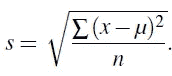

计算方差时，用平方根来抵消步骤 2 中平方的影响。

> 标准差是关于平均值的数据分布的度量。它大致衡量了这些条目与平均值的差距。它告诉我们数据是如何分布的。**SD 越多，数据越分散。因为它只是一个衡量标准，所以不可能是负数。**

在我们的例子中，

参与人 1 的标准差= 59.32

参与人 2 的标准差= 11.06

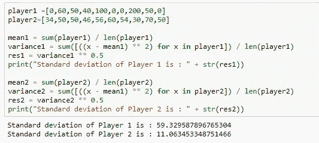

Python 代码片段

玩家 2 的标准差比玩家 1 小得多。因此我们可以说这个玩家更加稳定。他的表演变化较少。虽然他得分不高，但他在所有的比赛中都相当稳定。

想想自然界的任何变量。如果这个变量的标准差很大，你可以有把握地说这个变量有很多不同的值。行为不一致。但是如果它的标准差很低，那么你可以假设这个变量的行为是相当一致的。

你有一个总是很冷静的朋友，而另一个却喜怒无常(有时生气，有时冷静，有时冷漠)？你现在知道谁的“标准差”更大了。

如果一个变量有一个常数，那么它的标准差是多少？你不需要分子式。它将是 0。

"**平均值**和**"偏离平均值"**是在研究数据集时应该记住的两件事。