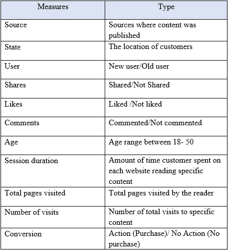
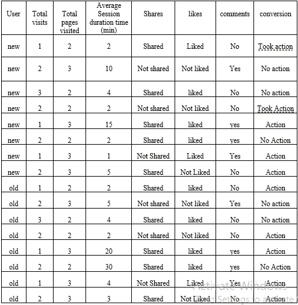
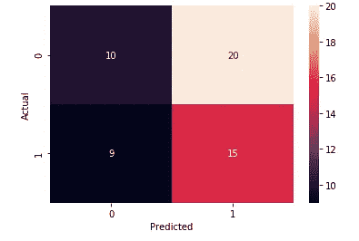
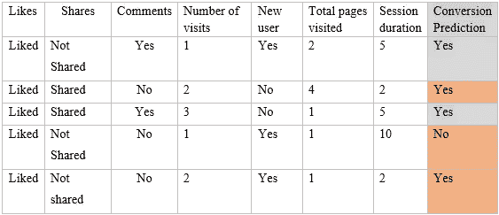
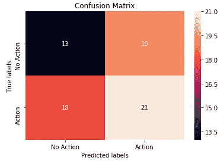
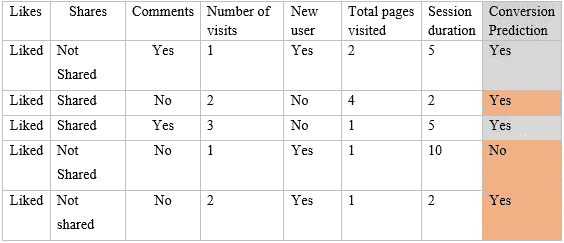
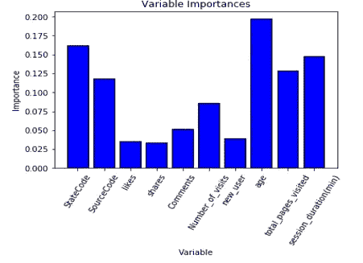

# 衡量公关行业的内容参与度

> 原文：<https://towardsdatascience.com/measuring-content-engagement-in-pr-industry-4644dbb4ed4c?source=collection_archive---------31----------------------->

来自 campaignasia.com 的照片

内容参与度测量在公关测量中至关重要，它证明了发布内容、媒体和品牌价值的影响。衡量敬业度时考虑的指标和属性真正解释了它的有效性。和常用的指标，大多数公关公司使用的是一些访问，分享，喜欢，评论，转换，花在一个页面上的时间，总页数访问和访问次数。

衡量内容参与度的挑战在于选择正确的公关指标来跟踪内容参与度的不确定性。这是因为任何社交媒体上的分享或喜欢并不意味着读者积极参与或打算采取行动。这意味着，分享或喜欢该内容的读者没有百分之百的机会积极参与该内容。

在本文中，我将对上述指标在解释实时内容参与度方面的不良联系做出一些假设。

为了衡量内容参与度，我考虑了下表中显示的一些指标/属性。

表 1 —预测内容参与度的方法

使用上面的列表，我们可以回答类似“访问(或)分享(或)喜欢(或)会话持续时间的数量决定内容参与度吗？决定客户是否积极参与内容的因素是什么？在所有列出的属性中，衡量内容参与度的两个不太重要的指标是“触及度”和“会话持续时间”。

*   [接触与参与](https://contentmarketinginstitute.com/2016/03/measure-engagement-right/):接触被定义为访问网站的次数。有些情况下，客户访问网站是因为他们被内容误导了。在这种情况下，这不是衡量内容参与度的好方法。
*   [会话持续时间与参与度](https://seo.co/measure-engagement/):会话持续时间是指阅读内容所花费的时间。有时候，人们会打开多个标签，分心，然后离开屏幕。在这种情况下，时间累积起来，可能会给出误导性的结果，说某个特定的读者正在积极地参与内容。

我列出了上述所有衡量标准的一些随机组合，以证明很难完美地衡量内容参与度。从下表中可以看出，输出变量是“转化率”，因为主动参与内容的最终结果是以销售的形式对内容采取一些行动，其余的都是用于分析参与度的输入变量。以下所有这些组合适用于各种“网站来源”和“位置”。

表 2-读者参与的各种可能性

如果我们考虑他们使用的资源和读者来自的国家，存在上述措施的许多组合。因为，来源和状态对内容参与度也有影响。如果一个来源更受欢迎，例如像福布斯或 LinkedIn，那么读者可能会认为这是一个好内容，并可能采取行动。同样，来自特定位置的读者比来自其他位置的读者更有可能采取行动。

*注*:我已经用上面列出的组合(来自表-2，用于进一步分析)组成了 214 条数据点记录，并将数据分成训练集和测试集。

数据集的链接:[https://github . com/ShailuSurya/content engagement/blob/master/content engagement % 20 dataset . CSV](https://github.com/ShailuSurya/ContentEngagement/blob/master/ContentEngagement%20Dataset.csv)

## I .我们如何决定读者是否积极参与内容？

使用上面列出的组合，很难预测读者是否积极参与。决定内容参与度的唯一属性是“转化”。如果客户在访问内容后采取了行动，那么他/她就被认为是积极地参与了内容，否则就不是。因此，主要任务是预测“转换”。

存在许多机器学习分类模型来预测结果。在这里，我使用逻辑回归和随机森林分类算法来预测转换的概率。

代码链接:[https://github . com/ShailuSurya/content engagement/blob/master/contentengagementmeasurement . ipynb](https://github.com/ShailuSurya/ContentEngagement/blob/master/ContentEngagementMeasurement.ipynb)

## a.逻辑回归

我采用了输入变量，“状态”，“来源”，“喜欢”，“分享”，“评论”，“访问次数”，“新用户”，“年龄”，“总访问页数”，“会话持续时间(分钟)”来训练模型，以预测转化率。数据被分成 75/25 的比例。测试数据的混淆矩阵如下所示。从模型结果来看，假阴性(第二类错误)率为 66%。模型的整体准确率为 46.2%。

逻辑回归的混淆矩阵

逻辑回归的前五个记录的预测结果如下表所示。结果并不准确，即使我们预测某个读者会采取行动，也有 66%的几率我们的预测是错误的。转换预测列中所有“橙色”单元格都被错误预测(当与提供的原始数据比较时)

表 3 —逻辑回归模型结果

## b.随机森林分类

预测“转换”的随机森林分类模型使用 600 个决策树进行训练，其中 70%为训练数据，30%为测试数据。模型的混淆矩阵如下所示。

随机森林分类的混淆矩阵

从上面的混淆矩阵中，如果我们预测读者将要采取行动，那么有 59%的机会(假阴性率)读者不会采取行动。同理，如果我们预测一个读者不会采取行动，那么有 46%的几率我们的预测是错误的。因此，很难说客户是通过喜欢、分享、评论、会话持续时间和总访问量来参与内容的。

从下表中可以看出，橙色单元格是随机森林模型的错误预测。它类似于前五个记录的逻辑模型。在此分析中，随机森林模型的精度比逻辑回归高 1%。我认为这 1%的增长不会影响错误预测的数量。我认为，这两种方法都不能准确预测读者转化率。

表 4-预测转换的随机森林分类

随机森林模型的可变重要性

随机森林模型确定预测转换最重要的变量是“年龄”、“州代码”(州)、“会话持续时间”和总访问页数。它不重视喜欢、分享、用户类型和评论。我认为年龄这个变量很重要，因为选择特定的阅读内容会随着年龄的变化而变化。有些品牌在某些地区很有名。因此，上图中的“StateCode”定义了不同地区的品牌认知度会影响转化率。

## 二。公司如何衡量内容参与度？

从以上两个模型来看，我们肯定无法准确衡量内容参与度。但是公司如何衡量呢？

*   通常，公司根据数据中可用的模式来衡量“内容参与度”。如果“喜欢具有高会话持续时间的内容”的读者采取行动，那么模型将预测喜欢内容或在内容上花费大量时间的读者将会采取行动。但是这些结果有多准确呢？这要看数据的准确程度。
*   如果可用的数据是有偏差的，那么结果将是有偏差的。例如，如果大多数客户多次喜欢、分享、评论和查看该内容，请采取行动。然后使用这种类型的数据点，我们可以说喜欢/分享/评论该内容的客户更有可能采取行动。

但是如果我们的预测是错的呢？所以，我认为没有正确的方法来猜测读者参与度。因为如果顾客不想采取行动，他/她就不会采取行动。这完全和客户在那一瞬间的行为有关。同样在 2014 年，悉尼科技大学的教授 Jim Macnamara 解释说，读者参与度是一个心理学概念，被错误地用点击量和分享量来衡量。我觉得这是真的。公司应该怎么做才能如此精确地衡量读者参与度？

公司应该考虑更多的指标以及与可用指标相关的风险。要建立任何衡量标准，最好是每个公司内部都有一定的广泛标准。我还认为，沉迷于数字，只分析定量数据，并且未能应用测量和评估技术，也会导致在测量内容参与度方面的失败。

## 结论

总的来说，没有一个输入变量真正定义转换率。逻辑回归和随机森林分类这两种模型都未能预测转化率。因此，我们必须首先了解数据可用性，以及预测转化率需要考虑哪些额外指标。

## 参考

《T2》吉姆·麦克纳马拉(2014)。重访评估的学科家园:公共关系评估标准的新视角

达利博·杰克斯，公共关系专家。公共关系传播的测量与评估