# 测量通过过滤器的浓缩咖啡萃取量

> 原文：<https://towardsdatascience.com/measuring-espresso-extraction-across-the-filter-c9a4ccee117f?source=collection_archive---------28----------------------->

不久前，我决定去[测量浓缩咖啡过滤器](https://link.medium.com/2T2tjpUsgU)上的孔，目的很简单:我后悔买了一台意大利的 Enrico 浓缩咖啡机，我想要一些可以量化的指标来忽略某些机器。结果变成了一项关于过滤器的大型研究，我发现即使是最好的过滤器，其过滤器平面上的孔径分布也会影响流量。然而，在现实生活中很难衡量这种现象。

过了一会儿，我找到了进行这种测量的方法，我终于有了合适的数字折光仪来进行这项工作。在提取过程中，测量需要分离浓缩咖啡过滤器的不同部分，我使用了一个微型冰块托盘。

# 背景

我开始注意到我的机器中带有无底的 portafilters 的模式。这种模式看起来与我从原始测量中发现的[模式相似](https://link.medium.com/YB0rXxJXA3)，但是裸 portafilter 的困难还是在于一些水流重叠，可能会隐藏堵塞的孔洞，使咖啡无法流出。此外，在拍摄过程中，我看到了更暗的流动，这表明流动如何在镜头内动态变化是更大的未知。我一直梦想能够测量这种现象。

几个月后，我得到了一台[白利糖度折射仪](https://www.northernbrewer.com/products/brix-specific-gravity-refractometer-with-atc)和一台 [Atago TDS 咖啡测量仪](http://atago.net/product/?l=ue&f=products_coffee.html)。Brix 很难用于收集多个数据点，但 Atago 非常适合数据收集。我开始收集各种数据，特别是在整个拍摄过程中提取的数据，并且对这种测试的渴望越来越强烈。我想要的不仅仅是最终的 TDS 读数。在进行跨时间的 TDS 测量时，我使用了一个冰块托盘来收集多个时间间隔的拍摄输出。这让我开始调查是否有人制作了一个小冰块托盘。我在亚马逊上发现了一个[微型冰块托盘，我想我会冒险花 12 美元做一次实验。](https://www.amazon.com/niceCube-Mini-Ice-Cube-Trays/dp/B01L7ZFBXW/ref=mp_s_a_1_1_sspa?keywords=tiny+ice+cube+tray&qid=1580172110&sr=8-1-spons&psc=1&spLa=ZW5jcnlwdGVkUXVhbGlmaWVyPUEyMUMxTzEyTEFCTDNEJmVuY3J5cHRlZElkPUEwNzU3MTA2MUlWMFdOTDBUQkVVWiZlbmNyeXB0ZWRBZElkPUEwMzE1NDgyMlMxMDlQM00xV1JCViZ3aWRnZXROYW1lPXNwX3Bob25lX3NlYXJjaF9hdGYmYWN0aW9uPWNsaWNrUmVkaXJlY3QmZG9Ob3RMb2dDbGljaz10cnVl)

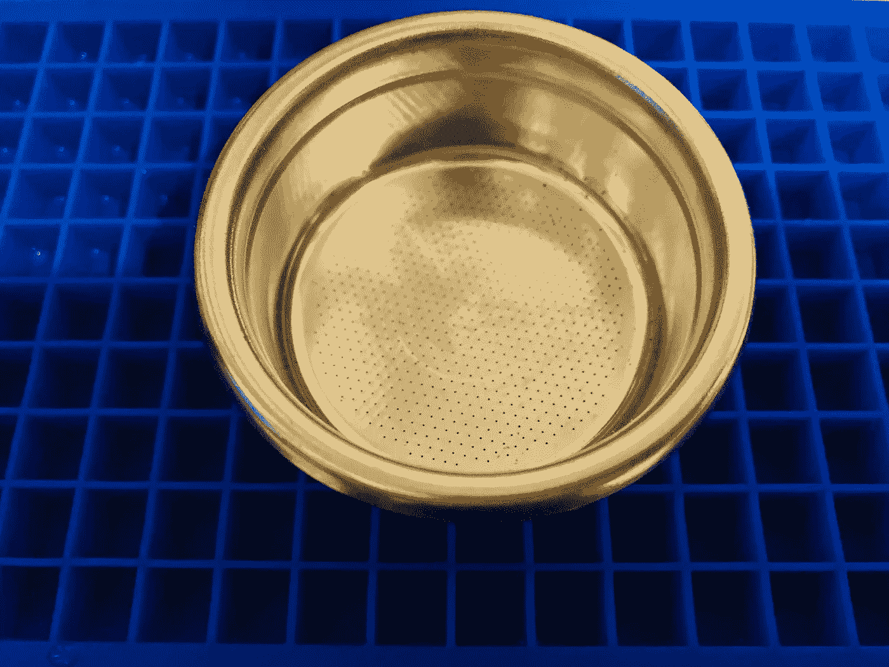

# 实验准备

收到托盘后，看起来我最多只能得到一个 5×5 的样品网格，缺角(总共 21 个样品)。我还用水做了一些测试，我发现正方形很浅，所以在拍摄过程中，我必须将它在过滤器上移动两次(总共三个位置)。杠杆机器的好处是我可以减缓压力，把托盘稍微拉下，然后把它移到下一个点。这确实对结果有轻微影响，但没有其他选择。

还有另外两个主要问题:

**关注点#1** :冰块托盘中的空气是否会阻止咖啡进入托盘，因为托盘会被压在过滤器的底部？这在很大程度上是未知的，似乎是大气压下水通过过滤器的一个问题。我没有解决办法，在拍摄的时候，这并没有产生明显的影响。

**关注点 2** :立方体之间的隔板会阻挡液体通过过滤器并影响圆盘内部的流动吗？这种情况很有可能发生，但我无法知道目前的工具是否产生了影响。如果它确实有影响，它将通过滤波器被感觉到，并且不会不均匀地影响输出(理论上)。

在准备我的设置时，我也不得不剪下滤镜，这很简单，用剪刀就能帮助我对准滤镜，尤其是当我在整个镜头中移动的时候。

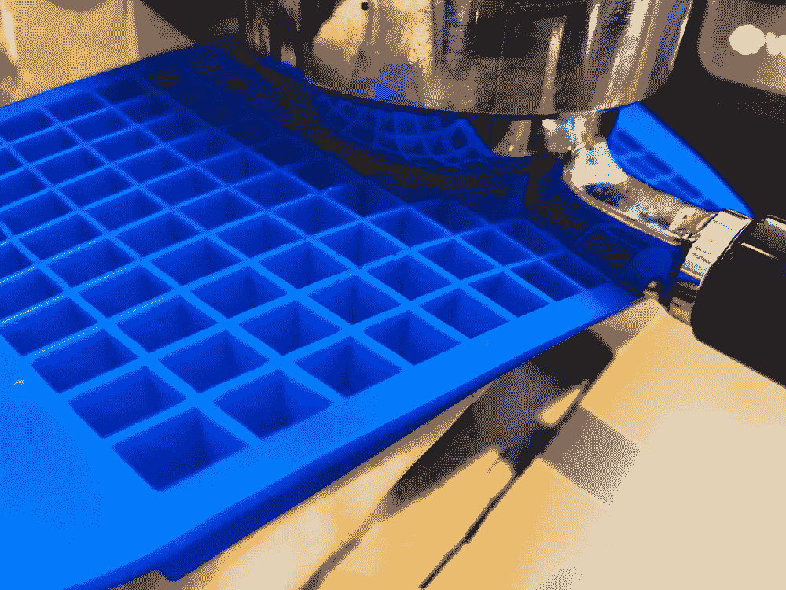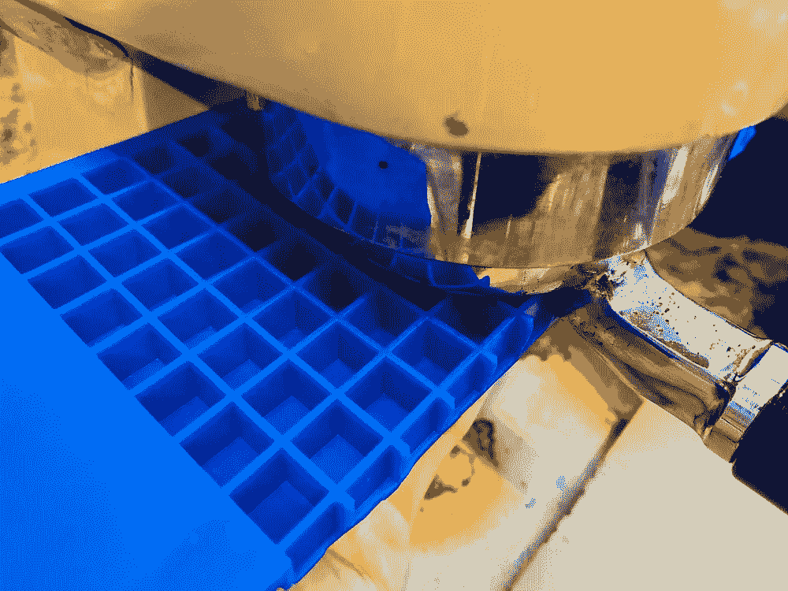

# 这一枪

至于设备，我用的是[金快线](https://link.medium.com/NMfeoLVpuT)弹簧驱动手动咖啡机。在第一次破裂后的 1:15 分钟，我烘烤了等量的埃塞俄比亚干法[和尼加拉瓜芬卡](https://www.sweetmarias.com/green-coffee.html)[的混合物。我用](https://www.sweetmarias.com/nicaragua-finca-buenos-aires-lot-1-6132.html) [Lume grinder](https://www.hellolume.com/shop/lume-automatic-travel-coffee-grinder-camp-light) 打磨它们，我开始用常规击球代替[断奏](https://medium.com/overthinking-life/staccato-espresso-leveling-up-espresso-70b68144f94)以防击球完全浪费。

我使用了一个 [IMS](https://www.imsfiltri.com/tecnologie/) 三重篮子，在准备冰球的过程中，我使用了一个弯曲的回形针来打碎团块并分配场地。然后我捣了两次:一次是在分发后一半的地面上，一次是在分发后的最后。我用了 24 克咖啡，我发现如果我不中途捣实，很难得到好的分配而不损失咖啡。我知道这不符合标准。然后我用一个水平仪确保从顶部看，一切都是水平的。

我还想说明的是，我没有想到[的第一次测试](https://youtu.be/3UdXpvAiqPA)会进行得如此顺利，我很惊讶。

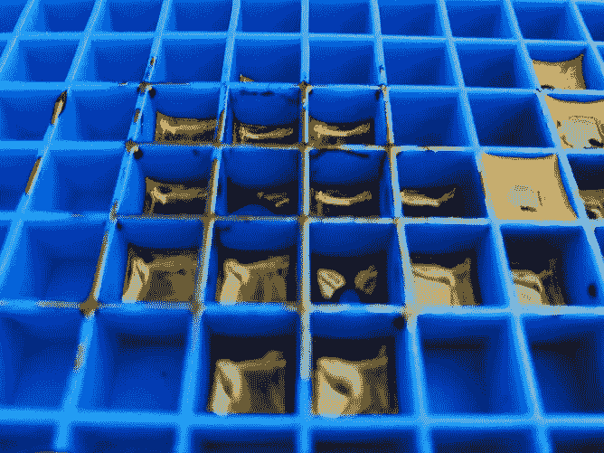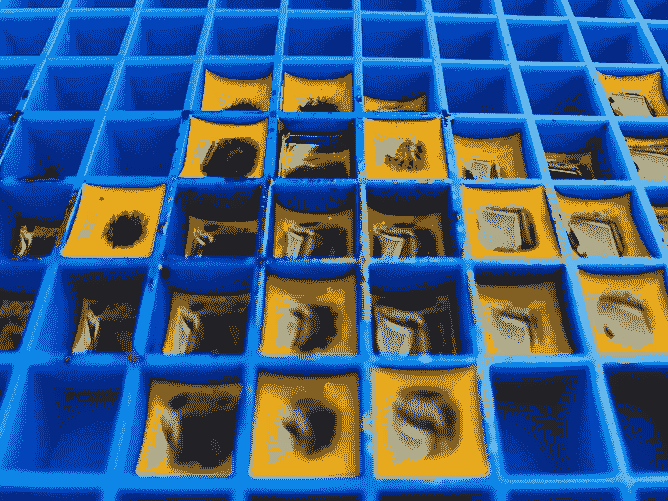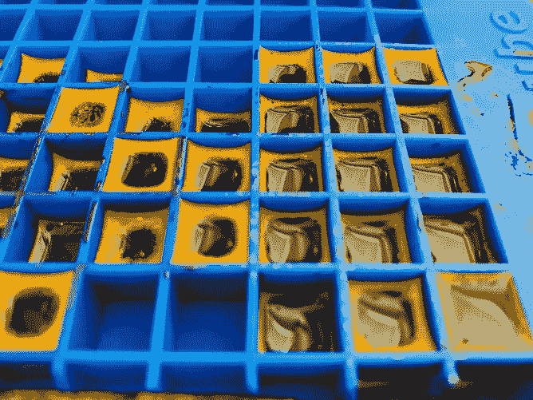

第一次测试的结果是惊人的。唯一的错误是没有将最左边的过滤器摆正，浪费了几列。最终的结果是，镜头最后三分之一的最右边的三列不见了。

后来，冰球上出现了一条裂缝，但这可能是在我把冰球拉进托盘并让压力不减的情况下发生的。过滤器的底部似乎显示了均匀流动的模式，但下一次，我应该有一个辅助相机来看看均匀流动是如何通过过滤器后的冰块托盘。

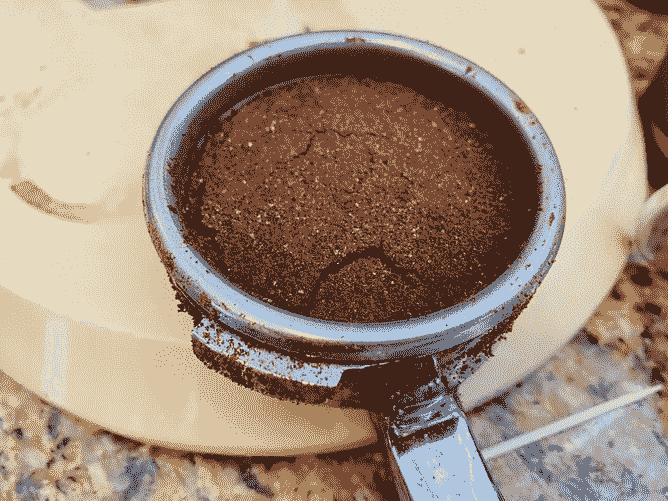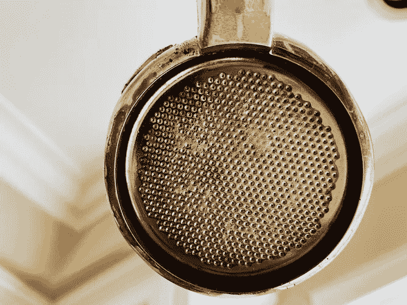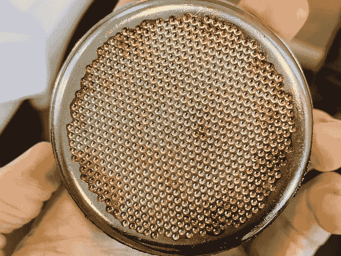

# 测量数据

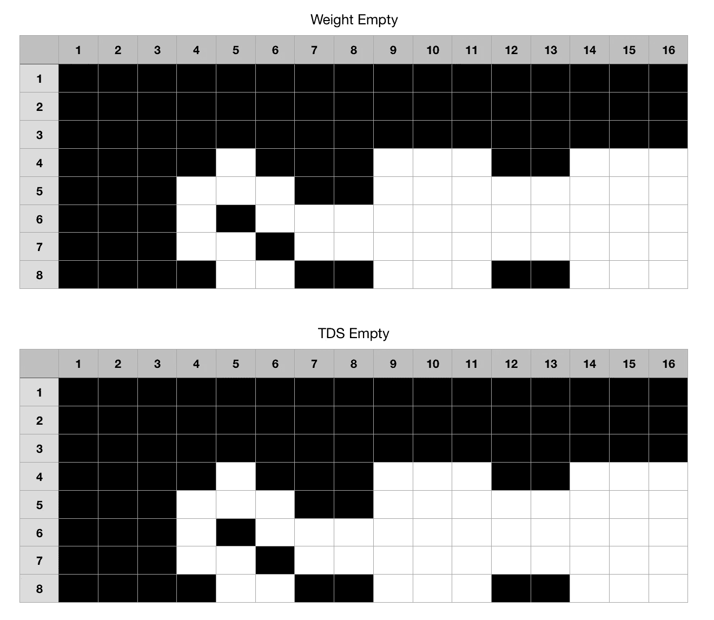

我使用了 Atago TDS 咖啡折射仪和一个可以精确到小数点后两位数的[标尺](https://www.google.com/aclk?sa=L&ai=DChcSEwikt96eqKXnAhUWvewKHWELDFwYABADGgJwag&sig=AOD64_31YTJ8c7G9ByEPS7Ju-fYX0-4anA&ctype=5&q=&ved=0ahUKEwiw_NqeqKXnAhWCLn0KHcZmB40QrkMIgAE&adurl=)(500 克 x 0.01g 克)。我为整个托盘设置了一个数据表，我涂黑了没有液体或液体太少无法测量的方块。

我还应该注意到，我用保鲜膜盖住托盘，让咖啡冷却到室温。我担心测量需要一段时间，我不希望水分蒸发成为一个重要因素。我不确定我是否会再次覆盖，但冷却的时间很重要。通常应该在你喝饮料的温度下进行 TDS 测量，但是在这个实验中控制它的唯一方法是确保它不变。控制这一变量的唯一完美方法是拥有一个 100%湿度的房间，并且当镜头离开时，温度与镜头相同。

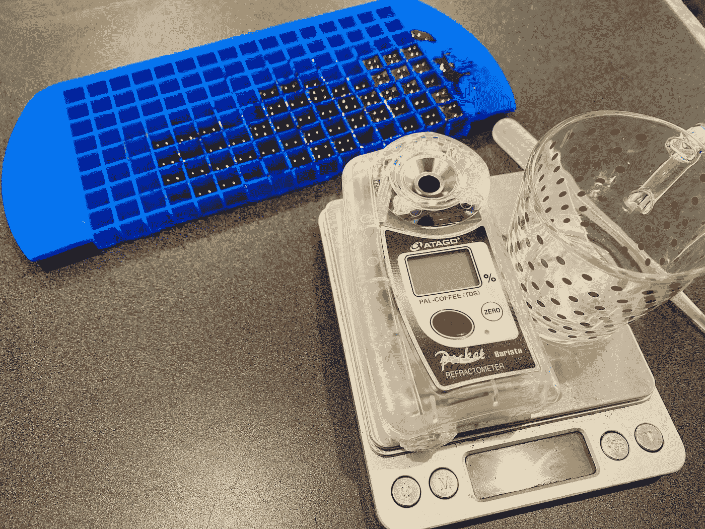

为了测量，我将托盘放在秤上，并将秤盘归零。然后，我会用注射器从立方体中取出尽可能多的咖啡，滴入 3 滴(偶尔偶然 4 滴)到 TDS 阅读器中。剩下的，我会倒进杯子里。我用一些棉签将立方体擦干，并记录重量。大约在那个时候，TDS 测量可用于记录。

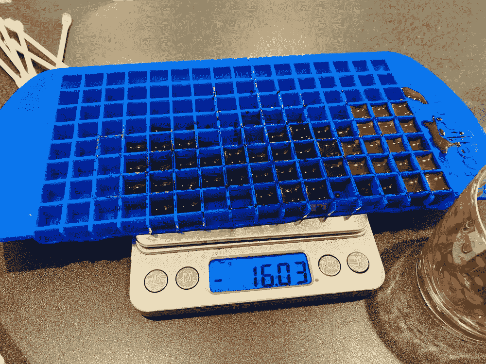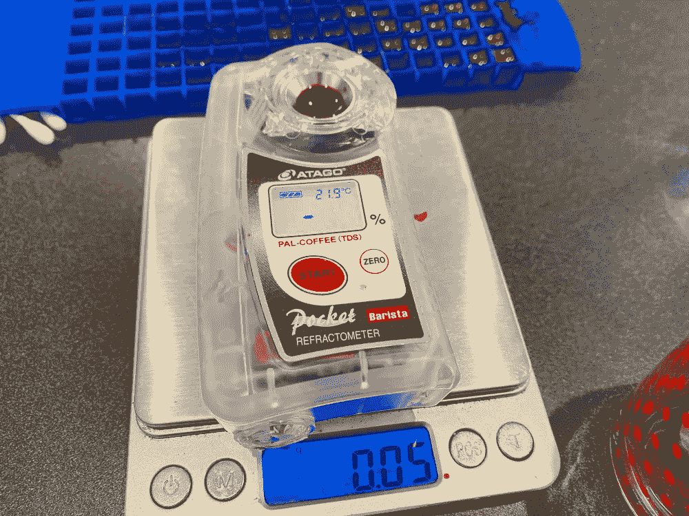

至于从哪里开始测量，拍摄的第一部分不多，我知道 TDS 会这么高，我必须稀释样品才能测量(Atago 只上升到 22.4% TDS)。所以我开始记录照片中间、结尾和最后开头的数据。

对于 TDS 过高的立方体，我会将计量器放在秤上，添加 3 滴(通常重 0.07 克，我承认这有可变性，因为它在秤上可以分辨的低端)，我会添加 0.14 克过滤水。我没有蒸馏水，但测量过滤水的 TDS 为 0.07%，我认为这可以忽略不计。

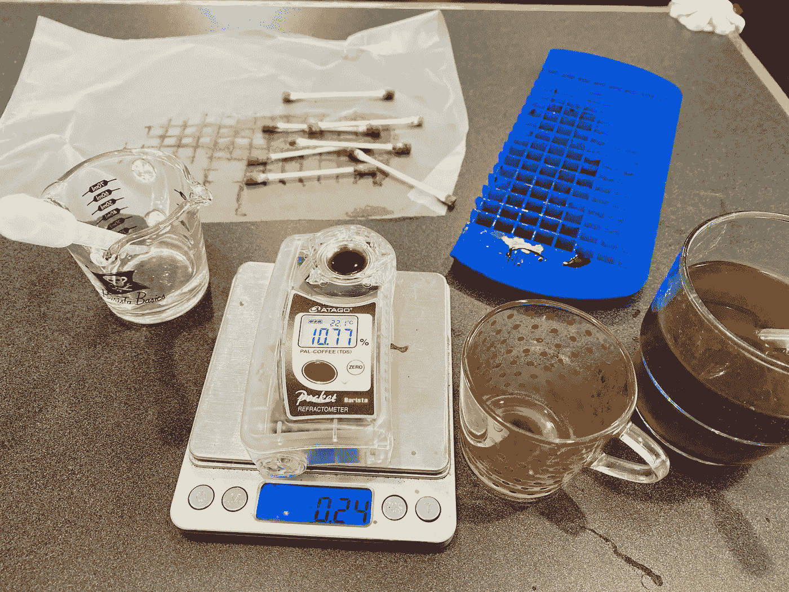

# 结果

即使在记录数据时，很明显过滤器上的分布是不均匀的，但奇怪的是分布如此不同。有些可能是因为拍摄的不均匀，但不清楚哪一方更受青睐。

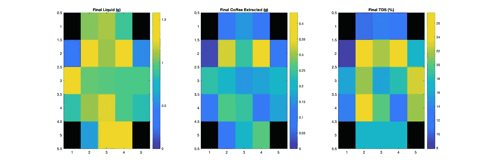

将三个时间实例中的每一个的所有方块相加，似乎可以清楚地看出，在最初的一点咖啡中提取了大块咖啡。与[之前的数据](https://medium.com/@rmckeon/coffee-solubility-in-espresso-an-initial-study-88f78a432e2c)相比，这似乎有点高，这可能是由测量误差引起的。

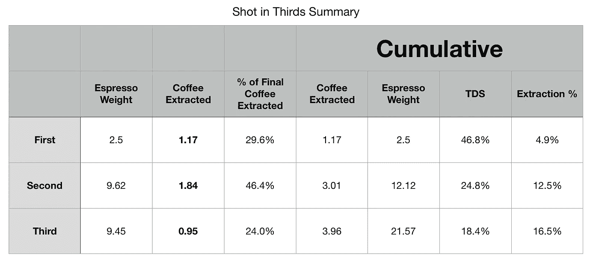

如果我们观察液体重量、咖啡萃取重量和 TDS 这三个时间段，就会发现奇怪的模式。仅仅因为过滤器上的一个点提取了大量的液体，提取的咖啡并不完全是趋势。在整个过滤器上也存在不均匀性。

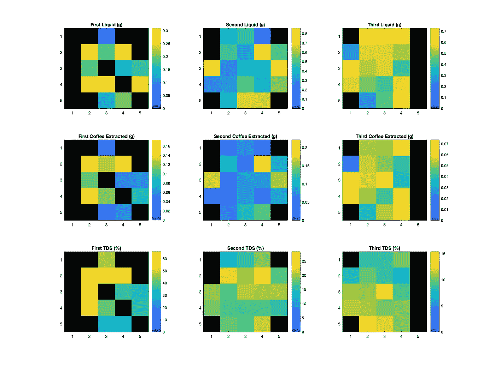

我为过滤器添加了累积的液体/咖啡/TDS，这样人们就可以看到总量是如何随时间变化的。就哪些方块有最多的液体通过而言，有一些通道，但这种模式并不像我想象的那样遵循提取咖啡的模式。

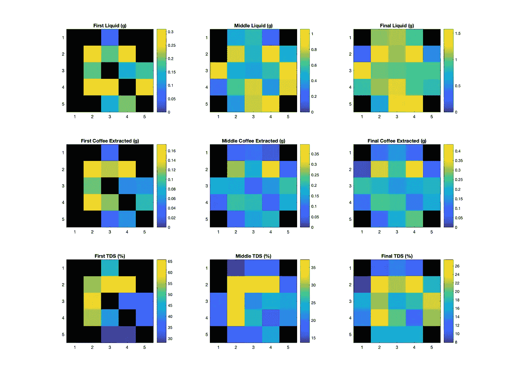

一段时间内的累积数字

为了了解液体重量与提取的咖啡之间的关系，我取了中间的样本，用提取物与重量的关系对它们进行了线性作图。它们看起来大多是线性的，但没有我想象的那么紧密。

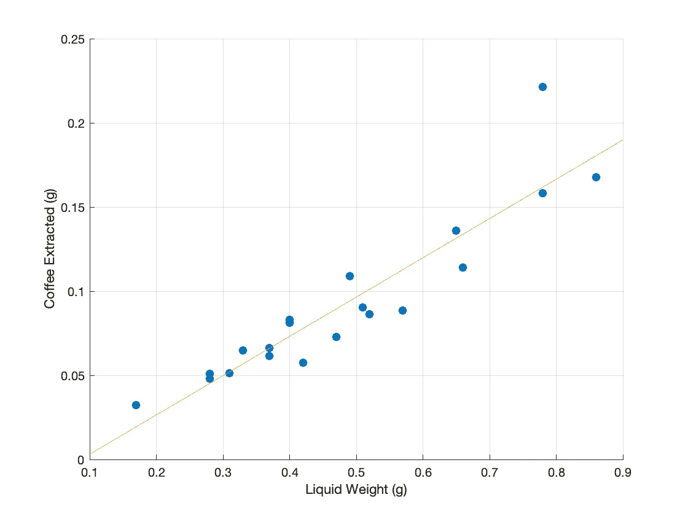

# 我们再深入一点！

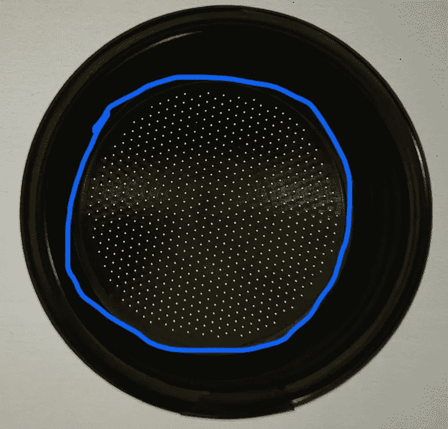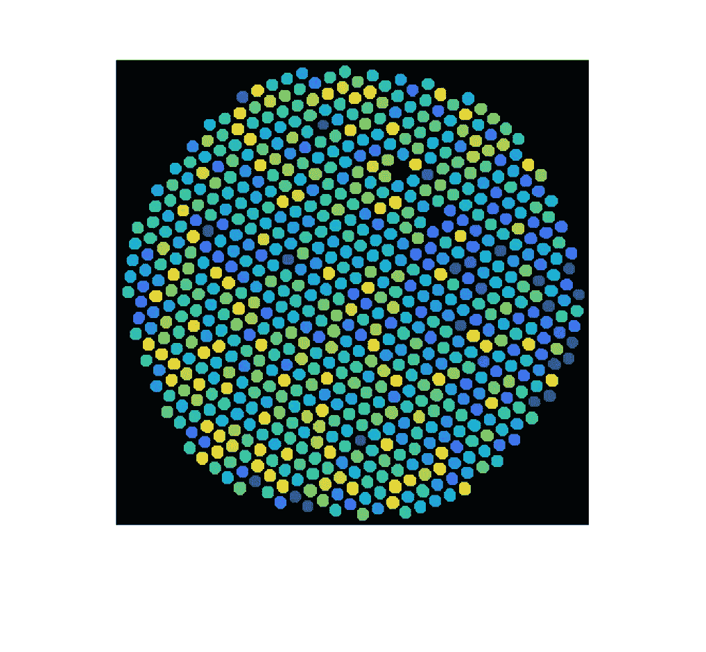

1.与上面的网格提取方向相同的过滤器的原始图像。2.基于标准图像处理技术的孔径彩色化。

现在，对于真正的测试，流量与基于井眼尺寸的[过滤器分析相比如何？一年前，我从事各种浓缩咖啡过滤器的滤网孔分析。孔尺寸较大的区域会导致较高的流量，从而有助于形成沟道吗？](https://link.medium.com/2T2tjpUsgU)

主要问题是孔的数量远大于用于收集样本的立方体的数量。因此，让我们向下采样到 5 乘 5 进行比较，记住，无论哪种方式，结果都应该是有保留的。

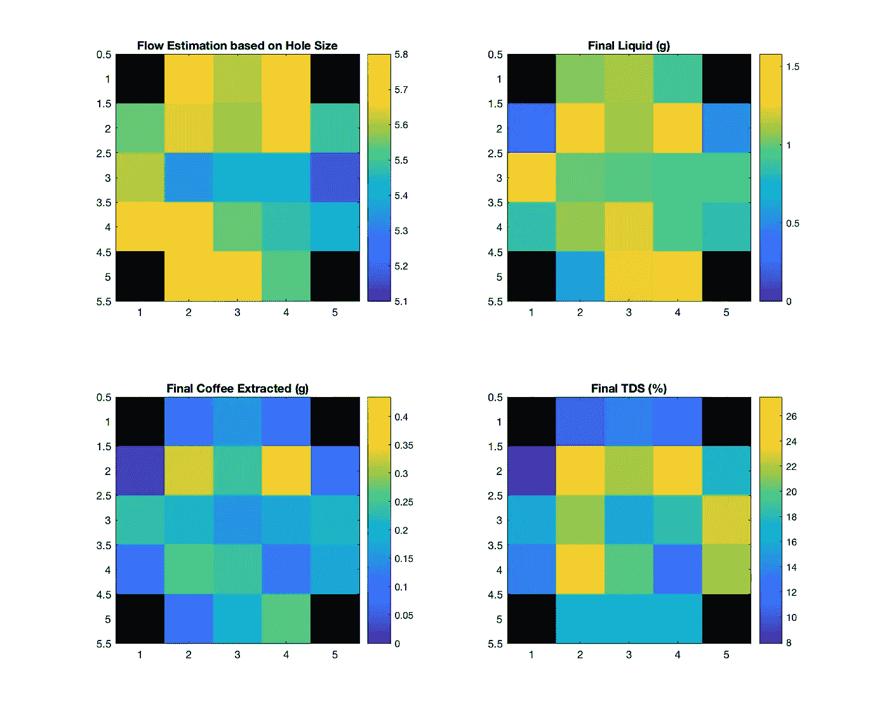

在中间一行，第 2 列到第 4 列有一个明显的带，这里的流量低于周围的方块。这在一定程度上与重量和提取的咖啡的最终数据收集相一致。中心像素似乎也排列得很好。需要更高的分辨率才能做出合理的结论。

这个实验可能是新奇的，但它仅仅是一个开始。一个更好的实验应该有更小的正方形和更多的正方形，并且可以重复多次。结果表明一件事是肯定的:过滤器下面发生的事情不能仅仅通过一对音量和 TDS 测量来总结。

虽然数据收集很复杂，容易出错，但我想再做一次，检查断奏镜头和其他过滤器。我还打算看看我是否能得到一个更好的设计，有更深更小的正方形。

如果你愿意，可以在 Twitter 和 YouTube 上关注我，我会在那里发布不同机器上的浓缩咖啡视频和浓缩咖啡相关的东西。你也可以在 [LinkedIn](https://www.linkedin.com/in/robert-mckeon-aloe-01581595?source=post_page---------------------------) 上找到我。

# 我的进一步阅读:

[断续浓缩咖啡:提升浓缩咖啡](/overthinking-life/staccato-espresso-leveling-up-espresso-70b68144f94?source=post_page---------------------------)

[浓缩咖啡中咖啡溶解度的初步研究](/coffee-solubility-in-espresso-an-initial-study-88f78a432e2c)

[浓缩咖啡模拟:计算机模型的第一步](https://medium.com/@rmckeon/espresso-simulation-first-steps-in-computer-models-56e06fc9a13c)

[咖啡数据表](/@rmckeon/coffee-data-sheet-d95fd241e7f6)

[工匠咖啡价格过高](https://link.medium.com/PJwoAMYpuT?source=post_page---------------------------)

[被盗浓缩咖啡机的故事](https://link.medium.com/pxCY5yrquT?source=post_page---------------------------)

[平价咖啡研磨机:比较](https://link.medium.com/rzGxlDtquT?source=post_page---------------------------)

[浓缩咖啡:群头温度分析](https://link.medium.com/FMxfCmcOCT?source=post_page---------------------------)

[浓缩咖啡过滤器分析](https://link.medium.com/2T2tjpUsgU?source=post_page---------------------------)

[便携式浓缩咖啡:指南](https://link.medium.com/zhCu9HbK6U?source=post_page---------------------------)

[克鲁夫筛:一项分析](https://link.medium.com/SK0dmYdK6U?source=post_page---------------------------)