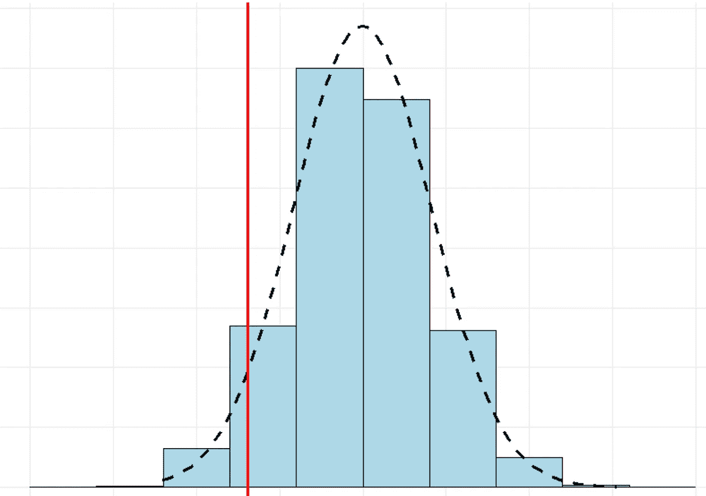
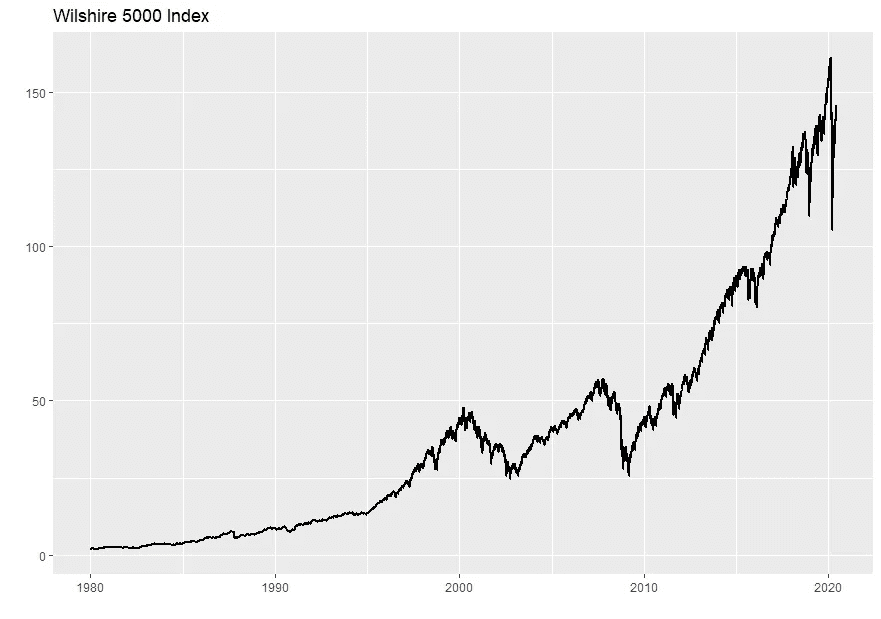
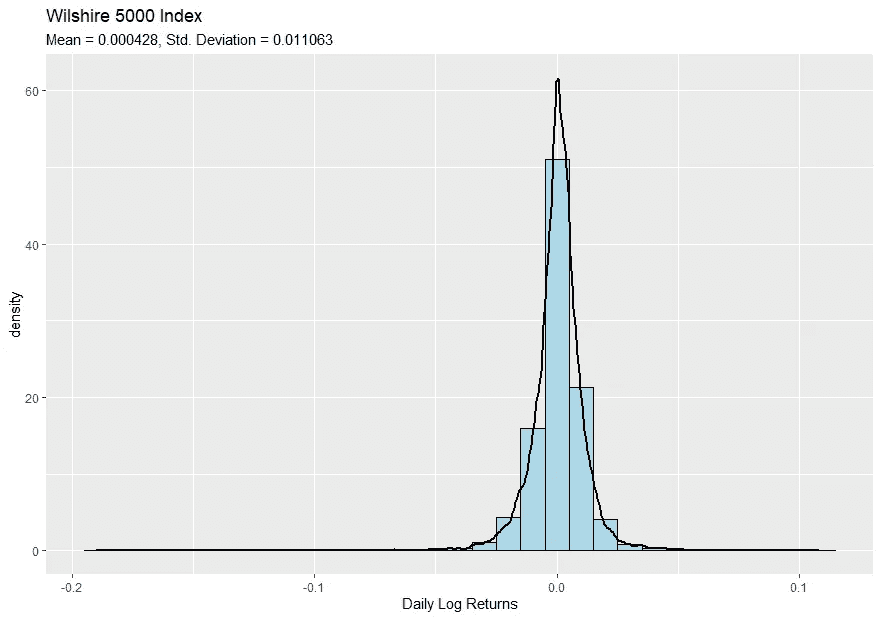
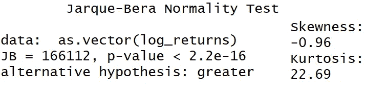
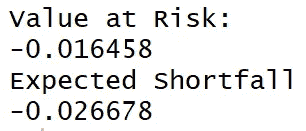
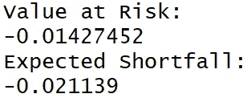
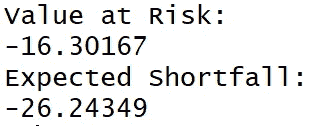

# 衡量金融风险:逐步指南

> 原文：<https://towardsdatascience.com/measuring-financial-risk-a-step-by-step-guide-dd51d647103b?source=collection_archive---------26----------------------->

## 风险价值、预期短缺和正态分布的风险

照片由[编年史颜](https://unsplash.com/@chronisyan?utm_source=unsplash&utm_medium=referral&utm_content=creditCopyText)在 [Unsplash](https://unsplash.com/?utm_source=medium&utm_medium=referral)

这里有一个虚构的故事，讲的是传奇金融家约翰·皮尔庞特·摩根的一个朋友把他所有的钱都投资到了股票市场。他的朋友神经极度紧张——他希望发大财，但又面临着失去一切的可能性。当他见到摩根时，他告诉他自己是多么担心自己的投资，这让他许多个夜晚都无法入睡。“我该怎么办？”他问。摩根简单地回答道:**“卖出，直到你达到睡眠点。”**

# 风险和回报

这项投资我会损失多少？每个投资者都问过这个问题。我们都直觉地理解摩根所暗示的风险和回报的权衡:像股票这样的高风险资产提供了更高回报和更高波动性的可能性。“更安全”的资产，如黄金和政府债券，波动性较低，但预期回报较低。考虑到这一点，我们如何计算我们投资的风险呢？

# 风险价值和预期短缺

**风险价值*【VaR】****和**预期短缺**是理解金融风险的基础。VaR 回答了一个基本问题:*

> *对于给定的信心水平，我预计我的投资组合在一定时间范围内最大的损失是多少？*

**

*资产回报的假设分布，红线代表风险值*

*关于风险值的问题通常是这样的:“在 95%的置信水平下，我的投资组合的一天风险值是多少？”这表示 alpha 值为 0.05，但也经常使用其他 alpha 值，如 0.01 和 0.10。在分布的背景下，VaR 实际上指的是一个*分位数。*对于 0.05 的 alpha，我们感兴趣的是我们回报的 5%分位数——这意味着我们回报的 95%在 VaR 的右边，而 5%在左边。我们选择的 alpha 越低，分布就越靠左，我们的 VaR 就变得越负。*

***预期短缺**回答了一个不同但相关的问题:*

> *在最差 q%的情况下，我的投资组合的预期回报率是多少？*

*与 VaR 相反，VaR 在回报率分布中寻找对应于 alpha 的分位数，Expected Shortfall 取 VaR 左边所有回报率*的平均值*。如果我们计算 alpha 为 0.05(5%分位数)的风险值，相应的 ES 取该点左侧所有每日日志回报的平均值。ES 是一个比 VaR 更稳健的风险度量，因为它解释了左尾巴的重量。当两种方法一起使用时，我们可以感觉到我们的投资组合在任何一天、一月或一年的风险有多大。*

# *获取数据*

*为了计算我们自己的 VaR 和 ES，我们将使用 **Wilshire 5000** 的数据，该股票市场指数被广泛认为是衡量美国股票价格的最广泛指标。我们可以使用`quantmod`从美联储经济数据库[中导入我们的数据。我们还将使用`ggplot2`来可视化我们的数据。让我们加载我们的库，导入数据，并将我们的观察限制在 1980 年 1 月到 2020 年 6 月之间。然后我们可以将数据绘制成时间序列。](https://fred.stlouisfed.org/)*

*加载库，获取数据，并绘制成时间序列*

**

*威尔希尔 5000 性能，1980 年至 2020 年*

# *计算日志回报*

*在计算 VaR 和 ES 时，我们将使用每日回报的自然对数，而不是传统的算术回报。使用对数回报有几个优点，最有用的是，与算术回报相比，对数回报的分布更对称，更接近正态分布(尽管，正如我们将看到的，对数回报正态分布的观点是一个非常有缺陷的假设)。*

*让我们计算每日日志回报、平均值和标准差，然后绘制分布图。*

**

# *正态性检验*

*我们的回报分布在两个重要方面偏离了常态。首先，我们的分布有重尾——这就是所谓的*轻子库分布。第二，我们的对数回报是不对称分布的:它们形成了一个左偏分布，这意味着极端负回报比极端正回报多。**

*我们可以使用`moments`包中的三个函数来确认这些观察结果:`kurtosis()`、`skewness()`和`jarque.bera()`。峰度衡量尾部的重量(正态分布的峰度为 3)，偏斜度衡量分布的对称程度(正态分布的偏斜度为零)。Jarque-Bera 是一种统计拟合优度测试，我们可以用来验证我们的分布的峰度和偏斜度是否不同于正态分布。*

**

*Jarque-Bera 的零假设是我们的分布是正态的。从统计学上，我们知道当 alpha 大于 p 值时，我们拒绝零假设。在这种情况下，我们拒绝零，并得出结论，我们的每日日志回报是非正常的。我们的 p 值基本为零(2.2e-16)，因此我们可以在 99%的置信度下拒绝正态假设。*

*实际上，这意味着 Wilshire 5000 对数收益比我们基于正态分布的假设更加不稳定。忽视这一现实并使用正态分布会让我们意识不到，并且容易受到黑天鹅级别的负面事件的影响，因为我们低估了尾部风险。*

# *方法 1:从经验分布中抽样*

*既然我们已经排除了使用正态分布来寻找 VaR 和 ES，我们可以用什么来代替呢？一种方法是直接根据我们的经验分布进行模拟，而不对其形状做任何假设。我们可以使用下面的代码，基于经验数据的模拟，在 95%的置信度下计算 1 天的 VaR 和 ES。*

**

*这告诉我们，在 95%的置信水平下，Wilshire 5000 的 1 天 VaR 为-1.64，ES 为-2.67%。换句话说，这意味着**我们不应该期望在任何一个交易日 95%的时间里遭受比 1.64%更糟糕的下跌。我们的 ES 状态告诉我们，单日跌幅超过 2%是可能的，但可能性极小。***

# *方法 2:从 student-t 分布中抽样*

*我们已经确定我们的回报不是正态分布的，但这并不意味着我们不能用另一种分布来拟合我们的回报。Student-t 分布是一大类分布，它包含正态分布，但具有较重的尾部。我们可以使用我们的平均值、标准差和自由度值来拟合“重新调整”的 Student-t 分布，以便它合理地接近我们的分布。我们可以使用`MASS`和`metRology`包来实现这一点，然后使用这个拟合的分布重新计算 VaR 和 es。*

**

*我们使用这种分布的结果意味着比我们的经验估计更少的风险。这一次，我们估计我们在 95%置信度下的 VaR 是-1.43%，而 ES 是-2.11。一种方法不一定比另一种更好，但对于保守的投资者来说，最好使用我们从经验分布中获得的结果，并假设最差的 VaR 和 ES。*

# *应用我们的结果*

*假设我们向威尔希尔 5000 投资 1000 美元。我们如何将刚刚计算的 VaR 和 ES 应用到这个投资组合中？*

*最终，我们基于离散回报来衡量我们投资组合的变化，*而不是*对数回报。我们使用对数收益是因为它们方便的统计特性，但离散收益是通常使用和报告的。让我们将经验 VaR 和 ES 转换为离散回报，根据我们 1000 美元的投资组合计算它们，并解释结果。*

**

*我们的 VaR 告诉我们:**我们不希望在任何一个交易日 95%的时间里损失超过 16.30 美元。我们的 ES 告诉我们，在最糟糕的 5%的情况下，我们预计损失约为 26.24 美元。***

*根据您的风险承受能力和时间跨度，这些指标可以应用于不同的环境。如果你是日内交易者，我们计算的 1 日 VaR 和 ES 将有助于显示你的交易策略的风险程度。如果你是一个长期投资者，我们可以对我们的日志回报使用`apply.yearly()`函数，并重新计算 VaR 和 ES，以确定我们在一年中可能会损失多少钱。*

# *结论*

*我希望你喜欢这个教程，并了解了一些投资组合风险！您现在可以使用`quantmod`获得财务数据，计算对数回报，使用`moments`软件包分析回报分布，并以几种不同的方式测量 VaR 和 ES。还有更先进的方法来衡量金融风险，我希望在未来的帖子中涵盖它们。关于如何使用 R 分析金融数据的更多信息，请查看我之前的帖子， [*在 R*](/building-and-testing-stock-portfolios-in-r-d1b7b6f59ac4) 中构建和测试股票投资组合。感谢阅读！*

**本文的代码和数据可以在我的*[*Github*](https://github.com/ctkincaid/Financial-Analysis-Using-R)*找到。**

# *关于我*

*我叫克里斯蒂安·金凯，在马里兰大学帕克分校学习金融和经济学。如果你喜欢这个帖子， [*关注我*](https://medium.com/@christiantkincaid) *上媒！**