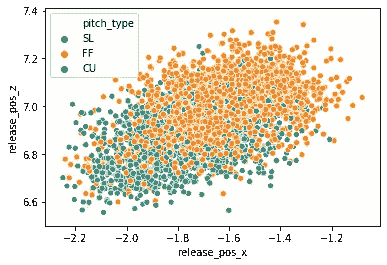
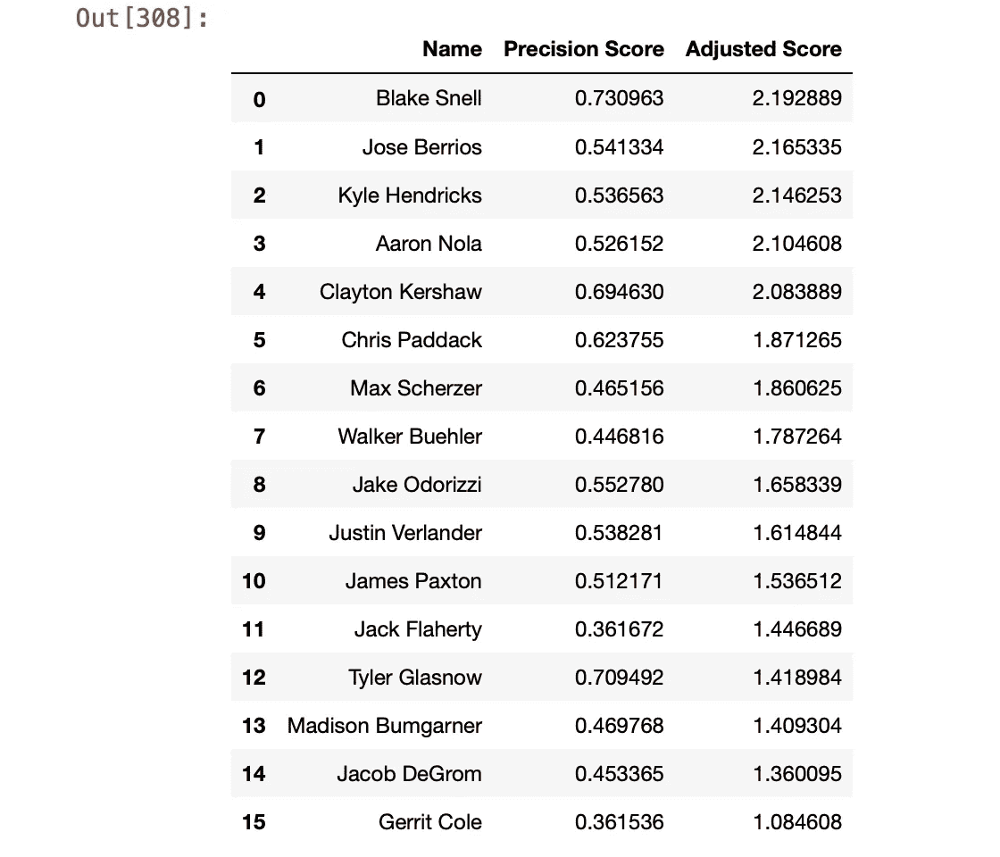
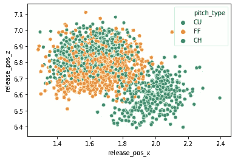
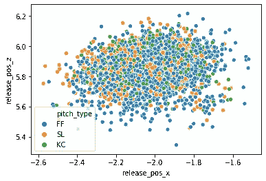

# 测量投手隐藏投球的能力

> 原文：<https://towardsdatascience.com/measuring-how-well-pitchers-hide-their-pitches-f61f076d91f4?source=collection_archive---------65----------------------->

## 使用机器学习来量化欺骗

何塞·莫拉莱斯在 [Unsplash](https://unsplash.com?utm_source=medium&utm_medium=referral) 上的照片

正如棒球界最近在 Astros 2017 作弊丑闻中看到的那样，知道投出了什么球给了击球手一个打破比赛的优势。然而，除非你有一个复杂的摄像头和垃圾桶系统，否则要知道要扔什么球是非常困难的。击球手只有不到一秒钟的时间来捕捉可能指示他们将要面对的投球类型的信号，处理和处理这些信息的时间甚至更少。指示投出哪一球的信号可能是投手的下意识反应，也可能是跑垒员向二垒看的信号。但这些要么是情境性的，要么是有经验的投手容易避免的。一个更难避免的投球指标是投手的释放点。

Sean Manaea 在 2018-2019 年投球的释放点

上图显示了奥克兰 A 队的投手 Sean Manaea 自 2018 年以来所有投球的释放点。正如我们从图中看到的，根据沥青的类型，释放点有相对明显的差异。对马奈来说，他倾向于释放比任何其他球都低的快速球，而他的变速球平均来说是在最高点释放的。观察力敏锐的击球手可以捕捉到这些信号并加以利用。不需要垃圾桶，只需要技巧。然而，并不是所有的投手在他们的释放点上都有如此明显的不同。以贾斯汀·韦兰德为例:

贾斯汀·韦兰德 2019 年的投球点数

看上面的图表，我们可以看到韦兰德的发布点更加统一。根据他的投球类型，他的释放点似乎没有很明显的不同。这使得击球手很难根据手臂位置的不同来预测韦兰德投出了什么球。

**量化隐藏音高的能力:**

既然我们已经看到了隐藏音高能力的差异，一个自然的问题是:我们如何量化这种差异？我决定量化这种能力的方法是使用一个分类模型。如果你不知道什么是分类模型，这里有一个快速总结。分类是一种机器学习模型，试图根据某些特征对数据进行分类。在这个特定的模型中,“类”是音高类型，特征是释放点的坐标和音高被投掷的计数。因此，该模型采用释放点坐标和计数，并根据该信息尽最大努力确定投掷的类型。

**功能选择:**

当然，如果我只是想准确地对投掷的球进行分类，我可以将旋转速度和球的运动度量作为特征包括进来，以建立一个更加准确的模型。但我想量化投手对击球手隐藏投球的程度，所以我只想要击球手在球从投手手中释放之前可以获得的信息。因此，在这个模型中，我们只有音高的释放坐标和它被扔进的计数作为特征。

**评估模型:**

一旦模型试图对给定的数据进行分类，我们需要一种方法来评估它对数据的分类程度。这就是我们如何衡量一个投手对击球手隐藏投球的能力。用于评估模型的度量标准称为精度分数。这实际上返回了被正确分类的音高的比例，所以它的范围是从 0 到 1。如果模型能够正确地对大部分投球进行分类(精确得分值更接近 1)，这告诉我们投手在他的投球的释放点上具有更明显的差异，和/或他在某些计数中投掷的投球是非常可预测的。更接近 0 的精度分数表明模型不能有效地基于释放点和计数对音高类型进行分类，这告诉我们投手在从同一点释放音高方面要好得多，并且根据计数将它们混合得很好。需要记住的一件事是，拥有更多球场曲目的投手得分会更低，因为有更多的球场需要分类。为了抵消这一点，我将根据模型的表现比简单地随机分类音高好多少来衡量模型的表现。例如，如果一个投手有 4 个音高，你随机猜测音高类型，你会有 25%的正确率。因此，如果一个有 4 个音高的投手的精确得分是 0.5，那么它的调整后得分将是 2，因为它比随机猜测有效两倍。

**成绩:**

既然我们已经定义了模型和评估指标，让我们来看看结果。在这里，我从 2019 年随机挑选了 16 名投手，并通过模型运行他们的投球数据。

我们的“赢家”是 Blake Snell，他拥有最高的精确度分数和最高的调整分数。斯内尔的高分表明他有不同的释放点，让我们看看他的释放点图来验证这一点。

布莱克·斯内尔的释放点

上面的图表似乎符合 Snell 的高精度得分。斯内尔似乎有非常明显的区域，他释放他的变速球到较低的右边，他的曲球和快速球到较高的左边。

当与 Gerrit Cole 相比时，这种差异更加明显，Gerrit Cole 在我测试的球员中精度得分最低。

Gerrit Cole 的发布点

Gerrit Cole 的释放点更加混乱，他在哪里释放某些球没有明确的模式。这使得击球手更难捡起他手中的球。

**应用:**

虽然这个小实验更适合我，但我相信团队可以通过几种方式利用这些数据和模型。

第一个应用是让击球手找到释放点有明显差异的投手。然后，团队和击球手可以查看这些投手的释放点图，以找到不同投球的模式，并使用该信息来帮助根据投手的手臂位置计算出正在投掷的投球。当然，这说起来容易做起来难，但是有经验的玩家可以利用这些信息达到很好的效果。

第二个应用是投手。具有高精确度分数的投手可能想要尝试降低他们的精确度分数，无论投球如何，都从同一点持续投球，让击球手更难捡起被投出的球。

如果您对如何应用这些数据有任何想法，请随时告诉我！

模型和数据的代码可以在我的 [GitHub](https://github.com/jwilsonds/pitch-classification-analysis) 上找到。这是我第一次使用分类，所以任何提示或批评都非常感谢。