# 新冠肺炎时代的社会距离测量

> 原文：<https://towardsdatascience.com/measuring-social-distance-in-the-time-of-covid-19-da0503717a62?source=collection_archive---------27----------------------->

## 使用 TensorFlow 对象检测 API 来检测行人并计算他们之间的“社交距离”。

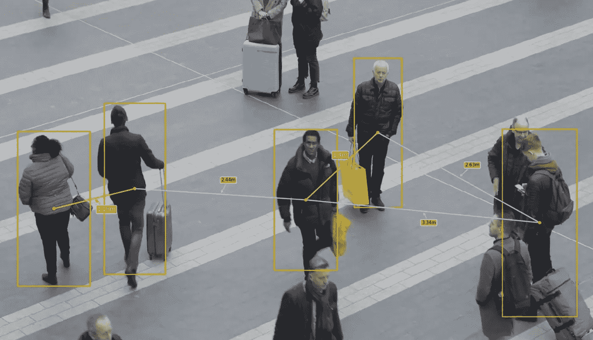

不幸的是，今天每个人都很熟悉这个术语*、【社会距离】、*。在一切恢复正常之前，我们将不得不忍受一段时间。在 [**免疫技术研究所**](https://immune.institute/en/?utm_campaign=IMMUNE&utm_source=Embajador) 我们尝试使用 **TensorFlow 对象检测 API** 开发一个应用程序，用于识别和测量行人之间的社交距离。

## 等等…什么是 TensorFlow 物体检测 API？

**TensorFlow 对象检测 API** 是用于创建深度学习网络的框架，该网络解决**对象检测**问题。它包含一些在不同数据集上训练的预训练模型，可用于推理。

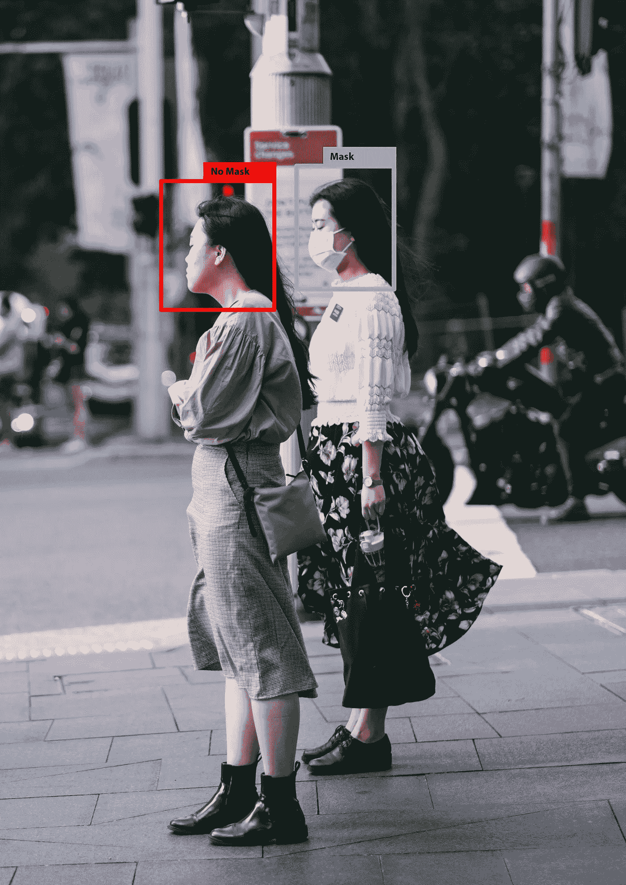

此外，我们可以使用该框架将**迁移学习**应用于之前在大型数据集上训练过的预训练模型，这使我们能够为特定任务定制这些模型。例如，我们可以应用迁移学习来训练一个识别一个人是否戴着面具的模型。

用于图像分类的迁移学习背后的直觉[是，如果一个模型是在一个足够大且通用的数据集上训练的，那么这个模型将有效地充当视觉世界的通用模型。然后，您可以利用这些学习到的要素地图，而不必通过在大型数据集上训练大型模型来从头开始。](https://www.tensorflow.org/tutorials/images/transfer_learning)

在这种情况下，我们不需要应用迁移学习，因为我们想要识别行人，并且已经有一些模型被训练来推断这一点。我们使用的模型**SSD _ mobilenet _ v2 _ coco _ 2018 _ 03 _ 29**已经针对这些对象进行了培训:

型号 ssd 的类别 _mobilenet_v2_coco_2018_03_29

对于这个用例，我们只需要识别和显示**行人**，因此我们将创建一个按标签过滤预测的函数，我们将只显示`person (id=1)`标签。

## 走吧…一些代码！

当我开发这段代码的时候， **TensorFlow 对象检测 API** 还没有完全支持 **TensorFlow 2** ，但是 7 月 10 日 Google 发布了一个新版本，开发了对一些新功能的支持。在这种情况下，我使用了 **TensorFlow 1** 和 **TF 对象检测 API** 的 **r1.13.0** 版本以及 Google Colab 的所有容量来进行这个实验。

你可以在我的 [GitHub](https://github.com/alejandrods/Social-Distance-Using-TensorFlow-API-Object) 里找到代码。

首先，我们需要在我们的**驱动器**中创建我们的工作目录`Projects/Pedestrian_Detection`，在那里我们将克隆 **TensorFlow 对象检测 API** 库。然后，我们将能够用 Google Colab 启动一个笔记本。

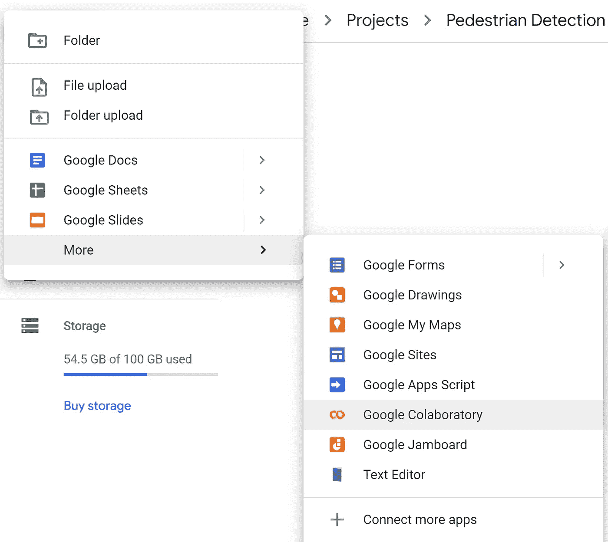

在项目/行人检测中创建一个 Google Colab

首先，我们需要将我们的驱动器安装到我们的笔记本电脑中，我们只需要按照说明进行操作。

在 Google Colab 中挂载驱动器映像

然后，我们将能够把`path`改变到我们的根文件夹`Projects/Pedestrian_Detection`。

更改我们根文件夹的路径

现在，我们可以克隆 **TF Object Detection** 的库，在本例中是 release[**r 1 . 13 . 0**](https://github.com/tensorflow/models/tree/r1.13.0)**。**

**我为什么要使用这个版本？**😄基本上，因为我已经测试了一些其他版本，但我发现了一些错误，这是我测试的第一个版本，它工作得很好。

一旦你克隆了这个库，你会在目录`Projects/Pedestrian_Detection`中看到一个名为`Models`的文件夹。

## 现在有趣的部分开始了！！

来自 TensorFlow 的家伙都是非常好的人，他们为我们提供了一个笔记本，让我们带您了解使用预先训练的模型来检测图像中的对象的过程(您可以在这里找到:`Projects/Pedestrian_Detection/models/research/object_detection/colab_tutorials)`)。但是，我们将创建自己的笔记本，因为我们将学习如何实现新的可视化功能。

转到 Drive 中的`Projects/Pedestrian_Detection/models/research/object_detection`,在这个目录中创建一个新的 Google Colab。

首先是将 **TensorFlow 版本**设置为 **1.x.**

正如我们之前所做的，我们应该将我们的驱动器映像装载到 Google Colab 中，并转到`Projects/Pedestrian_Detection/models/research/`。

安装驱动

正在将路径更改为。/模型/研究

我们将需要安装一些库，如`Cython, contextlib2, pillow, lxml, matplotlib, pycocotools`和`protocbuf compiler`。

安装库

现在我们应该运行`protoc compiler`，这是一个用于序列化结构数据的 Google 库，由 **TensorFlow** 使用，可以想象为 XML，但是更小、更快、更简单。

**协议**已经安装在 Google Colab 中，但是如果你正在使用你自己的机器，你必须遵循 [***这些说明。***](https://github.com/protocolbuffers/protobuf)

运行协议库

等等……协议做了什么？基本上，`protoc`已经为`/models/research/object_detection/protos`中的每个文件生成了一个 python 脚本。

**太好了！！我们离✌️.更近了一点下一步非常简单，因为我们需要设置`PYTHONPATH`并使用`setup.py.`安装包**

设置环境变量和测试 TensorFlow

最后，您应该会看到类似这样的内容:

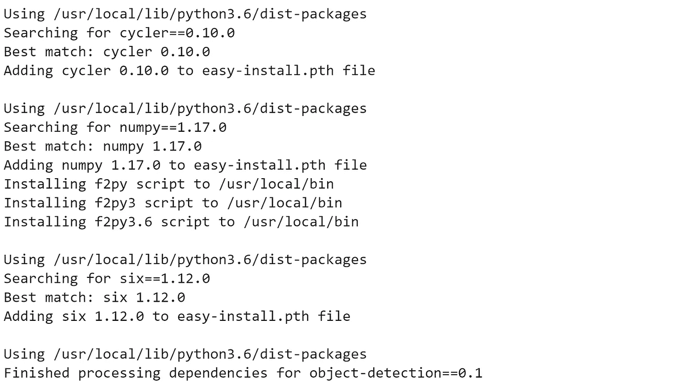

当您意识到一切都已正确安装时…

等一下……我们需要一个模特，对吗？ **Yeep！**我们需要下载一个预先训练好的模型，在这种情况下我选择了这个:**SSD _ mobilenet _ v2 _ coco _ 2018 _ 03 _ 29**因为它速度快(在一个实时应用中很重要)，而且准确性很高。但是，您可以探索其他型号[的性能，并为您的应用选择正确的型号。](https://github.com/tensorflow/models/blob/master/research/object_detection/g3doc/tf1_detection_zoo.md)

如果一切正常，您将能够使用 **TensorFlow 对象检测 API。**下一步是导入我们将要使用的库。

导入库

目前，我们能够加载我们预训练的模型，我们只需要定义`PATH_TO_FROZEN_GRAPH`，它是我们模型的路径，以及`PATH_TO_LABELS`，它是标签的路径。

装载图

**标签索引映射到类别名称**，这样当我们的卷积网络预测`1`时，我们就知道这对应的是`person`。这里我们使用内部实用函数，但是任何返回将整数映射到适当字符串标签的字典的函数都可以。

## 沉住气…最重要的功能！

函数`run_inference_for_single_image`将图像和我们的模型作为参数，为我们的图像运行推理。该函数返回一个字典`output_dict`，其中包含图像中检测到的每个对象的坐标和标签。

为单个图像运行我们的模型

正如我们之前说过的，我们的模型将要预测任何包含在`category_index`中的物体。但是，我们只想特别显示一个类别:`person`。因此，我们创建了一个函数，根据一个 ***、*** `min_score`和 ***标签 id* 、**、`categories`来过滤我们的预测。在这种情况下，**人员标签**的 **id** 为`1`。(这个我们可以在`category_index`查一下)。

用于过滤预测的函数

## 测量盒子之间的距离！🖼️

我们已经有一个运行推理的模型，它返回一个带有预测的字典`output_dict`。我们想要测量这些预测对象之间的距离，但这不是一个简单的解决方案。因此，我们创建了一些函数来计算每个预测盒的**质心**之间的距离。这些是步骤:

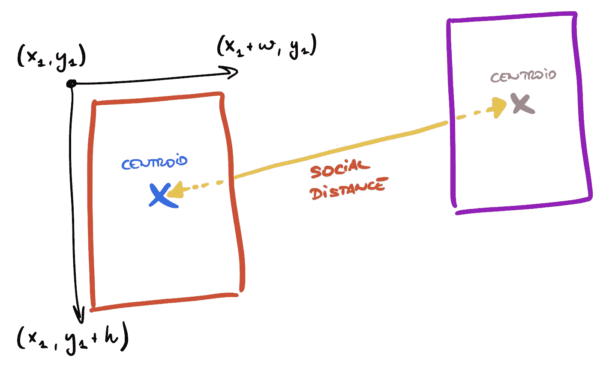

*   使用函数`calculate_coord`获取每个对象的坐标。
*   计算每个盒子的质心— `calculate_centr`。

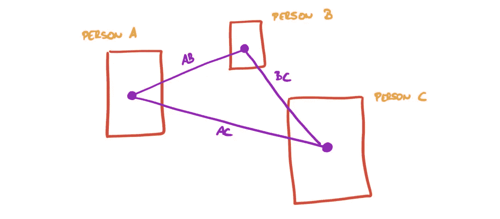

质心之间的排列

*   我们应该使用`calculate_perm`计算质心之间所有可能的排列。
*   用此函数`calculate_centr_distance`计算每个质心之间的距离(如`person A`和`person B`)。
*   最后，我们计算每个线段的中点，以便在图像中以文本形式显示距离— `midpoint`和`calculate_slope`。

显示和计算社交距离的功能

## 让我们把所有的东西放在一起！

现在我们已经定义了这些函数，我们可以创建名为`show_inference`的主函数，它将运行图像预测并显示行人之间的方框和距离。

该函数的第一部分负责获取图像和运行推理。我们将得到一个字典`output_dict`,里面有模型已经预测到的盒子。

```
image = Image.open(image_path)# the array based representation of the image will be used later
image_np = load_image_into_numpy_array(image)# Expanding dimensions 
# Since the model expects images to have shape: [1, None, None, 3]
image_np_expanded = np.expand_dims(image_np, axis=0)# Actual detection.
output_dict = run_inference_for_single_image(image_np, detection_graph)
```

然后，我们将设置`confidence_cutoff=0.5`以避免显示低精度预测。同时，我们将得到我们的图像的大小，我们需要设置一个关系**“像素-米”**来正确计算距离。我检查了一些图像，我认为`width — 150px = 7 meters`是一个很好的关系。这一部分很复杂，因为我们没有考虑视角或相机角度，这是一个很难解决的问题，我鼓励你改进它，并与我们分享你的解决方案😄。

```
# Get boxes only for person
confidence_cutoff = 0.5boxes, scores, classes = filter_boxes(confidence_cutoff, output_dict['detection_boxes'], 
output_dict['detection_scores'], 
output_dict['detection_classes'], [1])# Get width and heigth
im = Image.fromarray(image_np)
width, height = im.size# Pixel per meters - THIS IS A REFERENCE, YOU HAVE TO ADAPT THIS FOR EACH IMAGE
# In this case, we are considering that (width - 150) approximately is 7 meters
average_px_meter = (width-150) / 7
```

最后，我们可以为我们的预测计算所有的质心，并生成排列。然后，我们将能够创建连接质心和显示距离的线`dx,dy`。

```
# Calculate normalized coordinates for boxes
centroids = []
coordinates = []
for box in boxes:
    coord = calculate_coord(box, width, height)
    centr = calculate_centr(coord)
    centroids.append(centr)
    coordinates.append(coord)# Calculate all permutations
permutations = calculate_perm(centroids)# Display boxes and centroids
fig, ax = plt.subplots(figsize = (20,12), dpi = 90)
ax.imshow(image, interpolation='nearest')for coord, centr in zip(coordinates, centroids):
    ax.add_patch(patches.Rectangle((coord[0], coord[1]), coord[2],       coord[3], linewidth=2, edgecolor='y', facecolor='none', zorder=10))
    ax.add_patch(patches.Circle((centr[0], centr[1]), 3, color='yellow', zorder=20))# Display lines between centroids
for perm in permutations:
    dist = calculate_centr_distances(perm[0], perm[1])
    dist_m = dist/average_px_meter    print("M meters: ", dist_m)

    middle = midpoint(perm[0], perm[1])
    print("Middle point", middle)    x1 = perm[0][0]

    x2 = perm[1][0]
    y1 = perm[0][1]
    y2 = perm[1][1]        slope = calculate_slope(x1, y1, x2, y2)
    dy = math.sqrt(3**2/(slope**2+1))
    dx = -slope*dy
```

综上所述，这就是这个功能的最终状态。

显示推理和距离的功能

## 加油！！…让我们运行一些示例！

完成所有这些工作后，我们能够生成一些示例图像。我们只需要把我们的图片添加到这个文件夹:`../Projects/Pedestrian_Detection/models/research/test_images`

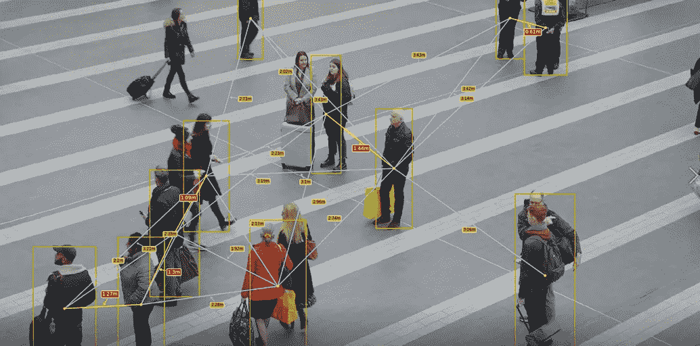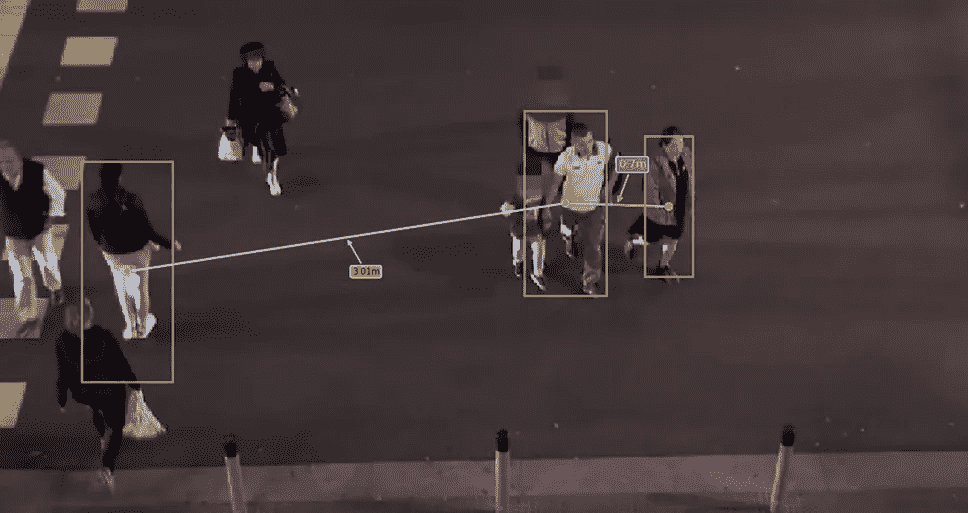

哇！它看起来很好，但如果我们能在视频中运行它，它会更酷。所以，我们走吧！

## 视频中的推理

在视频中运行模型的代码与图像相同，因为我们使用`openCV`将视频分割成帧，并将每一帧作为单独的图像进行处理。

视频功能

正如我们之前所做的，我们只需要将我们的视频复制到`../Projects/Pedestrian_Detection/models/research/test_images`中，并更新`cap = cv2.VideoCapture(…)`中的路径。此外，我们可以为`FILE_OUTPUT`设置一个名称。

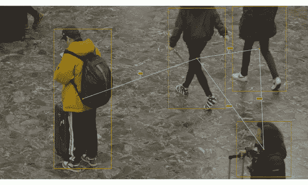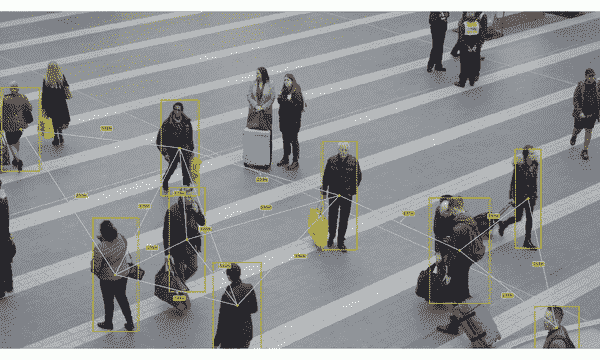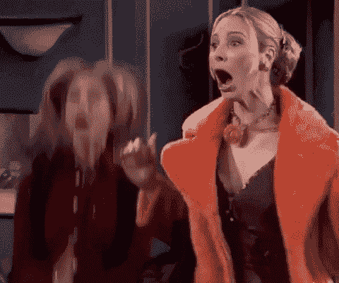

**干得好！！**代码现在已经可以预测和测量社交距离了。

我们开发了这个应用程序，因为在 [**免疫技术研究所**](https://immune.institute/en/?utm_campaign=IMMUNE&utm_source=Embajador) 我们尝试应用最先进的技术。我们喜欢分享知识，因为我们认为这是它变得强大的时候。

如果你想学习如何开发真实世界的应用程序，比如这个用于测量*、*、的**应用程序，你可能会对我们的 [**数据科学硕士**](https://immune.institute/en/data-science?utm_campaign=MDS2021_2&utm_source=Embajador) **e.** 感兴趣。这是一个针对寻求专攻数据科学、了解主要**人工智能**技术以及如何将它们应用到不同行业的专业人士的计划。**

如果您对我们的工作和工作方式感兴趣，请加入我们的 [**实时会议**](https://tech.immune.institute/sesion-informativa-data-science?utm_campaign=MDS2021_2&utm_source=Embajador) 。请随意使用我们的代码并对其进行改进。与我们分享成果！😄

本文及代码由:[亚历杭德罗·迪亚斯·桑多斯](https://medium.com/u/3b43171da13b?source=post_page-----da0503717a62--------------------------------)——([LinkedIn](https://www.linkedin.com/in/alex-diaz-santos-8aab812a/)， [GitHub](https://github.com/alejandrods) )为免疫技术研究所撰写。