# 用基尼系数度量统计离差

> 原文：<https://towardsdatascience.com/measuring-statistical-dispersion-with-the-gini-coefficient-22e4e63463af?source=collection_archive---------20----------------------->

## [视频教程](https://towardsdatascience.com/tagged/video-tutorial)

## *这篇文章对基尼系数进行了全面的数学解释，并对婴儿名字和医疗定价进行了一些非标准的应用。*

如果你处理数据的时间足够长，你一定会发现数据集的平均值很少能告诉你完整的数据故事。举个简单的例子，以下每一组人的**平均工资**都是 100 美元:

*   100 个每人挣 100 美元的人
*   50 个人每人挣 150 美元，50 个人每人挣 50 美元
*   1 个人挣 10，000 美元，99 个人什么也没挣

当然，主要的区别是钱在人们之间的分配方式，也称为统计离差。也许最流行的统计离差度量是标准差或方差；然而，你可以利用其他指标，如基尼系数，来获得一个新的视角。

基尼系数，也被称为基尼指数或基尼系数，是意大利统计学家和社会学家科拉多·基尼在 1912 年提出的。历史上，分析师用这个值来研究收入或财富分配；事实上，尽管基尼系数是在 100 多年前发展起来的，但联合国仍然在他们的年度国家排名中使用基尼系数来理解货币不平等。但是基尼系数的应用范围可能更广！在更彻底的数学解释之后，让我们将基尼系数应用于几个不涉及国际经济的非标准用例:婴儿名字和医疗保健定价。

[照片由 Janko Ferlič on Unsplash 拍摄。由作者裁剪和修改。](https://unsplash.com/photos/EpbIXGCrtK0)

# 定义基尼系数

理解基尼系数的第一步需要讨论洛伦兹曲线，这是一种由马克斯·洛伦兹开发的用于可视化收入或财富分布的图表。要描绘洛伦兹曲线，首先要获取一个群体的收入，并将其从最小到最大排序。然后构建一个线图，其中*x*-值表示目前为止看到的人的百分比，而*y*-值表示归属于这部分人的财富的累积比例。例如，如果最贫穷的 30%的人口拥有 10%的人口财富，则曲线应通过缩放后的( *x，y* )坐标(0.3，0.1)。还要注意的是，如果财富在人口中平均分配，洛伦兹曲线遵循一条直线， *x=y* 。请参见下图，了解假设的洛伦兹曲线以及等位线的图示。

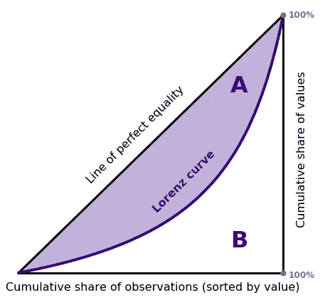

基尼系数衡量人口的洛伦兹曲线偏离完全平等的程度，或者一组数据偏离相等值的程度。基尼系数通常在 0 到 1 之间，其中

*   零代表完全平等*(例如，每个人都有相等的数量)*和
*   一个代表近乎完美的不平等*(例如一个人拥有所有的钱)*。

对于介于两者之间的所有情况，基尼系数 *G* 定义为

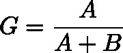

其中 *A* 表示完全相等线和洛伦兹曲线之间的区域，如上图所示，而 *A+B* 表示三角形总面积。

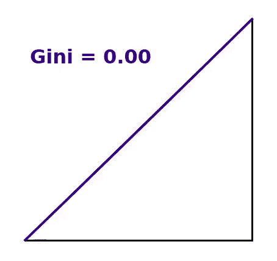

基尼系数通常介于 0 和 1 之间，其中 0 代表完全平等，而在数据中，1 代表接近完全不平等。

在引言中讨论的三种情况中，每种情况平均每人产生 100 美元。然而，如下图所示，每种情况下的基尼系数差异很大。

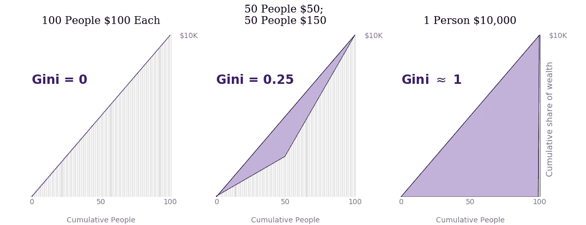

# Python 中的 Gini

要用 Python 计算一个数据集的基尼系数，你可以选择用类似于`scipy`的[求积](https://docs.scipy.org/doc/scipy/reference/generated/scipy.integrate.quad.html)例程来计算阴影区域*和*。如果这种类型的数值积分被证明对于大规模应用来说太慢或太复杂，你可以利用另一种选择，基尼系数的等价定义。

基尼系数也可以表示为数据的[相对平均绝对差](https://en.wikipedia.org/wiki/Mean_absolute_difference#Relative_mean_absolute_difference)的一半，即数据集中所有观察值对的平均绝对差的归一化形式。

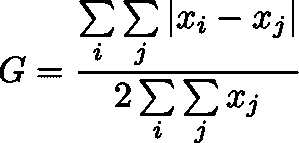

如果数据仅包含正值，计算将进一步简化，因为[没有必要评估所有可能的对](https://www.statsdirect.com/help/default.htm#nonparametric_methods/gini.htm)。将数据点按升序排序并分配位置索引 *i* 产生

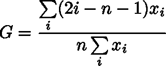

计算起来更快。

我所发现的基尼系数的最佳 Python 实现来自于 [Olivia Guest](https://github.com/oliviaguest/gini/blob/master/gini.py) 。在接下来的案例研究中，我将利用她的矢量化例程来计算基尼系数。

# 案例 1:婴儿的名字

到目前为止，我们主要是在基尼系数最初的经济学领域的背景下讨论基尼系数。然而，这种度量是一般化的，以便在统计离差扮演关键角色时提供洞察力。我现在将举例说明两个非典型的应用程序，以展示如何使用基尼系数扩大探索性数据分析的工作流程。

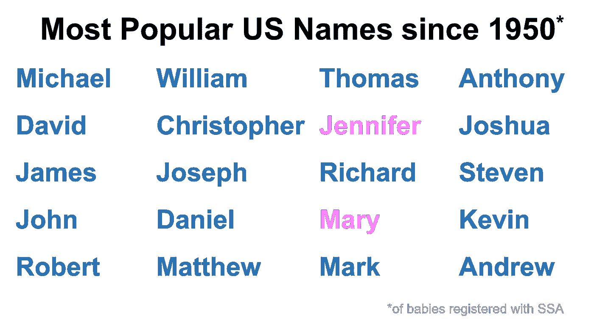

美国社会安全管理局(SSA)保存了出于研究目的给美国婴儿取名字的公共记录。综合这些 1950 年以后出生的孩子的数据，我发现前 20 个最受欢迎的名字中有 18 个更常与男孩联系在一起。那么雌性在哪里？

每年实际出生的男婴略多，在社会保障署登记的男婴当然也更多(53%为男性，47%为女性)；尽管如此，在我的快速人气排行榜上看到如此大比例的男性名字，我还是很惊讶。进一步挖掘数据，我发现尽管数据中出现的女性越来越少，但每年都有更多独特的女性名字。

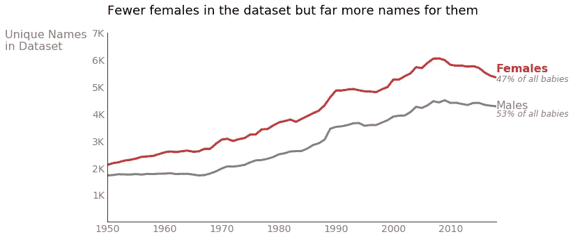

统计离差似乎起着重要的作用。从经济角度来说，一些男性名字，比如我列出的前 20 名，非常“富有”(最流行的名字“迈克尔”占 1950 年以来出生的所有男孩的 3%以上。)这些超受欢迎的男性名字可能会代代相传。另一方面，女婴在各种名字中分布更广，所以多出来的名字分享了女婴的“财富”。我们可以通过回归基尼系数来验证这一理论。

想想女孩是如何分散在每个名字中的。自 1950 年以来，数据集中的一些名字只占 5 个婴儿，而“詹妮弗”代表了近 150 万个个体。统计自 1950 年以来出生时每个名字都有的所有女性，并从最不流行的名字到最流行的名字排序，我们发现基尼系数为 0.96，这意味着最流行的名字与最独特的名字之间存在巨大差异。

男性名字显示出非常相似的洛伦茨曲线，但稍微偏一点，基尼系数为 0.97。男性和女性系数之间的差异似乎无关紧要，但考虑另一种观点。不要累计时间，而是计算每个性别的年度基尼系数。绘制自 1950 年以来每年的女性和男性基尼系数表明了一个清晰而持久的模式，其中男性系数始终较高。因此，男性名字比女性名字经历了更多的统计差异。同样值得注意的是，自 20 世纪 90 年代以来，男女的基尼值都有所下降，这表明人们倾向于更多样化的命名习惯。

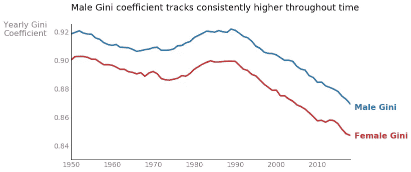

最后看一下这个数据集，让我们检查一下单个名字随时间的流行趋势。现在利用基尼系数，将女性数据按姓名分组，并计算基尼系数，因为它与年度频率有关；也就是说，对于任何一个给定的名字，按照该名字最不受欢迎的年份对数据集的每一年进行排序，以便计算基尼系数。基尼系数较低的名字在整个时间跨度内表现出相似的受欢迎程度，而系数较高的名字则意味着受欢迎程度不均衡。下图比较了“Scarlett”和“Miriam”这两个名字的流行趋势这两个名字代表了数据集中大约 60，000 名女性婴儿；然而，取名为“Scarlett”的婴儿数量的急剧增加产生了很大的基尼系数，而“Miriam”的基尼系数很低，因为自 1950 年以来，每年大约有 1000 个婴儿被冠以这个名字。

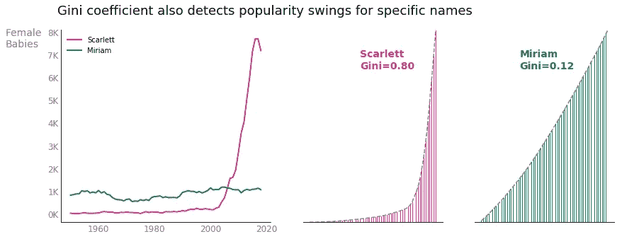

# 案例 2:医疗保健价格

现在转到由美国联邦机构医疗保险和医疗补助服务中心主持的 2017 年医疗保健定价数据集。这些数据作为单个医院的平均程序进行汇总，包括 500 多个医疗保险患者单独住院程序的费用和最终付款。我应用基尼系数计算来确定哪些程序(如果有的话)需要更好的计费标准化。我的分析的根本基础可以归结为:基尼系数越高，不同医院对特定手术收费的差距就越大。基尼系数较大的程序可能需要监管或更透明的成本细节。

dataset⁴基尼系数最高的程序或诊断相关组(DRG)被标记为“酒精/药物滥用或依赖 w 康复治疗”考虑到康复疗法在治疗时间和疾病严重程度方面有很大的不同，这也许并不令人惊讶；我们可能预计各类医院的收费会有很大差异。事实上，所有基尼系数最大的诊断，如凝血障碍和精神病，其严重程度都各不相同。另一方面，显示各医院之间最一致的程序性收费，大多描述一次性心脏事件，如瓣膜置换、经皮手术或胸痛观察。

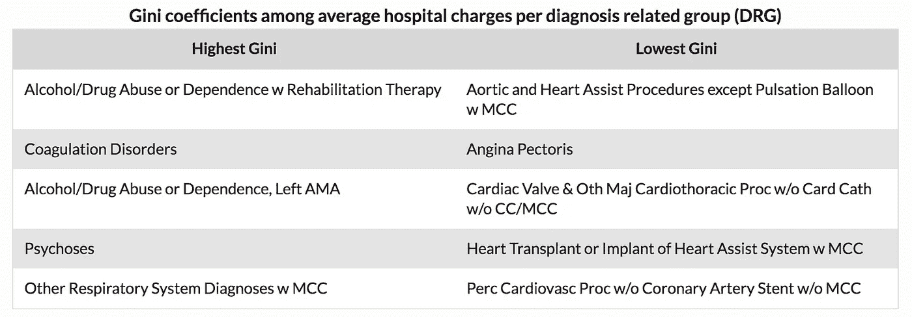

那么计费监管呢？我们是否需要更多的保护措施来确保医院对类似的手术收取类似的费用？嗯，更高的成本透明度当然没有坏处，特别是对于持续时间或强度不等的治疗，但让我们回到数据集。除了关于医院收费金额的信息，数据还包含[医院实际收到的总付款](https://www.cms.gov/Research-Statistics-Data-and-Systems/Statistics-Trends-and-Reports/Medicare-Provider-Charge-Data/Downloads/Inpatient_Outpatient_FAQ.pdf)。对收到的付款进行同样的分析得出的基尼值要低得多。事实上，对于*的每一个手术*，平均收入的基尼系数低于医院费用。这种奇怪的见解表明，医疗保险支付合同已经为缓和和规范医疗费用做了很多工作。⁵

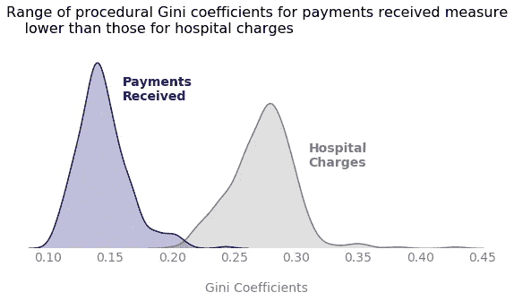

# 结论

基尼系数在诞生 100 多年后仍能提供真知灼见。作为一个很好的通用的统计离差度量标准，基尼系数可以广泛地用于探索和理解几乎任何学科的数据。目前，理解数据分布的最流行的度量标准可能是标准差；然而，标准差和基尼系数之间有几个关键的区别。首先，标准差保留了数据的规模。你用美元报告美国收入的标准差，而你可能用摄氏度给出温度的标准差。然而，基尼系数没有测量单位，也称为标度不变性。第二，标准差是无限的，因为它可以是任何非负值，但基尼系数通常在零和一之间。基尼系数的标度不变性和严格的界限使得比较两个不同数据源的统计离差更加容易。最后，标准差和基尼系数通过不同的透镜判断统计离差。如果一个非负数据集包含一个正的，其余为零，则基尼达到其最大值。如果一半数据位于极值最大值，另一半数据位于极值最小值，则标准差达到最大值。

[尽管基尼系数有很多好处，但它也有一定的局限性。与其他汇总统计数据一样，基尼系数压缩了信息，从而丢失了原始数据集的粒度。基尼系数也是多对一的，这意味着各种不同的分布映射到同一个系数。基尼系数被证明对异常值非常敏感，以至于一个单一的极端数据点(大或小)可以显著增加基尼系数。然而，经济学家也批评基尼系数对上层和下层的财富变化不够敏感。研究人员继续引入几个替代指标来研究收入不平等的不同方面，例如](https://www.scientificamerican.com/article/ask-gini/)[帕尔马比率](https://en.wikipedia.org/wiki/Income_inequality_metrics#Palma_ratio)，它明确捕捉了人口中最富有的 10%和最贫穷的 40%的金融波动。

无论您选择哪种度量来理解统计离差，建立数据直觉肯定不仅仅是简单地估计平均值或中值。基尼系数，长期以来在经济学领域很流行，不管你选择的学科领域是什么，它都提供了关于数据分布的极好的洞察力。正如本帖所展示的，基尼系数可以随着时间的推移而被追踪，可以针对特定的数据段进行计算，也可以用来检测需要更好的价格标准化的过程。它的应用是无限的，它可能只是你的 EDA 工具箱中缺少的组件。

*原载于 2020 年 6 月 5 日*[*【http://kimberlyfessel.com】*](http://kimberlyfessel.com/mathematics/applications/gini-use-cases/)*。*

[在 GitHub 上查看这段代码！](https://github.com/kimfetti/Blog/blob/master/gini_coefficient.ipynb)

# 脚注

基尼系数严格来说是非负的， *G ≥ 0* ，只要假设数据的均值为正。如果一些数据值为负，基尼系数理论上可能大于 1，如果一些人以债务的形式负贡献，这种情况就会发生在财富的背景下。

出于隐私原因，社会保障管理局不包括每个州每个性别少于 5 个婴儿的名字；因此，自 1950 年以来，一个女性名字对应五个孩子是绝对允许的最低限度。

年度数字中显示的基尼值小于总数，因为流行的名字往往会年复一年地流行，从而加剧了命名的不平等，增加了基尼系数。

⁴一些诊断相关组全年只在一家医院出现。我已经将数据集过滤到至少 50 家医院记录的程序中，以避免高差异问题。

⁵:医院收到的费用远远低于他们收取的费用。降低一个数据集的平均值，同时保持其标准偏差不变[实际上*会增加*基尼系数](https://repository.upenn.edu/gse_grad_pubs/6/)。在这里，我们观察到正好相反的效果，所以统计分散必须在收到的付款中减少。

# 参考

[1] " [谁，什么，为什么:什么是基尼系数？](https://www.bbc.com/news/blogs-magazine-monitor-31847943)*BBC 新闻:杂志监测。* (2015 年 3 月 12 日)。

[2] " [基尼不平等系数](https://www.statsdirect.com/help/default.htm#nonparametric_methods/gini.htm)"StatsDirect。

[3] O. Guest， [gini.py](https://github.com/oliviaguest/gini/blob/master/gini.py) 。GitHub。

[4] " [超越前 1000 名](https://www.ssa.gov/oact/babynames/limits.html)"*社会保障局*。于 2020 年 6 月 5 日访问。

[5] R. Harris，“[为什么出生的男婴比女婴多？](https://www.npr.org/sections/health-shots/2015/03/30/396384911/why-are-more-baby-boys-born-than-girls)*NPR*。(2015 年 3 月 30 日)。

[6]“[2017 财年住院费用数据](https://www.cms.gov/Research-Statistics-Data-and-Systems/Statistics-Trends-and-Reports/Medicare-Provider-Charge-Data/Inpatient2017)”*医疗保险和医疗补助服务中心*。于 2020 年 6 月 5 日访问。

[7] E. Lamb，“[问基尼:如何衡量不平等](https://www.scientificamerican.com/article/ask-gini/)”《科学美国人》(2012 年 11 月 12 日)。

[8] S. S. Lee，[基尼系数的魔力对标准化考试成绩不起作用](https://repository.upenn.edu/gse_grad_pubs/6/) (2018)，在美国教育研究协会(AERA)年会上提交的工作文件。