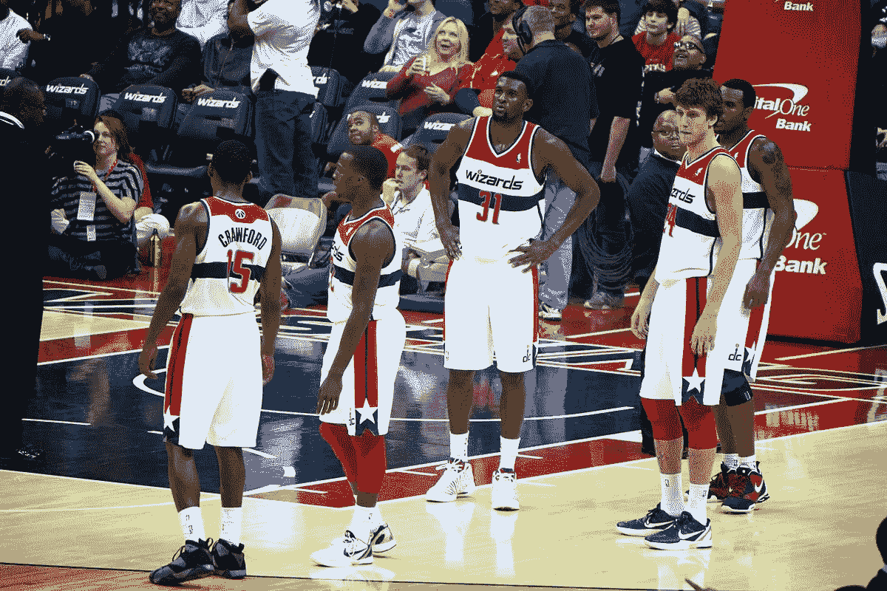
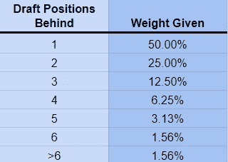
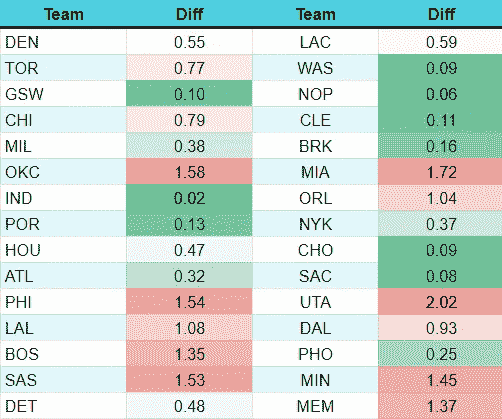
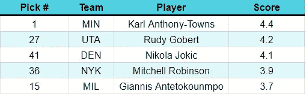
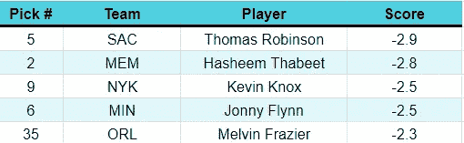
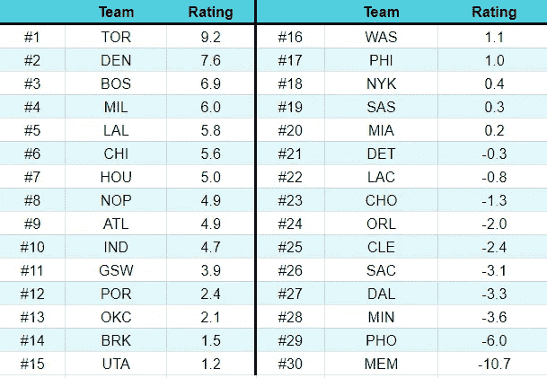
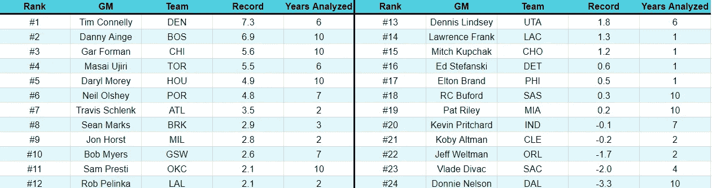

# 衡量 NBA 选秀中的成功

> 原文：<https://towardsdatascience.com/measuring-success-in-the-nba-draft-a7f67cfb7718?source=collection_archive---------29----------------------->

## 找出过去十年中最好的(和最差的)起草团队

[图像来源](https://commons.wikimedia.org/wiki/File:Washington_Wizards_reserves.jpg)

*注:* [*此分析的最新版本可在此处*](/which-nba-teams-are-best-at-drafting-20070ccd1702) *获得。*

选秀是每支 NBA 球队比赛中最重要的部分之一。除了几个大牌球队之外，在自由球员中吸引超级明星是很困难的，而且这样高水平的球员很少被交易(当他们被交易时，他们通常会带着巨大的价格标签)。对于许多球队来说，选秀是引进超级巨星的唯一可能。

然而，我们对起草的评价也是有缺陷的，而且很大程度上是轶事。在这篇文章中，我将尝试定量地衡量过去十年中每个团队和高管的效率。如果你想要完整的结果和排名，那么跳到文章的**结果**部分。然而，如果你只是想要 cliff-notes 版本，那么它看起来如下:

*   多伦多和丹佛是最高效的起草团队
*   孟菲斯是迄今为止最差的选秀，菲尼克斯太阳是倒数第二
*   最佳选秀前三名分别是卡尔-安东尼·唐斯(第一名)、鲁迪·戈贝尔(第 27 名)和尼古拉·约基奇(第 41 名)
*   三个最差的选秀权分别是托马斯·罗宾逊(排名第五)、哈希姆·塔比特(排名第二)和凯文·诺克斯(排名第九)
*   最佳选秀执行官(目前活跃的)是蒂姆·康纳利(丹佛掘金)、丹尼·安吉(波士顿凯尔特人)、加尔·福尔曼(芝加哥公牛)和马赛·乌吉里(多伦多猛龙)
*   最差的选秀高管(目前活跃的)是唐尼·尼尔森(达拉斯小牛)、弗拉德·迪瓦茨(萨克拉门托国王)和杰夫·韦尔特曼(奥兰多魔术)

# 方法学

首先，我必须承认[激发这个分析的原始帖子](https://www.reddit.com/r/nba/comments/8v1awu/oc_a_new_statistic_evaluating_every_draft_pick/)。虽然这种方法非常有趣，但我选择对这种方法进行重大修改。

在这个分析中，我将涵盖 NBA 选秀的十年，从 2018 年的选秀(我选择放弃 2019 年，因为这些球员在联盟中不到一年)到 2009 年的选秀。为了衡量每个玩家的成功，我选择了赢股指标。虽然任何指标都是不完美的，但 Win Shares 试图用一个数字来捕捉球员的影响，同时也衡量进攻和防守。

这种分析的指导原则是总经理只能选择当年在选秀位置上的球员。换句话说，在给定其他选择的情况下，每位总经理的表现如何？

例如，一个球队可能会先选中一个球员，这个球员对一个典型的第一选秀权的高期望感到失望。然而，前几年的第一次选秀权表现如何并不重要，更重要的是那支球队是否错过了更好的球员。

有些人会争辩说位置问题值得考虑(例如，警卫与警卫进行比较)。我不相信他们在大多数情况下；今天，NBA 的名单是如此的不稳定，以至于球队很少根据位置的需要进行选秀。大多数团队几乎只选择他们认为最优秀的人才。

考虑到这一点，这种方法将衡量每个被选中的球员和在他们之后被选中的球员的成功。这是因为在这个位置上，紧随其后的球员最有可能被认为是备选的选秀人选。球员被选中的位置越远，他们被给予的权重就越小，因为他们不太可能被认真考虑。

为了分配权重，我决定使用一个基本的指数函数:

e𝒹*= k * w*𝒹*+₁+(1-k)* e*𝒹*+₁*

在这个等式中， *E* 表示在𝒹.的草稿位置的预期 win 份额 *K* 是平滑因子，介于 0 和 1 之间。较高的 *K* 对较近的拔模位置赋予较大的权重。w 代表处于选秀位置𝒹 + 1 的玩家(该玩家直接在该玩家之后被选中)的实际获胜份额。

值为 1 的 *K* 会将整个权重分配给下一个被选中的玩家。首先，我将把 *K* 值指定为 0.5。在此平滑因子下，分配的权重计算如下:

为了形成选秀位置的预期获胜份额，直接在之后被选中的玩家将被加权 50%，在两个位置之后被选中的玩家将被加权 25%，等等。球员们选了 7 个位置，后来在选秀的底部贡献了 1.56%。

为了初始化指数函数，我给最后一个拔模位置(#60)分配了一个零值。虽然这种选择有些武断，但我相信这是很容易证明的。第二轮选秀权的期望值通常很低。自 2005 年联盟扩大到 60 支球队以来，已经有 15 名球员入选 60 强。其中七人从未在 NBA 打过球，而另外三人打了几场比赛，赢得 0.0 或以下的胜利份额(因为一名球员实际上有可能拥有负的胜利份额)。在剩下的五家公司中，有四家公司的股价在 0 到 2.4 韩元之间(伊塞亚·托马斯是一个巨大的例外)。零赢份额似乎大致代表了大多数第 60 次整体选择的表现。

总的来说，预期的盈利份额形成了一个反事实的场景，我们可以用它来比较实际的表现。

*净评级=实际-预期*

然后，如果实际表现超过预期表现(一个积极的净评级)，那么草案选择是一个好的。如果净评分是负的，那么选秀就是一个糟糕的选择(因为更好的球员马上就可以得到)。

从这里开始，每个球员的净评分将除以该选秀年度的评分标准偏差，从而得出最终得分。完成这最后一步是为了防止较老的选秀选择获得更高的分数(因为他们有更多的时间赢得 Win Shares)。

*得分=净评分/标准差*

所有数据直接取自[篮球参考](https://www.basketball-reference.com/)。做了一些小改动；例如，当技术上起草他们的团队立即将他们交易走。在这项分析中，在选秀之夜结束时，球员被认为是被他们所属的球队选中的。

## 敏感性分析

该方法确实包括一个有点随意的值:T4 K T5 值(平滑因子)。如前所述，较高的 *K* 将较大的重量放在较近的镐上，反之亦然。因此，我进行了敏感性分析，以了解不同的*K*-值会如何影响结果。虽然该方法最初使用的值是 0.5，但是我也在 0.4 和 0.6 测试了 K。然后，我从这三个结果中取出每个团队的最大值和最小值，以确定它们之间的差异。如果差异很小，这表明他们的分数相对来说不受改变 *K 的影响。*如果差异很大，那么就给了我们更多不确定性的理由。

这些结果如下所示:

绿色表示受改变 *K 影响最小的分数；这些是我们最有信心的分数。印第安纳、波特兰、华盛顿、新奥尔良等球队变化很小。红色表示对变化的 *K* 高度敏感的分数。这些是不确定性最大的分数。*

在大多数情况下，差异较大的团队的分数会随着较低的 *K* 而提高。这可能表明他们做出了 1-2 的选择，在表现非常好的球员之后直接选择。波士顿是个例外——他们的分数在更高的 K(T21)时有所提高。这可能表明波士顿受益于紧随其后的表现不佳的球员。

平均相差 0.7 左右。与此同时，在下面的排名中，团队之间的平均差异约为 0.65——这意味着改变 *K* 值可能意味着大多数团队最多上升或下降 1-2 位*(或者可能根本不变)。*

*虽然有几个团队有一些不确定性，但结果在很大程度上是稳健的。*

## *方法论缺陷*

*这种方法的一个问题是，它可能对第二轮选秀权不太准确。高管们通常会在顶级选秀中找到大量的一致意见(例如，通常不超过几名球员被认为是潜在的第一选秀权)。*

*第二轮选秀权不太确定。对于一个分析师来说，一个球员在第 40 顺位被选中并不罕见，而另一个分析师认为他们将不会被选中。在另一种分析中，在后面的拔模位置(特别是在第二轮)使用较低的 *K* 可能是理想的。*

# *结果*

*这项分析总共研究了 600 份草稿。*

## *前五名选秀*

**

*根据这个分析，卡尔-安东尼-唐斯是最好的选择，尽管他是第一选秀权。这是最大的，因为他身后的两名球员(安杰洛·拉塞尔和贾利尔·奥卡福)的表现相对较差。*

## *底部 5 个选秀权*

**

*前四选如预期；高彩票选秀权在 NBA 产生很少或没有价值。根据这一分析，最差的选择是托马斯·罗宾逊。年度最佳新秀和 5 次全明星达米恩·利拉德紧随其后被选中，这让罗宾逊很受伤。*

*一个反常的是梅尔文·弗雷泽，他在 2018 年被选为第 35 名。虽然弗雷泽在 NBA 打得很差(-0.1 胜)，但这对于第二轮选秀权来说并不罕见。弗雷泽很受伤，因为米切尔·罗宾逊是在他之后被选中的。很可能在一个较低的 *K* 值下，这个选择看起来不会那么糟糕。2018 年草案相对较小的样本量也很有可能给出一些不寻常的结果，这些结果不会随着时间的推移而保持不变。*

## *团队排名*

*按团队细分，结果如下:*

**

*丹佛掘金是最有效率的起草团队，多伦多猛龙紧随其后。与此同时，孟菲斯灰熊队以相对较大的优势成为最差的选秀球队。*

## *高管排名*

*在所有高管(在职和不在职)中，最好的是蒂姆·康纳利(来自丹佛)。两位高管的表现比其他人差得多:底特律活塞队的杰夫·鲍尔和孟菲斯灰熊队的克里斯·华莱士。*

*在被分析的仅有的现任高管中，排名如下:*

**