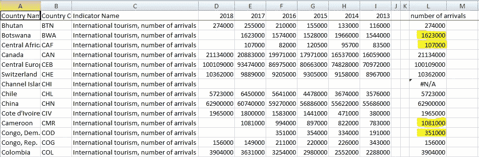
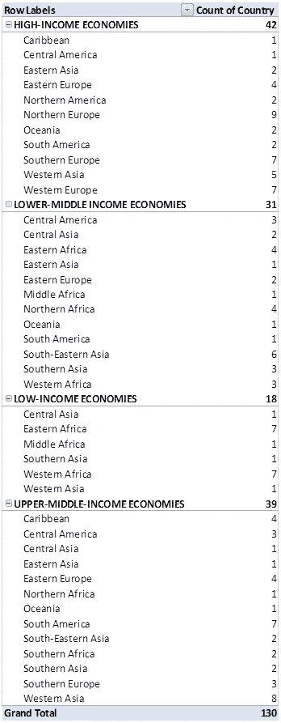
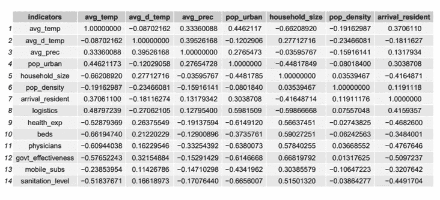
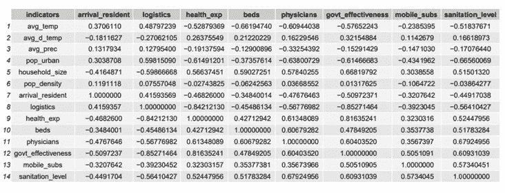
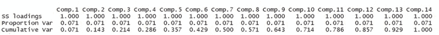
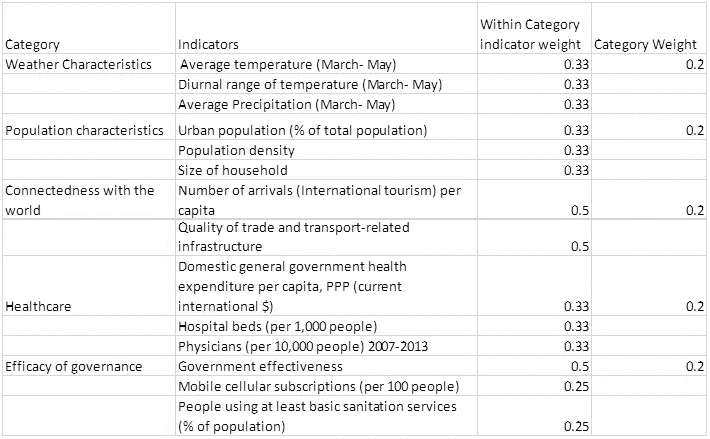
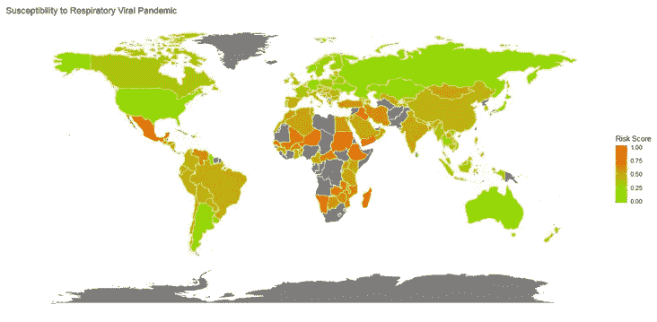
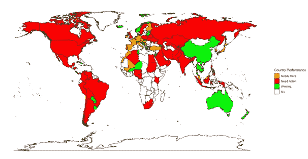
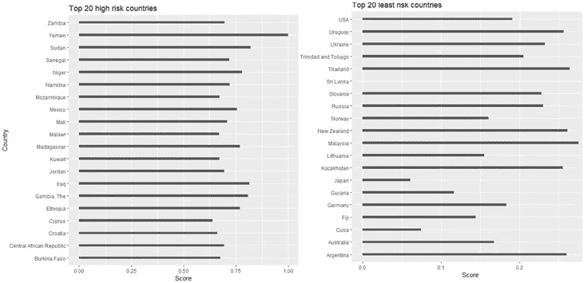

# 衡量各国对呼吸道病毒大流行的易感性

> 原文：<https://towardsdatascience.com/measuring-susceptibility-to-respiratory-viral-pandemic-across-countries-d016d4099f9d?source=collection_archive---------52----------------------->

## 走向数据科学(现实世界中的数据科学)

## Covid19 之前是否缺少准确的风险评分？

***编者按:*** [*走向数据科学*](http://towardsdatascience.com/) *是一份以数据科学和机器学习研究为主的中型刊物。我们不是健康专家或流行病学家，本文的观点不应被解释为专业建议。想了解更多关于疫情冠状病毒的信息，可以点击* [*这里*](https://www.who.int/emergencies/diseases/novel-coronavirus-2019/situation-reports) *。*

自文明出现以来，世界经历了许多流行病的爆发，往往因不健康的生活条件而加剧，这些条件允许通过病媒、空气、水、体液、粪便或不卫生的畜牧业进行广泛传播。虽然医疗保健的复杂性是这种流行病扩大的一个缓解因素，但世界的相互联系增加了它们成为疫情的可能性，从而大大放大了其风险。每一次疾病爆发都需要根据传播方式、受影响的身体部位和脆弱人群采取不同的应对措施。

自过去 150 年以来，已经发生了无数次呼吸道病毒疾病的大流行和爆发(1889 年、1918 年、1957 年(H2N2)、1968 年(H3N2)、2002 年(SARS)、2009 年(H1N1)、2012 年(MESR)等。在这项研究中，我们将通过考虑加剧社区传播的因素(疾病的传播率)来研究国家对呼吸道病毒疫情的易感性。(本文将引导您创建一个综合指数，以衡量国家对呼吸道病毒疫情的易感性，即该国面对这种疾病在其人口中快速传播的脆弱性)。想法是 1)能够将如此分析的易感性与目前处理新冠肺炎的国家的表现进行比较(当我们知道一些国家比其他国家更脆弱时，谨慎的做法是根据其风险评估其表现；有些国家已经能够控制病毒，可能是因为他们一开始接触的风险就很低)；2)为进一步纳入参数提供参考，以便更准确地捕捉脆弱性，并纳入更多类型的流行病，其中传播方式和对健康的影响各不相同；3)能够尽可能研究增加风险的因素。

应当指出，早些时候已经尝试过制定疫情备灾指数。大多数此类指数本质上是一般性的(就流行病准备而言)，集中于卫生管理的效率，包括官僚机构的效率和充足资金的可用性。在这项研究中，我们还将考虑使一些国家比另一些国家更容易受到影响的天气特征、连通性和人口特征。提出了一个月或一组月的滑动指数，以说明全年的可变性。

**数据建模**:

精确的数据建模需要一个完善的理论框架。正在创建的综合指数必须足够全面，以包括各种感兴趣的因素，同时排除那些会导致不准确或数据冗余的因素。由于我们在衡量一个国家对病毒性呼吸系统疫情的易感性，因此我们考虑了导致疾病传播的主要因素。

*类别和指标*

出于本研究的目的，建议的敏感性指数考虑了 5 个类别，每个类别都有一套指标。这五个类别是:

a)人口特征:人口密度被视为促成病毒流行病传播的因素。此外，重要的是家庭规模，可以加剧由于共享空间的事情。掌握该国的人口密度也是相关的——有多少人口生活在高密度地区，因此更容易受到社区传播。考虑到上述情况，这一类别的指标是:

-城市人口(占总人口的%)

-人口密度

-家庭规模

(数据取自世界银行数据库和联合国人口司-经济和社会事务部)

b)连接性:一个与全球不同地区相连的国家，病毒通过外国来源进入其边境的风险更高。此外，国内发达的交通系统增加了传播率。这些都是借助于以下指标来说明的。

-每个居民(该国总人口)到达(国际旅游)的人数

-贸易和运输相关基础设施的质量(物流绩效指数)

(数据来源于世界银行。要注意的是，理想的连通性应该已经通过分析空中交通数据而被捕获。由于这一数据不易获得，因此采用了一种更简单的衡量标准。)

c)天气特征:对流感和呼吸系统疾病的研究发现，它们与温度、湿度和温度的昼夜变化有关联。由于湿度数据很难获得，考虑到高度的相关性，降雨量在这里被用作一个近似的替代品(替代物)。

这一类别的指标是:

-平均温度(三月至五月)

-平均温度日较差(3 月至 5 月)

-平均降水量(3 月至 5 月)

为了收集天气数据，设计了一个刮刀，以获取所研究国家最大城市的温度和降雨量数据。(很难获得按月份分列的国家气象数据。最大的城市非常容易受到流行病的影响，这是一个很好的代表。)

数据取自每个国家最大城市的 https://en.climate-data.org/。python 中实现的 scraper 如下:

```
f1=open('CityNames.txt','r')
storeMessages=open('messages.txt','w')for line in f1 : 
        city=line.rstrip('\n')
        try:
              #Setting up Chrome webdriver Options
              chrome_options = webdriver.ChromeOptions()#creating Chrome webdriver instance with the set chrome_options
              driver = webdriver.Chrome(chrome_options=chrome_options)
              link = "[https://en.climate-data.org/](https://en.climate-data.org/)"
              driver.get(link)
              sleep(10)
#Click on the search bar, enter city name, press enter xpath0="//*[[@id](http://twitter.com/id)='search-form-header']"

              element = WebDriverWait(driver, 10).until(EC.presence_of_element_located((By.XPATH,xpath0)))
#              element = WebDriverWait(driver, 5).until(EC.element_to_be_clickable((By.XPATH, xpath0)))
              sleep(10)
              element.click()
              sleep(5)#              driver.find_element_by_css_selector('#search-form-header').clear()
              driver.find_element_by_xpath('//*[[@id](http://twitter.com/id)="search-form-header"]/input').send_keys(city)
              driver.find_element_by_xpath('//*[[@id](http://twitter.com/id)="search-form-header"]/input').send_keys(Keys.RETURN)
              sleep(5) xpath2="//*[[@id](http://twitter.com/id)='article']/section[1]/ul/a/div/div[2]/span[1]"
              element = WebDriverWait(driver, 5).until(EC.presence_of_element_located((By.XPATH,xpath2)))
              element.click()
              sleep(5)
#Copy the weather table in a csv file with city as its name fileName=city+".csv"              
              f = open(fileName, "w",newline='')
              writer = csv.writer(f)
              table = driver.find_element_by_css_selector("#weather_table")
              with f as csvfile:
                       wr = csv.writer(csvfile)
                       for row in table.find_elements_by_css_selector('tr'):
                              wr.writerow([d.text for d in row.find_elements_by_css_selector('td')])

              f.close()
              driver.close() except NoSuchElementException:
              print("No element found for "+city) 
              driver.close()#compile all csv files into one file
```

d)医疗保健:一个拥有强大医疗保健系统的国家可能会更好地应对疫情恐慌。(当保健能力薄弱时，疾病的传播速度就会加快。)这种稳健性通过以下指标体现:

-人均国内一般政府卫生支出，购买力平价(当前国际美元)

医院床位(每 1，000 人)

-2007-2013 年医生(每万人)

数据取自世界银行和 WHO⁴.

e)治理的功效:治理的质量及其促进者将对与任何疾病传播相关的风险产生负面影响。使用了两个指标来帮助在疾病传播时政府沟通的有效性。在这一类别下，使用了以下指标。

*   effectiveness⁵政府
*   移动电话用户(每 100 人)
*   至少使用基本卫生服务的人(占人口的百分比)

*缺失数据插补:*

数据可能以随机或非随机的方式丢失。在这两种情况下，由于信息丢失和可变性降低，缺失数据可能会造成问题。在数据以非随机方式丢失的情况下，偏差可能会影响结果。

缺失数据的处理方法是要么完全删除案例，要么进行单次/多次插补，其中遵循一种算法来估计与缺失数据最接近的值，同时保持完整数据集的可靠性。(有用于输入缺失数据的数学软件包(如鼠标等)。))

这里，为了输入缺失的数据，采用了最近一年(十年期内)的数据，该数据适用于该国。例如

这是世界银行的入境人数数据。可以看出，在喀麦隆，由于没有 2018 年的数据，保留了 2017 年的数据。



作者图片:缺失数据插补

上面是用 excel 中的 as 数组公式完成的。(从左向右时，它保留第一个非空白单元格。)

```
{=INDEX(range,MATCH(FALSE,ISBLANK(range),0))}
```

当此类调查没有发现任何数据时，该国将被从研究中剔除(也称为完全案例分析)。这项工作后的数据集有 130 个国家。为了了解这 130 个国家是否有足够的多样性来建立一个综合指数，我们做了一个快速分析。为此，这些国家按照收入类型和地理位置进行了划分。总体来看，数据集足够多样化。



作者图片:国家概况

*多变量分析和标准化:*

为了开发一个综合指数，多变量分析对于研究指标之间的相互关系变得至关重要。由于该指数正在发展成为一个尺度，指标之间的相关性变得相关，因为高相关性将导致类似因素的权重更大，从而扭曲最终得分。

由于指标具有不同的度量单位和标度，因此进行标准化是为了确保指标具有相同的范围[0，1]。(如果有异常值会扭曲转换后的指标，就要小心了。)这里，考虑到指标与被调查风险的关系，对指标进行了标准化。对于反向相关的指标(如平均温度、卫生支出等。)，Var *归一化*=(varₘₐₓ−varᵢ)/(varₘₐₓ−varₘᵢₙ)被使用。这样做是为了当指标值以正权重汇总时，每个类别的风险都得到适当考虑。

相关分析在 r。

```
library("Hmisc")
library(dplyr)df<-read.csv("data.csv",header = T)my_data<-select(df, avg_temp:sanitation_level)
res2 <- rcorr(as.matrix(my_data))
```

相关矩阵如下:



作者图片:相关矩阵

进行了相关性检查，以确保指标没有强相关性(此处阈值为 0.9，在这种情况下，指标将被重新考虑或从研究中删除)。没有发现如此强的相关性。

还进行了主成分分析，以评估不同指标之间的关系。这在 r 中实现了。

```
library(dplyr)
df<-read.csv("normalizeddataPCA.csv",header = T)
my_data<-select(df, avg_temp:sanitation_level)
pca_all<-princomp(my_data,scores = TRUE, cor=TRUE)
loadings(pca_all)
```



作者图片:PCA 结果

各组成部分之间的差异比例相等，表明这是一套相当独立的指标。

*重量测定:*

存在许多加权技术(如因素分析、联合分析、层次分析法等)。).通常，权重是在与主题专家进行调查后确定的(参与式方法)。最终，这些都是价值判断。

通常的做法是采用平均加权方案。这就是这里所做的，但治理效率类别除外(原因是政府效率是主要指标，而移动电话和卫生水平是增强政府能力的辅助手段)。

加权方案如下:



作者图片:类别和指标的权重

(理想情况下，在这些步骤之后，进行敏感性和不确定性分析以评估模型误差。这是为另一篇文章保留的:-))

**结果:**

获得分数并标准化。世界地图上标出了国家对呼吸道病毒疫情的易感性。



作者图片:风险评分

通过网站[https://www.endcoronavirus.org/countries](https://www.endcoronavirus.org/countries)，获得了各国截至 2020 年 5 月 31 日的表现，并绘制在世界地图上。



作者图片:新冠肺炎之后的国家表现



作者图片:风险最高和最低的前 20 个国家

用 R 创建地图的代码是:

```
library(ggmap)
mapData<-read.csv("CountryPerformance.csv", header = T)WorldData=map_data("world")combined_data<-WorldData[mapData$Country %in% mapData$Country, ]
combined_data$value<-mapData$Performance[match(combined_data$region,mapData$Country)]ggplot(combined_data, aes(x=long, y=lat, group=group,fill=factor(value)))+
  geom_polygon(colour="black")+
  scale_fill_manual(values = c("Orange","Red","Green"))+
  theme_bw() +
  labs(fill="Country Performance", x="",y="")+
  scale_y_continuous(breaks = c())+
  scale_x_continuous(breaks = c())+
  theme(panel.border=element_blank())
```

**观察:**

可以观察到，三个月后疫情疫情的易感性特征和表现并不完全相关(从某种意义上说，那些看似风险较低的国家被发现在努力遏制病毒)。可能的原因有:

*   指标、类别及其权重需要进一步微调，以准确捕捉呼吸道病毒疫情的风险暴露。当在综合指数中考虑不同的维度时，这是一个问题。例如，更高的医疗保健和政府能力可能会超过对国家高度连通性的补偿(从而降低高收入经济体的风险。)[建议阅读:Munda & Nardo，2007 年，国家排名的非补偿/非线性综合指标:一个可辩护的设置]。综合指数也可能遗漏了戴面具等社会和文化习俗。会对脆弱性产生影响。
*   此外，有可能一些国家尽管风险较低，但没有及时做出决定，如强制实施封锁，从而加剧了问题。

该研究旨在探索量化各国对特定类型病毒性疫情的易感性的可能性，并评估一个国家对其风险暴露的反应。还建议对每个国家不同类型灾害的风险状况进行分类(细分)，以确定减少每种灾害风险所需的优先事项和努力规模。

参考资料:

1:奥本海和其他流行病:风险、影响和缓解(2017 年)；2019 年全球健康安全指数

2:没有与主题专家讨论类别和指标。

3:中国马悦凌等 2020 年武汉气温变化和湿度对新冠肺炎死亡的影响

4:[https://apps . who . int/iris/bitstream/handle/10665/170250/9789240694439 _ eng . pdf；jsessionid = 07 c 6d 43 dbb 1972 a3 b 7 a 98 CBA 7a 857 B1 d？sequence=1](https://apps.who.int/iris/bitstream/handle/10665/170250/9789240694439_eng.pdf;jsessionid=07C6D43DBB1972A3B7A98CBA7A857B1D?sequence=1)

5:了解对公共服务质量、公务员质量及其不受政治压力影响的程度、政策制定和执行的质量以及政府对此类政策承诺的可信度的看法。