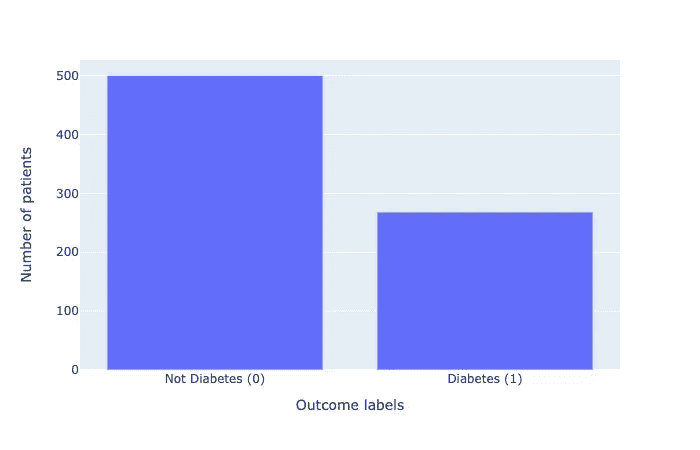
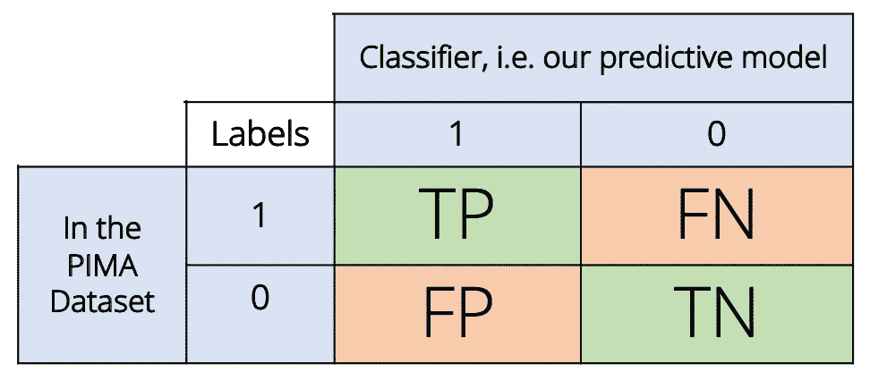
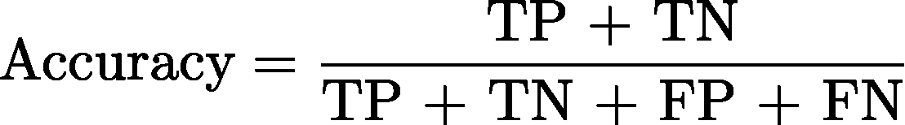
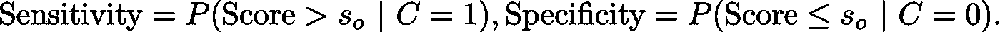
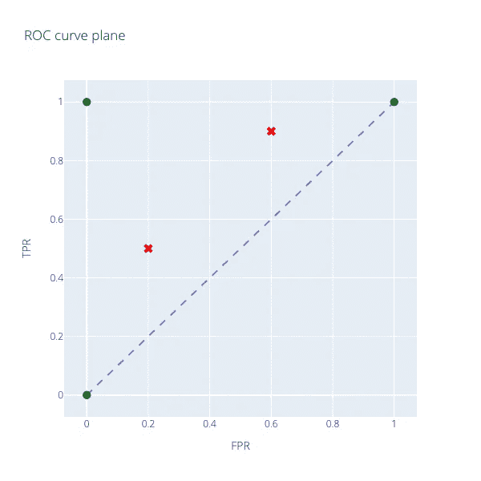
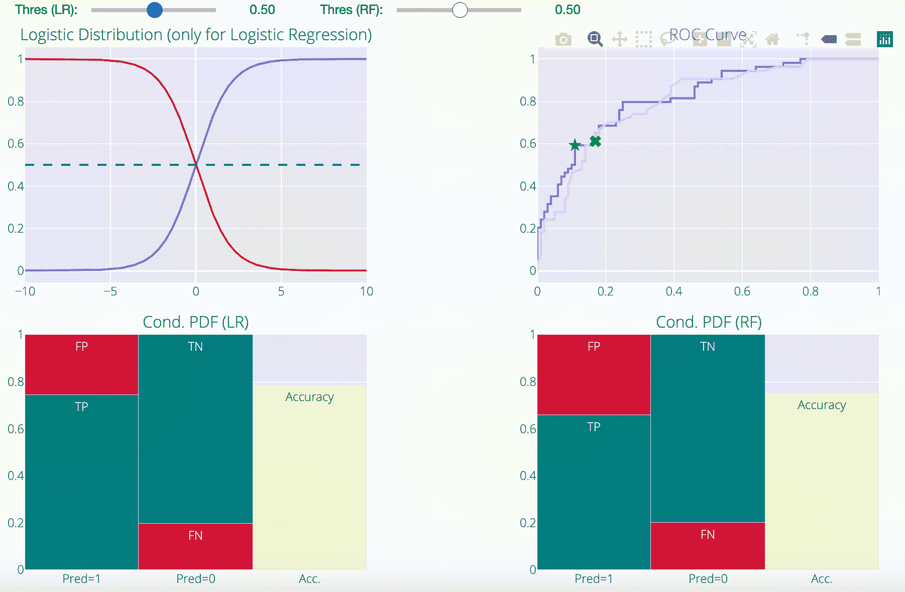

# ROC 曲线的力学

> 原文：<https://towardsdatascience.com/mechanics-of-the-roc-curve-83b10ce3887f?source=collection_archive---------52----------------------->

## 研究 ROC 曲线如何工作的直观仪表板

里奇·卡拉瓦拉在 [Unsplash](https://unsplash.com?utm_source=medium&utm_medium=referral) 上的照片

基于手头的任务，预测模型可以分为两类，即分类器和回归器。回归模型旨在预测连续结果，而分类器旨在预测离散结果。

在回归模型中，如果结果的分布是偏斜的，它会抛弃一些模型。例如，使用线性回归来预测[偏态分布](https://stats.stackexchange.com/questions/267078/why-is-skewed-data-not-preferred-for-modelling)会降低模型的性能。在线性回归的情况下，这种情况会发生，因为它违反了我们关于正态分布噪声的假设(您也可以考虑受一些“异常值”结果影响并阻碍学习过程的潜在损失函数；为了应对这种情况, [Huber 回归](https://en.wikipedia.org/wiki/Huber_loss)可能会有所帮助，因为潜在损失不会受到偏斜度的太大影响。).处理这种现象的一种方法是使用不同的模型，如[决策树](https://en.wikipedia.org/wiki/Random_forest)，g [一般化线性模型](https://en.wikipedia.org/wiki/Generalized_linear_model)等。本质上，结果分布在数据建模中起着重要的作用。

与连续结果情况类似，离散结果(分类)也有类似的不平衡结果计数问题。例如，假设我们试图对一个数据集建模，其结果是 1/0 的形式。例如，1 可能表示信用卡欺诈。大多数人不会犯欺诈罪，所以在这种情况下，计数会向 0 的方向倾斜。在[这篇](https://www.sciencedirect.com/science/article/abs/pii/S016786550500303X)论文中，他们引入了 ROC 曲线，作为一种工具，用于比较不同分类器的相对性能。这个工具正是受处理不平衡数据集问题的启发。这篇论文是深入理解 ROC 曲线概念的有趣读物。

在这篇文章中，我将尝试进一步解构 ROC 曲线的概念，并希望给你一个关于这些东西如何工作的直觉。我将使用 [PIMA 糖尿病数据集](https://www.kaggle.com/uciml/pima-indians-diabetes-database)来研究 ROC 曲线。我将从描述问题开始，说明为什么使用简单的准确性度量是一个糟糕的选择，最后，介绍一个仪表板来查看运行中的 ROC 曲线。

# 问题是

该数据集包含以下预测因子:妊娠次数，血糖浓度。、血压、皮褶厚度、血清胰岛素、身体质量指数、糖尿病谱系函数值、年龄。这些是诊断测量，目的是建立一个预测模型，对患者是否患有(1)糖尿病(0)进行分类。在数据收集过程中，设置了几个约束条件。例如，数据集中的所有患者都是至少 21 岁的女性。由于这种限制，并基于各种预测值(就其物理意义而言)，我们可能需要在将该数据集用于某些模型(如线性回归)之前进行一些预处理。此外，数据集也有一些缺失值。为了保持本文简洁，避免偏离讨论的主题，我不讨论数据预处理步骤。你可以在这里找到更多[的信息。](https://medium.com/@sahilgupta_86549/pima-diabetes-dataset-77ee2aa67ce7)

假设我们进行了适当的预处理，让我们看看结果变量的计数。我们可以在图 1 中观察到，计数偏向于标签 0，即与糖尿病患者相比，没有糖尿病的患者数量要多得多。

图。1(左)。响应变量直方图。患者总数为 768 人；500 名患者没有糖尿病(0)，268 名患者有糖尿病(1)。图。2(右)一个表格，描述了我们的预测模型中的分类可以达到的级别。

分类器的准确度被定义为它执行的所有分类中正确分类的数量。用技术术语来说，每当一个分类者进行分类时，它可以落在图 2 中四个框中的任何一个中。例如，这是我们如何读取单元格“FP”的表格:对于特定的分类，我们看到标签为 0，但分类器将其预测为 1，即预测模型预测一个没有糖尿病的人患有糖尿病，这解释了为什么它被称为假阳性(FP)。精确度定义为:

构建一个相当准确但完全无用的分类器非常容易。例如，我们可以使用数据集中的类频率构建一个随机分类器。真阴性(非糖尿病)的比例为 768 分之 500。在预测时，该随机分类器以 500/768 或 0.651 的概率预测一个人没有糖尿病。所以，这个分类器的准确率是 65.1%！但是，我们知道这在实际应用中完全没有用。显然，在我们对预测模型的准确性评估中，有一些缺失。直观地说，准确性关注的是模型能够捕捉的实际真值(即 TP 和 TN)。然而，在图 1 中，我们看到计数是偏斜的。因此，考虑到模型做出的错误预测(即 FP 和 FN)也是有意义的，因为错过更罕见事件的实际成本可能会高得多(随着计数偏斜度的增加，这可能会进一步增加)。

到目前为止，我们已经说服自己，评估预测分类模型的常用方法(即基于准确性)似乎不适用于不平衡的数据集。ROC 曲线是帮助我们做到这一点的一个工具。

# ROC 曲线

ROC 曲线，顾名思义，是真阳性率(TPR)和假阳性率(FPR)之间的图形。这些被定义为，

让我们试着理解这些术语，然后看看为什么 ROC 曲线可能是一个好的选择。让我们从分母开始。注意，TPR 和 FPR 中的分母分别是实际正和实际负(正指标签 1，负指标签 0，类似于图 2)。例如，根据图 2(见上图),我们知道糖尿病患者可以通过模型预测为糖尿病患者(TP)或非糖尿病患者(FN)。因此，TPR 表示所有阳性**标签**中真正阳性(由模型预测)的比例。类似地，FPR 指出了假阳性(由模型预测)在所有阴性**标签**中的比例。这里要注意的关键点是，这两个量是在更细粒度的水平上看分类器的预测。我们也可以用类似的方式解释这两个量的补数。TPR 的补充将是 FNR(假阴性率)，对于 FPR，它将是 TNR(真阴性率)。TPR 也叫灵敏度，1-FPR 叫选择性。所以，我们也可以说 ROC 曲线是灵敏度 v/S1-选择性的曲线图。

顺便提一下，灵敏度(TPR)和选择性(1-FPR)也可以解释为条件概率。例如，敏感度是将数据点(在 PIMA 数据集中带有正标签)分类为正的概率(请注意，分母 TP+FN 是真正标签为 1 的数据点，TP 是数据集中实际的正标签)。用数学术语来说，这就是灵敏度和选择性的定义，

这正是一个条件概率描述。这里，sₒ是一个阈值，其使用如下:如果我们的分类器的分数高于阈值(sₒ)，那么它被分类为正标签(1)，否则为负标签(0)。敏感性和特异性这两个术语在医学中被广泛使用，从疾病的角度思考这些定义会使它们更加直观:通过 PIMA 糖尿病数据集，我们的目标是建立分类模型，可以识别糖尿病患者和非糖尿病患者。因此，敏感度定义了我们的模型(/test)正确识别糖尿病患者的能力。类似地，特异性定义了我们的模型(/test)在检测非糖尿病患者方面的特异性(通常，在疾病的情况下，未患病的患者数量比患病的患者数量多得多)。

现在，让我们观察 ROC 曲线所在的平面，获得一些直觉。虚线表示随机分类器，其中 TPR = FPR。

图 3。ROC 曲线所在的平面。注意，根据 FPR 的定义，TPR ∈ [0，1]。

原因是基于先前(来自训练集)类别频率的随机分类器将在**平均**时获得相似的条件频率，因此等于 TPR 和 FPR。假设正标签和负标签的先验类别比例分别为α和 1- α。基于此的随机分类器将平均预测样本的α分数为糖尿病。这也意味着在**所有**糖尿病患者的样本中，它将平均预测α部分患者为糖尿病，这表示敏感性为α。使用类似的论证，我们可以说选择性是 1-α，这意味着 FPR 是α。因此，线 TPR=FPR 实际上代表一个随机分类器。

通过观察曲线中的极值点，我们可以获得一些进一步的直觉。左下方的绿点(FPR=0 且 TPR=0)表示具有 0 灵敏度和 1 选择性的分类器，即它在识别非糖尿病患者方面非常好，而在识别糖尿病患者方面非常差。另一方面，右上角(FPR=1 和 TPR=1)表示分类器确实擅长识别糖尿病患者，但不擅长识别非糖尿病患者。换句话说，分类器是超级敏感的，代价是没有选择性。最后，左上角(FPR=0 和 TPR=1)代表一个理想的分类器:它具有完美的灵敏度(=1)和完美的选择性(=1)。

用类似的方法，我们可以比较标记为红叉的两个分类器。与右侧相比，左侧具有更好的选择性和更差的灵敏度。一般来说，我们的目标是建立一个尽可能靠近左上角的分类器。

# ROC 曲线仪表板

现在，我们可以看到真正的 ROC 曲线了。为了澄清我在敏感度和选择性的定义中提到的关于分数的任何混淆，在我们给预测分配标签之前，这些可以被认为是值。例如，在[逻辑回归模型](https://en.wikipedia.org/wiki/Logistic_regression#Examples)中，它是数据点的对数优势值。通常，使用 0.5(概率)的隐含阈值(在我们的头脑中，或在纸上)。在对数赔率的上下文中，这基本上意味着我们正在选择可能性更大的事件(记住，[对数赔率](https://en.wikipedia.org/wiki/Logit)是事件赔率的对数比)。就像我们之前看到的，有时候这个阈值 0.5 不是一个好主意(准确性)，我们需要一个更好的阈值。ROC 曲线正好帮助我们做到了这一点。事不宜迟，这里有一个仪表板，您可以使用它，让这些事情变得更加直观。

你可以在这里找到这个仪表盘[的 Jupyter 笔记本。运行笔记本中的所有单元格后，仪表板会弹出。dashboard 使用 Plotly 和 Python 小部件，这使得将它直接嵌入到 medium 上有点棘手。](https://github.com/sahilgupta2105/Medium-Articles/blob/master/MechanicsOfTheRocCurve.ipynb)

在离开仪表板之前，让我说几句如何解释仪表板。在顶部，您可以找到两个阈值滑块，用于控制逻辑回归和随机森林的阈值(在灵敏度和选择性定义中定义)。左上角的图是使用逻辑回归模型生成的分数的逻辑分布。我已经将它包含在仪表板中，以使事情更加清晰。但是，在随机森林的情况下，分布的函数形式是未知的，这就是为什么省略随机森林情况下的分布。接下来，在它的右边，我们有一个模型和标记的 ROC 曲线图，显示了阈值的当前值。随着滑块的移动，标记在各自的 ROC 曲线上移动。

下面，我们有两个模型的条件概率分布，即以分类器知道预测的标签为条件。例如，假设分类器预测一个人是糖尿病患者，以 Pred=1 为条件的概率定义了一个人是糖尿病患者(TP)还是非糖尿病患者(FP)的概率。换句话说，底部的两个图给了我们一个互补的视角，当阈值变化时会发生什么。请注意，敏感度(和选择性)是条件概率，条件是知道数据点的真实标签是 C=1(或 C=0)。

这里您可以注意到的一个有趣的事情是，对于一个特定的模型(和超参数值)，ROC 曲线是固定的，改变阈值有助于我们进一步调整模型，以更好地与手头的业务目标保持一致(考虑灵敏度和选择性)。通常，使用交叉验证来选择阈值。