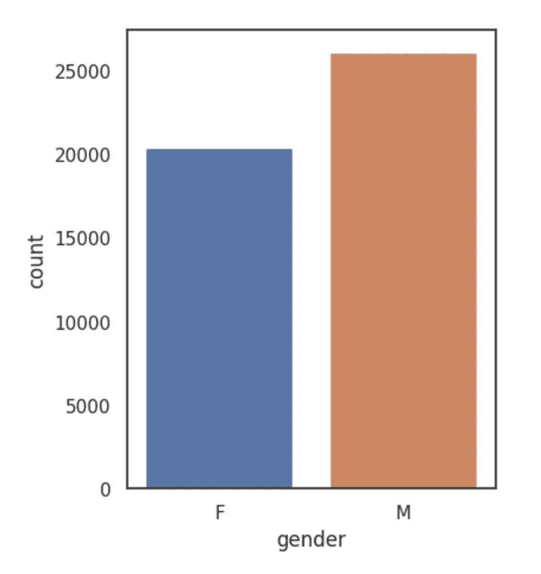
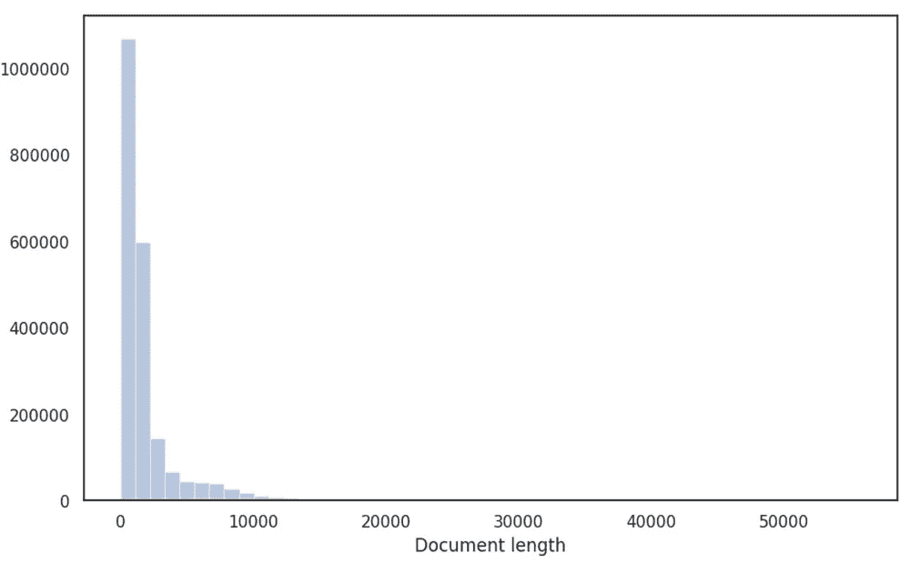
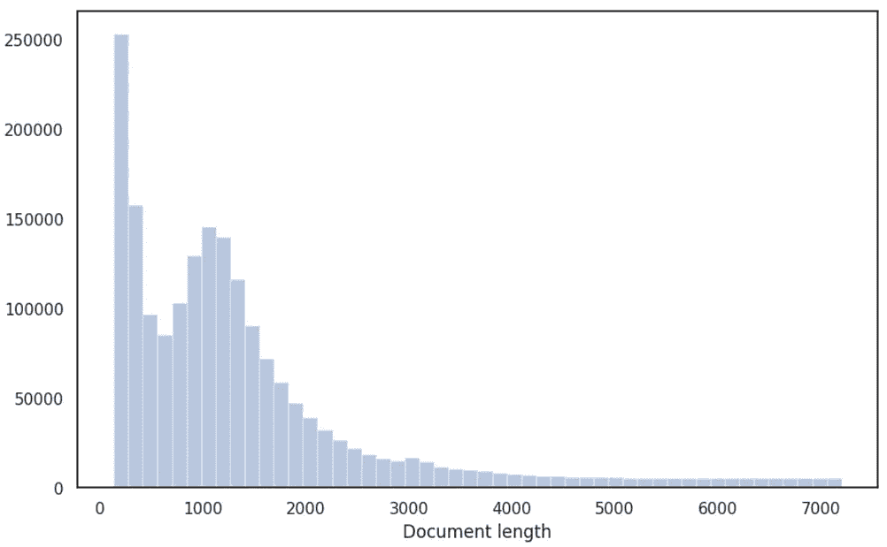
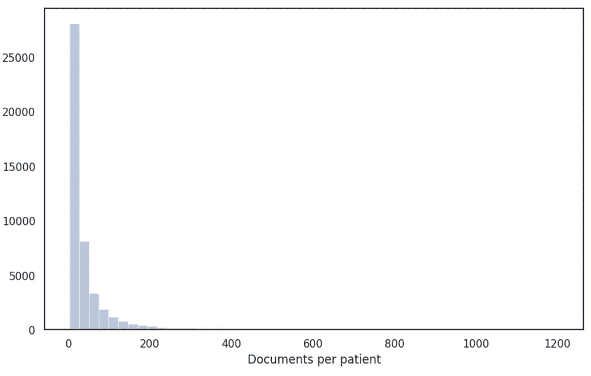
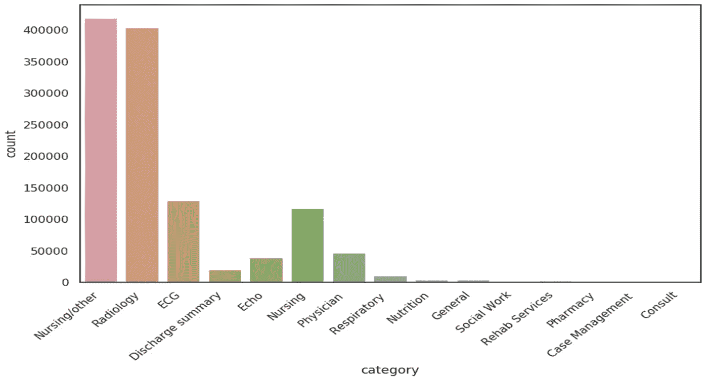
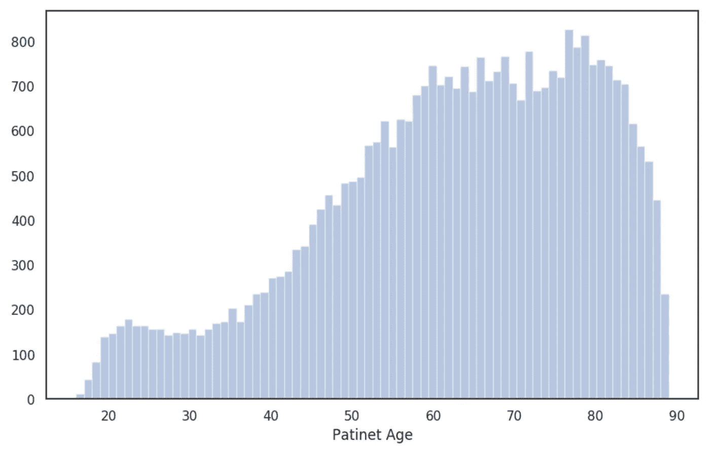
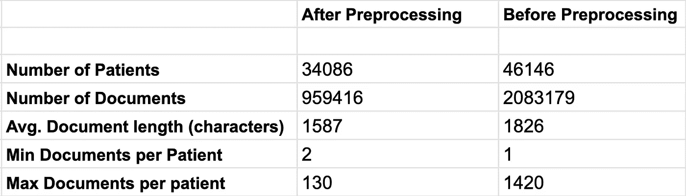

# 数据集分析和准备

> 原文：<https://towardsdatascience.com/medcat-dataset-analysis-and-preparation-be8bc910bd6d?source=collection_archive---------37----------------------->

## 来自 MIMIC-III 数据集的电子健康记录(EHR)的绘图、统计和预处理。


[探索中的猫](https://www.flickr.com/photos/crsan/2571204498)照片由[克里斯蒂安·霍尔默](https://www.fotografchristianholmer.com/) (CC 2)拍摄

在进行任何类型的机器学习时，最重要的步骤之一是理解数据集，并确保我们想要实现的目标实际上是可能的。因此，在继续我们分析年龄和疾病之间联系的主要目标之前，我们将首先在 MIMIC-III 数据集上显示一些基本的统计信息，并为接下来的步骤准备 EHR。

请注意:(1)要重现本教程中的结果(图像)，您需要访问 MIMIC-III，但我知道这可能会很麻烦，我已经在资源库中创建了两个虚拟 CSV 文件。这两个 CSV 文件模拟了我们使用下面的 SQL 脚本从 MIMIC-III 获得的两个文件。这不是真实数据，只能用于测试 MedCAT 或学习如何使用它。(2)我将展示 MIMIC-III 数据集的图表和统计数据。

# 进入 MIMIC-III

获得 MIMIC-III 并不太难，你可以在这里提交申请[通常几天后他们会批准你的申请。](https://mimic.physionet.org/gettingstarted/access/)

一旦你进入 MIMIC-III，你就可以从他们的网站下载完整的数据集。最初，文件是 CSV 格式的，我决定将它们导入到 PostgreSQL 数据库中，以使探索阶段更容易一些(您可以直接从 CSV 文件中做任何事情)。Physionet 提供了如何将 MIMIC-III 导入 PostgreSQL 数据库的教程，[链接](https://mimic.physionet.org/tutorials/install-mimic-locally-ubuntu/)。在我的例子中，我不得不稍微修改脚本来使它工作，并且在不使用 Makefiles 的情况下运行它们，这仍然是一个相当顺利的过程。

# 准备用于分析的数据

我们将所有内容导入 PostgreSQL 的原因是，我们可以更容易地从数据集中查看、过滤和选择需要的内容。 [MIMIC-III](https://mimic.physionet.org/mimictables) 有大量的表格和信息，但我们感兴趣的只有两个:`noteevents`和`patients`。

`noteevents` —包含患者 EHR 的书面部分*。*有关`noteevents`表的更多信息可在 MIMIC-III [网站](https://mimic.physionet.org/mimictables/noteevents/)上找到。在这个表中，我们只对 4 列感兴趣: **subject_id** (患者标识符)；**chartdate**(创建注释的日期)；**category**(注释的类型，例如*护理*)和**文本**(注释的文本部分)。用于提取所需信息的 SQL 脚本如下(使用 save to CSV 选项，或使用 Python 创建 CSV):

```
**SELECT subject_id, chartdate, category, text FROM mimiciii.noteevents**
```

`patients` —包含患者的基本结构化信息。再次，更多关于 MIMIC-III [网站](https://mimic.physionet.org/mimictables/patients/)。从这里我们取三列: **subject_id** (患者标识符)**性别**(男或女) **dob** (出生日期)。SQL 脚本:

```
**SELECT subject_id, gender, dob FROM mimiciii.patients**
```

**请注意**:(1)MIMIC-III 中的日期被随机移至未来(好消息是，对于一名患者，所有日期都使用相同的随机数进行移动)。(2)MIMIC-III 中有大量的`noteevents`，CSV 约为 3.9GB。

# 数据集的基本统计数据

[谷歌 Colab](https://colab.research.google.com/drive/1iWvwqdqdSlwaUbAJTQuJNmqRlclKZfVy)

## 患者表上的统计数据



图 1:MIMIC-III 患者的性别分布。

稍后，我们将根据性别对患者进行分组，以显示女性和男性之间的一些差异。因此，我们想检查我们的数据集是否平衡。在图 1 中，我们可以看到男性患者比女性患者多，但这并不重要(至少对于我们的用例来说不是)。从数字上看，共有 46520 名患者，其中 20399 名为女性，26121 名为男性。`noteevents`表中患者数量略有不同；不是所有的病人都有临床记录。

单独给出这个表无法做任何其他(有用的)事情，让我们首先检查`noteevents`表中的几件事情，然后我们将结合这两个表并绘制与年龄相关的统计数据。

## noteevents 表上的统计信息

从`noteevents`表中，我们想要检查临床记录的长度(字符数),这不是绝对必要的，但是知道我们在处理什么是很好的。图 2 的左侧显示了一些非常长的文档和一些接近 0 个字符的文档。为了清理一点，我们将根据长度(换句话说，最短和最长的音符)移除顶部和底部的异常值。清理并不是真正必要的，但是离群值会产生奇怪的结果，所以最好删除它们。图 2 的右侧显示了基于长度的文档的最终分布。



图 2:基于长度(字符数)的文档分布，左侧为清理前，右侧为删除 5%的最长和最短文档后。

接下来，我们要分析每位患者的文档数量(图 3)。由于这些是健康记录，更多的文件意味着情况可能对病人更糟。而一份文件通常意味着虚惊一场，病人马上就出院了。如上所述，我们将做一些清理和删除离群值，我们不希望患者有数千份文件，也不希望患者只有几份文件。



图 3:预处理前后每个患者的文档数量。

最后，我们还将显示每个类别的文档分布情况(图 4)，这对于了解文档的来源非常有用。目前，我们不会根据类别进行任何过滤。



图 4:每个类别的文档数量(文档来源)。

## 将两个表结合起来—基于年龄的统计数据

请记住，一个患者的所有日期都被同一个随机数移位，这意味着我们可以使用患者的出生日期和文档的创建日期之间的差异来计算该文档撰写时患者的年龄。我们将在这里执行另一个清理步骤，删除年龄大于 89 岁或小于 16 岁的患者(此步骤删除的患者数量最多，约为 20%)。MIMIC-III 不包含关于儿童的信息，只包含新生儿和成人的信息，因此删除 16 岁以下的人意味着只删除新生儿。新生儿的年龄相关统计没有意义。对于 89 岁以上的人来说，这有点极端，MIMIC-III 中的数据对这个年龄组来说是混乱的。细节可以在 Jupyter 笔记本中看到，图 5 显示了结果图。



图 5:在过滤/预处理后，MIMIC-III 中患者的年龄分布。

图 5 与最近在 MIMIC-III 数据集上进行的[研究](https://arxiv.org/pdf/1803.06589.pdf)中呈现的患者分布一致。

最后，表 1 显示了预处理前后数据集的统计数据。



表 1:预处理前后 MIMIC-III 数据集的基本信息。预处理之前的统计信息是在 noteevents 表上计算的。

# 结束了

如果你对更多关于 MedCAT 和电子健康记录的帖子感兴趣，请看这里的。