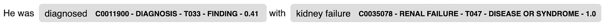
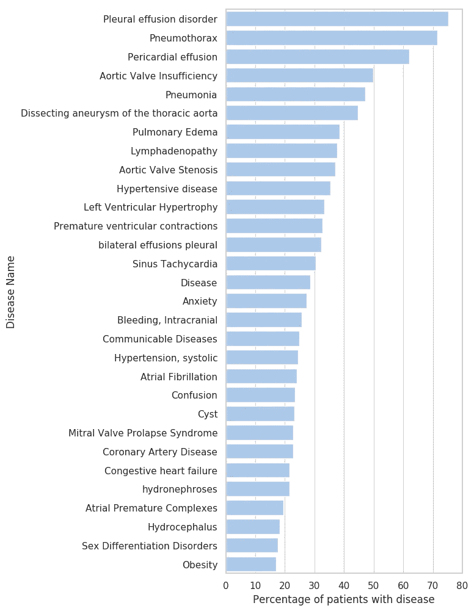
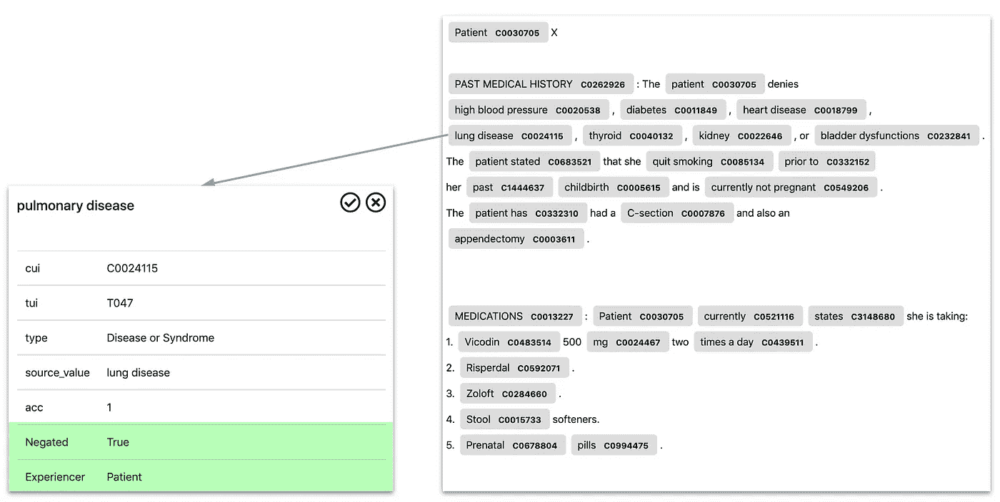

# 从电子健康记录中提取疾病

> 原文：<https://towardsdatascience.com/medcat-extracting-diseases-from-electronic-health-records-f53c45b3d1c1?source=collection_archive---------21----------------------->

## 深入探究 MedCAT 库:从构建概念数据库到无监督训练和文档注释。


来自 [Unsplash](https://unsplash.com/photos/hIgeoQjS_iE) 的[网络营销](https://unsplash.com/@impulsq)的照片。

这篇文章的重点完全是关于 MedCAT 以及如何使用它从 EHRs 中提取信息。典型的 MedCAT 工作流程:

1.  建立一个概念数据库(CDB)和词汇(Vocab)，或使用现有的模型。
2.  对包含大量文档的目标域中的任何数据集进行无监督学习。
3.  为在线/监督学习准备数据。
4.  微调 NER+L 模型，并通过 MedCATtrainer 添加元注释。
5.  将所有内容打包到一个 MedCAT 管道中，并注释文档(EHR)

这篇文章将涵盖步骤 1、2 和 3，而一篇关于监督培训的文章将经历步骤 4 和 5。

# 构建定制模型

[谷歌 Colab](https://colab.research.google.com/drive/1nz2zMDQ3QrlTgpW7FfGaXeV1ZAtZeOe2)

MedCAT 在其管道中使用两种主要模型:

*   词汇表(Vocab) —词汇表用于拼写检查和单词嵌入。它可以使用任何类型的单词嵌入(从 Word2Vec 到 BERT)。如果数据集来自非常特定的领域，通常建议您创建嵌入。
*   概念数据库(CDB) —概念数据库包含特定案例的所有相关概念。在医疗应用中，像 UMLS 或 SNOMED 这样的大型数据库是标准的，然后过滤出所需的概念。MedCAT 适用于任何类型的概念数据库，无论其规模有多大。

这篇文章的其余部分将展示如何从头开始构建这些模型。

## 建立新词汇

运行 MedCAT 时需要的两个模型中的第一个是词汇模型(Vocab)。该模型用于两件事:(1)拼写检查；以及(2)单词嵌入。

Vocab 非常简单，您可以从一个结构如下的文件中构建它:

```
<token>\t<word_count>\t<vector_embedding_separated_by_spaces>
```

*   通常是一个字或子字，如果你使用字节对编码或类似的东西。
*   `word_count`这个词在你的数据集或任何大型数据集中的数量(维基百科也很好)。
*   `vector_embedding_separated_by_spaces`预先计算好的矢量嵌入，它可以是从 Word2Vec 到 BERT 的任何东西。

使用三维矢量嵌入构建词汇表的文件示例(这是一个没有标题的 TSV 文件):

```
house    34444     0.3232 0.123213 1.231231
dog    14444    0.76762 0.76767 1.45454
.
.
.
```

请注意，如果拼写很重要(或者如果您希望 MedCAT 稍后能够纠正拼写错误)，词汇表中的所有单词都必须拼写正确。

现在，要构建 vocab:

```
from medcat.utils.vocab import Vocabvocab = Vocab()
vocab.add_words(path=<path_to_the_tsv_file>)
# Save the new Vocab
vocab.save_dict(<save_path>)
```

## 建立新概念数据库(CDB)

使用 MedCAT 时需要的第二个模型是概念数据库(CDB)。这个数据库包含了我们想要检测和链接的所有概念的列表。对于大量的医疗用例，我们将使用大型数据库，如 UMLS 或 SNOMED。但这不是一个要求，MedCAT 可以用于任何数据库，不管它有多大。

CSV 是构建 CDB 所必需的(下面显示的结构/标题是必需的，并且必须存在):

```
cui,str
1,kidney failure
7,CoVid 2
7,coronavirus
```

这是用于构建 CDB 的 CSV 文件的最基本版本:

> `*cui*` -概念唯一标识符，这只是你数据库中的一个`*ID*`，可以是一个数字或一个字符串。
> 
> `*str*`——概念的串/名。为感兴趣的概念写下所有可能的名称和缩写是很重要的。如果您有一个具有多个不同名称的概念(就像上面 cui=7 的那个)，您可以简单地添加多个具有相同概念 ID 的行，MedCAT 将在构建阶段合并这些行。

```
from medcat.utils.vocab import Vocab
from medcat.prepare_cdb import PrepareCDBvocab = Vocab()
vocab.load_dict(<path_to_a_vocab_model>)# Build the concept databse from a simple CSV
prep_cdb = PrepareCDB(vocab=vocab)# Crete an array for paths to CSV files that will be used to build
#our CDB
paths = [<path_to_our_csv_file>]
cdb = prep_cdb.prepare_csvs(paths)# Save the new model
cdb.save_dict(<save_path>)
```

要打印我们的 CDB 内容(当 CDB 非常大时，请小心使用此功能):

```
print(cdb.cui2original_names)#Output: {'1': {'kidney failure'}, '7': {'coronavirus', 'CoVid 2'}}
```

如您所见，MedCAT 用`cui=7`将这两个概念结合起来，并合并了不同的名称。

**完整的 CSV 规格**

`CSV`可以包含附加信息，所有可能的字段都在下面的示例中指定:

```
cui,str,onto,tty,tui,sty,desc,examples
1,Kidney Failure,SNOMED,PN,T047,Disease,Description of the concept,The patient was diagnosed with kidney failure
1,Failure of Kidneys|KF|K. Failure,,,,,,
.
.
```

这些字段都是可选的，可以包含在您的 CSV 中，也可以省略:

> `*onto*` -源本体，如 HPO、SNOMED、HPC、...
> 
> `*tty*` -术语类型，如 PN -主要名称。主要姓名很重要，我建议在创建 CDB 时添加这些字段。
> 
> `*tui*` -语义类型标识符-如 T047(取自 [UMLS](https://metamap.nlm.nih.gov/Docs/SemanticTypes_2018AB.txt) )。
> 
> `*sty*` -语义类型-如疾病
> 
> `*desc*` -这一概念的描述
> 
> `*examples*` -这个概念在一个句子中的例子(使用简短的例子，而不是整个文档)。

**只有一行需要有关于概念的完整信息。**

从这个 CSV 构建 CDB 的代码与上面相同，唯一的不同是构建的 CDB 上的额外功能:

```
from medcat.utils.vocab import Vocab
from medcat.prepare_cdb import PrepareCDBvocab = Vocab()
vocab.load_dict(<path_to_a_vocab_model>)# Build the concept databse from a simple CSV
prep_cdb = PrepareCDB(vocab=vocab)# Crete an array for paths to CSV files that will be used to build
#our CDB
paths = [<path_to_our_csv_file>]
cdb = prep_cdb.prepare_csvs(paths)print(cdb.cui2original_names)
# Output: {'1': {'KF', 'Kidney Failure', 'failure of kidneys'}}print(cdb.tui2cuis)
# Output: {'T047': {'1'}}print(cdb.cui2tui)
# Output: {'1': 'T047'}print(cdb.cui2desc)
# Output: {'1': 'Description of the concept'}
```

## UMLS 和斯诺梅德

如果你能接触到 UMLS 或 T2 的 SNOMED，你也可以建立大型的医疗 CDB。构建 CDB 仍然使用与上面相同的代码，您只需要将 UMLS/SNOMED 概念放入具有上述格式的 CSV 文件中。

很少有用例需要完整的 UMLS 数据库，我建议使用您的用例/领域所需的子集。构建一个包含完整 UMLS 数据库的 CDB 当然是可能的，但是请注意这个过程可能需要 36 个小时，并且需要大约 16Gb 的内存。

**注意**:对于 UMLS，我准备了创建 CSV 文件的脚本，因为我们在 PostgreSQL 数据库中有 UMLS。 [MedCAT 论文](https://arxiv.org/abs/1912.10166)中的附录 A。或者，如果您想构建 SNOMED，这里有一个存储库。

# 无监督训练

[谷歌 Colab](https://colab.research.google.com/drive/1q29RbHlZoFK7TcvMKITi3ABbE-E_fw30)

我将使用的模型是从 [UMLS](https://www.nlm.nih.gov/research/umls/index.html) 创建的；不幸的是，UMLS 是不公开的。您可以在这里请求访问 UMLS [并构建您的模型，如前一节所述。](https://www.nlm.nih.gov/research/umls/index.html)

对于那些想跟随教程，但不想去 UMLS 的人，我已经创建了使用 UMLS 的免费子集的模型。你可以在这里下载 CDB 模型[，在这里](https://s3-eu-west-1.amazonaws.com/zkcl/cdb-medmen.dat)下载词汇表[，这些模型更小，但在许多用例中仍然有用(Google Colab 已经包含了下载模型的所有代码)。](https://s3-eu-west-1.amazonaws.com/zkcl/vocab.dat)

首先，我们加载模型(如果您已经创建了模型，就可以使用它们):

```
from medcat.cat import CAT
from medcat.cdb import CDB
from medcat.utils.vocab import Vocab# Create and load the CDB (Concept Database)
cdb = CDB()
cdb.load_dict(cdb_path)# Create and load the Vocabulary
vocab = Vocab()
vocab.load_dict(vocab_path)# Create CAT - the main class from medcat used for concept annotation
cat = CAT(cdb=cdb, vocab=vocab)
```

然后，我们将设置几个参数(完整列表将在 [github](https://github.com/CogStack/MedCAT) 上提供):

```
cat.spacy_cat.PREFER_FREQUENT = True # Frequent conceps are pref
cat.spacy_cat.PREFER_ICD10 = False # Useful only for clinical coding
cat.spacy_cat.WEIGHTED_AVG = True # The way context is calculated
cat.spacy_cat.MIN_CONCEPT_LENGTH = 3 # Ignore concepts <= 3 characters
```

我们现在准备运行无人监督的训练。我准备了一个小数据集，可以用来测试无监督训练，但请注意，像 MIMIC-III 这样的大数据集将产生更好的结果。如果您在本地运行(Google Colab 已经有了所有的东西)，下面的代码块假设您已经从存储库中下载了数据(或者您已经有了 MIMIC-III):

```
DATA_DIR = "./data/"
data = pd.read_csv(DATA_DIR + "pt_notes.csv")# Enable the unsupervised training
cat.train = True# Print statistics on the CDB model before training
cat.cdb.print_stats()# Run the annotation procedure 
for i, text in enumerate(data['text'].values):
    # This will now run the training in the background 
    _ = cat(text)

    # So we know how things are moving
    if i % 100 == 0:
        print("Finished {} - text blocks".format(i))# Print statistics on the CDB after training
cat.cdb.print_stats()# Disable the training mode
cat.train = False
```

这就结束了无监督的训练，如果你看看`print_stats`函数的输出，你会看到我们有多少概念接受了训练。剩下的就是保存训练好的模型(只有 CDB 模型接受训练，vocab 始终保持不变):

```
cdb.save_dict(<save_path>)
```

# 注释文档

现在培训已经结束，我们可以继续文档注释了。

```
text = "He was diagnosed with Kidney failure"
doc = cat(text)print(doc.ents)
# out: (diagnosed, kidney failure)
```

仅此而已，没别的了。如果您愿意，也可以使用 displacy from spacy 查看带注释的文档(适用于 Jupyter 笔记本):

```
from spacy import displacydisplacy.render(doc, style='ent')
```



图 0。MedCAT 注释的显示输出。

底层的 CDB 模型是基于 UMLS 的(甚至是公开可用的 MedMentions 模型)，这允许我们过滤注释，只获得我们感兴趣的概念(对于我们的用例是 T047——疾病或综合征；以及 T048——精神或行为障碍)，完整列表[此处](https://metamap.nlm.nih.gov/Docs/SemanticTypes_2018AB.txt)。

```
TUI_FILTER = ['T047', 'T048']
cat.spacy_cat.TUI_FILTER = TUI_FILTER# Annotating documents will now give only the concepts
#that have one of the two TUIs defined in the filter.text = "He was diagnosed with Kidney failure"
doc = cat(text)
#out: (kidney failure)
```

# 为 MedCATtrainer 准备数据

无监督学习非常有用，因为它不需要我们进行任何注释工作，但它可以学习一些奇怪的东西。为了修复缺失和错误，我们将通过 MedCATtrainer 使用在线/监督培训对模型进行微调。这样，大部分工作都由无监督学习来完成，我们只需要投入一点时间来完善它。

再次查看分析年龄和疾病之间关系的用例，我们可以仔细选择使用哪些文档来微调模型。目标是显示年龄和疾病之间联系的一般人口统计，这意味着最流行的疾病(精神和身体)是最重要的。对于微调，选择已经由 MedCAT 模型检测到的最常见疾病(无监督)并检查错误(或可能的改进)是有意义的。更正式地说，以下是必要的:

*   用感兴趣的概念(T047 和 T048)的现有 MedCAT 模型注释所有文档。
*   找出最常见的疾病和精神障碍。
*   查找出现所选最频繁概念的文档。
*   对于两组(T047 和 T048)中前 100 种疾病中的每一种，随机选择 N=2 份文件，用于验证 MedCAT 完成的检测。

这样，我们将只查看感兴趣的概念出现的文档，而不是可能没有提到相关概念的随机文档集。

为了注释数据集中的所有文档，我们将使用 MedCAT 中的`multi_processing`函数，它允许在多个处理器上更快地运行(如果我们有处理器的话)。在注释过程中，我们将记录每个 CUI 出现在哪个文档中。

```
# This will be a map from CUI to a list of documents where it appears: {"cui": [<doc_id>, <doc_id>, ...], ..}
cui_location = {}batch_size = 10000 
batch = []
cnt = 0
for id, row in data.iterrows():
    text = row['text']
    # Skip text if under 10 characters, not really necessary as we 
    # have filtered before, but I like to be sure.
    if len(text) > 10:
        batch.append((id, text))

    if len(batch) > batch_size or id == len(data) - 1:
        # Update the number of processors depending on your machine.
        #We are using the only_cui option, means the 
        #returned entities will only have a CUI (no other 
        #information, try both if interested).
        results = cat.multi_processing(batch, nproc=2,only_cui=True)

        for pair in results:
            row_id = pair[0]# Convert to set to get unique CUIs
            cui_list = set(pair[1]['entities']) 

            for cui in cui_list:
                if cui in cui_location:
                    cui_location[cui].append(row_id)
                else:
                    cui_location[cui] = [row_id]

        # Reset the batch
        batch = []
```

现在我们已经有了每个 CUI 出现的文档，我们还可以在我们的数据集中绘制最常见的 CUI(疾病)(下图)。更完整的代码库请参考[笔记本](https://colab.research.google.com/drive/1q29RbHlZoFK7TcvMKITi3ABbE-E_fw30)。



图一。按患者划分的 MIMIC-III 中前 30 种疾病/障碍的分布。请不要认为这张图表是理所当然的，它是基于检测疾病的提及，忽略它们是否被否定/历史/假设/与患者无关等。所有这些属性都是下面解释的元注释。

剩下的是选择最常见的疾病，并为每个疾病随机选择两个文档，并以 MedCATtrainer 要求的格式保存它们。这是一个简单的`CSV` 文件，结构如下:

```
name,text
<name of a document>,<text of a document>
```

# 梅德卡特雷纳

是一个基于 web 的界面，可用于改进(或训练新的)MedCAT 模型。完整的教程可以在[资源库](https://github.com/CogStack/MedCATtrainer) + [博客文章](https://medium.com/@tomsearle/medcattrainer-a-tool-for-inspecting-improving-and-customising-medcat-880a11297ebe)中找到。培训师支持许多功能，但我们的重点是:

1.  改善 NER+L，教练让我们看到由 MedCAT 检测到的概念，并为每一个说正确/不正确。如果遗漏了什么，我们还可以添加新的概念(注释)。在此过程中，模型会在后台进行更新和微调。
2.  元注释，对于每个检测到的概念(在我们的例子中是一种疾病)，我们将添加元注释来表示该概念的上下文相关属性。

## 元注释

对于许多用例来说，仅仅从 EHR 中提取医疗概念是不够的。通常需要提取每个检测到的概念的元注释(属性/特性)。一些可能的元注释是:

*   否定:概念在文本中是否被否定(例如，患者患有癌症，而患者没有癌症)
*   体验者:疾病是否会影响患者或其他人(例如，患者患有癌症，而患者的父母患有癌症)
*   暂时性:该疾病目前影响患者还是过去影响患者(例如，患者发烧与患者两年前发烧)。
*   不确定性:有时临床医生会在电子病历中写下假设的陈述(例如，这看起来像肾衰竭)
*   有许多其他元注释可以提取，这完全取决于用例。

让我们看一个例子，在图 2 中，对于概念`lung disease`，有 2 个元注释告诉我们这个概念是否定的(意味着某人没有肺病)，并且体验是耐心的(意味着某人是病人)。



图二。EHR 中的元注释示例。

MedCATtrainer 使我们能够训练模型，这些模型稍后将自动进行这些元注释。对于我们的用例，一个元注释就足够了:

*   状态(已确认/其他):如果未被否定且当前影响患者，则标记为`Confirmed`，其他情况下标记为`Other`。请注意，我们的元注释实际上是否定、经验者、时间性和不确定性的结合。

# 结束了

如果你对更多关于 MedCAT 和电子健康记录的帖子感兴趣，请看这里的[。](https://towardsdatascience.com/tagged/medcat)