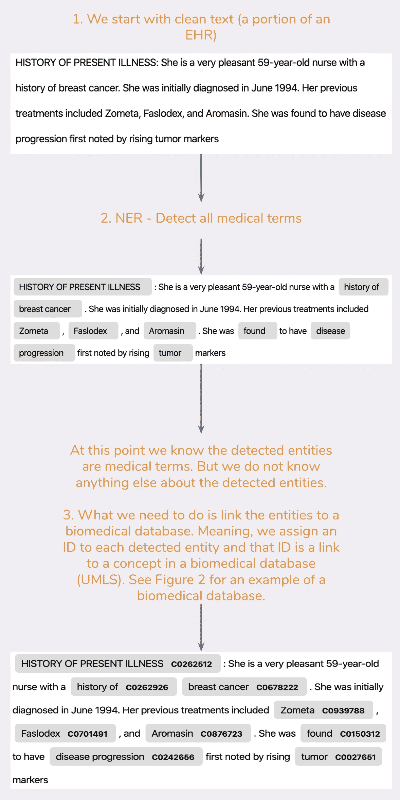
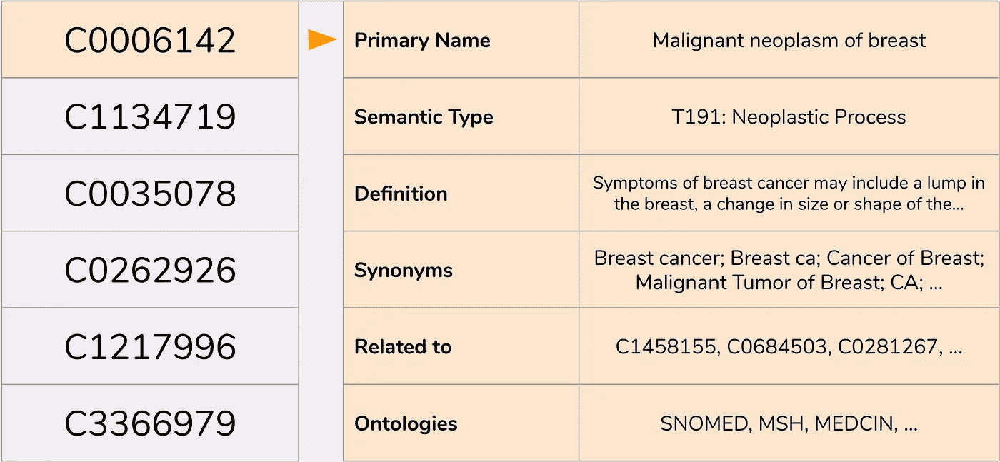

# MedCAT |简介—分析电子健康记录

> 原文：<https://towardsdatascience.com/medcat-introduction-analyzing-electronic-health-records-e1c420afa13a?source=collection_archive---------16----------------------->


照片由 [Hush Naidoo](https://unsplash.com/@hush52) 在 U[n spash](https://unsplash.com/photos/yo01Z-9HQAw)上拍摄。

## 介绍如何使用 [MedCAT](https://github.com/CogStack/MedCAT) 组织、构建和分析电子健康档案(EHRs)。例如，MedCAT 用于最近一项关于 [ACE 抑制剂和 CoVid-2019](https://www.researchgate.net/publication/340261837_Treatment_with_ACE-inhibitors_is_associated_with_less_severe_disease_with_SARS-Covid-19_infection_in_a_multi-site_UK_acute_Hospital_Trust) 的研究。

电子病历是医疗信息的宝库；它们包含了令人难以置信的大量知识。提几个通常每个病人都有的数据点:(1)有症状的疾病；(2)药物治疗，通常伴有剂量说明、最终副作用和患者反馈；(3)治疗，有时有患者的反馈；(4)来自临床医生的风险、假设和意见；(5)病人的证词；(6)各种测量和实验室结果。

在处理 EHR 时，我们首先需要构建和组织它们。它们包含的信息通常以非结构化格式(自由文本)提供。对于医生来说，这个相对还可以；他们可以阅读文档并获得他们需要的信息。但是，如果我们想要使用数据进行统计分析或机器学习，没有结构是有挑战性的。

给定一个结构化的 EHR，一些可能的研究用例是(1)死亡率预测；(2)疾病风险计算；(3)临床编码；(4)疾病或患者的时间模型；(5)疾病/药物相互作用；(6)药物不良反应的检测；

当然，我并不是第一个理解电子病历中的可用数据对病人和医疗机构都有很大好处的人。最近，我们已经看到谷歌健康(数据聚合工具)、亚马逊(他们的理解医疗)和许多其他公司的大动作。虽然很高兴看到大公司了解 EHR 的价值，但他们需要很长时间才能完全访问医院数据(隐私问题)。最后，即使他们获得了访问权，它是否能促进研究项目或帮助病人也是值得怀疑的。

我在这里的目标是展示，使用像[**【MedCAT】**](https://github.com/CogStack/MedCAT)**这样的工具，我们可以在几个小时内在一台个人笔记本电脑上构建大型医院的电子病历，而不需要大型服务器和基础设施。有了这个，我们就有可能启动/进行能够改善医疗保健的研究项目。**

这篇文章的其余部分组织如下。首先，我们将定义一个用于展示 [MedCAT](https://github.com/CogStack/MedCAT) 的小项目。其次，我们将看看我们正在使用的数据集。第三，我们将检查环境设置。

**请注意**:(2)我不会分享任何医疗数据集，但会显示在哪里以及如何访问/获取它们；(3)一些统计学和机器学习的知识会有帮助，但不是必须的；(4)我们这里关注的是 EHR，同样的方法可以用于其他类型的文档，但是目前，该工具主要在生物医学文档上进行测试。

# [MedCAT 教程概述](https://github.com/CogStack/MedCAT/tree/master/tutorial)

本教程中的每一篇文章都是独立的文章，但仍然建立在同一个故事之上。随意跳转到你感兴趣的帖子，它应该很容易跟踪和理解(链接将随着教程的发布而更新)。

1.  **简介** —本岗位

3.  [**从电子健康档案中提取疾病**](/medcat-extracting-diseases-from-electronic-health-records-f53c45b3d1c1) —深入探究 Python 中的 MedCAT 库以及命名实体识别和医疗概念的链接。如果您只对如何使用 MedCAT 感兴趣，这很有用。
4.  **监督培训和完整的 MedCAT 管道** —探索 MedCAT 库的更高级部分，以及如何为 NER+L &元注释构建完整的管道。
5.  [**分析结果**](/prevalence-of-physical-and-mental-diseases-450c0f4f5851) —这是我们从电子健康记录中提取出感兴趣的实体后可能实现的一个例子。
6.  **med cat 库的其他工具和功能(ICD10 代码，SNOMED CT) &未来的期望**

# 简介—项目定义

让我们看一个例子。假设我们访问了一家大型医院的数据库，该医院的每个患者都有一个包含大量自由文本的 EHR(下面的文档示例，您可以在 [mtsamples](https://www.mtsamples.com/) 找到更多)。除此之外，每个 EHR 还包括几个结构化字段，如年龄、性别和种族。现在，假设我们的项目是展示疾病与年龄之间的**关系(可以用来计算与年龄相关的疾病风险分值)。为了做到这一点，我们需要知道每个患者的年龄，以及在他的 EHR 中出现的疾病。提取年龄很容易，这是一个结构化的领域，但问题是疾病。它们只在自由文本中被提及，通常不会在其他地方出现。在继续之前，我们需要从每个 EHR 中提取疾病，并将它们保存在结构化数据库中。**

**请注意** : (1)疾病提取问题还有更多的内容，但我们会继续扩展。(2)疾病只是一个例子，我们可以用药物、症状、程序或任何其他东西来做同样的事情。


一个 EHR 的假例子，请注意，尽管这是自由文本，但它明显比真正的 EHR 更结构化，阅读/理解起来是一场灾难。

## 疾病提取问题的正式定义

我们想要实现的在自然语言处理(NLP)中被称为命名实体检测和链接(NER+L)。NER 意味着检测文本中的实体(例如医学术语，图 1 中的第二步)。而 L 意味着将被识别的实体链接到生物医学数据库中的概念(例如 [UMLS](https://www.nlm.nih.gov/research/umls/index.html) ，图 1 中的第三步)。



链接部分是必不可少的，因为它允许我们标准化和组织被检测的实体，因为多个被识别的实体可以链接到生物医学数据库中的相同医学概念。例如，在 EHR 中，我们可以有:

*   患者被诊断患有**乳腺恶性肿瘤** …
*   既往病史包括**乳腺癌** …
*   入院原因:**乳腺癌** …

每一个粗体的概念都是相同的疾病，只是书写方式不同。如果我们不对检测到的实体进行标准化，将很难计算例如有多少患者患有乳腺癌的统计数据。

此外，如果我们将一个实体链接到一个生物医学数据库，我们就可以访问该数据库中的所有结构化字段(图 2)。



生物医学数据库的一小部分(UMLS)。

一旦我们检测到实体并将其链接到我们的生物医学数据库，我们就可以，例如，基于`Semantic Type`字段过滤实体，或者找到所有链接到 ID 为`C0006142`的生物医学概念的实体。在 UMLS 可以找到所有语义类型的概述[这里](https://metamap.nlm.nih.gov/Docs/SemanticTypes_2018AB.txt)(注意，其中一个语义类型是*疾病*，这正是我们需要的)。

**请注意:** (1)对于生物医学数据库，我们将使用 UMLS，因为它是最大的数据库，拥有超过 420 万个医学概念。还有许多其他生物医学数据库，但 UMLS 完全符合我们的需求，因为我们希望提取所有可能的疾病。

# 数据集——MIMIC-III

[MIMIC-III](https://mimic.physionet.org/about/mimic/) 是一个公开可用的数据集，由麻省理工学院计算生理学实验室开发。它包括临床笔记，人口统计，生命体征，实验室测试等。

我选择了这个数据集，因为它是唯一公开的包含 EHR 的数据集之一。数据集不能直接下载，但需要先[提交请求](https://mimic.physionet.org/gettingstarted/access/)——通常会在几天内获得批准。

# 环境设置(如果在本地运行)

我们将使用 Python 作为主要编程语言，稍后，一些情节将使用 R 或在 JavaScript 的帮助下完成，但这主要是为了让它们更有趣。

我将使用 python 3.7 做任何事情，很可能 3.5 以上的版本会很好。

如果您正在本地机器上学习本教程，建议使用以下命令启动一个新的 Python 虚拟环境:

```
python3 -m venv medcat
```

一旦完成，您就可以克隆 [MedCAT 存储库](https://github.com/CogStack/MedCAT)并进入`tutorial`目录。从那里运行(不要忘记激活`medcat`环境):

```
pip install -r requirements
```

由于 MedCAT 构建在 SpaCy/SciSpaCy 之上，您还需要使用以下命令下载语言模型:

```
pip install [https://s3-us-west-2.amazonaws.com/ai2-s2-scispacy/releases/v0.2.4/en_core_sci_md-0.2.4.tar.gz](https://s3-us-west-2.amazonaws.com/ai2-s2-scispacy/releases/v0.2.4/en_core_sci_md-0.2.4.tar.gz)
```

# Google Colab

所有的代码也可以在 Google Colab 上找到，你可以在[库](https://github.com/CogStack/MedCAT/tree/master/tutorial)的`tutorial`部分找到笔记本的链接。这是遵循本教程的最简单的方法，因为一切都已经配置好了。但是，请注意，Colabs 不会使用真实数据(MIMIC-III)，而只会使用公开可用的数据集和生成的虚拟数据。