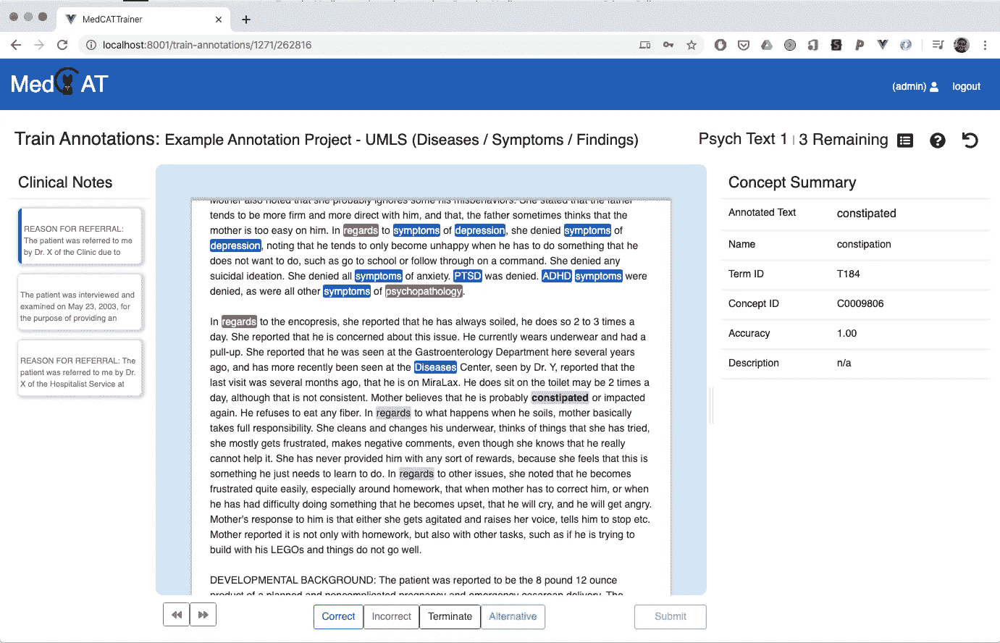
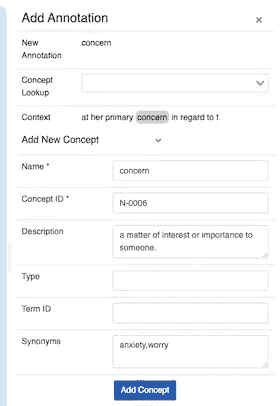
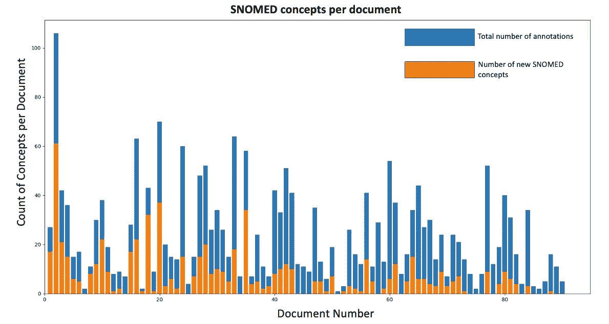
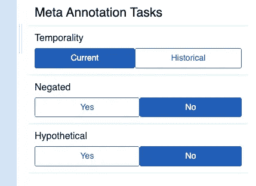

# MedCATTrainer:用于检查、改进和定制 MedCAT 的工具

> 原文：<https://towardsdatascience.com/medcattrainer-a-tool-for-inspecting-improving-and-customising-medcat-880a11297ebe?source=collection_archive---------44----------------------->

## MedCAT 的配套工具:组织、构建和分析电子健康记录(EHRs)的管道。

# 概观

[医学概念注释工具(MedCAT)](https://github.com/CogStack/MedCAT) ，是一个(命名实体识别+链接)NER+L 工具，用于识别临床文本概念并将其链接到现有的生物医学本体，如[【UMLS】](https://www.nlm.nih.gov/research/umls/index.html)或[SNOMED-CT](https://digital.nhs.uk/services/terminology-and-classifications/snomed-ct)——这通常是从临床 EHR 中可用的大量非结构化纯文本中获得洞察力的第一步。

本文将介绍 MedCATTrainer，它是 MedCAT 的一个附带工具，可用于:

1.  inspect——可以直观地检查和审查由 MedCAT 识别和关联的概念，从而建立对 MedCAT 模型的信任。
2.  改进——提供受监督的训练示例，允许人类注释者改进 MedCAT 模型。
3.  定制——为训练项目/用例特定的模型收集更多的用例特定的注释。

这 3 项任务对于跨临床用例应用 MedCAT 非常重要。

# 安装/设置

MedCATTrainer 提供了注释接口、ReST API、中间层和数据库。所有的组件都已经被 dockerized，并且是可用的[开源](https://github.com/CogStack/MedCATtrainer)。下载、安装和运行需要 [3 个命令](https://github.com/CogStack/MedCATtrainer/blob/master/README.md#installation)。

第一次运行应用程序时，下载 [MedCAT 模型](https://github.com/CogStack/MedCAT)、示例[数据集](https://github.com/CogStack/MedCATtrainer/blob/master/docs/example_data/psych.csv)，并为已配置的示例用户创建许可的示例项目。

# 注释界面

该界面显示了一个[文档摘要](https://github.com/CogStack/MedCATtrainer/blob/master/README.md#doc-summary)及其注释状态、当前正在审查的[临床文本](https://github.com/CogStack/MedCATtrainer/blob/master/README.md#main-text)以及来自 MedCAT 的[当前选择的概念](https://github.com/CogStack/MedCATtrainer/blob/master/README.md#section-5---concept-summary)细节。

一个易于使用、简单但功能丰富的 web 界面允许注释者:

*   **检查**最初以灰色显示的 MedCAT 识别的实体，并在选择后突出显示其各自的状态。
*   **提高** MedCAT 的 NER+L 能力，通过选择[合适的文本，右击‘添加注释’，然后从 MedCAT](https://github.com/CogStack/MedCATtrainer/blob/master/README.md#additional-annotations) 中搜索并链接正确的术语。这可以提高 MedCATs 对其从未见过的首字母缩写词、拼写错误或术语缩写的识别能力。

项目配置中的一个可选设置允许人类注释者添加全新的概念。新概念可以通过类似于 UMLS 和 SNOMED-CT 根术语的语义类型进一步分组。这一特征与精神健康等领域尤其相关，这些领域通常没有 UMLS 和 SNOMED-CT 等标准化术语。

# 主动学习

MedCATTrainer 可用于主动训练已配置的 MedCAT 模型。在文档的每一次[提交](https://github.com/CogStack/MedCATtrainer/blob/master/README.md#submit)之后，每个正确的、不正确的和新添加的实体被用于进一步训练所配置的 MedCAT 模型。随着人类注释者处理更多的文档,“辅助”注释体验使得注释变得不那么困难。

下图显示了最近的一个项目，该项目在真实的临床文本中注释症状、发现和药物治疗概念，随着人类注释者的进行，他们遇到的手动添加的新 SNOMED-CT 实体越来越少。变化的峰值表明真实临床数据的可变性。MedCAT 模型的收敛证明了投资于人类注释的价值，并且可以被认为是模型“微调”的一种形式。

一旦“微调”到数据集或临床记录类型，双注释器就可以对 MedCAT 模型性能进行严格评估，而无需主动学习计算标准指标，如 [IIA](https://en.wikipedia.org/wiki/Inter-rater_reliability) 和[科恩的卡帕](https://en.wikipedia.org/wiki/Cohen%27s_kappa)。MedCATTrainer 支持这个用例，它允许管理员轻松地[克隆](https://github.com/CogStack/MedCATtrainer/blob/master/README.md#clone-project)项目和[权限](https://github.com/CogStack/MedCATtrainer/blob/master/README.md#create-project)注释器，然后[下载](https://github.com/CogStack/MedCATtrainer#download-annos)和[报告度量性能](https://github.com/CogStack/MedCATtrainer/blob/master/docs/Processing_Annotations.ipynb)。

# 用例/项目特定的注释

在下游研究问题中使用临床文本通常不仅仅是简单地确定正确的文本跨度和与正确的术语概念相联系(UMLS/斯诺梅德-CT)。它还经常涉及对疾病或症状的进一步注释，以确保它们与患者相关，或者是当前的实例，而不仅仅是临床医生假设性地提及概念。然而，研究问题通常会有不同的解释，例如，时间性——“当前”和“历史”可能无法为所有研究问题提供适当的粒度级别。

MedCATTrainer 支持这些所谓的元注释的项目或用例特定集合的配置。[管理员可以用特定的元注释配置注释项目](https://github.com/CogStack/MedCATtrainer/blob/master/README.md#meta-annotation-configuration),以便在项目之间重用或单独使用。每个配置的注释和相关值都出现在界面中。

一旦完成，管理员可以[下载](https://github.com/CogStack/MedCATtrainer/blob/master/README.md#download-annos)注释，并使用 [MedCAT 库](https://github.com/CogStack/MedCAT/blob/master/medcat/meta_cat.py)训练单个元注释模型。

# 概括起来

这个简短的介绍激发了 MedCATTrainer 与 MedCAT 工具的结合使用。全套文档可直接在 [GitHub](https://github.com/CogStack/MedCATtrainer) 上获得，此外还有[编程 API 访问](https://github.com/CogStack/MedCATtrainer/blob/master/docs/API_Examples.ipynb)的全部细节、上述所有功能的详细配置以及用于组织、构建和分析 EHR 的常见用例的项目设计模式。