# 干预人力资源自动化！

> 原文：<https://towardsdatascience.com/meddling-with-hr-automation-b331daf21858?source=collection_archive---------29----------------------->

## 利用数据科学改善人力资源招聘流程

**供稿人:** 林家辉
OOI 惠敏
PHOE CHUAN BIN
沈志安
吴彦祖 MENG 凯

# 行动纲要

设计一个系统，能够提取工作角色最重要的技能，并使用自然语言处理(NLP)将它的适用性与大量非结构化简历相匹配。该系统还能够在多个技能维度上对候选人进行评估和排名，以计算每个工作角色的每个候选人的总分。

接下来，我们研究了不同行业和职业的人格特征，以发现它们之间是否存在显著差异。在确立了这一意义后，我们开发了一个系统，使用文本分析来识别求职者的 MBTI 人格类型。这可以作为人力资源的指南，以确保所选申请人的个性符合他们申请的角色和团队。

最后，我们使用流失数据来识别某些个人信息，这些信息可能有助于选择不太可能离开公司的候选人。如果候选人拥有某些对预测人员流失非常重要的信息，这些信息可以作为一种标记机制，向人力资源人员发出警报。

**如果您希望查看有关该报告的简明幻灯片，请前往**[https://medium . com/@ phoechuanbin/dumping-with-HR-automation-slides-4 db 88 eadb 99 c](https://medium.com/@phoechuanbin/meddling-with-hr-automation-slides-4db88eadb99c)

# 介绍

如今，发送简历几乎不费吹灰之力。例如，谷歌，许多有抱负的计算机科学学生希望为之工作的四大科技公司之一，每周收到超过 2 万到创纪录的 7 万份简历。(埃迪·j，2014 年)

相反，人力资源的工作并不容易。他们有许多职责，如处理员工的工资，培训等。，其中一项包括翻看数千份这样的简历。更糟糕的是，在一家运转良好的公司中，人力资源可能也不太熟悉和熟悉各种职位和角色。

此外，一份工作的合适人选不应该仅仅是拥有最好的资格。性格和心理情绪特征通常非常能说明一名员工是否适合和有能力在一个组织的工作文化中茁壮成长。

最后，对于人力资源来说，留住员工是一个普遍而普遍的问题。员工类似于资源，失去员工就相当于失去了雇佣和培训员工的时间、资源和金钱。

因此，人力资源分析正在崛起，以解决这些问题，因为沟通。利用分析的能力可以通过对非结构化信息进行分类、排序和存储，显著释放人力资源资源，并以一种更少偏见、数据驱动的方式管理员工。

我们的团队设计了一个三阶段计划来处理获得合格人才的问题，通过心理情绪特征筛选最合适的候选人，最后通过找到流失率的重要变量来留住员工。

# 1.获得物ˌ获得

# 1.1 背景

使用传统的人工劳动对简历进行人工分类不仅耗费大量资源，而且容易受到人为偏见和错误的影响。Marianne 和 Sendhil 在 2003 年进行了一项著名的研究，研究了姓名为 Emily 和 Greg 或 Lakisha 和 Jamal 的候选人的就业能力。结果是“听起来像白人的名字”比“听起来像黑人的名字”多收到 50%的回复。

因此，我们的团队设计了一个 3 步数据驱动模型，我们相信它可以帮助人力资源部门根据简历对所申请职位的适合性，更客观地对简历进行排名。这可以作为不匹配简历的主要过滤器。图 1.1 描述了这个模型。

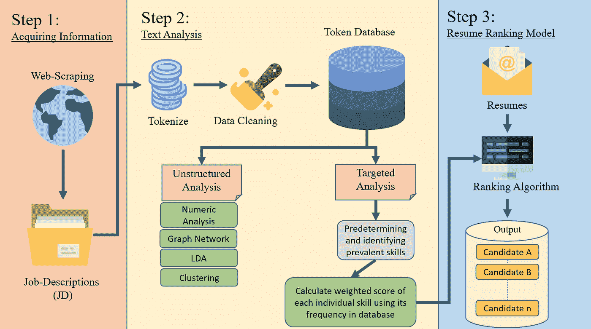

*图 1.1:简历排名模型*

首先，我们相信对于一个给定的工作角色来说，获得最重要的技能的最好方法是从“群众的智慧”中寻求。通过网上搜集各种组织的大量职位描述(JDs ),强调该角色的基本工作要求，我们将获得该行业普遍需要的最突出的技能。

其次，在获得数百个 JD 后，我们可以通过给定作业角色的令牌化来创建令牌数据库，并在执行 NLP 之前清理它。停用词被移除并且应用词袋(BOW)模型，因此词的顺序无关紧要。我们首先执行了一般的、非结构化的文本分析，随后是有针对性的分析。前者类似于无监督学习，因为我们试图在令牌数据集中寻找未知模式。后者旨在为其在每个预先确定的技能列表中的流行程度给出一个“分数”。

第三，通过应用具有先前设计的评分的排名算法，可以根据候选人的个人技能维度或作为整体与所申请的工作的相关性对候选人进行数字排名。

# 1.2 应用

# 1.2.1 网页抓取

我们的团队从 Indeed，一个与就业相关的工作列表搜索引擎，搜集了“数据科学家”(Ds)、“数据分析师”(DA)和“数据工程师”(DE)的 JDs。在他们的服务条款中，确实允许网络抓取。

由于原始文本是从网页上刮下来的，因此在进行任何分析之前都需要进行预处理。我们通过以下方式同等对待每个数据集:

1.  转换为 UTF-8 到 ASCII 编码
2.  删除换行符(" \r "和" \n ")和标点符号
3.  转换为字母格式
4.  修剪前导和尾随空白
5.  转换为小写

# 数据清理

首先，我们将每个数据集标记为二元模型(2 个单词作为 1 个标记)，因为这对“机器学习”、“人工智能”和“数据科学”等术语有意义。

在执行任何有意义的分析之前，必须进行数据清理。首先，我们将二元模型分成单个单词，同时保持其结构完整性。接下来，我们从“tidytext”包中过滤出常用的停用词。这些词在语言中经常被用来使句子流畅，但通常不是实质性的，很少增加意义。这一步见证了所有数据集中令牌大小最显著的减少，大约减少了三分之二。(附录 1A)

之后，我们删除了数据集中频率= 1 的单词。在我们的例子中，这些包括不太有意义的术语，如“aaa”，或者不正确解析的术语，如“abilitiesstrong”。因此，它们不是实质性的。

为了清除未正确处理的单词，我们通过反复试验过滤了具有高字符数的标记(例如“manufacturinglocationsingaporecontract”)。但是，我们知道这可能会损坏我们的数据。一旦大多数前 50 个字符计数标记被认为是有效的或可理解的，我们就停止该过程。

我们继续使用“textstem”包对我们的令牌进行符号化。与词干化相反，词干化的目的是返回单词的基本形式，而词干化是一个更粗糙的过程，只需砍掉单词的词尾。例如，如果遇到标记“ponies”，词汇化将返回“pony”，而词干化将返回“poni”。

# 1.2.3 一般文本分析

一个词在数据集中所占的比例越高，我们就可以假设一个令牌在特定工作角色中的相关性越大。

然而，我们意识到，DS 有许多技术术语，如“数据科学家”和“机器学习”，而 DA 有一些不太有用的术语，如“婚姻状况”和“性取向”(附录 1B)。因此，这种数值分析方法可能并不适用于市场中的所有工作角色，而应该仅用于数据探索。

这一观察可以通过使用潜在狄利克雷分配(LDA)模型的主题建模和聚类分析来验证。结果表明，单词可以分为技术行话或人口统计变量。分析可在附录 1C 至 1E 中找到。因此，使用我们的领域知识进行有针对性的分析以获得更好的洞察力是合乎逻辑的。

# 有针对性的分析

与一般的文本分析不同，目标分析利用特定工作所需技能的领域知识。在我们的案例中，我们确定了 4 个我们认为相关的独特技能维度。这些技能类别如下所示。

**DS、DA、DE 的 4 个技能维度**

1.  编程语言
2.  数据科学工具
3.  技术
4.  软技能

首先，我们的团队搜集了维基百科中大约 700 多种编程语言的列表，我们认为这是最全面的，尽管有一些不太流行。(附录 1F)。我们承认诸如“reason”、“basic”和“simple”这样的标记可能会被含糊地使用，而不是严格地用于编程语言。然而，由于这些是可行的编程语言，我们选择保持谨慎，在我们的分析中保留它们。

接下来，我们确定了一个“14 大数据科学工具”的列表，如“tableau”、“scikit-learn”和“excel”(data flair 团队，2019)。我们认为，尽管这超出了编程语言的范围，但它与编程语言是密切相关的，并且是 it 行业中必不可少的元素。同样，我们也注意到在分析具有多重定义的术语时会有歧义。例如，当“excel”带有优越的含义时，它可能被解释为数据科学工具。

然后，我们确定了与 IT 行业相关的 6 个广泛的技术技能，尽管选择了编程语言或使用的工具(Chandrasekaran，2018)。它们分别是“统计”、“回归”、“可视化”、“发现”、“分类”和“提取”。(附录 1H)。

最后，我们承认软技能对于所有行业的运营都是相关的。因此，我们策划了一个宽泛的术语列表，如“沟通”、“团队合作”、“领导力”等。其被设计成不那么模糊。我们的调查结果如附录 1I 所示。

# 1.3 简历排名模型

与 JDs 类似，我们的团队已经从 Indeed 合法地下载了 20 份简历。我们设计了一种算法，根据第 1.2.4 节中讨论的技能维度对这些简历进行排序。

# 排名算法

*图 1.2:编程语言排名算法*

首先，我们为特定的工作角色创建了一个文档术语矩阵。因此，简历(文档)以行的形式展示，而技能(令牌)以列的形式呈现。这给出了每个候选人所拥有的技能的一般和简要的反馈(附录 1J)。

我们建议利用对数函数的特性来计算分数。对数函数是指数函数的反函数，并且是广泛接受的和方便的表示大数的方式(Jon。, 2018).分数以递减的速率增加，以适应这样的事实，即具有较高的项计数不会线性地增加分数的值。例如,“python”的值为 1 对 2≈10 对 20。这也可以防止给那些垃圾相关关键词的简历过高的分数。

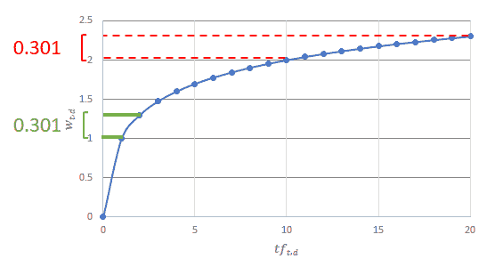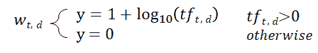

*图 1.3:基于术语频率的得分图*

图 1.3 显示了用于计算分数的两个等式。我们不能简单地使用对数方程，因为 log(0)趋向于-∞。

如果词频为 0，则相应的分数逻辑上为 0。否则，我们将使用

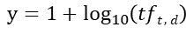

来计算分数。该图显示了得分如何随术语频率而变化。

对于不同的工作角色，每项技能都有不同的价值。例如，编程语言“python”在 Ds 的 JDs 中有 26.2%的显著提及比例，而在 DE 中只有 16.6%。因此，“python”在 Ds 的 JDs 中的高提及率应该比在 DE 中的高。因此，我们建议将步骤 2 中的分数乘以该关键字的相应提及率比例。

# 1.3.2 产出

我们对每个简历数据集(DS、DA、DE)的每个技能维度(“编程语言”、“数据科学工具”、“技术技能”、“软技能”)进行了分析和计算。通过这些评分，我们可以评估个人满足申请职位要求的整体能力。

此外，通过每个维度的得分，这增加了为什么一个候选人比另一个候选人更好的解释力。例如，两个候选人具有相同的总分，但是候选人 A 具有更高的“编程语言”分数，并且对于该工作，该维度是至关重要的。所以，候选人 A 更适合。

每个数据集最终结果的汇编见附录 1V，每个数据集各自维度的汇编见以下附录。

**数据集**

**附录**

DS: 1J，1K，1L，1M

大卫·爱登堡:1N，1O，1P，1Q

德:1R，1S，1T，1U

# 重要观察结果

我们观察到，我们预先定义的“技术技能”词汇在 DA 和 DE 简历数据集中没有广泛使用，因为计数范围在 0 到 1 之间。这可能意味着所确定的术语不够广泛，或者工作角色不需要这些技能。这也适用于数据集内。对于德除“责任”一词外的软技能，其整体提及率也较低。我们理解简历通常不包含这样的词，因此建议使用其他文件，如求职信。

其他值得注意的观察包括简历中的大量提及，特别是“Sazid Khan 的简历”，其中 89 次提到了数据科学工具技能术语“tableau”。经过进一步分析，他有一份长达 6 页的简历，其中提到了 Tableau 应用程序套件在他的各种工作中的使用。然而，对数函数和给定的较低权重分数缓和了他夸大的使用，他在 DE 数据集中的数据科学工具方面排名第五。

# 建议

在我们的最终分析中，我们假设每个技能维度都是同等重要的。但是，每个技能维度的权重可以通过部门主管的意见、专家意见等进行更改。同样，我们的模型目前没有能力评估其他相关因素，如教育水平、成就、以前的工作经验、课外活动或爱好等。目前。例如，为了跟踪教育水平，我们可以将诸如“A-Levels”和“Diploma”这样的术语分组为高中水平的教育，将诸如“学士”和“理学士”这样的术语分组为大学水平的教育。

# 1.4 结论

我们提出的模型为人力资源提供了一种资源友好的方法，将市场上几乎任何工作角色的非结构化简历转换为更结构化、更有组织性的数据集。这样，人力资源部门就能够使用数据驱动的方法来客观地评估候选人的各种技能领域，并更好地判断谁最符合给定角色的工作要求。

# 2.人格契合度

# 2.1 问题

获取人才和技能只是提高工作场所运营效率的一个方面，个人对工作环境的适应也很重要。研究表明，那些很好地融入公司文化、与同事和主管相处融洽的员工总体工作满意度更高，更有可能留在公司，并且更致力于实现卓越的工作绩效(Bouton，2015)。

有鉴于此，我们的团队旨在调查在给定的行业和/或部门中是否存在相同性格类型的趋势。如果是这样的话，我们将随后开发一个模型，筛选出适合特定行业和/或部门的具体个性特征。该模型可以在第 1 部分之后结合使用，在第 1 部分中，如果个人符合所申请工作的要求，将对其进行筛选。

使用不同行业和部门工作人员的 3600 份记录(personality.csv)和他们在五大性格测试(开放、尽责、外向、随和、神经质)中各自的分数(Gosling et al .，2003)的数据集，我们分析了部门和行业雇用具有相似性格的员工的假设。

# 2.1.1 跨部门/行业的平均人格特质得分是否存在差异？

首先，我们需要分析不同部门和行业的平均人格特质得分是否相同。方差分析用于对我们的数据集进行测试。以下是仅针对外向性得分的无效假设和替代假设(有关其他人格特征的结果，请参考附录 2A):

H0:不同部门/行业的外向性得分是一样的

H1:不同部门/行业的外向性得分不一样

*图 2.1.1:跨部门外向性得分的方差分析结果*

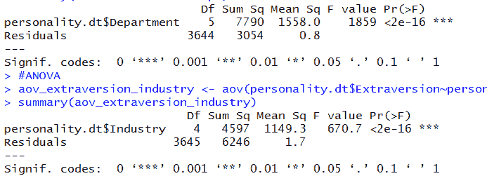

*图 2.1.2:各行业外向性得分的方差分析结果*

从图 2.1.1 和 2.1.2 所示的 ANOVA 结果中，我们可以看到跨部门和跨行业的外向性得分的 p 值都小于 0.05，具有统计学意义。这意味着我们拒绝零假设，并得出结论，不同部门或不同行业之间的平均外向性得分不同。

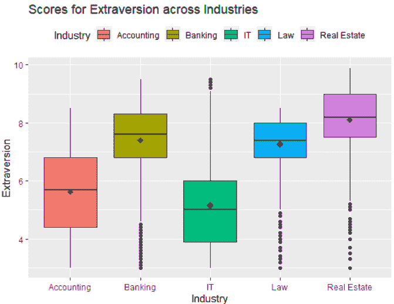

*图 2.2.1:各行业外向性得分箱线图*

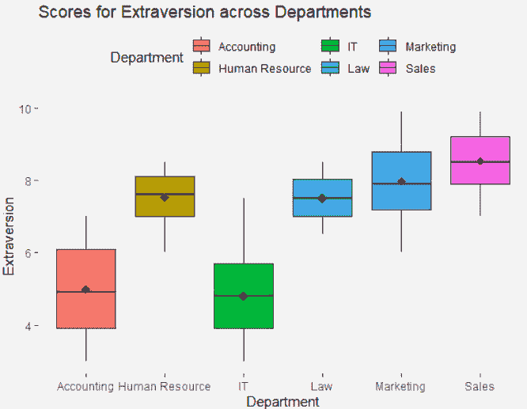

*图 2.2.2:跨部门外向性得分箱线图*

此外，我们为了可视化的目的绘制了一个箱线图。从图 2.2.1 和图 2.2.2 可以看出，数据集的外向性得分在不同行业和部门之间存在显著差异。例如，在图 2.2.1 中，用红点表示的房地产的平均外向性得分明显高于其他行业，尤其是会计和 IT 行业。这可能是因为在房地产行业，员工将不得不更多地互动和社交，因此拥有高外向性得分将允许他们从周围的人那里获得能量，从而更有效地运作。这与会计和 IT 行业形成对比，在这两个行业中，员工与同行业其他人员之间的互动并不常见，因此外向性得分非常高的员工没有多少附加值。同图方差小，也可以解释为，同行业工作的人，大部分都有非常相似的外向性得分。附录 2B 还显示了所有行业和部门的其他性格特征的图表。

# 2.1.2 部门还是行业更有意义？

比较图 2.2.1 和图 2.2.2，可以看出每个部门内的外向性得分显示出比每个行业内更低的方差和更少的离群值。我们的方差分析结果可以进一步支持这一观点，如图 2.1.1 和图 2.1.2 所示，结果显示跨部门的 f 值(1859)显著高于跨行业的 f 值(670.7)。由于 f 值揭示了组内方差的均值与组内方差的均值之比，因此可以得出结论，部门间方差与每个部门方差之比低于行业间方差与每个行业方差之比。

这暗示着，在某个部门内部雇佣性格特征相似的员工，比在某个行业内部更重要，更准确。这样的观察是因为一个行业中的员工可以在不同的部门工作，不同的部门会决定他们的工作范围，因此需要一定的性格特征。行业并不是具有某些特质的员工的决定因素。因此，部门性格特征应该优先于基于行业的特征，尽管后者仍然很重要。

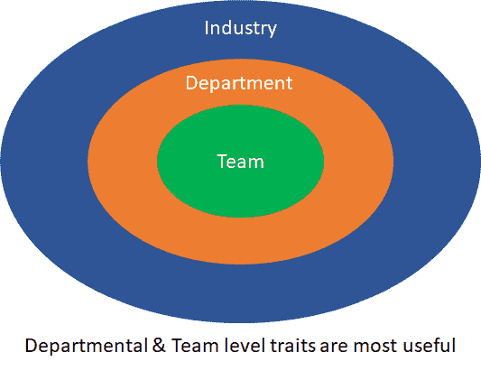

*图 2.3:行业、部门和团队的关系*

不要忘记，员工与其同事和主管的个性匹配同样重要，因为员工主要与上述人员互动。只有当这些方之间建立了良好的关系，运营效率才会最大化，因为关系满意度会很高。

# 2.2 方法

为了确保雇佣的人适合这个部门，我们必须首先能够确定申请人的性格类型。一种选择是让每个申请人都通过标准化的 MBTI 测试。然而，这可能是非常耗时和昂贵的，并且可能不适合所有的公司。此外，申请人可能会“玩弄”这些性格测试，以适应他们申请的角色，从而增加他们被雇用的机会。我们的目标是在不增加招聘流程复杂性的情况下，使用容易获得的文本数据(如求职信)来评估候选人的个性。

通过文本分析，我们将能够通过申请人申请工作时提交的求职信来确定他们的性格类型。这可作为确定它们是否适合特定部门的指南。

作为改进，我们可以使用相同的方法来分析用户的社交网络以获得更高的准确性，因为它是文本数据的不太正式的形式，并且申请人“玩弄”系统的能力也较低。我们将使用下面求职信中的文本数据。

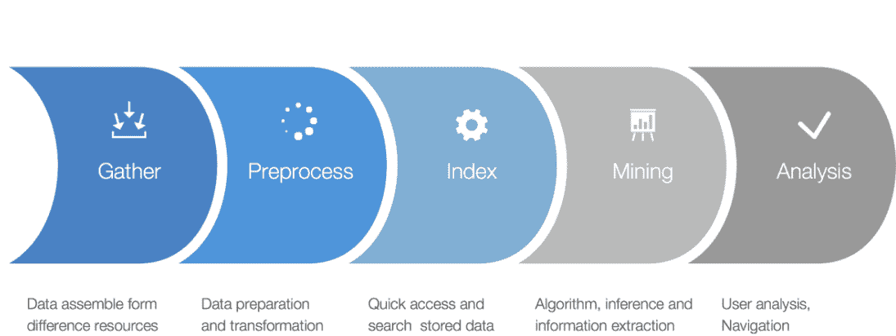

*图 2.4:文本分析步骤*

我们将把 MBTI 分为四个维度，并开发一个与它们相对应的心理词汇。该词典用于检测求职信中与维度相关的单词的用法。

为了开发完整的心理词汇，必须对不同性格类型的人使用的词汇类型进行深入的心理学研究。为了简化我们的模型，我们将使用由申请人用来描述自己的简单描述性词语组成的心理词汇(例如，具有高度外向性的人使用“善于交际”来描述自己)。

当这些词在求职信中被发现时，术语频率的总和将被分配到我们的心理词典所规定的各个维度。使用列表分数，我们将能够确定申请人在 MBTI 的不同维度上是高还是低。

使用 1.3.1 中的相同对数函数来减少随函中关键字的重复使用，以准确反映术语每次出现的值。

# 2.2.1 文本分析结果

我们对 5 份不同的简历样本进行了文本分析，以找出申请人的不同性格类型。

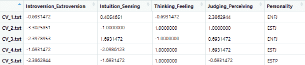

*图 2.5 文本分析结果*

使用我们的模型，需要注意以下几点:

如果值为正，则表示各自列中的“内向(I)”、“直觉(N)”、“思考(T)”和“判断(J)”。

如果值为负，则在各自的列中表示“外向(E)”、“感知(S)”、“感觉(F)”和“感知(P)”。

根据上表中的结果，我们可以从 5 位不同申请者的简历中推断出他们的 MBTI 性格类型。据观察，CV_1 申请者的人格类型是 ENFJ，CV_2 是 ESTJ，CV_3 是 ENFJ，CV_4 是 ESTJ，CV_5 是 ESTP。使用这些 MBTI，招聘经理和人力资源人员可以使用它作为指导，以帮助他们的招聘过程。

例如，一个销售部门寻找具有 ESTJ 性格类型的申请人，因为他们认为他们需要一个直言不讳、对人有良好感觉、能够批判性思考并对事物有良好判断力的人来成为一名成功的销售人员。这种情况下，CV_2 和 CV_4 会更合适。

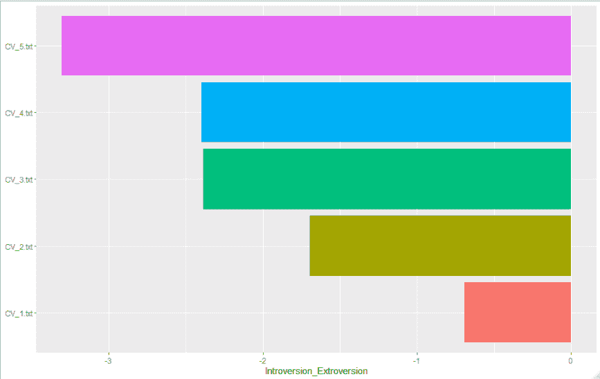

*图 2.6:内向和外向的结果*

接下来，销售部门可以进一步研究他们认为更重要的特征。他们可能会选择外向，因为销售人员需要全天会见许多客户，与客户建立融洽关系的能力至关重要。因此，他们可能会调查这两个简历的外向性得分。从上面的结果中，我们可以观察到使用 CV_4 的申请人具有最高的外向性得分，他的个性符合该部门的要求。

# 2.3 限制

然而，我们承认很难量化人格特质，更不用说对它们进行排名了，尤其是如果输入数据和使用的词汇不够强大和广泛的话。衍生的人格类型应该作为指南而不是分数。因此，我们建议使用社交网络数据，并为此开发一个广泛的词典。同样，这也可以进一步扩展到大五人格模型。

# 2.3.1.推荐

这个庞大的词汇应该考虑到变价词，即改变或强化极化词含义的词(开放数据科学，2018)。这包括否定词，如“不”。简单地将单词与心理词典进行匹配来计算个性过于简单化，因为它可能会删除或改变文本数据中的基本信息。

使用我们的文本挖掘模型，如果发现“不善于交际”，原始模型会将“善于交际”标记为外向性的积极术语。然而，随着变价词的出现，我们知道这个词的意思已经改变了，这个词应该被标记为一个否定词。心理词典可以被开发成包括“句子级”文本分析，因为当考虑到变价物的存在时，它将给出单词含义的更好表示。

# 2.4 结论

使用上述方法，我们能够使用容易获得的文本数据找到候选人的人格类型。然后，人力资源部可以通过查看申请人的特质来确保所选的申请人符合部门的要求，从而确保选择最合适的申请人。

# 3.保持

# 3.1 问题

雇佣新员工时，雇主可能会考虑的一个因素是他们留在公司的可能性。因此，我们报告的这一部分将重点关注员工的流失率。

自然减员指的是通过辞职和退休自愿减少雇员，并且没有人接替。对于一个高流失率的公司来说，有很多负面影响。首先，由于生产力的损失以及雇佣和培训费用的增加，这将对公司的盈利能力产生直接影响。高流失率还可能导致工作场所士气低落，因为现有员工可能会过度劳累，而新员工适应公司的难度会增加。这将导致员工生产率和公司收入下降(Markovich，2019)。因此，为了减少雇佣和培训费用的增加，以及减轻收入损失，雇佣自然减员可能性低的员工是很重要的。

减少员工流失有两大方法:留住现有员工和雇佣流失率较低的员工。第二种方法将在本分析中重点介绍。我们的目标是找到与自然减员相关的重要因素，并利用这些因素从申请人的简历中筛选出自然减员概率高的潜在员工。

# 3.2 数据探索和清理

这个分析使用了 IBM HR 数据集。数据集由 37 列 23532 行组成。由于存在大量变量，只有一个变量的列(如 Over18、StandardHours 和 EmployeeCount)将被删除。

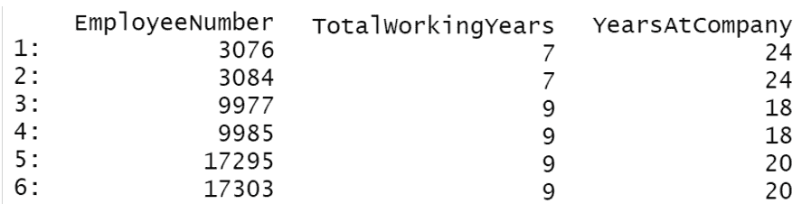

*图 3.1 公司总工作年限<年*

发现 6 个数据点中，员工的总工作年数少于他在公司的年数。有可能是不真实的，因为总工作年数应该大于或等于在公司的年数。由于很难准确预测哪个值是正确的，这 6 个数据点将被丢弃。

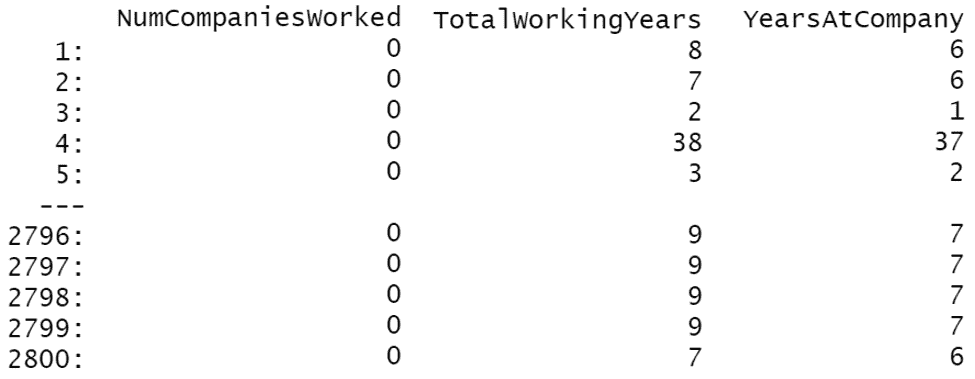

*图 3.2 在公司总工作年数>年但 NumCompaniesWorked = 0*

2800 名员工被发现工作年数比在公司的年数多，尽管他们是在第一家公司(NumCompaniesWorked = 0)。这些很可能是不真实的，因为如果是员工的第一家公司，总工作年限和在该公司的工作年限应该是相同的。由于很难准确预测哪个值是正确的，所有这些数据点都将被丢弃。

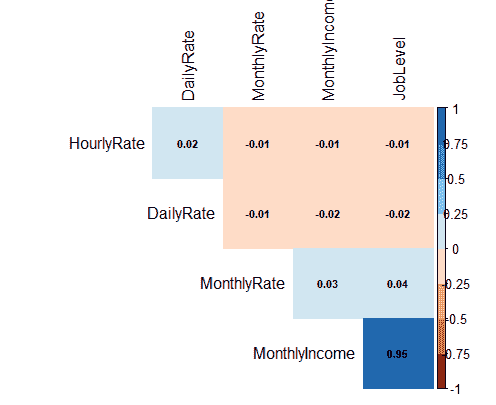

*图 3.3 薪资和职务级别相关数据的相关值*

有 4 列与工人的工资相关:小时工资率、日工资率、月工资率和月收入。然而，它们彼此具有极低的相关值，这似乎是不合逻辑的。因此，由于 MonthlyIncome 与 JobLevel 的相关性最高，MonthlyIncome 将被保留，而其他 3 列将被删除。

最终清理的数据集由 20，683 行和 31 列组成。

# 3.3 方法概述

这种分析的最终结果是损耗。自然减员分为两类——当前员工和自愿辞职的员工。图 3.4 总结了我们的分析方法。

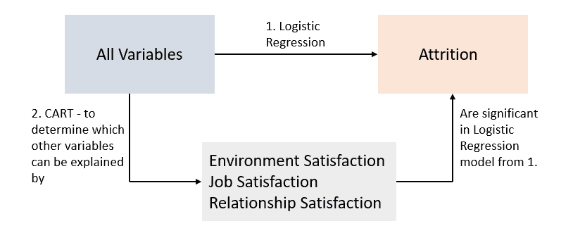

*图 3.4 分析方法概述*

首先，我们使用一个逻辑回归模型，以流失为输出，来确定预测流失的变量。在对产生的显著变量进行简要分析后，我们发现环境满意度、工作满意度和关系满意度是中间输出，可以解释其他一些变量。因此，我们使用分类和回归树(CART)来找出哪些变量在确定 3 个满意度测量中的每一个中是重要的。然后引入专家意见和领域知识来进一步探索重要变量。

# 3.4 逻辑回归结果

我们进行了逻辑回归分析，以了解哪些变量在预测减员方面具有重要意义。在排除非显著变量后，对模型进行了修正。调整后的逻辑回归模型的结果如下图 3.5 所示。

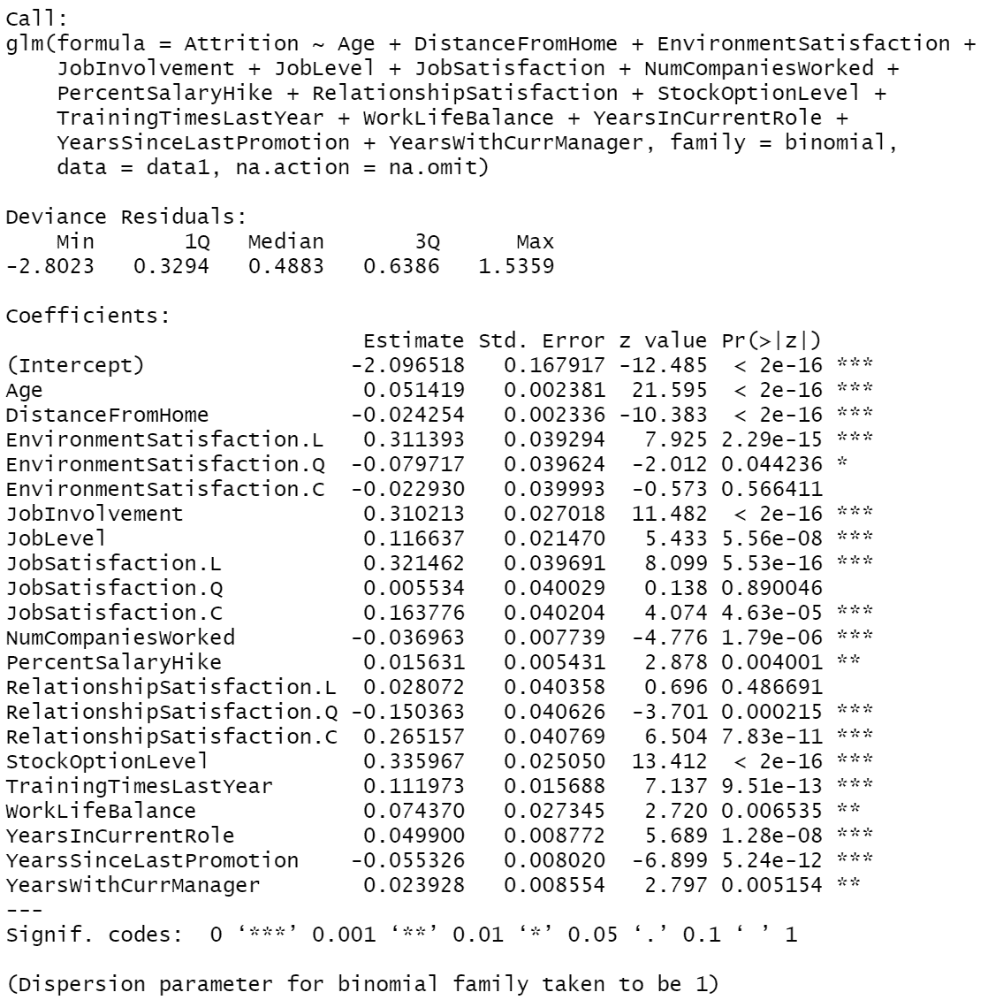

*图 3.5 Logistic 回归结果*

从结果来看，有 15 个变量具有统计显著性，p 值小于 0.05。

员工流失的一个可能原因是对公司的不满。根据 Statista 2019 年的数据，美国员工辞职的首要原因之一是对当前组织的不满(米勒托维奇，2019)。例如，如果员工对自己的工作环境不满意，他很可能会主动辞职。员工满意度主要有 3 个方面:工作满意度、环境满意度和关系满意度(Johnson，2017)。

如理论所述，环境满意度、工作满意度和关系满意度具有高度的统计学意义，p 值小于 0.001。这 3 个变量是中间输出变量，因为其他一些变量可以用这 3 个满意度来解释。例如，离家的距离可能是决定环境满意度的一个重要因素。因此，将进行进一步的分析，以确定哪些变量可以用这 3 种满意度来解释。

# 3.5 购物车结果

使用 CART 模型分析变量在预测环境满意度、工作满意度和关系满意度方面的显著性。

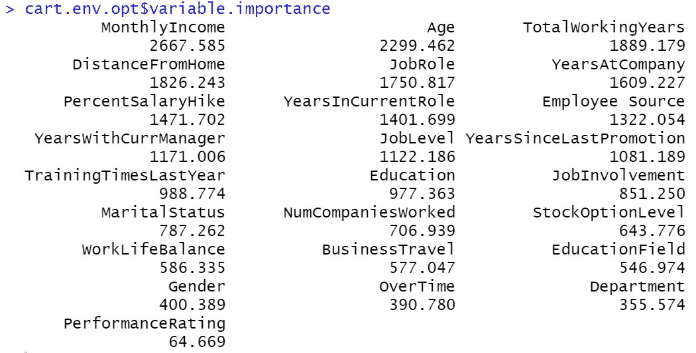

*图 3.6 环境满意度购物车结果*

环境满意度的 CART 模型得出的总体准确率为 0.845。图 3.6 显示了预测环境满意度的可变重要性的结果。

*图 3.7 工作满意度购物车结果*

工作满意度的 CART 模型得出的总体准确率为 0.959。图 3.7 显示了预测工作满意度的可变重要性的结果。

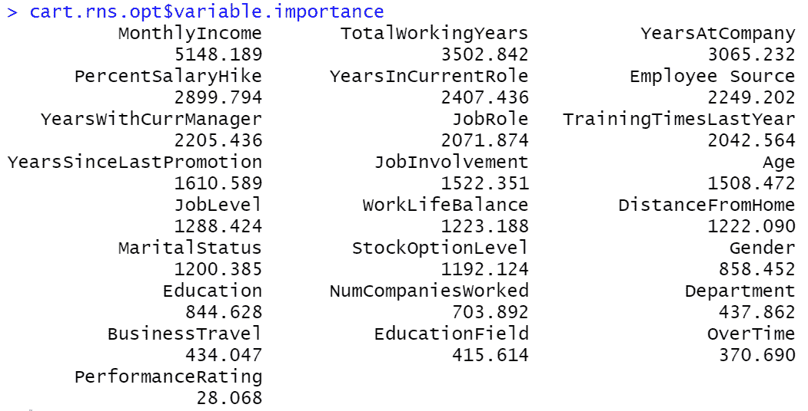

*图 3.8 关系满意度购物车结果*

关系满意度的 CART 模型产生了 0.966 的总体准确率。图 3.8 显示了预测关系满意度的可变重要性的结果。

# 3.6 重要因素分析

下表总结了各种变量及其在预测员工流失和员工满意度重要性方面的重要性。只有在 CART 模型中确定的前 10 个重要变量被认为是重要的。由于存在大量变量，因此仅显示了对预测损耗有意义的变量。

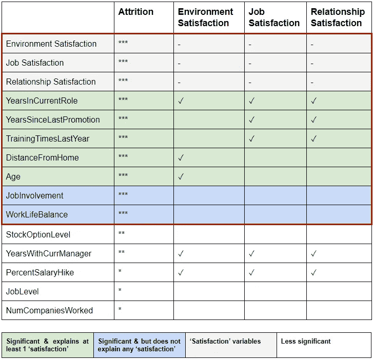

有多个变量对预测流失很重要，但也可以用环境满意度、工作满意度和关系满意度来解释。每一个满意度测量，以及在预测减员更重要，但没有任何满意度测量解释的变量，将进一步探讨。(红色边框区域)

*   环境满意度

环境满意度是指员工对其物理工作环境的满意程度。根据我们的结果，它是由年龄、离家的距离、喜欢的百分比、年数和年数决定的。还有其他变量，如办公室美学，可能很重要，但不包括在数据集中，因此不会进一步讨论。由于变量很多，只有年龄和离家的距离将进一步探讨，因为这两个变量在申请人的简历中更相关。

不同年龄的上班族对工作环境有不同的偏好。老一辈的人更倾向于优先考虑建筑中的可持续性特征和联网可能性，而年轻一代则更喜欢支持团队工作、社交互动和创新的工作环境(Rothe 等人，未注明)。因此，根据公司的工作环境，最适合公司的年龄范围会因公司而异。然而，雇主不应该优先考虑按年龄筛选员工，以防止工作场所的年龄歧视。

对大多数人来说，浪费在上下班路上的时间是可以避免的。然而，长时间的通勤与缺勤和迟到的增加有关，也与对工作的怨恨增加有关，并且无法达到与那些住在工作场所附近的人相同的标准(Durhan，2019)。英国的研究人员发现，每天上下班额外 20 分钟的通勤时间与减薪 19%具有相同的负面影响(Loudenback，2017)。因此，毫不奇怪，离家的距离和环境满意度之间有很大的关系。因此，通勤时间越长，员工流失的可能性就越大。

因此，雇主在求职者身上寻找的一个可能因素是离家更近。然而，需要注意的是，这个问题还有其他解决方案，比如让工作时间更加灵活，因为按照员工离家的距离来排列员工可能不切实际，对公司也没有好处。此外，在新加坡这样一个拥有完善、高效公共交通系统的小国，雇员之间通勤时间的差异可能并不显著。

*   工作满意度和关系满意度

工作满意度通常衡量员工对工作各个方面的满意程度，如工作的性质或范围。关系满意度衡量员工与同事和主管的关系。根据我们的结果，PercentSalaryHike、TrainingTimesLastYear、YearsInCurrentRole、YearsSinceLastPromotion 和 YearsWithCurrManager 是决定工作满意度和关系满意度的重要变量。也有其他变量没有包括在数据集中，但可能是重要的和有意义的，但不会进一步讨论。然而，这些变量中的大部分在雇用新员工时都是不相关的，因此不会进一步探讨。相反，公司可以利用这些变量来提高当前员工的工作和关系满意度，以提高当前员工的保留率。只有 YearsInCurrentRole 可能与简历有关。

担任当前职位的年限是一个变量，在确定所有 3 个满意度指标时非常重要。一个在当前职位上工作了很长一段时间的员工表明，他更有可能对当前的职位感到满意。因此，雇主可以筛选申请与他们以前工作相同职位的申请人，以了解他们在特定职位上的工作年限。工作年限较长的申请人可能会有较高的员工满意度，因此自然减员的可能性较低，因此雇主可以考虑优先考虑这些申请人。

*   工作投入和工作生活平衡

工作投入是指一个人在心理和情感上参与到工作中的程度。工作生活平衡描述了一个人在工作和生活其他方面的平衡。这两个变量的结果偏离了我们的预期结果。这两个变量在决定工作满意度时被认为是重要的，但是我们的发现并不支持这一点。可以使用其他数据来源来进一步分析这种关系。尽管如此，它们在预测减员方面仍然很重要。然而，由于这些因素在简历中并不相关，公司可以利用它们来提高现有员工的保留率。

# 3.7 结论

雇主可以利用上面讨论的变量，根据员工流失的可能性对候选人进行排名。通过这些措施，可以降低公司的整体流失率，从而减少用于招聘和培训新员工的资源浪费，提高公司的整体盈利能力。

还有许多其他变量可能有助于雇主筛选出高流失率的申请人，这些变量没有包括在该数据集中，因此没有进行分析。可以进一步研究和评估这些外部因素在预测人员流失方面的重要性及其作为雇主筛选机制的实用性。

对这种分析的一种可能的改进是按部门划分数据集，并对每个部门分别进行分析，以便考虑不同部门之间可能出现的社会和文化差异。

减少员工流失的另一种方法是提高现有员工的留任率。上面提到的一些变量在预测自然减员方面很重要，但很难用来筛选申请人。相反，公司可以考虑利用这些因素来提高现有员工的保留率。可以对这些策略做进一步的分析和研究。通过实施这两种方法来提高现有员工的保留率和雇用流失率较低的新员工，公司更有可能看到员工流失率的大幅下降。

# 参考

Bertrand 和 s . Mullainathan(2003 年)。艾米丽和格雷格比拉基莎更适合工作吗

贾马尔呢。劳动力市场歧视的现场实验。doi: 10.3386/w9873

k . bouton(2015 年)。为文化契合而招聘。检索自

[https://hbr.org/2015/07/recruiting-for-cultural-fit](https://hbr.org/2015/07/recruiting-for-cultural-fit)

钱德拉塞卡兰，S. (2018 年 1 月 14 日)。成为数据科学家—课程通过

都市地图。检索自

[http://nirvacana . com/thinks/2013/07/08/成为一名数据科学家/](http://nirvacana.com/thoughts/2013/07/08/becoming-a-data-scientist/) 。

DataFlair 团队。(2019 年 5 月 23 日)。2019 年最常用的 14 种数据科学工具-基本数据

科学成分。检索自

[https://data-flair.training/blogs/data-science-tools/](https://data-flair.training/blogs/data-science-tools/)

达勒姆，J. (2019，7 月 19 日)。上班通勤时间长的影响。检索于 11 月 6 日，

2019，来自[http://www . safe workers . co . uk/effectsoflongcommutestwork . html](http://www.safeworkers.co.uk/effectsoflongcommutestowork.html)。

埃迪 J. (2014)。Google 一天收到多少份简历？检索自

【http://eddiejackson.net/wp/? p = 2044 fqjcneir 3 wtgziryf 3 TD 7 vy 9-pIyvE-ig

高斯林，S. D .，伦特弗鲁，P. J .，，小斯旺，W. B. (2003)。一个非常简单的测量

大五人格领域。《人格研究杂志》， *37* (6)，504–528。

r .约翰逊(2017 年 11 月 21 日)。员工满意度是由什么构成的？恢复

2019 年 11 月 6 日，来自

[https://small business . chron . com/up-employee-satisfaction-22231 . html](https://smallbusiness.chron.com/up-employee-satisfaction-22231.html)。

约拿(2018 年 5 月 11 日)。数学帮助-对数定律。检索自

[https://www.superprof.com.au/blog/rules-of-logarithms/](https://www.superprof.com.au/blog/rules-of-logarithms/)

t . louden back(2017 年 10 月 23 日)。研究:上下班路上多花 20 分钟会让你

就像减薪 19%一样痛苦。检索自

[https://www . Inc . com/business-insider/study-reveals-commune-time-impacts-job-satisf](https://www.inc.com/business-insider/study-reveals-commute-time-impacts-job-satisfaction.html)

[action.html](https://www.inc.com/business-insider/study-reveals-commute-time-impacts-job-satisfaction.html)

马尔科维奇，M. (2019 年 2 月 4 日)。高离职率的负面影响。恢复

2019 年 11 月 6 日，来自

[https://small business . chron . com/negative-impacts-high-over-rate-20269 . html](https://smallbusiness.chron.com/negative-impacts-high-turnover-rate-20269.html)。

m .米勒托维奇(2019 年 9 月 9 日)。40 工作满意度统计:快乐的价值

工人。2019 年 11 月 6 日检索，来自

https://www . small biz genius . net/by-the-numbers/job-satisfaction-statistics/。

开放数据科学。(2018 年 11 月 2 日)。句子级情感导论

用 sentimentr 分析。检索自

[https://medium . com/@ ODSC/an-introduction-to-sentence-level-analysis-wi](https://medium.com/@ODSC/an-introduction-to-sentence-level-sentiment-analysis-with-sentimentr-ac556bd7f75a)

[th-sentiment r-AC 556 BD 7 f 75 a](https://medium.com/@ODSC/an-introduction-to-sentence-level-sentiment-analysis-with-sentimentr-ac556bd7f75a)

Rothe，p .，Lindholm，A.-L .，Hyvö nen，a .，& Nenonen，s .(未注明)。工作场所偏好–

年龄有影响吗？检索自

【http://www.irbnet.de/daten/iconda/CIB21523.pdf 

# 附录

# 附录 1A

每个清理阶段数据集的样本大小

**在**之前

**在**之后

**删除停止字**

数据科学家

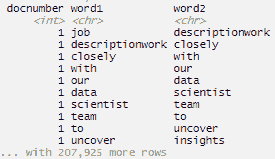

数据分析师

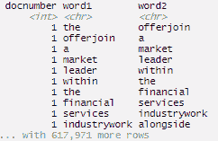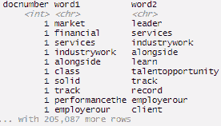

数据工程师

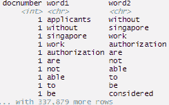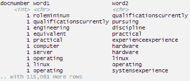

**移除频率 1 令牌**

数据科学家

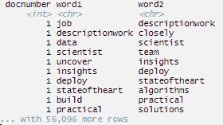

数据分析师

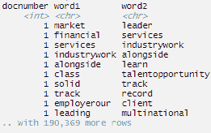

数据工程师

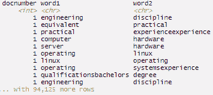

**删除未正确处理的单词**

数据科学家

数据分析师

数据工程师

**通过单词词条清理**

数据科学家

数据分析师

数据工程师

# 附录 1B

**每个工作角色使用的前 10 个二元模型**

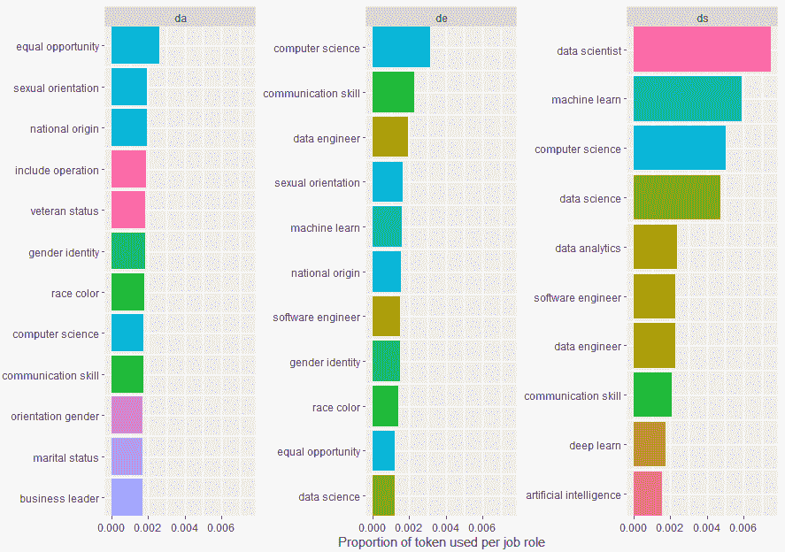

**文字云(DS)**

**Wordcloud (DA)**

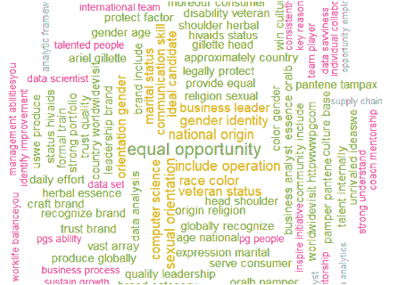

**Wordcloud(德)**

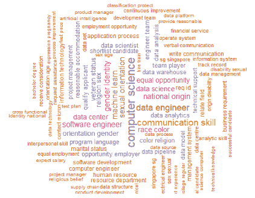

# 附录 1C

用图网络分析符号间的关系。例如，我们知道以单词“data”开头的二元结构非常常见，因为它与其他连接单词有许多关系，如“data science”和“data analyst”。

**图网络关系(DS)**

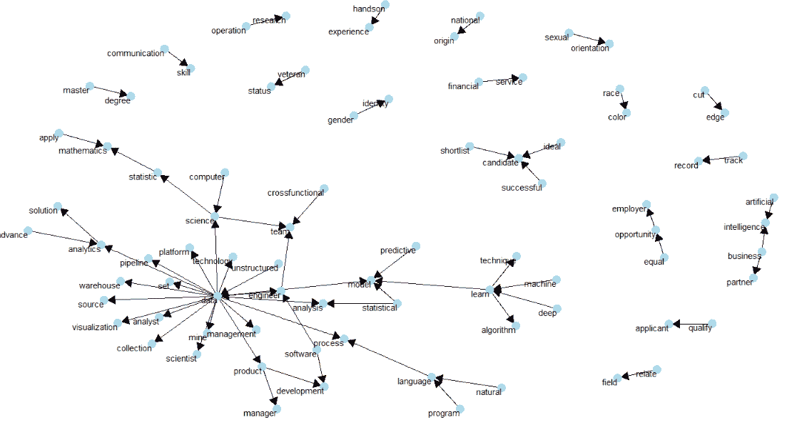

**“数据”一词关系的放大网络(DS)**

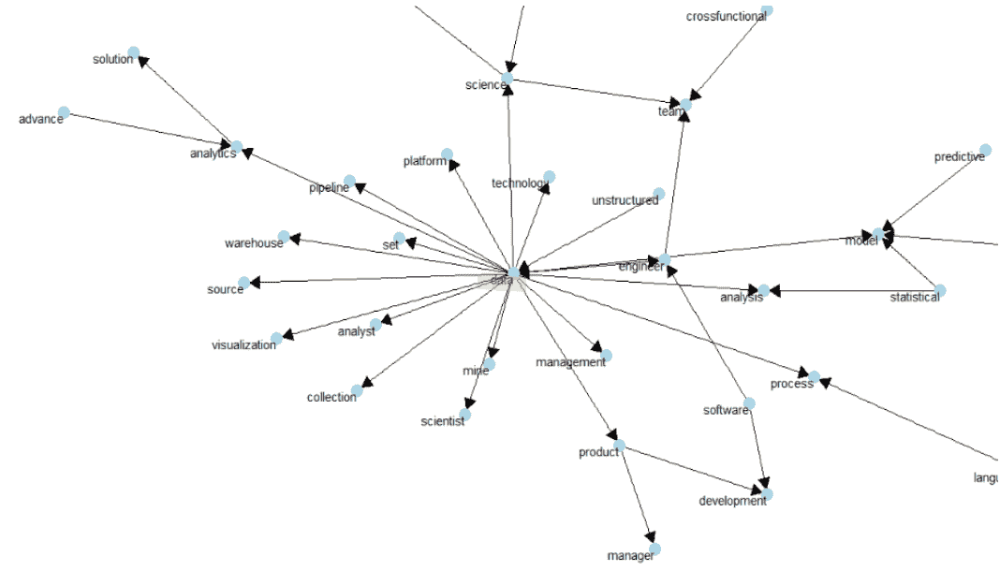

**网络关系图(DA)**

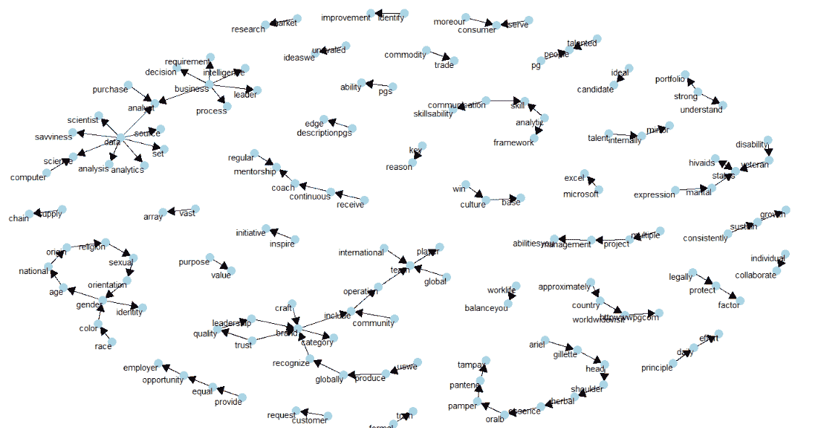

**网络关系图(德)**

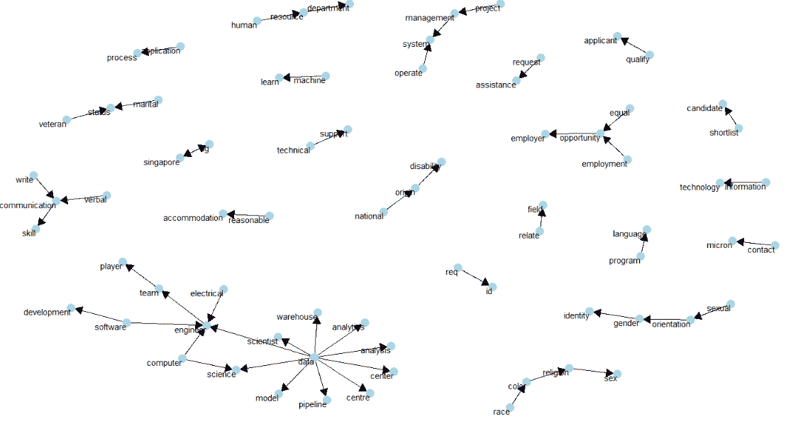

# 附录 1D

主题建模也可以用模型来执行，例如潜在狄利克雷分配(LDA)模型是主题建模的一个例子。例如，单个文档可能有多个主题，这些主题可以被分类为“与猫相关”和“与狗相关”。LDA 识别固有的、不同的主题，并将单词分类到不同的类别中。在我们的例子中，我们将 DS、DA、DE 数据集合并在一起，并应用 LDA。我们的结果与我们的比例分析的结果相似，因为 LDA 模型已经识别出技术术语或不太有用的人口统计变量的不同主题。

**3 个数据集的 LDA 模型**

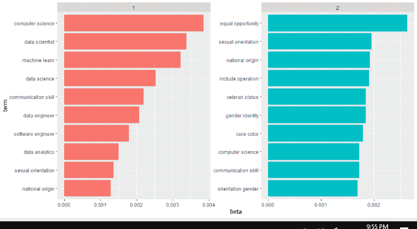

# 附录 1E

还可以对文本等非结构化数据执行聚类，以识别固有的主题或类别。在我们的例子中，尽管去除了稀疏项，但由于数据集中的大量标记，层次聚类树图是不可理解的。但是，通过使用“dendextend”包的“get_subdendrogram”函数，我们可以探索和构思这些子树状图。类似地，我们可以看到人口统计学术语，如“平等机会”、“种族肤色”，以及技术术语，如“数据科学家”、“机器学习”，被分组为不同的簇。

**3 个数据集的子树状图矩阵**

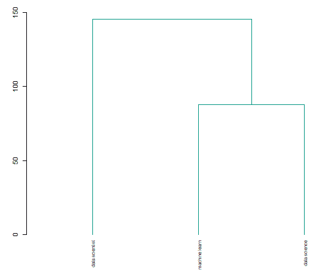

**子树状图 1**

**子树状图 2**

“技术术语”

“人口统计学术语”

# 附录 1F

**十大编程语言(DS、DA、DE)**

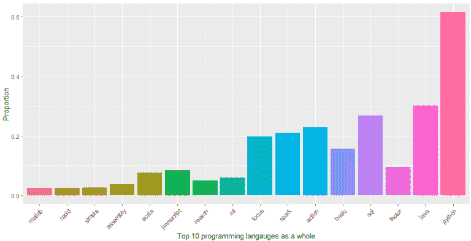

**十大编程语言(DS)**

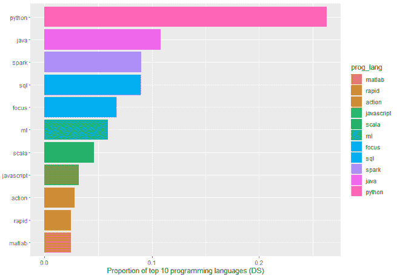

**十大编程语言(DA)**

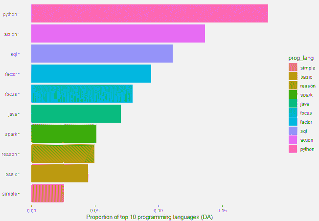

**十大编程语言(德)**

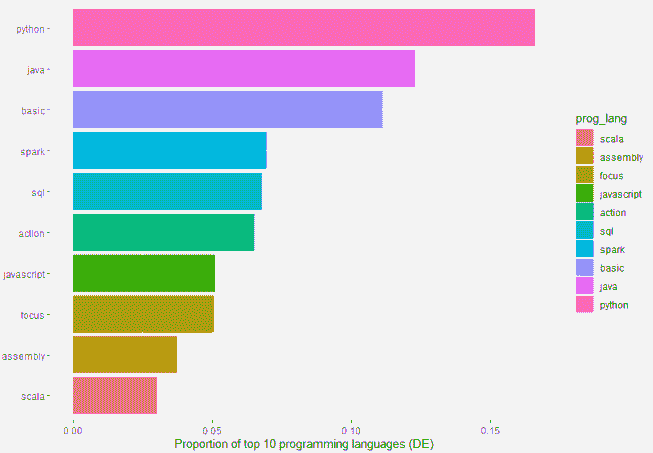

**十大编程语言(DS、DA、DE)**

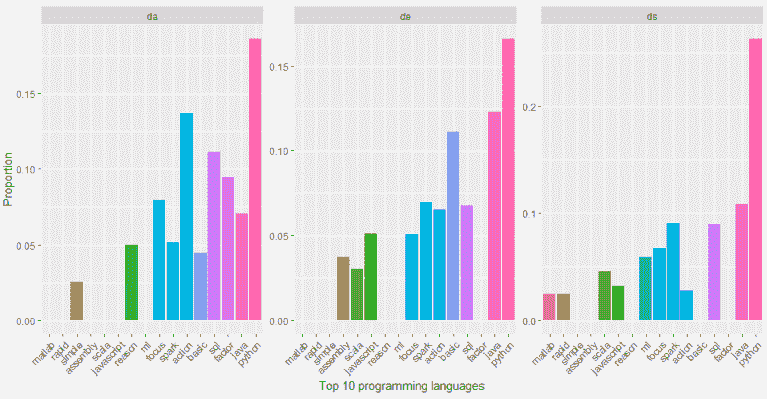

**所有编程语言(DS、DA、DE)的文档术语矩阵**

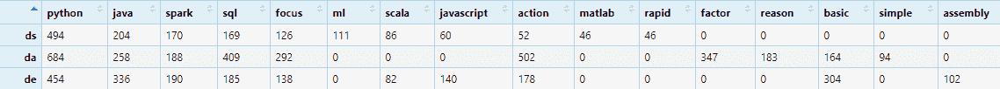

# 附录 1G

**十大数据科学工具(DS、DA、DE)**

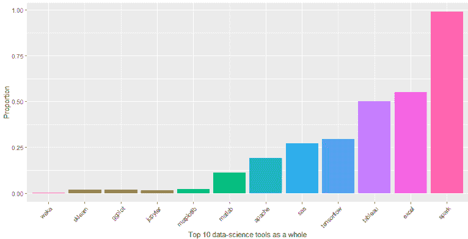

**十大数据科学工具**

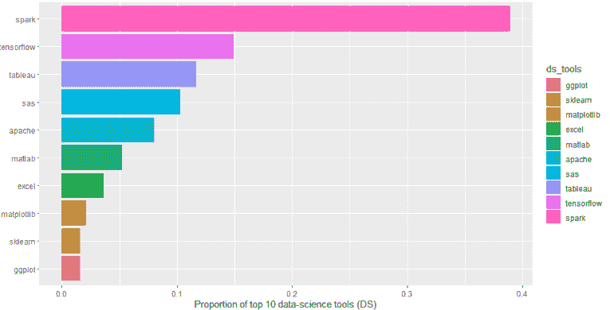

**十大数据科学工具(DA)**

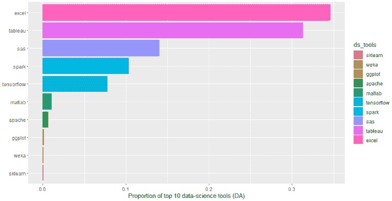

**十大数据科学工具(DE)**

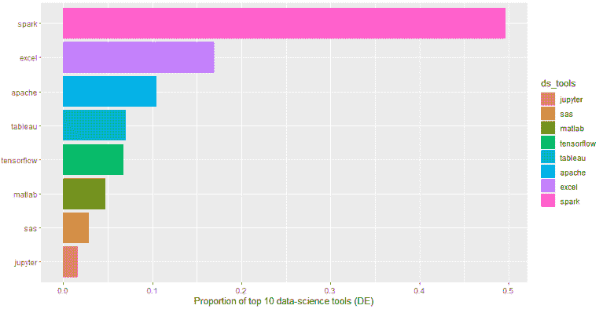

**十大数据科学工具(DS、DA、DE)**

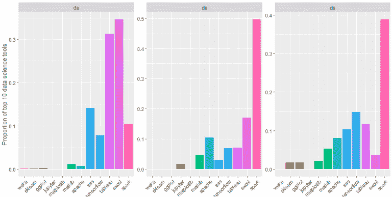

**所有数据科学工具(DS、DA、DE)的文档术语矩阵**

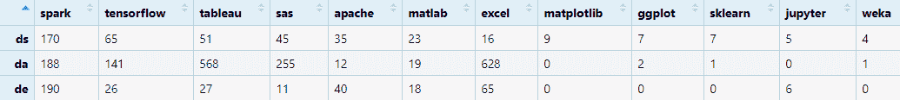

# 附录 1H

**技术技能(DS，DA，DE)**

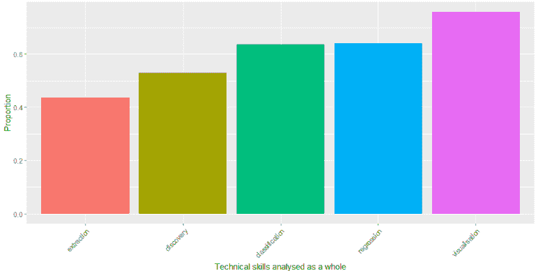

**技术技能(DS)**

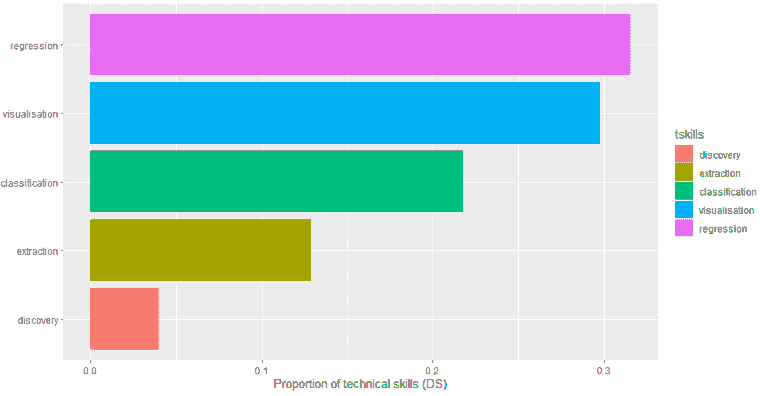

**技术技能(DA)**


**技术技能(德)**


**技术技能(DS，DA，DE)**


**文档-术语-技术技能矩阵(DS，DA，DE)**


# 附录 1I

**软技能(DS，DA，DE)**


**软技能(DS)**


**软技能(DA)**

**软技能(德)**

**软技能(DS，DA，DE)**


**文档-术语-软技能矩阵(DS，DA，DE)**


# 附录 1J

**程序设计语言的文档-术语-矩阵(DS)**


**编程语言 DTM 的对数函数(DS)**


**重新计算提及的编程语言(DS)的比例**

由于全部预定义列表中只有 8 种编程语言与数据科学家数据集相关，我们应该重新计算“总数”及其各自的“比例”,以便进行分析。


重新计算前

重新计算后

**程序设计语言 DTM 加权评分(DS)**


**基于编程语言(DS)的每个候选人的总得分**

# 附录 1K

**数据科学工具的文档术语矩阵(DS)**


**用于数据科学工具(DS)的 DTM 对数函数**


**重新计算提及的数据科学工具(DS)的比例**

由于整体预定义列表中只有 11 种数据科学工具与数据科学家数据集相关，因此我们应该重新计算“总数”及其各自在该分析中的“比例”。


重新计算前

重新计算后

**数据科学工具(DS)DTM 加权评分**


**基于数据科学工具(DS)的每位候选人的总得分**


# 附录 1L

**文档-术语-技术技能矩阵(DS)**


**技术技能(DS)的 DTM 对数函数**

**提及技能的比例(DS)**


**DTM 技术技能加权评分(DS)**


**每个候选人基于技术技能的总得分(DS)**


# 附录 1M

**文档-术语-软技能矩阵(DS)**


**DTM 对数函数对于软技能(DS)**


**重新计算提及的软技能的比例**

由于整个预定义列表中只有 4 项软技能与数据科学家数据集相关，因此我们应该重新计算“总数”及其各自的“比例”,以便进行分析。


重新计算前

重新计算后

**软技能 DTM 加权评分(DS)**


**每位候选人基于软技能(DS)的总得分**


# 附录 1N

**程序设计语言的文档-术语-矩阵(DA)**


**用于编程语言的 DTM 对数函数(DA)**


**重新计算提及的编程语言的比例(DA)**

由于全部预定义列表中只有 8 种编程语言与 Data Analyst 数据集相关，我们应该重新计算“总数”及其各自的“比例”,以便进行分析。


重新计算前

重新计算后

**程序设计语言 DTM 的加权评分(DA)**


**基于编程语言(DA)的每个候选人的总得分**

# 附录 1O

**数据科学工具的文档-术语-矩阵(DA)**


**用于数据科学工具的 DTM 对数函数(DA)**


**重新计算提及的数据科学工具(DA)的比例**

由于整体预定义列表中只有 4 种数据科学工具与 Data Analyst 数据集相关，因此我们应该重新计算该分析的“总数”及其各自的“比例”。


重新计算前

重新计算后

**DTM 数据科学工具加权评分(DA)**


**基于数据科学工具(DA)的每位候选人的总得分**


# 附录 1P

**文档-术语-技能矩阵(DA)**


**技术技能 DTM 对数函数(DA)**


**重新计算提及的技能比例(DA)**

由于整体预定义列表中只有 3 项技术技能与数据分析师数据集相关，我们应该重新计算“总数”及其各自的“比例”,以便进行分析。


重新计算前

重新计算后

**DTM 技术技能加权评分(DA)**

**每个候选人基于技术技能的总得分(DA)**


# 附录 1Q

**文档-术语-软技能矩阵(DA)**

**DTM 对软技能的对数函数(DA)**


**重新计算提及的软技能的比例(DA)**


重新计算前

重新计算后

**软技能 DTM 加权评分(DA)**


**每位候选人基于软技能的总得分(DA)**


# 附录 1R

**程序设计语言的文档-术语-矩阵(DE)**


**DTM 编程语言的对数函数(德)**


**重新计算提及的编程语言的比例(DE)**

由于全部预定义列表中只有 9 种编程语言与数据工程师数据集相关，因此我们应该重新计算“总数”及其各自的“比例”,以便进行分析。


重新计算前

重新计算后

**编程语言 DTM 加权评分(DE)**


**基于编程语言的每个候选人的总得分(DE)**


# 附录 1S

**数据科学工具的文档术语矩阵**


**用于数据科学工具的 DTM 对数函数**

**提及数据科学工具的比例**


**数据科学工具 DTM 加权评分(DE)**


**基于数据科学工具(DE)的每位候选人的总得分**


# 附录 1T

**文档-术语-技能矩阵(德)**


**技术技能 DTM 对数函数(德)**


**重新计算提及的技能比例(DE)**


**重新计算前**

**重新计算后**

**DTM 技术技能加权评分(DE)**


**每个候选人基于技能的总得分(DE)**


# 附录 1U

**文档-术语-软技能矩阵(德)**


**DTM 对数函数为软技能(德)**


**重新计算提及的软技能(DE)的比例**


重新计算前

重新计算后

**软技能 DTM 加权评分(DE)**


**每个候选人基于软技能的总得分(DE)**


# 附录 1V

假设每个类别的权重相等，我们相应地计算每个候选人的总计。但是，这可以通过部门负责人的意见进行更改，以更好地适应公司的需求。

**DS 简历综合排名**


**大简历综合排名**


**德简历综合排名**


# 附录 2A

**跨部门尽责性得分方差分析结果**

**各行业尽责性得分方差分析结果**


**跨部门宜人性得分的方差分析结果**

**各行业宜人性得分的方差分析结果**


**跨部门公开性得分的方差分析结果**


**各行业开放度得分的方差分析结果**

**跨部门神经质得分的方差分析结果**

**各行业神经质得分的方差分析结果**


# 附录 2B

**各行业责任心得分箱线图**


**各部门责任心得分箱线图**


**各行业宜人性得分方框图**


**各部门宜人性得分方框图**


**各行业开放度得分箱线图**


**跨部门公开得分方框图**


**各行业神经质得分的箱线图**


**跨部门神经质得分箱线图**


希望你喜欢这篇文章:-)我欢迎任何反馈，你可以在 LinkedIn 上找到我。