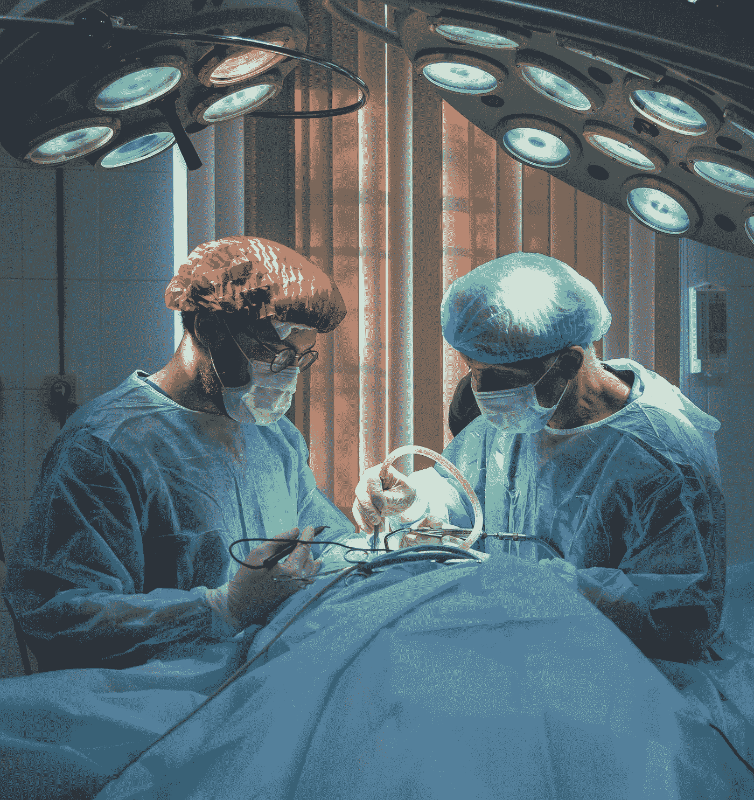
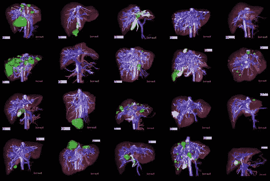
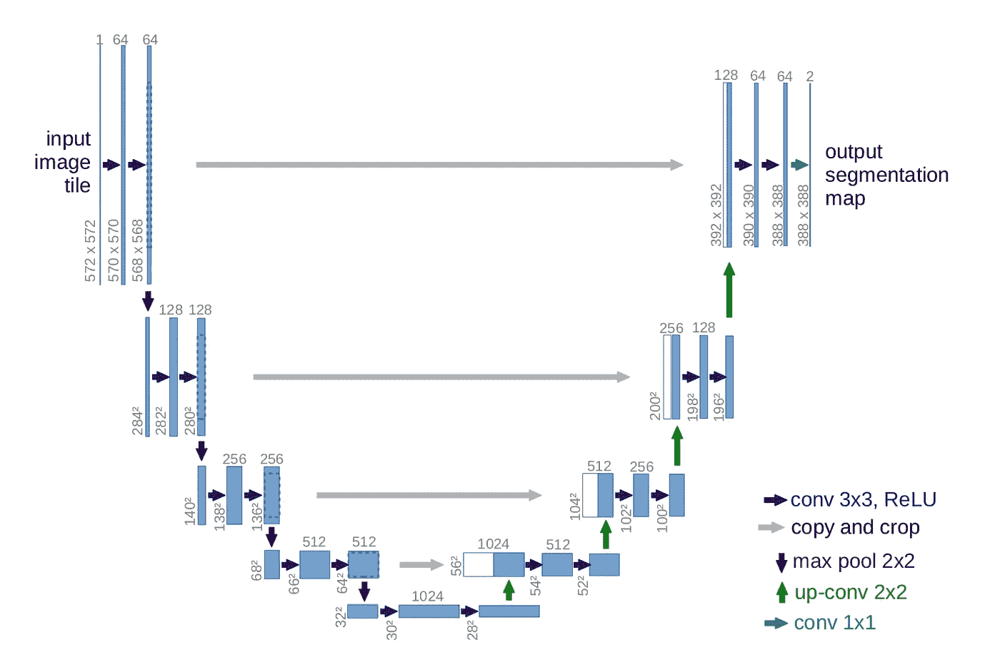
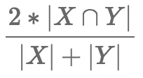
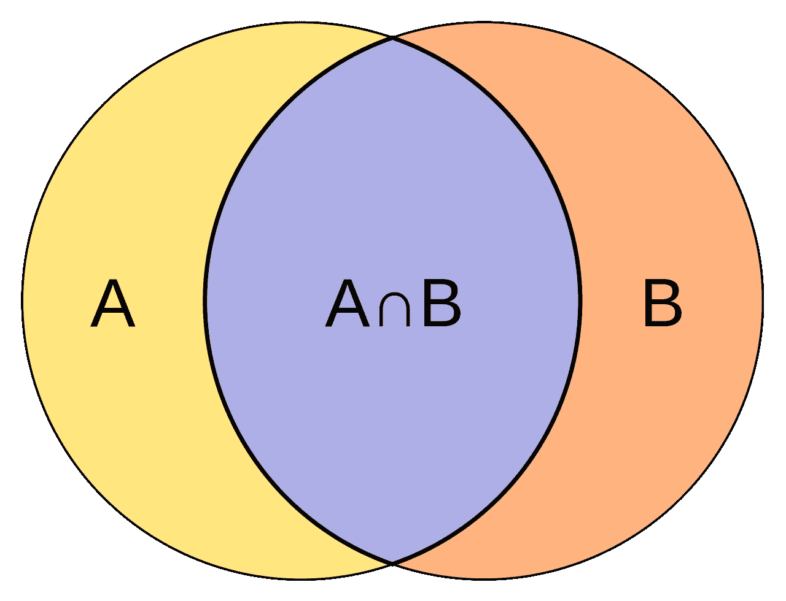
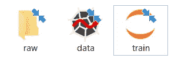
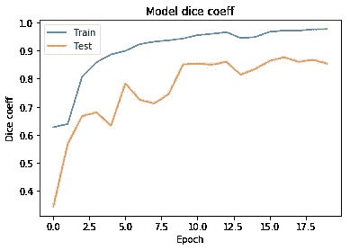
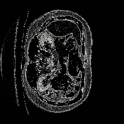

# 基于 Keras 的医学图像分割:U-net 架构

> 原文：<https://towardsdatascience.com/medical-images-segmentation-using-keras-7dc3be5a8524?source=collection_archive---------9----------------------->

## 了解如何构建肝脏分割算法。包括数据预处理、建模和结果可视化的教程。

Olga Guryanova 在 [Unsplash](https://unsplash.com?utm_source=medium&utm_medium=referral) 上的照片

 [## soribadiaby/深度学习肝脏分割

### 目的:目的是通过计算机视觉在病人扫描图像上自动描绘肝脏。使用的方法是…

github.com](https://github.com/soribadiaby/Deep-Learning-liver-segmentation) 

# 介绍

[**医学图像分割**是自动或半自动检测 2D 或 3D 图像内边界的过程](http://www5.cs.fau.de/research/groups/medical-image-segmentation)

医学图像的分割长期以来一直是一个活跃的研究课题，因为人工智能可以帮助对抗许多疾病，如癌症。自动、精确和快速地执行这项任务将有助于专家的工作，并且能够用可靠的方法更好地治疗病人。

在这篇文章中，我们将看到如何在实际的病人扫描数据集上使用 U-net 架构自动分割肝脏。希望你会喜欢它。

# 数据

此处提供 NifTi 格式的数据[。NifTi(神经成像信息学技术倡议)是一种开放的文件格式，通常用于存储使用磁共振成像方法获得的脑成像数据。有一个叫做 nibabel 的 Python 包，我们将用它来处理这种数据。](https://www.dropbox.com/s/8h2avwtk8cfzl49/ircad-dataset.zip?dl=0)

我们将使用的数据集由 20 个 3D 医学检查组成，它包含源图像以及每个图像的肝脏分割模板。这些数据来自法国的 IRCAD 医学研究中心。

来源: [ircad](https://www.ircad.fr/fr/recherche/3d-ircadb-01-fr/)

为了执行我们的任务，我们显然不会只使用 20 个数据(这在深度学习中真的很少)。为了增加我们的数据，我们将使用轴向二维切片。

# 模型

我们将训练一个 U-net 架构，一个完全卷积的网络。这种体系结构的原理是在通常的收缩网络层中添加上采样操作符，而不是池。

这允许网络学习上下文(收缩路径)，然后学习定位(扩展路径)。由于跳过连接，上下文信息被传播到更高分辨率的层。所以我们有和输入一样大小的图像:

U-net 架构

# 公制的

作为度量，我们使用[骰子系数](https://en.wikipedia.org/wiki/S%C3%B8rensen%E2%80%93Dice_coefficient)(与 Jaccard 系数非常相似)。它是衡量两个样本相似性的统计指标:

骰子系数公式

设置交集

在这个图中我们可以清楚地看到:如果 dice 系数等于 1，就表示我们比较的两个样本完全相等！所以越接近 1 越好。

现在我们已经建立了框架，我们可以开始项目了。

# 项目结构

在您的项目文件夹中创建一个“原始”文件夹:

项目结构

在“原始”文件夹中，创建一个“测试”文件夹和一个“训练”文件夹。

然后将数据分成两组(训练和测试，通常我们对训练集使用 13 个样本，对测试集使用 7 个样本)，并将它们放在相应的目录中。

我们将在最后两部分看到“data.py”和“train.ipynb”中写什么。

# 数据预处理

预处理部分在深度学习任务中至关重要，因为神经网络需要某种格式的数据。

在这一部分中，我将向您展示将数据转换为 numpy 数组的 python 代码，我们将把这些数组提供给神经网络。为此，我们将把三维数据转换成二维数据。然后把他们救进来”。npy”格式，以便在进一步的培训中使用。

data.py

现在我们已经准备好了数据，让我们进入最后一步:培训！

# 用 Keras 训练神经网络

在这一部分中，我将向您展示设置架构、训练神经网络并将结果存储在文件中的笔记本(代码灵感来自[这个](https://github.com/jocicmarko/ultrasound-nerve-segmentation)回购)，请不要犹豫参考注释以了解代码:

train.ipynb

多亏了“mark_boundaries”函数，我们将能够看到带有黄色标记的分割结果。

# 结果

终于有结果了！我们的工作得到了回报，这些曲线代表了 20 个时期的训练和测试骰子系数。测试的骰子系数几乎达到了 0.87，这是相当令人满意的。

骰子在时代上的系数

你会在“preds”目录中看到这种代表 2D 切割的结果。用黄色标出的是由算法预测的肝脏:

分割结果

我们现在可以在几秒钟内分割数千次扫描！一项需要专家花费更长时间的任务。

# 结论

最后，我们使用骰子系数几乎达到 0.87 的 U-net 架构成功地训练了我们的神经网络！

**改进轨迹**:

*   通过堆叠二维分割图像来重建三维扫描。
*   通过沿几个斜轴制作二维切片，将数据放大更多

希望这篇文章对你有用。感谢阅读。