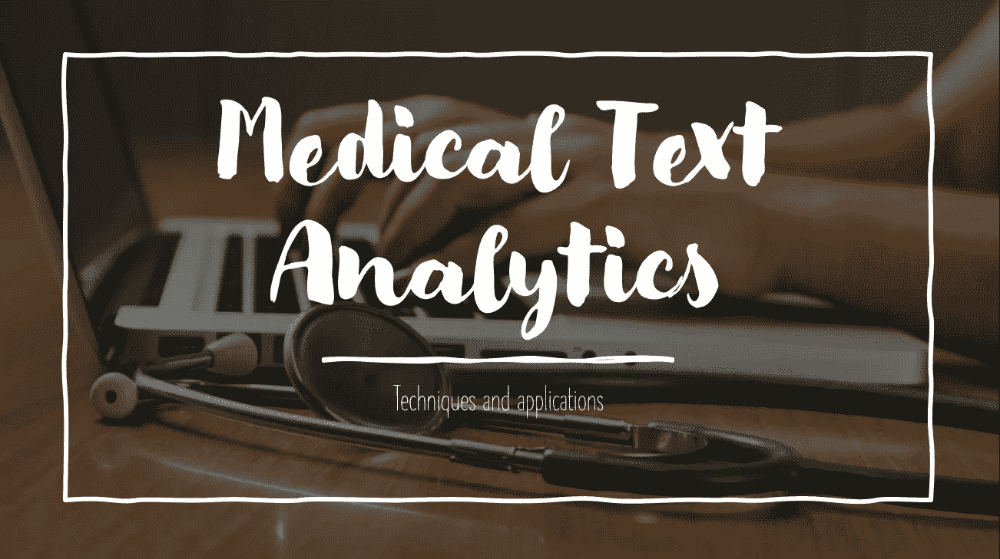
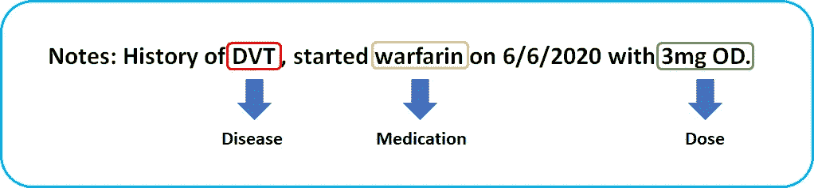
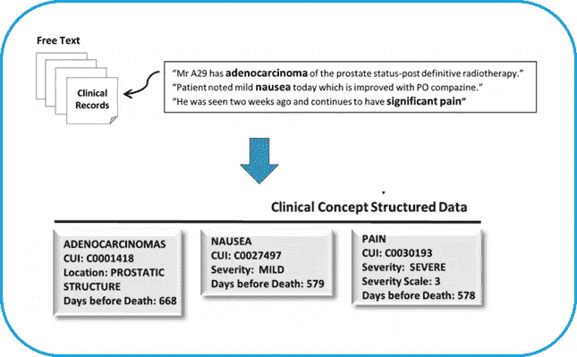
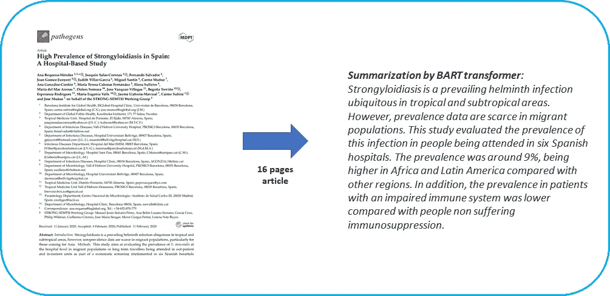
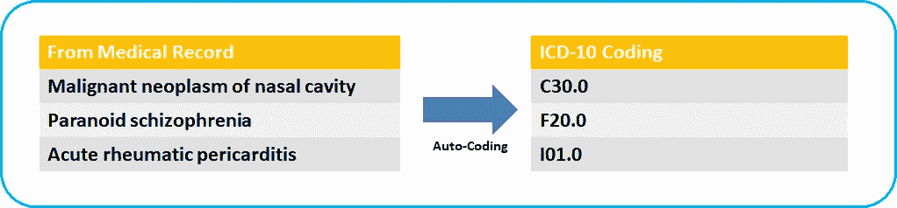

# 医学文本分析技术及其应用

> 原文：<https://towardsdatascience.com/medical-text-analytic-techniques-and-its-applications-c7419c7c1f6?source=collection_archive---------25----------------------->

[国立癌症研究所](https://unsplash.com/@nci?utm_source=unsplash&utm_medium=referral&utm_content=creditCopyText)在 [Unsplash](https://unsplash.com/s/photos/medical?utm_source=unsplash&utm_medium=referral&utm_content=creditCopyText) 上的原始照片

# 介绍

医疗保健行业的技术进步帮助我们生成了越来越多的数据，据估计，2020 年生成的全球医疗保健数据为 2，314 艾字节，比 153 艾字节的 153 艾字节有所增加[1]。这些数据来自多个来源，如 EHR(电子健康记录)、临床研究、患者的物联网(IoT)、门诊患者的医疗记录、患者的远程医疗记录和聊天记录。这些数据的很大一部分采用非结构化叙述文本的形式，描述了医疗程序，如临床记录、出院总结、临床监测表或放射报告[2]。

这些非结构化的叙述性文本由为患者提供护理的医生、护士、药剂师和工作人员编写，并提供超出传统出院总结的更多细节。这些笔记是在护理过程中生成的，并拥有详细信息，如患者病情的进展、护理计划、医疗和家族史，以及许多其他临床属性。

随着这些类型的数据量的增加，使得计算机系统难以以可用的格式分析数据，并且消耗了医疗专业人员的时间来从中提取有价值的信息，因此，这些信息的自动分析的出现对于医疗专业人员来说是至关重要的，以便改善患者的临床结果并降低医院的运营成本。此类工作的例子包括医院再入院的预测、高危患者不良反应的识别以及个性化疾病风险预测的创建[3]

这些非结构化文本的自动分析可以在医学文本分析技术的帮助下完成。文本分析是检查大量文档以从文档中发现新信息或知识的过程，它识别医疗记录中的事实、关系和断言，并将其转换为结构化形式，该形式可以进一步集成到数据库、数据仓库或商业智能仪表板中，并由医疗专业人员用于描述性、规定性或预测性分析。

# **一、命名实体识别(NER)**

医学命名实体识别(NER)是指自动识别不同文本数据块中的医学术语的任务[5]，它主要用于从临床笔记中提取重要的实体类别，如临床发现、程序和药物名称及其剂量[6]。NER 通常是一个两阶段的过程，其中第一阶段包括检测和确定文本中的实体，第二阶段包括选择和提取实体。[8]NER 在医疗领域的应用示例包括从以不同语言编写的临床报告中提取医疗概念，发现与时间表达、个人数据匿名化相关的概念，以及最后分析医疗实体之间关系的提取[7]。

作者图片

# **二。假设生成和知识发现**

自然语言处理经常被用来发现文本数据中新的假设和隐藏的知识。它为医疗保健专业人员提供了重要的见解，可用于他们的日常实践和研究工作。这项技术有助于检测患者的风险因素、症状和危急事件，并有助于卫生专业人员做出决策。这种技术的示例应用是从科学文章和基于健康的网络社交媒体的内容中检测和识别不良药物事件(ADE)[9]，通过病历文本对转移性前列腺癌患者的不同疼痛进行分类和研究[10]。

来源:[10]使用医疗记录文本的自然语言处理对转移性前列腺癌患者的疼痛进行纵向分析

# **三世。文本摘要**

自动摘要是指一个或多个文档的主要主题被识别并简明准确地呈现的过程。[4]这允许医疗保健专业人员以摘要短文本的形式获得诸如 EHR 临床记录、入院记录等文件的要点，因此减少了时间量，提高了生产率，并使其对分析大量信息时出现的主观性不太敏感。应用示例包括摘要系统，该系统允许从医学新闻文章中自动生成摘要[11]以及通过从与支持临床医生信息需求相关的研究论文摘要中提取句子来对临床信息进行摘要[12]。

来源:[使用 BART 模型的 COVID 研究论文摘要](/summarization-of-covid-research-papers-using-bart-model-5b109a6669a6)

# **四。文本分类**

文本分类是指从海量数据中发现文本并将其分类的自动过程，它在文本数据检索和挖掘中起着至关重要的作用。[13]健康相关文本的分类被认为是文本分类的更具挑战性的情况，因为医学文本通常包含标准化的医学术语，其指的是医学领域中的一些概念或缩写，例如血压 140/65。除此之外，病历中经常有语法不好的句子。[14]文本分类的示例应用包括临床警报或风险因素分类、自动诊断分类、患者分层、不良事件分类、电子健康记录分类、症状学分类、通过意见和情感分析挖掘的健康挖掘器[4]

图 5:病历中 ICD-10 疾病的自动编码。作者图片

# 结论:

随着医疗保健向 EHR 的转移，医学文本分析的前景一片光明。医学文本分析的不断进步为患者提供了更好的护理质量，降低了医院和全国范围内的医疗保健成本，最后为患者提供了更多的医疗保健可及性。卫生保健专业人员和卫生政策制定者必须了解这项技术提供的好处，并制定一个坚实的计划将这项技术纳入日常实践。本文介绍了医学领域中不同类型的文本分析术语数据集，随着资源的丰富，医学专业人员和健康信息学可以利用这些现有的资源，开始以低得多的成本在他们的实践中实施医学文本挖掘。

最后，将新的实践或技术融入医疗保健行业不是一项简单的任务，尤其是当这个行业涉及到患者的生命和隐私时，必须克服许多挑战，例如现有设施的准备、法律和伦理、患者隐私以及更高管理层的支持。作者希望医疗行业能够克服这些挑战，因为这项技术可以帮助无数的生命，节省大量的金钱。

感谢您的阅读！

# **参考文献:**

*[1] M. Zwolenski 和 L. Weatherill，“数字宇宙丰富的数据和物联网不断增加的价值”，《澳大利亚电信和数字经济杂志》，2014 年第 2 卷第 3 期。*

*[2] K. Feldman，N. Hazekamp，N. V. Chawla，“挖掘临床叙事:所有文本不相等”，2016 年 IEEE 医疗保健信息学国际会议(ICHI)，2016。*

*[3]穆尼奥斯，伊莎贝尔&赞布拉纳，玛丽亚·罗萨里奥。(2013).将本体论应用于术语:优势与劣势。赫尔墨斯:商业语言与交流杂志。51.65–77.10.7146/hjlcb.v26i51.97438*

*【4】“什么是文本挖掘、文本分析和自然语言处理？”语言学，2020 年 8 月 14 日。【在线】。可用:*[*https://www . linguamatics . com/what-text-mining-text-analytics-and natural-language-processing。*](https://www.linguamatics.com/what-text-mining-text-analytics-andnatural-language-processing.) *【访问时间:2020 年 11 月 13 日】。*

*[5] M. S. Simpson 和 D. Demner-Fushman，“生物医学文本挖掘:近期进展调查”，挖掘文本数据，第 465–517 页，2012 年。*

*[6] P. Corbett 和 A. Copestake，“基于置信度的化学命名实体识别的级联分类器”，BMC 生物信息学，第 9 卷，第 S11 期，2008 年。*

*【7】卢克，卡门&卢娜，何塞·玛丽亚&卢克，玛丽亚&文图拉，塞巴斯蒂安。(2018).医学文本挖掘的研究进展。威利跨学科评论:数据挖掘和知识发现。9.10.1002/widm.1302*

*[8] G. Popovski，S. Kochev，B. Seljak，T. Eftimov，“FoodIE:一种基于规则的食品信息提取命名实体识别方法”，第八届模式识别应用与方法国际会议论文集，2019。*

*【9】taf ti AP，Badger J，LaRose E，Shirzadi E，Mahnke A，Mayer J，Ye Z，Page D，Peissig P (2017)利用生物医学文献发现药物不良事件:一次大数据神经网络冒险。JMIR 医学信息学 5(4)*

*[10] N. H. Heintzelman、R. J. Taylor、L. Simonsen、R. Lustig、D. Anderko、J. A. Haythornthwaite、L. C. Childs 和 G. S. Bova，“使用病历文本的自然语言处理对转移性前列腺癌患者的疼痛进行纵向分析”，《美国医学信息学协会杂志》，第 20 卷，第 5 期，第 898–905 页，2013 年。*

*【11】萨卡尔，卡迈勒。(2009).利用领域知识进行医学领域的文本摘要。国际工程趋势杂志。1.*

*[12] S. R. Jonnalagadda，G. D. Fiol，R. Medlin，C. Weir，M. Fiszman，J. Mostafa，H. Liu，“从 Medline 引文中自动提取句子以支持临床医生的信息需求”，《美国医学信息学协会杂志》，第 20 卷，第 5 期，第 995–1000 页，2013 年。*

*[13]f . Sebastiani，“自动文本分类中的机器学习”，ACM 计算调查，第 34 卷，第 1 期，第 1–47 页，2002 年。*

*[14] L. Qing，w .，d .雪海，“一种新的基于神经网络的医学文本分类方法”，《未来互联网》，第 11 卷第 12 期，第 255 页，2019。[15]马尼伊卡、楚伊、布朗、布欣*