# 基于卷积神经网络的医学 x 射线⚕️图像分类

> 原文：<https://towardsdatascience.com/medical-x-ray-%EF%B8%8F-image-classification-using-convolutional-neural-network-9a6d33b1c2a?source=collection_archive---------1----------------------->

## 从无到有构建 x 线肺炎检测的 CNN 模型

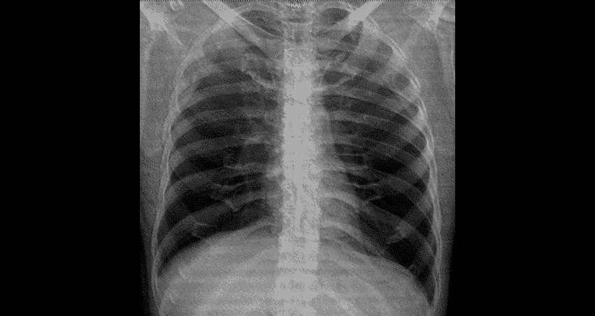

图片来自[维基媒体](https://commons.wikimedia.org/wiki/File:Projectional_rendering_of_CT_scan_of_thorax_(thumbnail).gif)

## 在本文中，我们将创建一个 CNN 模型，它可以将 X 射线图像分类为肺炎病例或正常病例。

**web 应用**已经部署到 streamlit share:[https://share . streamlit . io/smarthardk 10/Xray-classifier/main/web app . py](https://share.streamlit.io/smarthardik10/xray-classifier/main/webapp.py)

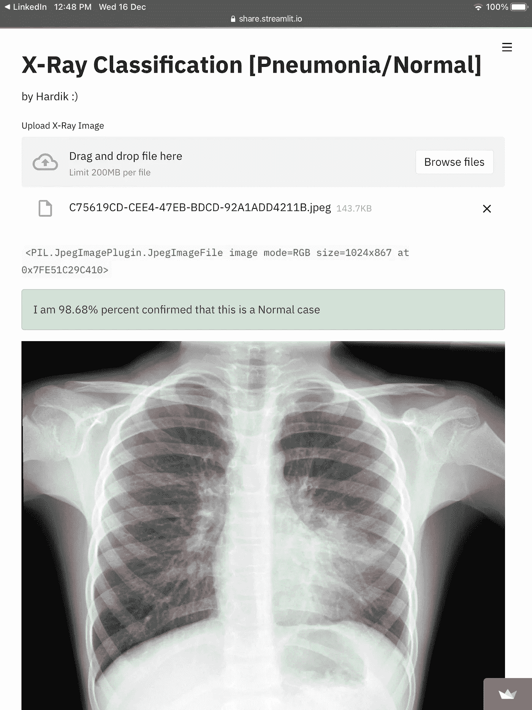

## 目录

1.  数据集
2.  初始化
3.  准备数据

*   3.1 数据扩充
*   3.2 加载图像

4.卷积神经网络

*   4.1 必要的进口
*   4.2 CNN 架构
*   4.3 拟合模型

5.评价

# 1 数据集

我们将用于图像分类的数据集是胸部 X 射线图像，它包括两个类别，肺炎和正常。这个[数据集](https://www.kaggle.com/pcbreviglieri/pneumonia-xray-images)由 Paulo Breviglieri 发布，是 Paul Mooney 最受欢迎的[数据集](https://www.kaggle.com/paultimothymooney/chest-xray-pneumonia)的修订版。数据集的这个更新版本在验证集和测试集中具有更平衡的图像分布。数据集被组织成 3 个文件夹(train、test、val ),并包含每个图像类别不透明度(即&正常肺炎)。

*总观察值(图像):5856
训练观察值:4192(正常 1082 例，肺部阴影 3110 例)
验证观察值:1040(正常 267 例，肺部阴影 773 例)
测试观察值:624(正常 234 例，肺部阴影 390 例)*

首先，我们将使用 Kaggle API 直接从 Kaggle 中提取数据集。为此，我们需要创建一个 API 令牌，它位于 Kaggle API 选项卡下的 Account 部分。点击“创建一个新的 API 令牌”,一个 json 文件将被下载。
运行下面几行代码来安装所需的库并上传 json 文件。

```
! pip install -q kaggle
from google.colab import files
files.upload()
! mkdir ~/.kaggle
! cp kaggle.json ~/.kaggle/
! chmod 600 ~/.kaggle/kaggle.json
```

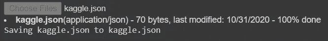

当提示“选择文件”时，上传下载的 json 文件。运行下一行代码将下载数据集。要获得数据集 API 命令来下载数据集，单击 Kaggle 数据集页面的数据部分中的 3 个点，然后单击“复制 API 命令”按钮并用`!`将其粘贴

```
! kaggle datasets download -d pcbreviglieri/pneumonia-xray-images
```

因为我使用 Google Colab 来运行这个项目，所以数据集 zip 文件被下载到 Sample Data 文件夹中。现在，通过运行下面几行代码，我们使用 zipfile 库将文件夹和文件解压缩到所需的目标文件夹。

```
import zipfilezf = "/content/pneumonia-xray-images.zip"
target_dir = "/content/dataset/cnn/pneumonia_revamped"zfile = zipfile.ZipFile(zf)
zfile.extractall(target_dir)
```

**现在我们的数据集已经准备好了，让我们开始吧！**

Gif via [GIPHY](https://media.giphy.com/media/yXzMsbJfjrhLy/giphy.gif)

# 2 初始化

让我们看看我们的数据集目录树。

```
content
└───dataset
    └───cnn
        └───pneumonia_revamped
            ├───test
            │   ├───Normal
            │   │   ├───image1.jpg
            │   │   └───image2.jpg
            │   └───Opacity
            │       ├───image1.jpg
            │       └───image2.jpg
            ├───train
            │   ├───Normal
            │   │   ├───image1.jpg
            │   │   └───image2.jpg
            │   └───Opacity
            │       ├───image1.jpg
            │       └───image2.jpg
            └───val
                ├───Normal
                │   ├───image1.jpg
                │   └───image2.jpg
                └───Opacity
                    ├───image1.jpg
                    └───image2.jpg
```

在这部分代码中，我们将定义目录路径，导入一些需要的库，并定义一些我们将在项目的后面部分经常使用的公共常量参数。

```
#Some Basic Importsimport matplotlib.pyplot as plt #For Visualization
import numpy as np              #For handling arrays
import pandas as pd             # For handling data#Define Directories for train, test & Validation Set
train_path = '/content/dataset/cnn/pneumonia_revamped/train'
test_path = '/content/dataset/cnn/pneumonia_revamped/test'
valid_path = '/content/dataset/cnn/pneumonia_revamped/val'#Define some often used standard parameters
#The batch refers to the number of training examples utilized in one #iteration
batch_size = 16 #The dimension of the images we are going to define is 500x500 img_height = 500
img_width = 500The dimension size of 500 or more than 500 with batch size greater than 16 may result in a crash as the RAM gets completely used in such cases. A lower dimension size with greater batch size is one of the options to try.
```

# 3 准备数据

## 3.1 数据扩充

我们将通过执行一些图像增强技术来人为地增加图像训练数据集的大小。

> 图像增强通过创建现有训练集图像的修改版本来扩展数据集的大小，这有助于增加数据集变化并最终提高模型预测新图像的能力。

```
from tensorflow.keras.preprocessing.image import ImageDataGenerator# Create Image Data Generator for Train Set
image_gen = ImageDataGenerator(
                                  rescale = 1./255,
                                  shear_range = 0.2,
                                  zoom_range = 0.2,
                                  horizontal_flip = True,          
                               )# Create Image Data Generator for Test/Validation Set
test_data_gen = ImageDataGenerator(rescale = 1./255)
```

Gif via [GIPHY](https://media.giphy.com/media/t1HJXy5Q5NKA8/giphy.gif)

使用`tensorflow.keras.preprocessing.image`库，对于训练集，我们创建了一个图像数据生成器，它将定义的参数随机应用于训练集，对于测试&验证集，我们将重新调整它们，以避免事先操纵测试数据。

**定义一些图像数据发生器参数:-**

1.  `rescale`—每个数字图像由一个值在 0 到 255 之间的像素创建。黑色为 0，白色为 255。因此，重新调整原始图像像素值的比例数组，使其介于[0，1]之间，这使得图像对整体损失的贡献更加均等。否则，更高像素范围的图像导致更大的损失，并且应该使用更低的学习率，更低像素范围的图像将需要更高的学习率。
2.  `shear_range` —图像的形状是剪切的变换。它固定一个轴，并以某个角度拉伸图像，该角度称为剪切角。
3.  `zoom_range` —图像以小于 1.0 的倍率放大。图片缩小了 1.0 倍以上。
4.  `horizontal_flip`—一些图像被随机水平翻转
5.  `vertical_flip` —一些图像随机垂直翻转
6.  `roataion_range` —随机地，图像在 0°到 180°范围内旋转一定角度。
7.  `width_shift_range` —水平移动图像。
8.  `height_shift_range` —垂直移动图像。
9.  `brightness_range` —亮度 0.0 对应绝对无亮度，1.0 对应最大亮度
10.  `fill_mode` —将图像中缺少的值填充到最接近的值、包裹值或反射值。

除了重新缩放之外，这些变换技术被随机应用于图像。所有图像已被重新缩放。

## 3.2 加载图像

图像数据生成器有一个名为 flow from directory 的类，用于从包含图像的文件夹中读取图像。返回目录操作符类型`tensorflow.python.keras.preprocessing.image.DirectoryIterator`。

```
train = image_gen.flow_from_directory(
      train_path,
      target_size=(img_height, img_width),
      color_mode='grayscale',
      class_mode='binary',
      batch_size=batch_size
      )test = test_data_gen.flow_from_directory(
      test_path,
      target_size=(img_height, img_width),
      color_mode='grayscale',
      shuffle=False, 
#setting shuffle as False just so we can later compare it with predicted values without having indexing problem 
      class_mode='binary',
      batch_size=batch_size
      )valid = test_data_gen.flow_from_directory(
      valid_path,
      target_size=(img_height, img_width),
      color_mode='grayscale',
      class_mode='binary', 
      batch_size=batch_size
      )
```

`Found 4192 images belonging to 2 classes. Found 624 images belonging to 2 classes. Found 1040 images belonging to 2 classes.`

**它接受的一些参数定义如下:-**

1.  `directory` —使用的第一个参数是我们之前定义的 train，test &验证文件夹的路径。
2.  `target_size` —目标尺寸是您的输入图像的尺寸，每个图像将被调整到这个尺寸。我们之前已经将目标尺寸定义为 500 x 500。
3.  `color_mode`—如果图像是黑白或灰度设置为“灰度”，或者如果图像有三个颜色通道设置为“rgb”我们将使用灰度，因为这是 x 光图像。
4.  `batch_size` —生成器批量生成的图像数量。我们之前将批量定义为 16。我们选择 16，因为图像的大小太大，无法处理 RAM。
5.  `class_mode` —如果您只有两个类别要预测，则设置“二进制”，如果您没有设置为“分类”，如果您开发了一个自动编码器系统，则输入和输出很可能是同一个图像，在这种情况下设置为“输入”。这里我们将它设置为二进制，因为我们只有 2 个类要预测。

**让我们看看我们从数据扩充**中获得的一些列车组图像

Gif via [GIPHY](https://media.giphy.com/media/YWy93Zf9eW8RMlK0gK/giphy.gif)

```
plt.figure(figsize=(12, 12))
for i in range(0, 10):
    plt.subplot(2, 5, i+1)
    for X_batch, Y_batch in train:
        image = X_batch[0]        
        dic = {0:’NORMAL’, 1:’PNEUMONIA’}
        plt.title(dic.get(Y_batch[0]))
        plt.axis(’off’)
        plt.imshow(np.squeeze(image),cmap=’gray’,interpolation=’nearest’)
        break
plt.tight_layout()
plt.show()
```

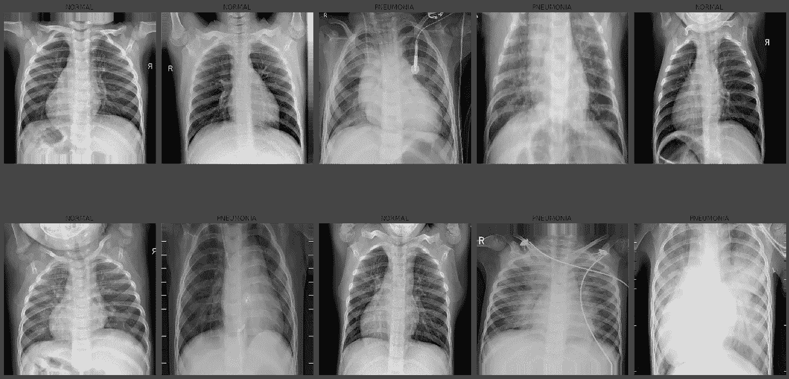

查看列车组的一些图像

Gif via [GIPHY](https://media.giphy.com/media/1kkxWqT5nvLXupUTwK/giphy.gif)

嗯，我不能仅仅通过看这些图片来判断哪一个是肺炎病例，哪一个是正常病例。为此，我需要一个放射学学士学位，需要 2 到 4 年时间，仅第一年就要花费 466 万卢比。 ***好吧，不要担心，作为一个数据科学从业者，你可以教计算机分辨它们之间的区别。*** *我们有希望在这方面达到很高的精确度，否则就是放射科医师的学位了。*

# 4 卷积神经网络

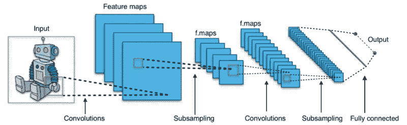

CNN 架构的例子由[维基媒体](https://commons.wikimedia.org/wiki/File:Typical_cnn.png)

> **用一句话告诉我什么是 CNN**—它是一种人工神经网络，能够在图像中定位或检测模式。


最大共享示例由[维基媒体](https://commons.wikimedia.org/wiki/File:RoI_pooling_animated.gif)

**解释 CNN 架构内部的情况—** CNN CNN 架构基于多层卷积。卷积层接收输入并转换图像中的数据，然后将其作为输入传递给下一层。这种变换称为卷积运算。我们需要为每个卷积层定义过滤器的数量。这些滤镜检测边缘、形状、曲线、对象、纹理甚至颜色等图案。它检测到的更复杂的图案或物体的层次更深。本质上，滤镜是图像内核，我们可以定义为 3×3 或 4×4，这是一个应用于图像整体的小矩阵。我们将池层与卷积层一起使用，目标是对输入表示(图像)进行下采样，通过保留子区域绑定中的最大值(激活的特征)来降低其维数。在输入矩阵中移动的像素数量称为步幅。当步幅为 1 时，我们一次将过滤器移动 1 个像素。当步幅为 2 时，我们将过滤器一次移动 2 个像素，依此类推。较大的过滤器尺寸和跨度可用于将大图像的尺寸减小到中等尺寸。

[GIPHY](https://media.giphy.com/media/i4NjAwytgIRDW/giphy.gif) 的卷积运算示例

好吧，如果你讨厌数学，所有这些复杂的数学运算都是在幕后进行的，我们需要做的就是定义超参数和层。如果你热爱数学并想了解这些*数学运算*是如何工作的，你可以参考参考资料部分的链接。

YT 上有一个很棒的视频，他们试图创建人类神经网络。

**锁定并加载我们开始创建的 CNN 架构。**

Gif via [GIPHY](https://media.giphy.com/media/3o7buflZ5B9MTxcU7u/giphy.gif)

## **4.1 必要进口**

```
from tensorflow.keras.models import Sequential
from tensorflow.keras.layers import Dense,Conv2D,Flatten,MaxPooling2D
from tensorflow.keras.callbacks import EarlyStopping,ReduceLROnPlateau
```

## 4.2 CNN 架构

开始构建 CNN 模型之前需要注意的事项:-

1.  总是从一个较低的过滤值开始，如 32，然后逐层增加。
2.  用 Conv2D 层和 MaxPooling 层构建模型。
3.  内核大小最好是奇数，如 3×3。
4.  Tanh，relu 等。可用于激活功能，但 relu 是最优选的激活功能。
5.  `input_shape`取最后一个尺寸的图像宽度&高度作为颜色通道。
6.  在 CNN 层和添加 ANN 层之后平坦化输入。
7.  如果问题超过 2 类，则使用激活函数作为最后一层的 softmax，将单位定义为类的总数，并使用 sigmoid 进行二进制分类，并将单位设置为 1。

注意:-您可以随时试验这些超参数，因为没有我们可以确定的固定值。

```
cnn = Sequential()cnn.add(Conv2D(32, (3, 3), activation="relu", input_shape=(img_width, img_height, 1)))
cnn.add(MaxPooling2D(pool_size = (2, 2)))cnn.add(Conv2D(32, (3, 3), activation="relu", input_shape=(img_width, img_height, 1)))
cnn.add(MaxPooling2D(pool_size = (2, 2)))cnn.add(Conv2D(32, (3, 3), activation="relu", input_shape=(img_width, img_height, 1)))
cnn.add(MaxPooling2D(pool_size = (2, 2)))cnn.add(Conv2D(64, (3, 3), activation="relu", input_shape=(img_width, img_height, 1)))
cnn.add(MaxPooling2D(pool_size = (2, 2)))cnn.add(Conv2D(64, (3, 3), activation="relu", input_shape=(img_width, img_height, 1)))
cnn.add(MaxPooling2D(pool_size = (2, 2)))cnn.add(Flatten())cnn.add(Dense(activation = 'relu', units = 128))
cnn.add(Dense(activation = 'relu', units = 64))
cnn.add(Dense(activation = 'sigmoid', units = 1))cnn.compile(optimizer = 'adam', loss = 'binary_crossentropy', metrics = ['accuracy'])
```

现在我们已经开发了 CNN 模型，让我们深入看看这里发生了什么。

```
cnn.summary() Model: "sequential_1" _________________________________________________________________ Layer (type)                 Output Shape              Param #    ================================================================= conv2d_3 (Conv2D)            (None, 498, 498, 32)      320        _________________________________________________________________ max_pooling2d_3 (MaxPooling2 (None, 249, 249, 32)      0          _________________________________________________________________ conv2d_4 (Conv2D)            (None, 247, 247, 32)      9248       _________________________________________________________________ max_pooling2d_4 (MaxPooling2 (None, 123, 123, 32)      0          _________________________________________________________________ conv2d_5 (Conv2D)            (None, 121, 121, 32)      9248       _________________________________________________________________ max_pooling2d_5 (MaxPooling2 (None, 60, 60, 32)        0          _________________________________________________________________ conv2d_6 (Conv2D)            (None, 58, 58, 64)        18496      _________________________________________________________________ max_pooling2d_6 (MaxPooling2 (None, 29, 29, 64)        0          _________________________________________________________________ conv2d_7 (Conv2D)            (None, 27, 27, 64)        36928      _________________________________________________________________ max_pooling2d_7 (MaxPooling2 (None, 13, 13, 64)        0          _________________________________________________________________ flatten_1 (Flatten)          (None, 10816)             0          _________________________________________________________________ dense_2 (Dense)              (None, 128)               1384576    _________________________________________________________________ dense_3 (Dense)              (None, 64)                8256       _________________________________________________________________ dense_4 (Dense)              (None, 1)                 65         ================================================================= Total params: 1,467,137 Trainable params: 1,467,137 Non-trainable params: 0 _________________________________________________________________
```

## **口译模式总结**

```
# Hyperparameters of Conv2D
Conv2D(
    filters,
    kernel_size,
    strides=(1, 1),
    padding="valid",
    activation=None,
    input_shape=(height,width,color channel)
    )# Hyperparameters of MaxPooling2D 
MaxPooling2D(
    pool_size=(2, 2), strides=None, padding="valid"
    )
```

图像的输入形状是我们之前定义的高度&宽度`(500,500,1)`。并且`1`代表颜色通道，因为图像是灰度的，所以它的颜色通道是 1，对于 rgb 图像是 3。

`(none,500,500,1)`在这里，Keras 增加了一个额外的维度`none`，因为批量大小可以变化。

在第一个`Conv2d`层卷积操作中，对`(500,500)`的图像使用`(3,3)`内核大小，步长和膨胀默认设置为 1，填充设置为“有效”，它输出`(500-3+1 , 500-3+1 ) = (498,498)`的输出大小，我们定义的过滤器数量为 32，输出形状现在为`(None,498,498,32)`

现在，在第一个 Max Pooling 层中，我们已经将内核大小定义为`(2,2)`，默认情况下,`(2,2)`会将其应用到图像大小的输入中，我们得到的是`((498–2//2)+1,(498–2//2)+1))= (249,249)`

展平层采用所有通道上的所有像素，并创建一个 1D 矢量，而不考虑批次大小。因此，`(13, 13, 64)`的输入被拉平为`(13*13*64) = 10816`的值。

参数值由第一层的`(3*3*1*32)+(32) = 320`给出的`(kernel_height * kernel_width * input_channels * output_channels) + (output_channels)`计算。

整流线性激活函数或短期 ReLU 是分段线性函数，如果为正，则直接输出输入，否则输出零。校正的线性激活函数克服了消失梯度的问题，允许模型更快地学习和更好地执行。

填充— `"SAME"`:输出尺寸与输入尺寸**相同**。这要求滤波器窗口滑动到输入映射之外，因此需要填充。`"VALID"`:滤波窗口停留在输入图内的**有效**位置，输出尺寸缩小`filter_size - 1`。不会出现填充。

激活函数-简单地说，激活是一种添加到人工神经网络中的函数，用于帮助网络学习数据中的复杂模式。当与我们大脑中基于神经元的模型进行比较时，激活功能在一天结束时决定对下一个神经元做什么。由于分类在两个类之间，我们将对最后一层使用 sigmoid 激活函数，该函数返回值在 0 到 1 的范围内。对于 2 个以上的类，我们可以使用 softmax 激活功能。

## 定义模型编译

*   学习率——训练时，随机梯度下降的目标是最小化训练集的实际值和预测值之间的损失。减少损失的途径需要几个步骤。Adam 是一种自适应学习率方法，这意味着它计算不同参数的个人学习率。
*   损失函数-由于这是一个二元分类，我们将在训练期间使用二元交叉熵来评估损失。如果有 4 个以上的类，我们会选择分类交叉熵。
*   度量—准确性—计算实际标签与预测值相等的频率。它将测量训练和验证的损失和准确性。

**可视化 CNN 模型**

```
from tensorflow.keras.utils import plot_modelplot_model(cnn,show_shapes=True, show_layer_names=True, rankdir='TB', expand_nested=True)
```

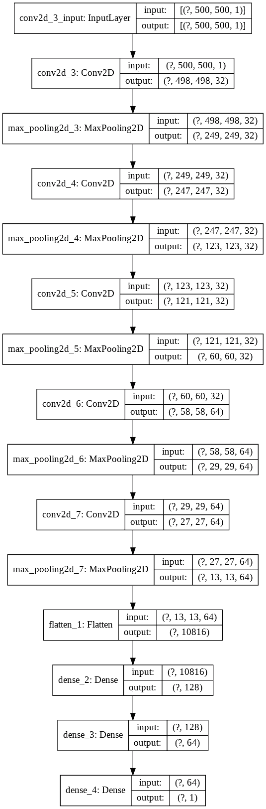

绘制 CNN 架构

## 4.3 拟合模型

**定义回调列表**

根据一些度量标准(`monitor`)和条件(`mode, patience`)调用`EarlyStopping`来停止历元。这有助于避免过度拟合模型。在这里，我们告诉停止基于`val_loss`指标，我们需要它是最小的。`patience`表示在达到最小 val_loss 之后，在接下来的迭代中，如果 val_loss 在 3 次迭代中的任何一次中增加，则训练将在该时期停止。

当指标停止改善时，降低学习率。一旦学习停滞，模型通常会受益于将学习速度降低 2-10 倍。这种回调监控一个数量，如果在“耐心”次数内没有看到改进，则学习率降低。[来源](https://keras.io/api/callbacks/reduce_lr_on_plateau/)

```
early = EarlyStopping(monitor=”val_loss”, mode=”min”, patience=3)learning_rate_reduction = ReduceLROnPlateau(monitor=’val_loss’, patience = 2, verbose=1,factor=0.3, min_lr=0.000001)callbacks_list = [ early, learning_rate_reduction]
```

**分配类别权重**

为每个类分配类权重是一种很好的做法。它强调少数类的权重，以便模型能够平等地从所有类中学习。

```
from sklearn.utils.class_weight import compute_class_weight
weights = compute_class_weight('balanced', np.unique(train.classes), train.classes)
cw = dict(zip( np.unique(train.classes), weights))
print(cw)
```

`{0: 1.9371534195933457, 1: 0.6739549839228296}`

## 现在一切都准备好了，进入最后一步**训练💪**

Gif via [GIPHY](https://media.giphy.com/media/3o7qE4gcYTW1zZPkre/giphy.gif)

我们传递给 model.fit 的参数是训练集、epochs as 25、用于计算 val_loss 和 val_accuracy 的验证集、类权重和回调列表。

```
cnn.fit(train,epochs=25, validation_data=valid, class_weight=cw, callbacks=callbacks_list)
```

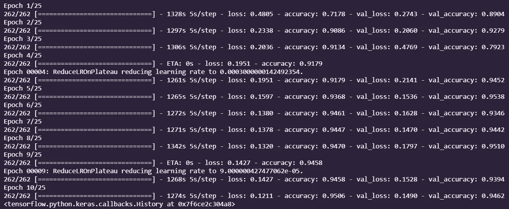

训练模型

看起来早期停止在 val_loss =14.9%和 val_accuracy = 94.6%的第 10 个历元停止。

# 5 评估

让我们直观地看到所有指标在整个时期生命周期中的进展

```
pd.DataFrame(cnn.history.history).plot()
```

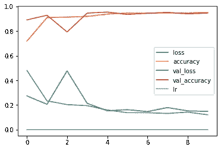

绘制度量进度

我们在测试数据集上获得的准确率是 91%

```
test_accu = cnn.evaluate(test)print('The testing accuracy is :',test_accu[1]*100, '%')
```

`39/39 [==============================] — 50s 1s/step — loss: 0.3132 — accuracy: 0.9119 The testing accuracy is : 91.18589758872986 %`

让我们预测测试数据集，并详细查看一些性能测量指标来评估我们的模型。

```
preds = cnn.predict(test,verbose=1)
```

`39/39 [==============================] — 46s 1s/step`

因为最后一层的激活函数是 sigmoid，所以该模型给出 0 到 1 范围内的预测，而不是 0 或 1 的精确分类。因此，我们将 0.5 到 1 范围内的所有值分类为 0，将小于 0.5 的值分类为 1。注(0 表示正常情况，1 表示肺炎情况)

```
predictions = preds.copy()
predictions[predictions <= 0.5] = 0
predictions[predictions > 0.5] = 1
```

**混淆矩阵**

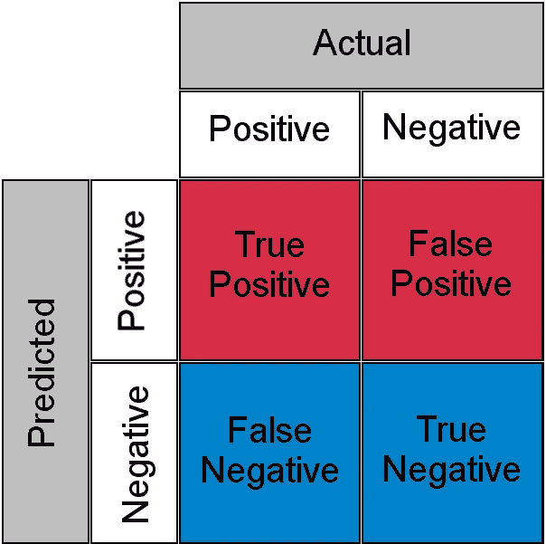

混乱矩阵的例子由[维基媒体](https://commons.wikimedia.org/wiki/File:ConfusionMatrixRedBlue.png)

让我们来解释混淆矩阵的输出。左上(TP)表示被正确预测为正常病例的图像数量，右下(TN)表示被正确预测为肺炎病例的图像数量。作为肺炎病例，右上表示不正确预测但实际上是正常病例的图像的数量，左下表示不正确预测但实际上是肺炎病例的正常病例图像的数量。

Gif via [GIPHY](https://media.giphy.com/media/1oJLpejP9jEvWQlZj4/giphy.gif)

**？？还在困惑困惑矩阵？？**

> 解释二元或多类分类的混淆矩阵的简单方法是查看我们是否在从左到右的对角线像元中获得最大值，在其余像元中获得最小值。

```
from sklearn.metrics import classification_report,confusion_matrix
cm = pd.DataFrame(data=confusion_matrix(test.classes, predictions, labels=[0, 1]),index=["Actual Normal", "Actual Pneumonia"],
columns=["Predicted Normal", "Predicted Pneumonia"])import seaborn as sns
sns.heatmap(cm,annot=True,fmt="d")
```

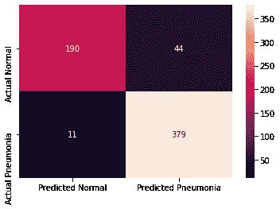

混淆矩阵

**分类报告**

*   精度=真阳性/(真阳性+假阳性)
*   回忆=真阳性/(真阳性+假阴性)
*   F1 = (2 *精度*召回)/(精度+召回)

```
print(classification_report(y_true=test.classes,y_pred=predictions,target_names =['NORMAL','PNEUMONIA']))
```

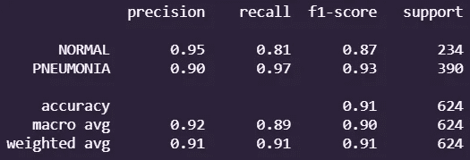

分类报告

**让我们用百分比%** 可视化一些预测图像

```
test.reset()
x=np.concatenate([test.next()[0] for i in range(test.__len__())])
y=np.concatenate([test.next()[1] for i in range(test.__len__())])
print(x.shape)
print(y.shape)#this little code above extracts the images from test Data iterator without shuffling the sequence# x contains image array and y has labels dic = {0:'NORMAL', 1:'PNEUMONIA'}
plt.figure(figsize=(20,20))
for i in range(0+228, 9+228):
  plt.subplot(3, 3, (i-228)+1)
  if preds[i, 0] >= 0.5: 
      out = ('{:.2%} probability of being Pneumonia case'.format(preds[i][0]))

  else: 
      out = ('{:.2%} probability of being Normal case'.format(1-preds[i][0]))plt.title(out+"\n Actual case : "+ dic.get(y[i]))    
  plt.imshow(np.squeeze(x[i]))
  plt.axis('off')
plt.show()
```

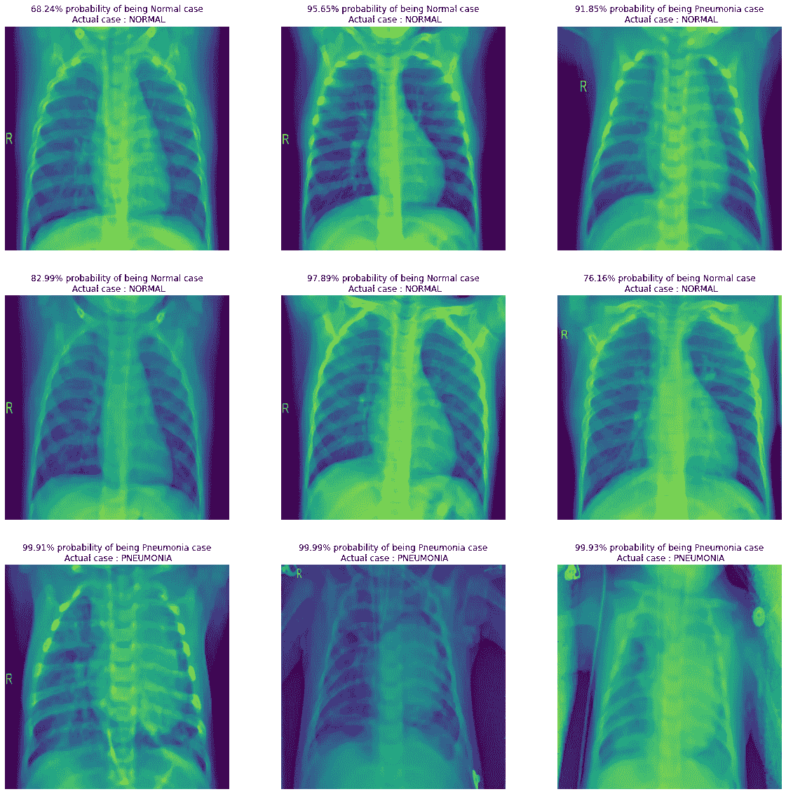

测试数据预测

此代码块给出了单个图像的百分比预测，可以通过指定其路径直接从您的驱动器加载。

在导入图像后，我们必须在这里重新创建所有的数据预处理步骤，就像我们之前将测试集输入模型以获得预测一样。对于预处理，我们需要导入`tensorflow.keras.preprocessing.image`类。

1.  导入图像，定义尺寸为`(500,500)`，颜色通道为灰度。
2.  将图像转换为数组，将它除以 255 进行缩放，将维度扩展到轴= 0，因为我们的模型需要 4 个维度，如前所述。
3.  最后我们来预测一下案情！

**让我们用我的 X 射线对我们的模型做一些实地测试**

```
# Testing with my own Chest X-Ray
hardik_path = '/content/drive/My Drive/unsegregated /IMG_20201023_204205928~2.jpg'from tensorflow.keras.preprocessing import imagehardik_img = image.load_img(hardik_path, target_size=(500, 500),color_mode='grayscale')# Preprocessing the image
pp_hardik_img = image.img_to_array(hardik_img)
pp_hardik_img = pp_hardik_img/255
pp_hardik_img = np.expand_dims(pp_hardik_img, axis=0)#predict
hardik_preds= cnn.predict(pp_hardik_img)#print
plt.figure(figsize=(6,6))
plt.axis('off')
if hardik_preds>= 0.5: 
    out = ('I am {:.2%} percent confirmed that this is a Pneumonia case'.format(hardik_preds[0][0]))

else: 
    out = ('I am {:.2%} percent confirmed that this is a Normal case'.format(1-hardik_preds[0][0]))plt.title("Hardik's Chest X-Ray\n"+out)  
plt.imshow(np.squeeze(pp_hardik_img))
plt.show()
```

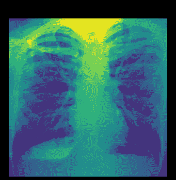

哈迪克的胸部 x 光片

**Phew** 。我的胸部 x 光检查似乎一切正常。现在轮到你诊断胸透了。

# 干得好！我们刚刚创建了一个 CNN 模型，可以以 91%的准确率将 X 射线图像分类为肺炎病例或正常病例。

Gif via [GIPHY](https://media.giphy.com/media/XreQmk7ETCak0/giphy.gif)

感谢你在这个漫长的旅程中陪伴我，我们刚刚为₹省下了 466 万卢比 x 4 年的放射学家学位，现在我们能够对 x 光进行分类。

## 关注我的社交活动

链接到我关于这个项目的笔记本:[colab.research.google.com](https://colab.research.google.com/drive/1J6nM1LlGE-DW93QO-yFkeBSGv9OQoHSC?usp=sharing)

我的 LinkedIn 个人资料:[https://www.linkedin.com/in/hardik-deshmukh/](https://www.linkedin.com/in/hardik-deshmukh/)

我的其他媒体文章:[https://medium.com/@smarthardik10](https://medium.com/@smarthardik10)

我的 GitHub:[https://github.com/smarthardik10](https://github.com/smarthardik10)

部署在 streamlit 上的应用程序:

https://share . streamlit . io/smarthardk 10/Xray-classifier/main/web app . py

# 参考

[1][https://stack overflow . com/questions/61060736/how-to-interpret-model-summary-output-in-CNN](https://stackoverflow.com/questions/61060736/how-to-interpret-model-summary-output-in-cnn)

[2][https://towards data science . com/a-guide-to-a-efficient-way-to-build-neural-network-architectures-part-ii-hyper-parameter-42 efca 01 e5d 7](/a-guide-to-an-efficient-way-to-build-neural-network-architectures-part-ii-hyper-parameter-42efca01e5d7)

[3][https://medium . com/@ RaghavPrabhu/understanding-of-convolutionary-neural-network-CNN-deep-learning-99760835 f148 #:~:text = Strides，with%20a%20stride%20of%202](https://medium.com/@RaghavPrabhu/understanding-of-convolutional-neural-network-cnn-deep-learning-99760835f148#:~:text=Strides,with%20a%20stride%20of%202) 。

[4][https://machine learning mastery . com/rectified-linear-activation-function-for-deep-learning-neural-networks/](https://machinelearningmastery.com/rectified-linear-activation-function-for-deep-learning-neural-networks/)

[5][https://stack overflow . com/questions/37674306/what-the-difference-than-same-and-valid-padding-in-TF-nn-max-pool-of-t](https://stackoverflow.com/questions/37674306/what-is-the-difference-between-same-and-valid-padding-in-tf-nn-max-pool-of-t)

[6][https://deep lizard . com/learn/playlist/plzbt5o _ S2 Q7 lw i2y 8 _ qtvuxzedl 6 qu](https://deeplizard.com/learn/playlist/PLZbbT5o_s2xq7LwI2y8_QtvuXZedL6tQU)

[7][https://towards data science . com/Adam-latest-trends-in-deep-learning-optimization-6be 9a 291375 c](/adam-latest-trends-in-deep-learning-optimization-6be9a291375c)

[8][https://towardsdatascience . com/everything-you-need-known-to-know-about-activation-functions-in-deep-learning-models-84ba 9f 82 c 253](/everything-you-need-to-know-about-activation-functions-in-deep-learning-models-84ba9f82c253)