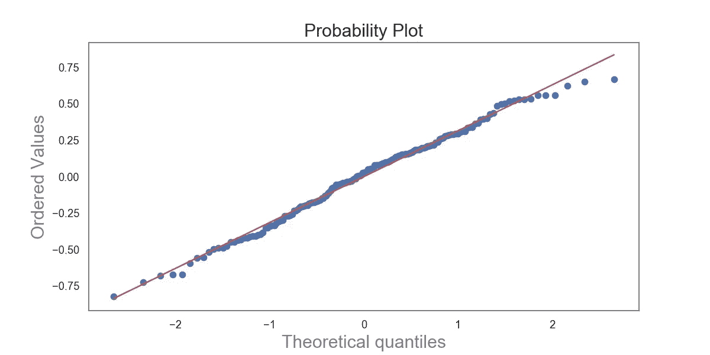

# 中世纪城市化:用 Python 模拟城市动态

> 原文：<https://towardsdatascience.com/medieval-urbanism-modelling-city-dynamics-with-python-3f835555976a?source=collection_archive---------58----------------------->

## 中世纪城市的等级制度是否压制了城市社会经济生活？

[阿德里安·图丁](https://unsplash.com/@adrientutinphoto?utm_source=unsplash&utm_medium=referral&utm_content=creditCopyText)在 [Unsplash](https://unsplash.com/s/photos/medieval?utm_source=unsplash&utm_medium=referral&utm_content=creditCopyText) 上拍摄的照片

有这篇文章代码的 Jupyter 笔记本可以在[这里](https://github.com/lexparsimon/Urban-Data-Science/blob/master/Medieval%20cities.ipynb)找到，原始文章[这里](https://lexparsimon.github.io/medieval/)。

## 城市是如何成长的？

大城市是否只是小城市的放大版仍然是一个悬而未决的问题。这是一个重要的问题。为了规划更好的城市，我们需要更好地理解地理、城市经济、社会和物理网络以及政治制度如何共同带来城市的发展或衰落。为了实现这一目标，需要对城市住区如何随着时间的推移而演变有一个透彻的看法。[实质性研究](https://www.ucpress.edu/book/9780520081154/civilization-and-capitalism-15th-18th-century-vol-ii)声称，将在“现代性”、“资本主义”和工业革命中获胜的社会、经济、政治和组织结构及其创新植根于并发展自中世纪的欧洲定居点。另一方面，中世纪的城市在性质上有所不同:更小，农业，生产力更低，技术更简单，没有有组织的市场经济。与现代城市的类似结构相比，封建政府、教会和行会等严格的等级制度对中世纪城市的社会和经济生活的组织产生了更大的影响。这种影响表现在隔离的公司社会中，在这种社会中，社会团体限制了个人和家庭的社会和经济交往及机会。现代西方思想、人员和货物的“自由流动”与中世纪的城市格格不入。

这两种不同的、乍看上去相互矛盾的观点提出了一个经验性的问题:中世纪的城市与现代城市有本质上的不同吗？或者说，从中世纪到现代城市，城市进程、形式和功能是否存在连续性？

这不仅仅是一个有趣的问题，提出这样的问题对于建立一个广泛的、有历史依据的城市化理论非常重要。在本帖中，我们将缩小所提问题的范围，并试图**找出教会或行会等等级制度是否限制和约束了影响城市经济和空间增长的社会融合和互动**。我们将查看加州 173 座中世纪城市的建成区和常住人口的数据集。公元 1300 年，用简单的统计技术揭示它们之间的关系，并解释与来自[定居比例理论](https://journals.plos.org/plosone/article?id=10.1371/journal.pone.0162678#:~:text=Despite%20their%20many%20structural%20differences,within%20a%20given%20urban%20system.)的两个模型相关的结果。[第一个模型](https://science.sciencemag.org/content/340/6139/1438/tab-pdf)最初是为描述现代城市而开发的，它将城市的建成区作为其人口规模的函数，将城市视为嵌入空间的无约束、无等级的社会经济网络。由于中世纪制度对社交网络的影响，第二种模式[建立在第一种模式的基础上，增加了对社会和经济互动的限制。后一个模型预测，如果这种限制性影响很强，城市的聚集效应将很弱，这在建筑面积和人口之间的关系中是显而易见的。](https://journals.plos.org/plosone/article?id=10.1371/journal.pone.0162678#:~:text=Despite%20their%20many%20structural%20differences,within%20a%20given%20urban%20system.)

## 城市的空间和社会组织模式

一方面，人们可以把中世纪的城市想象成一个自组织的、无等级的社会和空间网络实体。如果是这样的话，人与人之间的互动只受到交易、运输、[机会成本](https://en.wikipedia.org/wiki/Opportunity_cost)，以及个人需求、技能和资源之间所谓的[匹配成本](https://en.wikipedia.org/wiki/Matching_theory_(economics))的限制。在这样的网络中，任何两个人之间的互动都不受限制，可以自由进行。我们将把这种城市视角称为*社会反应器模型*。然而，如前所述，诸如教会、封建当局、行会、家庭关系等等级制度。，在中世纪的城市中发挥了巨大的权力和控制力。这构成了一个假设的基础，即这些制度强烈地规范了不同社会群体之间的联系，因此限制了促进经济生产率、思想流动以及知识和创新创造的社会互动。我们将把这种城市视图称为*结构化社会互动模型*，并讨论相应的数学模型，该模型基于捕获所提及的社会和经济规则的分层图。然后，我们将对现有数据进行统计分析，并通过从这些模型的角度解释数据分析的结果来检验我们的假设。

## 社会反应器模型

大多数城市社会经济理论，包括地理和城市规划的经典模型背后的基本思想是“空间平衡”的概念。在威廉·阿隆索(William Alonso)提出的最简单的形式(T1)中，它指出，在一个城市中，个人和企业通过在土地租金、交通成本和经济偏好之间取得平衡来选择他们的位置，给定可用的资源。这通常会导致单中心的空间组织，城市中心的土地价格最高——就可达性和低交通成本而言，这是最有利的位置——随着远离市中心而降低。另一方面，城市或住区规模理论与阿隆索模型具有相同的基本要素，只是它提供了一个更精确的建模框架，通过一个规模指数将城市的微观过程和物理结构与其人口联系起来，如下所述。住区规模理论背后的核心思想是，所有人类住区——无论规模或社会经济复杂性如何——在总体形式和功能方面都有基本的数量相似性。这来自社会集聚带来的多层次收益[，无论是经济专业化、创新、共享基础设施、共同劳动力、国防、宗教还是贸易。本质上，**他们模拟了一个城市的各种社会经济特征与其人口之间的关系**。城市经济学模型和城市规模理论之间的一个关键区别是用社会经济互动网络取代了经济学中常见的生产或效用函数。](https://journals.openedition.org/cybergeo/2519)

也就是说，让我们推导出一个城市的人口 *N* 与其建成区 *A* 之间的预期关系。与经典的城市经济模型不同，我们*不必*假设一个放射状的单中心城市结构。为了做到这一点，我们权衡了社会经济互动给个人带来的平均收益和相关的交通成本:

在等式中， *G* 是每次互动的净[收益](https://journals.plos.org/plosone/article?id=10.1371/journal.pone.0162678#:~:text=Despite%20their%20many%20structural%20differences,within%20a%20given%20urban%20system.)乘以一个人在一段时间内走过的区域。鉴于中世纪与现代城市在社会关系、经济生产率和创新方面的差异， *G* 可能会随着时间的推移而发生显著变化。 *ϵ* 是每单位长度的运动成本，它是技术(步行、骑马等)的函数。).另一个描述城市中个体互动成本的因素是分形维数，它描述了人们探索城市的方式。对于 *H=1* 来说，个体通过线状轨迹在城市中移动，而对于 *H→2* 来说，他们将城市作为一个区域进行彻底的探索。在相反的极限 *H→0* 中，个人仍然被限制在一个地方(轨迹是一个静态点)，城市实际上不再是一个相互作用的社会经济网络。通过一些简单的高中代数调整，我们得到:

其中 *α:=2/(H+2)* 和 *a:=(G/ϵ)^α* 。这个简单的结果描述了城市住区的一些最重要的特性。首先，如果社会交往的收益相对于交通成本来说很小，就像中世纪城市的情况一样，那么前因子 *a* 将会很小，城市将会非常密集。还要注意的是，如果 *H=0* ，如隔离定居点可能发生的情况，总建筑面积 *A* 将与人口成比例，不会产生任何聚集效应。对于 *H=1* ，可以得到特殊的指数值 *α=2/3* ，这种情况[被](https://journals.plos.org/plosone/article/file?type=printable&id=10.1371/journal.pone.0087902)描述为无定形的定居模型，因为它忽略了城市中的任何空间结构和组织。在这样的聚居地，人口密度 *n* 随着人口规模*n(n)= n/a(n)= a^(−1)*迅速增加。

然而，到目前为止，我们还没有考虑到这样一个事实，即城市住区不是作为空白的各向同性画布组织起来的，而是通过感兴趣的地点和使通向它们成为可能的网络(街道、运河、小路)组织起来的。这意味着城市中社会经济互动的有效空间由其*接入网络*定义。总网络面积 *A_n* 可以从人口密度 *N/A* 中导出:

*a _ n(n)∞n_d=a^(1/2)*其中 *d* 是个体间的平均距离 d=(A/N)^(1/2).此外，

其中 *δ = H/2(H+2)* 和 *a_0=la^(1/2)* 。这里的 *l* 是捕捉每个感兴趣位置(如门和入口)的网络宽度的长度标尺。对于 *H=1* ，我们得到 *1 的指数δ = 5/6* 。

对于剩余的分析，社会反应器模型的两个方面是特别有趣的。首先，该模型预测城市的建成区面积应随其人口平均以指数 *2/3 ≤ α ≤ 5/6* 增长，其中 *2/3* 的下限对应于无定形的各向同性元素，通常为小城镇，而 *5/6* 的上限对应于城市中物质基础设施的作用和精细测量。第二个方面与管理社会互动的等级制度有关，这是我们接下来要关注的。

## 结构化社会互动模式

现在，让我们看看政治机构和社会团体如何在城市中的个人之间的社会和经济互动中引入进一步的约束，以及它们的影响如何改变上一节中描述的标度定律。我们要做的基本上是建立一个模型，从城市中完全自由的社会融合转向隔离社会群体的等级结构，减少这些群体之间的自由社会互动。这些结构可以是正式的，如行会、教区，也可以是非正式的，如家庭关系或种族关系。

在上图中， **A** 展示了一个非结构化的社交网络，任何人都可以自由地与他人联系，唯一的限制是移动的成本。这样的网络结构意味着连通性随着城市人口规模的增加而迅速增加，平均度为*k(n)= k0n^δ，δ∾1/6*。相反， **B** 显示了一个结构化的社会经济网络，其中社会互动由社会团体和政治机构(黑色方块)调节，并且在层级的每一级，可能会受到因素 *s < 1* 的抑制。这意味着，与另一个人的联系层次越高，社会互动的积极影响就越会在每一个层次上被削弱。当等级制度的总体效果是减少社会可能性，从而减少聚集效应，迫使面积与人口的比例指数更接近 1。

事实上，等级结构也可以被建模为通过**减少**互动成本来**促进**社会互动，例如，通过减少犯罪或充当中心场所，促进创新，如现代城市中的大学。但这是一个不同的故事，我们不会在这里讨论它。

上图中的层次结构 **B** 由 *h* 级参数化，在每一级我们假设 *b* 连接是可能的，类似于树形图中的[分支因子](https://en.wikipedia.org/wiki/Branching_factor)。 *b* 和城市人口 *N* 之间的关系则由 *h(N) = log_b N* 给出。

我们现在可以推导出一个人可以拥有的互动次数，因为他的接触是通过更高层次的群体或社会机构进行的。这里重要的参数是**社会视野**， *r = sb* 。如果 r*r>1*，或者说*有效*接触率大于 1，那么这个城市作为一个互动的社会经济网络就不会分崩离析。因为，这个城市被分成不同的团体，由各自的机构决定。

我们从考虑一个典型人的联系数量开始。在层级的第一级，有 *b* 可能的连接，在第二级有 *b+sb* ，在第三级有 *b+sb+(sb)^2* 等等。然后，在给定的阻尼水平下，一个人的交互总数 *s* ，是有限几何级数的和

如果你不记得高中代数课上的内容，你可以在下面的附录中找到复习资料。对于非常小的 *s* ，我们有 *r < < 1* 和*k _ s(n)= b/(1sb)≅b*，这意味着所有的相互作用基本上局限于家庭**，根本没有城市作为社会经济关系的网络！**相比之下，对于接近 1 的 *s* ，我们有 *r > 1* ，我们可以写成:

由于城市人口 *N* 与总的基础设施网络面积成比例， *A_n* 乘以典型人的平均连接性， *k_s(N)* ，并且由于 *h=log_b N* ，我们得到

其中:θ = ∣ *lns/lnb* ∣.注意，当 *s→1* 时，指数 *θ* 变为零，使得社会群体的影响变得无关紧要。我们还记得，由于[城市生产率与其连通性](https://www.jstor.org/stable/20008031?seq=1)，*a _ n = a _ 0n^(1−δ)∞n^(1−δ)*成正比，因此我们得到

在相反的极限中，当社会机构过度限制时，我们得到*A _ N∾N*，导致随着城市的增长，人口密度没有增加( *n =常数*)。这表明了限制社会机会的等级制度如何减少甚至可能消除社会经济集聚效应、空间密集化以及城市本身。一句话:如果我们在任何城市系统中观察建筑面积与人口的线性比例，我们可以确定正式或非正式等级制度的社会经济限制*可能*在起作用的情况。

## 中世纪城市数据的统计数据分析

在我们的腰带下有一点理论，让我们在四个不同的政治“城市系统”的 173 个城市住区的数据集中揭示城市建成区和人口之间的统计关系:德国、意大利北部、法国、比利时和英格兰:

让我们首先绘制数据集中所有城市的建成区与人口的关系图:

正如典型的[城市规模](https://en.wikipedia.org/wiki/Rank-size_distribution)一样，我们看到了面积和人口的高度倾斜分布。由于一个合理的假设是人口和建筑面积都不能太大，我们可以通过取两个变量的自然对数来安全地转换数据，从而使它们“正常化”,而不会因为厚尾而冒有偏差回归结果的风险。

好多了！既然这四个地缘政治集团可能有不同的社会经济结构，我们应该对它们加以控制。让我们按城市系统来划分情节:

现在，我们本质上定义以下[普通最小二乘](https://en.wikipedia.org/wiki/Ordinary_least_squares)模型:

其中 *i* 是指定城市系统中城市的指数， *ϵ* 表示 i.i.d .高斯分布误差。请注意，这只是上面讨论的社会反应器模型的对数变换版本，并且 *β* 与原始模型中的比例系数 *α* 相同。准备好数据后，让我们首先一起运行所有城市的模型。以下是回归结果:

我们看到，感兴趣的估计参数**缩放系数** *β* **为 0.714，位于 2/3 和 5/6 之间！**这是中世纪城市人口和面积的统计分布与城市规模理论相一致的第一个暗示。在我们继续之前，让我们首先运行一些诊断测试，以确保我们没有[异方差或正态性](https://en.wikipedia.org/wiki/Ordinary_least_squares#Assumptions)问题。我们可以从剩余曲线开始:

很好，看起来很随意。对于异方差性，即误差项的方差在不同观测值之间不相同的情况，我们将使用 [Breusch-Pagan 检验](https://en.wikipedia.org/wiki/Breusch%E2%80%93Pagan_test)，它本质上是卡方检验。跳过数学，重要的是，如果我们获得一个小的 p 值(< 0.05)，这表明我们有异方差，应该解决这个问题。幸运的是，我们获得了 0.644 的 p 值，因此我们可以安全地假设同伦方差。

为了检查正态性，我们看一下 [Q-Q 图](https://en.wikipedia.org/wiki/Q%E2%80%93Q_plot):

并发现与正态假设非常吻合。

现在让我们继续运行四个不同的模型，每个模型对应一个地缘政治城市系统。从四个城市系统的 Breusch-Pagan 测试中获得的所有 p 值都远大于 0.05，所有四个模型的 Q-Q 图如下所示:

在不违反我们的回归假设的情况下，我们在对数空间中为四个城市系统绘制了回归线:

估计的缩放系数为

*   英国: **0.73**
*   法国和比利时: **0.79**
*   德国: **0.75**
*   意大利北部: **0.72**

即使将置信区间考虑在内，估计的标度系数在地缘政治城市系统中也非常相似，如社会反应堆模型预测的那样 *2/3≤α≤5/6* ，并且**没有一个系数是** *≥5/6* ..由于这个原因，**我们无法从统计上发现明显的证据，证明等级制度限制了中世纪城市的社会经济互动**。当然，由于系数大致落在 *2/3≤α≤5/6* 范围的中间，一些社会经济抑制仍然可能发生。尽管如此，一致的估计比例系数[与现代城市的比例系数](https://science.sciencemag.org/content/340/6139/1438/tab-pdf)非常接近，并没有衰减到 1。这表明中世纪城市的等级制度对城市社会经济互动没有明显的限制性影响，至少在结构化互动模型预测的框架内是如此。

## 结论

尽管存在许多结构、社会和经济差异，中世纪城市住区至少有一个与现代城市相同的基本属性:**在给定的城市系统中，较大的城市比较小的城市密度更大**。总体而言，数据显示，城市地区的人口增长速度并没有超过社会反应器或结构化互动模型的预测，这表明没有证据表明中世纪城市的社会经济连通性和聚集效应受到了限制性抑制。尽管等级制度在中世纪城市盛行，而且在今天的西方城市中似乎并不占主导地位，但我们可以将这一结果解释为拒绝中世纪社会制度的强烈隔离作用的直观想法。这意味着西欧城市的等级制度。公元 1300 年并没有在很大程度上限制社会融合、经济整合，或者人员、思想和信息的自由流动。这些发现表明，在基本结构层面上，**中世纪城市的微观社会经济过程与现代城市的基本相似**。尽管有许多结构、功能和文化上的差异，中世纪和当代的城市似乎都被描述为随着它们的发展而在空间上变得越来越密集的社会网络。所有这些都表明，通过现代都市主义可以更好地理解过去的城市，但通过中世纪甚至古代的都市主义也可以更好地理解现代城市。随着历史数据的数量和质量不断提高，我们可以预期情况会是这样。

## 附录

对于 *r≠1* ，一个几何级数的前 *n* 项之和为

其中 *a* 是级数的第一项， *r* 是公比。我们可以推导出总和 *s* 的公式如下:

