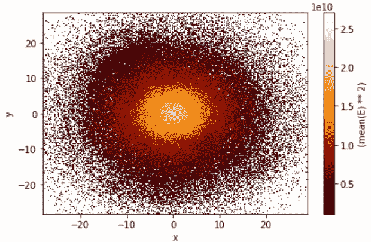

# 分析笔记本电脑上的大数据

> 原文：<https://towardsdatascience.com/medium-data-on-your-laptop-in-2020-e986468a577f?source=collection_archive---------45----------------------->

## 处理大于内存的数据的技术。


[Filiberto Santillán](https://unsplash.com/@filisantillan?utm_source=medium&utm_medium=referral) 在 [Unsplash](https://unsplash.com?utm_source=medium&utm_medium=referral) 上的照片

大数据自 2005 年左右就已经存在了。当时，如果你想操纵大数据，Hadoop 是热门的新玩具。然而，最有可能的是，您必须建立自己的内部集群，花几周或几个月的时间配置所有东西，然后才能真正*对数据进行处理。*

如今，情况不同了，就像所有与技术相关的事情一样，对大数据工具的访问已经民主化。

具体来说，有三件事发生了变化:

1.  内存成本一直在下降，这意味着如今数据科学笔记本电脑上 24GB 或 32GB 的内存非常普遍。
2.  所有大数据基础设施在诸如 AWS 或 GCP 这样的云平台上都可以轻松使用。
3.  尽管大数据在过去被 Java 或 Scala 所主宰，但在几个成熟的专用库的帮助下，python 已经成为这个世界上的一流公民。

在本大数据系列的第一章中，我们将看到 2020 年大数据项目有哪些**本地**选项，以及您应该根据您的用例选择哪一个。

有时，您可以在笔记本电脑上做任何需要做的事情，尤其是当您处理的是*介质*数据(几十 GB)时。好处是您可以立即开始。这种情况与两种情况相关:

# 1.您可以缩小数据

事实上，处理大数据最简单的方法是……将其转换成较小的数据，并在本地进行处理。

## 亚取样

作为第一个例子，假设您有数十亿个点跟踪道路上用户的驾驶速度，并且您想知道速度分布是什么样子，或者基于驾驶模式构建保险索赔的预测模型。在这种情况下，一种明智的方法是对数据进行子采样，假设您可以使其小到足以容纳您的内存，但又大到足以具有统计代表性。因此，如果您的数据库中有 100，000 个用户，每个用户每秒钟都有一个数据点，他们在路上，您可以对您的数据进行子采样，对于 10K 用户的随机子集和数据库中的特定月份，每 10 秒钟只获取一个数据点。

让我们看看数字是什么样子的。假设您有:

*   100，000 名用户，每名用户每秒钟可获得 1 个数据点
*   假设每个数据点包含 5 或 6 个字段(某种 ID，2 个位置字段和 2 个速度向量字段)，每个数据点总计约 200 字节
*   每个用户平均每天驾驶 1 小时，总计每天 3600 个数据点，每月 100K 个数据点
*   数据的总大小:(100K 用户)x(每月 100K 数据点)x(每个数据点 200 字节)=每月 200GB

200GB 显然不是您通常会在笔记本电脑上处理的东西，但是采用前面的方法(对于 10K 随机选择的用户，每 10 秒 1 个数据点)会将它降低到 2GB！

虽然它可能不会给你一个尽可能精确的图片，但对于最初的探索，甚至是一个模型的 MVP 来说，它肯定是绰绰有余的。

## 组块

有时，您希望应用于数据的处理或分析自然会被分成多个独立的步骤。例如，您可能想要生成月度报告，或者您想要按州或城市计算一些统计数据。

在这种情况下，只下载当前分析阶段(正在分析的当前月份或当前地理位置)所需的数据，对其执行分析，然后继续下一次迭代，每次都交换内存中的数据，而不是增加分配的内存大小，这是很有意义的。

只要您不介意等待整个流程按顺序完成运行，或者如果您只需要更新它而不是每次从头开始重新运行它，这种迭代方法是很有趣的。

无论您使用子采样还是分块，大数据都存储在某个地方的数据仓库中，您可以对其进行查询，但您永远不会将它完全放在您的笔记本电脑上。

## 向下铸造

向下转换是将 64 字节浮点列转换为 32 字节浮点列的过程，假设您不介意精度上的小损失。您还可以向下转换 64 字节的长整数，特别是当您有像年或年龄这样的东西时，它们真的不需要那么多空间！

最后，pandas 最近引入了`category` dtype，对于分类数据非常有用，代替了默认的`object`(或字符串)dtype。不同之处在于，新的`category` dtype 只为分类变量的每个**唯一值**保留空间，而默认的`object` dtype 为每个值保留空间。

通过使用`astype`函数，您可以在读取数据后向下转换您的列，但是最好您可以使用`dtype`参数在`read_csv`函数调用中指定您的列的类型。

# 2.您可以使用库来处理大于内存的数据

假设子采样或分块不能满足您的需求。让我们以由 100 只股票组成的 ETF(交易所交易基金)为例，你必须找到该 ETF 的确切波动率，给定这 100 只股票中每只股票的每日收盘价。上面的选项(子采样、分块或向下转换)都不令人满意，因为在这种情况下，您希望尽可能精确。

解决方案是使用一个可以处理核外计算的库，这意味着它可以计算统计数据或处理存储在硬盘上的数据，根据需要将数据移入和移出内存。

## 对于统计计算，使用 Vaex

👉**读取数据**

在计算大量表格数据的统计数据时，Vaex 的速度非常快。Vaex 的另一个非常好的特性是能够在数据框上创建虚拟列，也称为表达式。它们不会占用任何内存空间，Vaex 会根据需要动态使用它们。

要安装 vaex，假设您已经安装了 python，只需运行:`pip install vaex`，但是**确保您是以 admin** 身份运行的。

Vaex 与 HDF5 配合得非常好，因此如果您从一个大的 CSV 文件或一堆 CSV 文件开始，您首先要做的是将它们转换为一个 HDF5 文件。下面是执行此操作的代码:

在这种情况下，我们简单地使用`import glob`并将第一行替换为:

```
for i, chunk in enumerate([pd.read_csv(file) for file in glob.glob('folder/path')]):
```

然后你可以用`df = vaex.open('bigfile.hdf5')`连接你的数据。

👉**用 Vaex 计算统计**

从那里，计算统计数据就像:`df.<statname>(<expression>, [binby=], [limits=])`一样简单。

几个例子:

*   计算数据帧中`A`列的平均值:`df.mean(df.A)`或等效的`df.mean(df.A, limits='minmax')`。
*   只计算 0 到 10 之间的平均值:`df.mean(df.A, limits=[0, 10])`。
*   同时做上面两个例子:`df.mean(df.A, ['minmax', [0, 10]])`。
*   计算仅包括中间 99%值的平均值(即排除左侧的 0.5%和右侧的 0.5%):`df.mean(df.A, limits='99%')`。
*   我们也可以用字符串名来指代列:`df.mean('A')`。
*   或者我们可以即时构建表达式:`df.mean('A + 10*B')`。
*   我们可以使用参数`binby`按 bin 计算统计量，参数应该是一个表达式列表:`df.mean('A', binby=['B'])`。
*   当使用宁滨时，您可以通过使用 shape 参数来控制箱的数量，shape 参数是维度值的列表，例如，`df.mean('A', binby=['B'], shape=4)`将使用 4 个箱返回 B 的每个箱的平均值 A。如果使用多个表达式进行绑定，您可以通过提供单个形状值来获得正方形网格，也可以提供一个形状值列表(每个宁滨表达式一个形状值)。
*   我们可以将 Vaex 表达式传递给`numpy`函数，它将返回一个新的 Vaex 表达式，例如`df.newA = np.clip(np.log(df.A), 0, 1)`。这里我们也在数据帧中存储新的表达式。

下面是您可以计算的可用统计信息列表:`count`、`mean`、`std`、`var`、`cov`、`correlation`、`median_approx`、`mode`、`min`、`max`、`minmax`、`mutual_information`。API 文档可以在这里找到[。](https://vaex.readthedocs.io/en/latest/api.html)

使用方括号([]): `df_negative = df[df.x < 0]`过滤数据帧，然后我们可以在过滤后的数据帧上执行上面的任何计算(或下面的绘图)。

👉**用 Vaex 操作数据**

*a .加入数据*

我们可以用 Vaex 做左、右和内连接。语法很简单:`dfA.join(dfB, left_on='a', right_on='b', how='left|right|inner')`

*b .分组和汇总*

这里有一个来自 Vaex 教程的例子，展示了分组/聚合功能，包括控制计算列的名称:`df.groupby(by='x', agg={'mean_y': vaex.agg.mean('y'), 'max_z': vaex.agg.max('z')}`。

您会注意到聚合函数在`vaex.agg`模块内部。可用的功能有:`count`、`first`、`max`、`min`、`sum`、`mean`、`std`、`var`、`nunique`。

👉**用 Vaex 绘图**

Vaex 提供了一个简单的 API 来绘制大量数据的统计数据。两个主要的函数是`plot1d`和`plot2d`，它们被从一个 dataframe 对象中调用。例如:

*   用 x 的值来画 E 的平均值:`df.plot1d(df.x, what='mean(E)', limits='99%')`。请注意，这些限制适用于 X 轴，并且有一个值为 64 的默认`shape`参数(即默认情况下，X 值将被分成 64 个箱)。
*   或者，我们可以使用`vaex.stat.<statistic>`语法来利用制表符结束。上面的例子可以改写为:`df.plot1d(df.x, what=vaex.stat.mean(df.E), limits='99%')`。
*   如果您已经计算了想要绘制的统计数据，您应该传递`grid`参数(带有结果表达式)而不是`what`。
*   对于 2d 绘图:`df.plot(df.x, df.y, what=vaex.stat.mean(df.E)**2, limits='99%')`，它将输出如下内容:



👉**使用 Vaex 进行高级绘图**

可以通过传递轴的表达式对列表(默认情况下显示为列)和/或“what”列表(默认情况下显示为行)来输出多个图。

例如，`df.plot([['x', 'y'], ['x', 'z']], what=[vaex.stat.count(), vaex.stat.mean(df.E)])`将输出一个网格 2x2 的图。

我们可能希望显示不同数据子集的图。在这种情况下，前面提到的过滤数据的方法(使用括号并将结果赋给变量)将是低效的，更好的方法是使用`selection`参数。因为默认情况下选择会在同一个图表上过量绘制，所以我们可以使用`visual`参数进行定制。例如，要将选择显示为列，将不同的表达式显示为行:

```
df.plot([['x', 'y'], ['x', 'z']], what=vaex.stat.count(), selection=[None, df.E > 0], visual=dict(column='selection'))
```

👉**带 Vaex 的超级琴弦**

Vaex 可以对字符串列应用一系列操作。这些操作可以通过使用`df.string_column.str.<operation>`语法来调用。操作列表可以在这里找到[。一些最有用的是`contains`(用于子串检测)和`match`(用于正则表达式匹配)，连接字符串列的`cat`，以及不言自明的`startswith` / `endswith`。](https://vaex.readthedocs.io/en/latest/api.html#string-operations)

## 如果您打算以后使用云集群，请使用 Dask

Dask 是 python 世界中著名的大数据处理库。我要直截了当地说，如果你只处理**中等数据**，也就是说，你的数据集是以千兆字节为单位的，Vaex 每次都会在性能方面击败 Dask。

然而，Vaex 被设计为在单台计算机上工作。目前没有多节点内置功能。另一方面，Dask 使用统一的 API 提供单节点和多节点功能。如果在迁移到云之前，您只想在本地进行一些测试或试验，那么这是一个巨大的优势。

Dask 的另一个特性是它试图模仿 python 数据科学家熟悉的许多库:当然是 pandas，还有 scikit-learn 和其他库。这使得学习曲线几乎不存在。例如，在 Dask 中读取 CSV 文件非常简单:

```
import dask.dataframe as dd df = dd.read_csv(filepath, blocksize=25e6) #25MB chunks
```

如果您的机器上有 n 个内核，您可以调整块大小(也取决于您的总可用 RAM)来优化运行时，尝试读取 n 个块中的数据。Dask 可以轻松地从各种来源(本地或远程)读取各种格式(CSV、parquet、hdf5 等)的数据。).

这在某些方面是一个优势，但从长远来看，它也可能是一个约束，因为 scikit-learn 中的一些设计选择并不是最好的。

需要注意的另一个警告是 Dask 的`apply`方法要求用户指定输出的类型和名称。这不是一个巨大的烦恼，只是一些需要注意的事情。

最后，我非常喜欢 [Dask Distributed](https://distributed.dask.org/en/latest/) ，这是一个用于 python 分布式计算的轻量级库。在云中设置非常容易，我在这里写了一个关于[的主题。](https://medium.com/@klahrichi/hyperparameter-tuning-with-dask-distributed-and-mlflow-ca6a4a275a2e)

*下期保持联系！我将探索面向大数据的云技术:Spark、Bigquery、Dataflow 等等。*