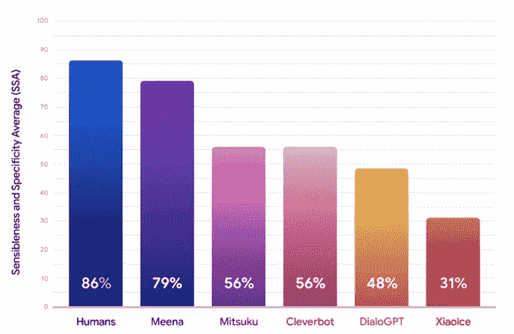

# 米娜:谷歌的新聊天机器人

> 原文：<https://towardsdatascience.com/meena-googles-new-chatbot-657241cf5595?source=collection_archive---------10----------------------->

## 一个更像人类的多功能聊天机器人

谷歌最近发表了一篇关于其新聊天机器人 Meena 的论文。谷歌在设计和方法上击中了所有的要害。虽然底层技术并不是全新的，但就构建聊天机器人而言，这似乎是正确的方向，聊天机器人真正多功能，在交互方面更像人类。

# 聊天机器人的兴起

聊天机器人是一种人工智能系统，它通过文本消息或语音与用户进行交互。最近聊天机器人的应用有了巨大的增长。事实上，根据 T2 的一些估计，聊天机器人市场有望增长到 94 亿美元。

聊天机器人有很多使用案例——例如，客户服务、电子商务服务商、食品配送等。大多数大公司都有自己版本的聊天机器人，比如苹果的 Siri，谷歌的谷歌助手，亚马逊的 Alexa 等等。

也有很多框架可以帮助你构建自己的聊天机器人应用程序，例如开源框架 [RASA](https://rasa.com/) ，谷歌 [DialogueFlow](https://dialogflow.com/) ，IBM[Watson](https://www.ibm.com/watson/how-to-build-a-chatbot)，或者微软 [Bot 框架](https://dev.botframework.com/)

尽管聊天机器人有所增长，但当前大多数解决方案仍面临一些主要挑战:

1.  **基于封闭域/规则的**:大多数聊天机器人都是封闭域的，这意味着它们只在特定的域内工作。这些机器人寻找某些关键字来找出用户的意图，一些基于规则的系统在引擎盖下确定应该根据意图采取什么行动。虽然这些系统仍然有用，但它们不是通用的，并且需要大量特定领域的工作才能运行
2.  **非对话式:**聊天机器人的圣杯是互动应该看起来像人类。对于当前的大多数系统来说，这几乎是不可能的
3.  **非多回合:**大多数聊天机器人在给出响应时没有考虑到多重交互(用户和聊天机器人通过轮流进行交互)的更大背景，这再次导致交互时的非人类体验。

# 米娜

Meena 是一个基于 Transformer seq2seq 架构的多回合、开放域聊天机器人(你可以阅读 [this](/recent-advancements-in-nlp-2-2-df2ee75e189) 了解更多关于 Transformers 的信息)，以端到端的方式训练。它的规模很大，包含 2.6 亿个参数，并在 300GB+文本数据上进行训练。Meena 试图通过其方法和设计来解决上一节中强调的挑战。

以下是这篇论文的一些主要亮点:

1.  **训练数据:**米娜接受公共领域社交媒体对话的训练。每个会话被转换成一个(上下文，响应)对，其中“上下文”表示“响应”消息之前的多达 7 条消息。总数据包括 40B 个字和 341 GB 的文本数据。
2.  **模型架构** : Meena 基于 Evolved Transformer (ET)架构，是在原有 Transformer 架构的基础上进化而来的 NAS 架构。该模型具有 1 个 ET 编码器模块和 13 个 ET 解码器模块。
3.  **模型训练:**模型在一个 TPU v3 吊舱上进行了长达 30 天的训练(2048 个 TPU 核心！！)
4.  **将现有的研究向前推进**:Meena 中使用的大多数概念，例如——开放域性质、端到端训练、transformer seq2seq 架构等，在过去已经以某种形式进行了尝试。只是大了很多(训练数据，模型大小)，好了很多(架构，解码)。
5.  **评估指标:**很难评估聊天机器人的性能，因为没有唯一的正确答案。根据作者的说法，这篇论文的主要贡献之一是设计了一个评估指标，他们称之为*敏感性和特异性* *平均值* (SSA)。它应该是模拟一个对话是否会被称为一个基于人类判断的好的对话。
6.  **敏感性和特异性平均值(SSA) *:*** 对于给定的响应，SSA 被定义为人类是否认为该响应有意义(合理)和具体(这不是类似“我不知道”或“这很好”的一般响应)的二元指标的平均值。
7.  **培训目标**:定义一个评估最终绩效的指标是不够的，因为我们还需要定义一个模型在培训时试图优化的衡量标准。作者的另一个主要成就是证明了 NLP 中常用的度量“困惑”与模拟人类判断的 SSA 度量相关。因此，优化模型以自动减少困惑会使它更受人类欢迎。

# 结果

米娜 vs 人类和其他夏博特。来源[谷歌博客](https://ai.googleblog.com/2020/01/towards-conversational-agent-that-can.html)

在作者定义的 SSA 指标上，Meena 的得分为 79%，低于人类 86%的水平，但它仍然比其他许多受欢迎的聊天机器人要好。当然，其他聊天机器人没有记住新的 SSA 指标(作者提出的)，但当前的方法仍然值得称赞，因为它不是手工制作的，而是以端到端的方式训练的。

# 摘要

谷歌对 Meena 的做法和结果令人兴奋。虽然要建造在专业知识和多功能性方面与人类一样好的聊天机器人还有很多工作要做，但 Meena 似乎是朝着正确的方向迈出了一步。