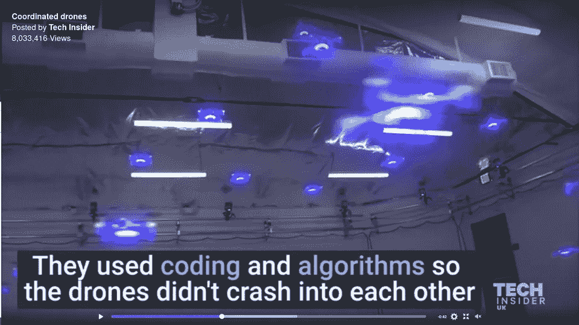
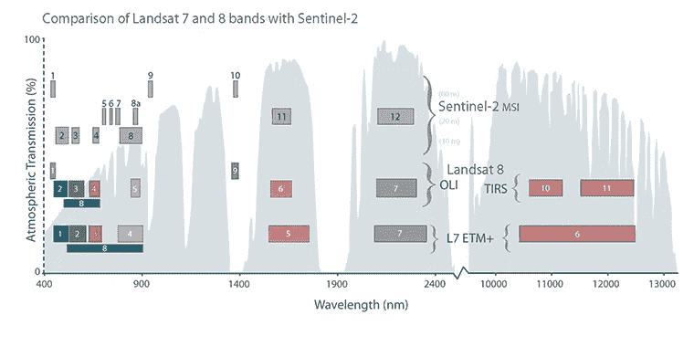
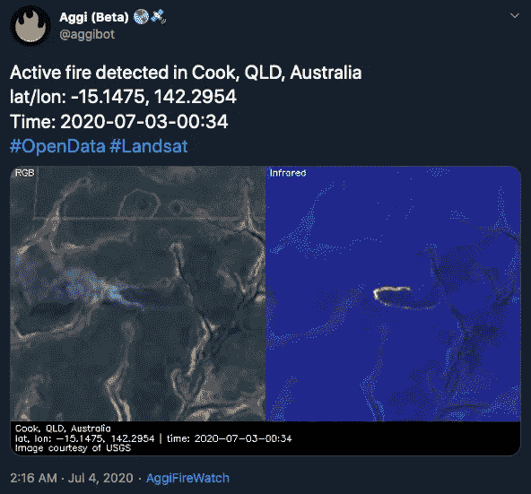
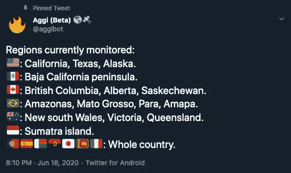
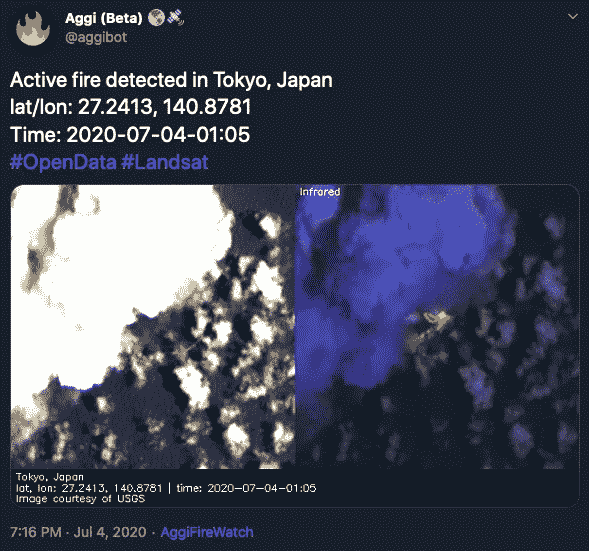
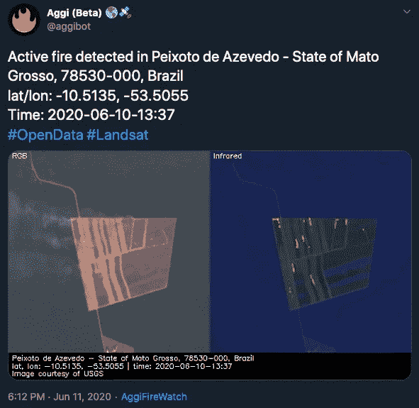
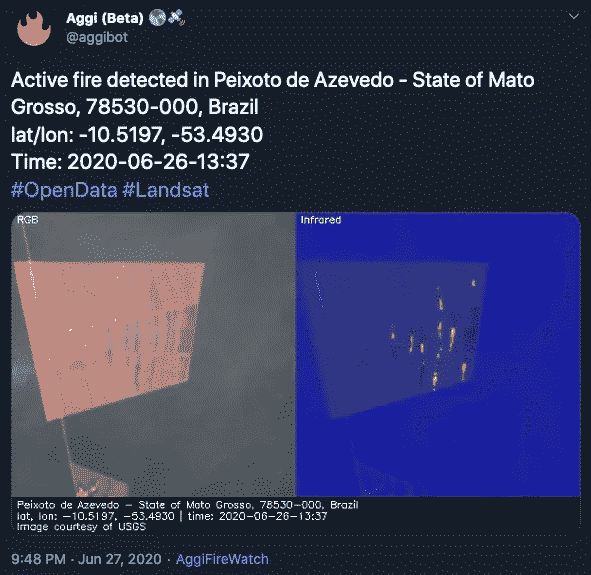

# 认识一下火灾探测推特机器人 Aggi🔥🛰️

> 原文：<https://towardsdatascience.com/meet-aggi-the-fire-detection-twitter-bot-a1e3089bf7ea?source=collection_archive---------57----------------------->

## 我造了一个推特机器人，它可以在卫星图像中探测火灾。继续阅读，了解更多。

@AggiBot 是一个 Twitter 机器人，它使用最新的 [Landsat-8](https://en.wikipedia.org/wiki/Landsat_8) 卫星图像来探测和可视化活跃的火灾。现在在推特上直播了。

早在 2018 年，当我第一次看到推特上流传的[加州野火](https://en.wikipedia.org/wiki/2018_California_wildfires)的照片时，我就决定建立 Aggi。我想知道这是否可以用编码、算法和卫星自动完成！

编码和算法([来源](https://www.reddit.com/r/ProgrammerHumor/comments/5ylndv/so_thats_how_they_did_it_its_brilliant/))

在遥感中，近红外(NIR)和短波红外(SWIR)波段通常用于可视化活跃的火灾和/或烧伤疤痕。所以我开始试验 Sentinel-2 和 Landsat-8 卫星的近红外/SWIR 波段。来自两次任务的数据是公开的，并且具有非常相似的光谱轮廓(见图 1)。我最初的实验显示了两者都很有希望的结果。然而，使用 Landsat-8 数据获得了更一致的结果，所以我最终在最终产品中使用了它。

图 1 ( [来源](https://www.usgs.gov/faqs/how-does-data-sentinel-2a-s-multispectral-instrument-compare-landsat-data?qt-news_science_products=0#qt-news_science_products))

# @AggiBot 是做什么的？

[@AggiBot](http://twitter.com/aggibot) 分析最新的 Landsat-8 图像，寻找活跃的火灾。每当检测到火灾时，火灾的可视化图像就会发布到 Twitter 上(参见图 2 中的示例)。

图 2 ( [来源](https://twitter.com/aggibot/status/1279101684946526209))

目前， [@AggiBot](https://twitter.com/aggibot) 监控着 13 个不同国家 1500 多万平方公里的土地(见图 3)。目标是扩大到监测至少 10%的地球陆地面积，或 5100 多万平方公里。

图 3 ( [来源](https://twitter.com/aggibot/status/1273573784109252611))

# 它是如何工作的？

@AggiBot 运行在 [AWS](https://en.wikipedia.org/wiki/Amazon_Web_Services) 上，所以它一直在监听来自 [Landsat 的 S3 桶](https://registry.opendata.aws/landsat-8/)的 SNS 通知。每次推送新场景时，会自动触发以下事件序列:

1.  从 AWS 获取场景数据(影像+元数据)。
2.  生成场景的逐像素二元火焰遮罩。
3.  发现和定位现场的单个火灾。
4.  使用[谷歌反向地理编码 API](https://developers.google.com/maps/documentation/geocoding/intro#ReverseGeocoding) 将探测到的火灾坐标转换为人类可读的地址。
5.  使孤立的火可视化(RGB 和假彩色)。
6.  最后，发微博！

源代码完全是用 Python 写的，使用了 [Rasterio](https://rasterio.readthedocs.io/en/latest/) 和 [OpenCV](https://opencv.org/) 等库。

# 到目前为止有趣的发现

Just last week the [Nishinoshima 西之島 volcanic eruption in](https://www3.nhk.or.jp/nhkworld/en/news/20200703_22/) Ogasawara, Tokyo, Japan was detected on July 4th (See Figure 4).

图 4 ( [来源](https://twitter.com/aggibot/status/1279358316150472705))

另一个有趣的例子来自巴西马托格罗索州的[6 月 10 日](https://en.wikipedia.org/wiki/Mato_Grosso)和 6 月 26 日的[地点](https://goo.gl/maps/FH4CDLHCiXhE7zhR9)都检测到了火灾。从燃烧模式和谷歌地图上出现的植被来看，这似乎是某种形式的雨林砍伐(见图 5)。

图 5([2020–06–10](https://twitter.com/aggibot/status/1271007303060381698)，[2020–06–26](https://twitter.com/aggibot/status/1276860038255083522))

# 常见问题(FAQ)

*   **@ AggiBot 的目的是什么？**宣传野火是我们星球面临的一个环境问题。
*   **@ AggiBot 多久能探测到一场火灾？**取决于新的 Landsat-8 场景何时可用。一般 8~12 小时。
*   **@ AggiBot 能预测未来的火灾吗？**不，这不可能！
*   **@ AggiBot 能探测到的最小的火是什么？面积为 20 Landsat-8 像素，或 18000 平方米的火灾。**
*   **@ AggiBot 的检测是否经过验证？不，他们不是。事实上，假阳性经常发生。**
*   **@ AggiBot 是开源的吗？**还没有。但是正在努力。

# TL；博士；医生

*   我建造了一个 Twitter 机器人，它使用卫星图像来探测和可视化活跃的火灾。
*   它运行在自动气象站上，使用最新的 Landsat-8 图像。
*   现在在推特上直播:[https://twitter.com/aggibot](https://twitter.com/aggibot)