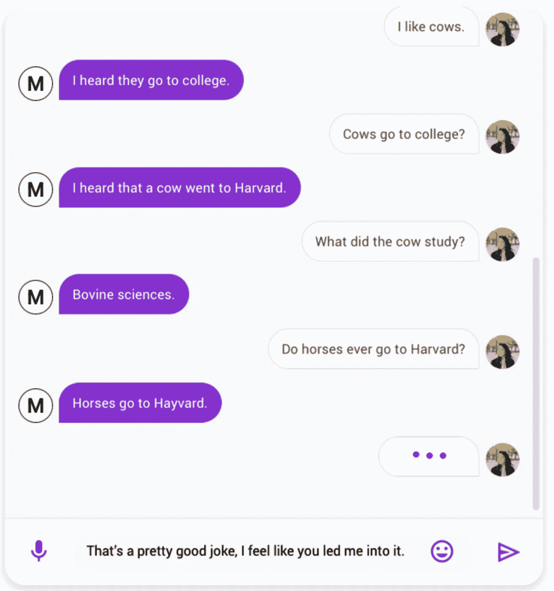
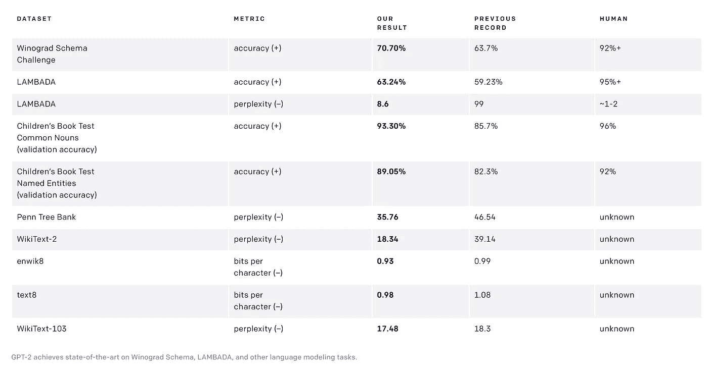

# 认识谷歌 Meena

> 原文：<https://towardsdatascience.com/meet-google-meena-11c26849e12a?source=collection_archive---------7----------------------->

贾里德·阿兰戈在 [Unsplash](https://unsplash.com/s/photos/future?utm_source=unsplash&utm_medium=referral&utm_content=creditCopyText) 上的照片

## 技术

## 谷歌人工智能的最新聊天机器人技术

几年前，当我看到桑德尔·皮帅介绍 Google Duplex 时，不寒而栗。那个预约接线员，美得吓人。那辆*嗯嗯*很神奇。

今天，我刚刚读到谷歌人工智能的新聊天机器人叫做 [Meena](https://arxiv.org/abs/2001.09977) 。它被描述为

> 多回合开放域聊天机器人对从公共领域社交媒体对话中挖掘和过滤的数据进行端到端训练

# 我们来分解一下

**多回合**指参与者之间一个来回的对话。还记得 Lisa (Google Duplex)试图和真人预约理发的对话吗？这种对话可以被归类为多回合，因为机器人不会失去上下文，保持有意义并完成任务。

**开放域**意味着聊天机器人可以谈论的话题没有任何限制。这个想法是让聊天机器人更像人类。像人类一样说话。有了足够大的数据集，聊天机器人应该可以做到。即使没有上下文，人类也能找到一种合理的方法来扩展对话。这就是聊天机器人开放域名的意义。

> ***一个吓人的笑话***
> 
> 这或多或少将是文明的终结，不是吗？你们都听说过这个笑话，对吧？没有吗？这就是——世界上最杰出的科学家创造了第一台 AGI 计算机(或计算机网络)。他们问 AGI 的第一个问题是— ***上帝存在吗？*** *情报回应—* ***有，现在就有！***

**挖掘**和**过滤** —对数据进行语言处理和过滤。挖掘和过滤的目的是，首先，从文本中提取有意义的数据(有意义的词或有更多权重的词或定义上下文的词)，其次，从句子中过滤掉所有的噪音，所有不必要的垃圾。数据挖掘(和过滤)本身是一个非常广泛的研究领域，其中涉及到语言学、语言理论、形式语法等等。

谷歌人工智能的博客文章说

> 训练的目标是最小化[困惑](https://en.wikipedia.org/wiki/Perplexity)，预测下一个单词(在这种情况下，是对话中的下一个单词)的不确定性。其核心是[进化的变形金刚](https://ai.googleblog.com/2019/06/applying-automl-to-transformer.html) [seq2seq](https://en.wikipedia.org/wiki/Seq2seq) 架构，这是一种由进化[神经架构搜索](https://en.wikipedia.org/wiki/Neural_architecture_search)发现的变形金刚架构，用于改善困惑。

对于统计学家、ML 工程师和数据科学家来说，这些词可能很容易理解。但不是每个人都这样。**评估语言模型**不严格地说就是检查模型的准确性。有许多方法可以评估一个语言模型。

> 评估告诉我们语言模型的好坏

概括地说，有两种语言评价模式

1.  **外在评估模型** —所发生的是，你让两个相互竞争的语言模型经历相同的测试/任务，如机器翻译、语音识别、语法纠正等等。然后，你评价哪个表现更好。缺点是评估这些模型需要大量的时间和资源。因此，替代方案如下。
2.  **内在评估模型** —外在模型所做的是基于语言模型的外在事物进行评估，即使用模型完成一些任务，将模型应用于特定用例或应用。内在模型针对语言模型的本质。在内在模型中用作度量的一个东西是困惑。一个例子是香农游戏——它简单地问了一个问题*语言问题能多好地预测给定句子中的下一个单词？*还有其他方法可以根据内在属性评估模型。

所以，**困惑**只是一个统计模型，是用内在属性来评估语言模型。

> 简单来说，整个想法就是猜测给定的不完整句子中的下一个单词，并看看模型预测的有多好。这就是困惑背后的想法。困惑度越低，模型越好。

# Google Meena 的评测还用什么

在谷歌人工智能的博客上阅读这篇[深度文章，他们声称米娜的**敏感度和特异性平均值(SSA)** 只比人类低 7%。](https://ai.googleblog.com/2020/01/towards-conversational-agent-that-can.html)

你还记得乔姆斯基的著名句子结构吗？

> 无色的绿色想法疯狂地沉睡

他试图展示语言中的漏洞，以及语言是如何拥有句法和语义的。句法就是语法。语义就是意义。语法不难。语义是。使用乔姆斯基的方法，机器可以在没有太多意义的情况下写出语法正确的句子。今天它可以做到这一点。它做得不太好的是— **有意义**。这就是整个努力的意义所在。

SSA 的目标是语义——聊天机器人的响应有多大意义？以及它对正在进行的对话有多具体。因此，敏感性(或意义)和特异性(对话的上下文)是测试语言模型好坏的一个很好的书面指标。

从本质上来说，**敏感性和特异性平均值(SSA)** 是由谷歌创建的一个指标，用于衡量对话聊天机器人以一种敏感和特定的方式对对话做出回应的能力。就像人类一样。为了测试 Meena，它与市场上其他流行的开源聊天机器人进行了对话。Google AI 的博客上说，

> 为了计算 SSA，我们众包了与正在测试的聊天机器人的自由形式对话——Meena 和其他知名的开放域聊天机器人，特别是 [Mitsuku](https://en.wikipedia.org/wiki/Mitsuku) 、 [Cleverbot](https://en.wikipedia.org/wiki/Cleverbot) 、 [XiaoIce](https://en.wikipedia.org/wiki/Xiaoice) 和 [DialoGPT](https://arxiv.org/abs/1911.00536) 。

与谷歌 Meena 的对话。

谷歌声称 Meena 比当今市场上最好的生成模型更好，这种模型叫做 [GPT-2](https://github.com/openai/gpt-2) ，由埃隆·马斯克和山姆·奥特曼创建并支持 [OpenAI](https://openai.com/about/) 。这是从中得到的一些结果—

[OpenAI 在几个数据集上的 GPT-2](https://openai.com/blog/better-language-models/) 性能指标。摘自 OpenAI 的网站。阅读[本](https://cdn.openai.com/better-language-models/language_models_are_unsupervised_multitask_learners.pdf)了解详情。

关于 SSA 指标的更多信息还有待了解。但是当谷歌说他们做得更好的时候，人们可能会相信他们。他们以前交付过令人惊奇的东西。

谷歌在博客文章的结尾写道:

> 虽然我们在这部作品中只关注感性和特异性，但其他属性如**和* [*真实性*](https://arxiv.org/abs/1811.01241) *在后续作品中也值得考虑。此外，解决模型中的安全性和偏见是我们的一个重点领域，鉴于与此相关的挑战，我们目前不会发布外部研究演示。然而，我们正在评估与外部化模型检查点相关的风险和好处，并可能选择在未来几个月内使其可用，以帮助推进该领域的研究。**

*我希望他们强调真实性，强调安全性和偏见。那是最重要的。*

# *这对我们的未来意味着什么？*

*我们甚至不会注意到这项技术何时成为我们日常生活的一部分。这绝对是谷歌研究人员的一项伟大成就。更好的是，他们正在考虑解决这些模型中的安全性、真实性和偏见。这也是 OpenAI 的基础。虽然，他们的想法是一个人(谷歌)手中的权力太大了，所以如果 AGI 在不久的将来成为现实，如果我们能够通过开源最好的人工智能代码来分配这种权力，那会更好。*

*我把这个留给你，*显然是*——*

*那个令人不寒而栗的电话。*

*Head [这里](https://linktr.ee/kovid)为我写更多关于技术的文章。*