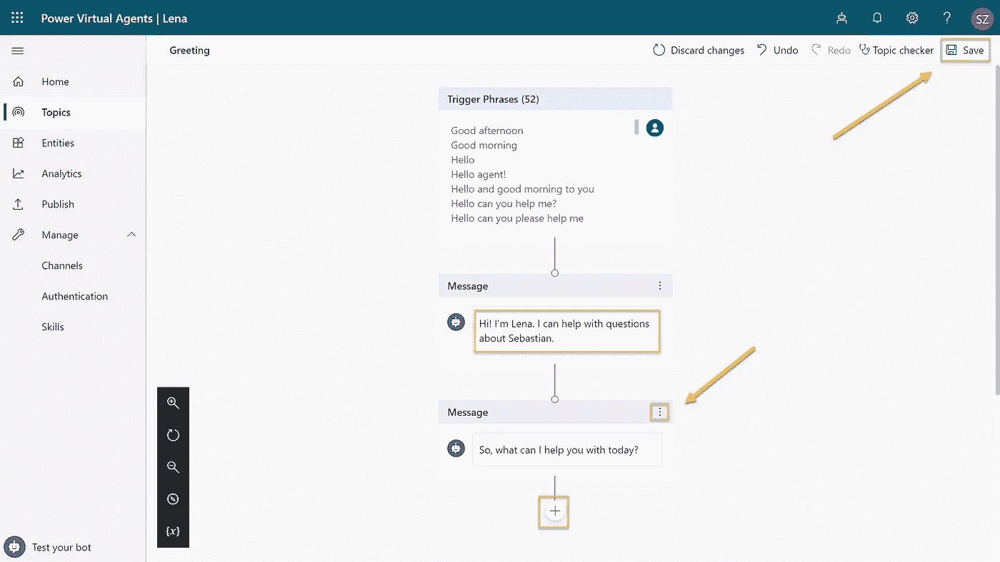

# 见见 Lena——一个简单的人工智能无代码聊天机器人。

> 原文：<https://towardsdatascience.com/meet-lena-a-simple-ai-no-code-chatbot-8ac006c92a45?source=collection_archive---------27----------------------->

## 微软 POWER 平台解决方案

## 用微软的 Power 虚拟代理构建一个简单的聊天机器人，无需代码

照片由[德鲁·比默](https://unsplash.com/@drew_beamer?utm_source=medium&utm_medium=referral)在 [Unsplash](https://unsplash.com?utm_source=medium&utm_medium=referral) 上拍摄

Power Virtual Agent (Power VA)是微软称为 [Power Platform](https://powerplatform.microsoft.com/en-us/) 的低代码和数据平台的最新成员，它允许你不用代码就可以构建人工智能支持的聊天机器人。

准备好自己构建一个机器人了吗？在这个介绍故事中，我将指导你注册、创作并在你的个人网站上发布这个机器人，完全不需要任何代码。

# 注册 Power VA

进入 [Power Virtual Agents 营销页面](https://go.microsoft.com/fwlink/?linkid=2106332)，选择**开始免费**。使用您的 Microsoft 工作或学校帐户登录，或者注册(如果您没有)。

一旦你注册并登录，你可以给你的机器人一个名字。我叫我的**莉娜**。

# 向莉娜问好

我们首先定制机器人的问候行为。在**开始**页面点击**自定义您的问候语**按钮。

这就把我们带到了所谓的**创作画布**，在这里你可以改变你的机器人的流程和行为。使用**创作画布**非常简单。用你自己的对话框随意调整你的机器人的个性。根据需要删除不必要的步骤。

因为我希望我的机器人回答关于我的问题，所以我在主问候消息中反映了这一点。完成自定义问候行为后，点击**保存**按钮。

接下来，从菜单中选择**主题**。把**主题**看作是处理特定内容的对话流的封装——可以说是**主题**。

Power VA 自带两种类型的**话题**。首先，有一些**系统主题**，你很少或根本无法控制。这些是像问候和再见这样的谈话的主要组成部分。稍后请随意探索它们。

第二，有**用户主题**你可以完全从零开始构建或者基于所谓的**经验**。这些预构建的**用户主题**用于向您展示概念，作为一种互动学习。

我们现在不需要它们，所以我们将关闭所有的**课程**。

现在是时候定义我们自己的**用户主题了。**我们使用 Power VA 的**建议主题**功能，而不是从头开始。该功能能够抓取任何给定的网站，并尝试根据其内容“猜测*主题。这方面最好的例子是一个典型的公司或产品网站上的常见问题。*

*出于这个介绍的目的，我使用了我的个人网站，上面有关于我的简介和简短的传记。看看 VA 能从中提取出什么力量。请随意使用您自己的网站或网络上的任何其他内容。*

*点击**建议主题**，输入您希望 Power VA 抓取的网址链接，点击**添加**。您可以添加多个网站以获得更多建议。准备好之后点击**开始**。*

**

*根据网站的数量和大小，此过程可能需要几分钟，如进度消息所示。*

*爬行完成后，Power VA 会根据网站内容告诉你它建议了多少个主题。点击标签**建议**查看摘录。*

**

*正如你从截图中看到的，Power VA 很好地从我的个人网站中发现了最重要的信息，并且很好地命名了它们。*

*现在是时候一个一个的打磨爬行出来的结果了。这包括决定我们是否希望保留建议并将其作为**用户主题**添加，或者我们是否希望删除它。*

**

*选择任何建议并单击其名称，查看发现的确切内容。在我的例子中，你可以看到它是如何很好地提取我的简历的。然而，它不知道用户将如何要求它离开**触发短语**和一个无意义的条目。*

*我们必须通过点击**添加到主题并编辑**来改进这一点。*

**

*首先，我们检查抓取的内容，并立即注意到我们必须更新名称并从列表中删除无意义的触发短语。*

*此外，我们添加了至少 3-5 个不同的短语，用户可能会使用它们来查询这些内容。*

**

*提示:在编写触发短语时，最好遵循以下简单规则:*

*   *句子开头的大写字母*
*   *其他的都用小写*
*   *不要用标点符号(。, ?！:;)*
*   *至少使用 3-5 个触发短语，并尽可能清晰地表达出来*

*当你完成所有的重命名和措辞后，点击**保存主题**按钮。对您想要保留的所有其他建议重复此步骤。*

**

*在测试我们的机器人之前，我们必须启用新添加的**用户主题**。为此，我们使用每个主题旁边的**状态**开关将所有**打开**。*

**

*现在是时候测试我们的机器人了。*

*点击左下角的**测试你的机器人**并说“*Hi”*来观看你调整后的问候对话框出现。问任何其他问题，看看你的机器人是否正确理解它。*

**

*随意测试机器人，并即时改进。您可以单击聊天旁边的**创作画布**上的节点，并立即编辑它们。*

*此外，请注意聊天上方的主题之间的**轨迹**切换，当启用时，会将**创作画布**的上下文动态切换到正确的主题，允许您快速改进您的机器人。*

# ***发布你的机器人***

*发布我们的机器人超级容易。*

*进入**发布**菜单，点击**发布**按钮。确认发布，就大功告成了。她上场了！*

*在我们最终使用我们的机器人之前，我们需要了解它可以在各种不同的渠道上使用，比如定制网站、Skype、微软团队、脸书甚至电子邮件。要查找这些频道，请点击发布页面上的**转到频道**。*

**

*出于本指南的目的，我们将把我们的 bot 添加到一个定制网站中，基本上是将其嵌入为一个 iframe。如果你手头没有自定义网站，你可以简单地使用开箱即用的**演示网站**来展示结果。*

**

*点击**自定义网站**和**复制**嵌入代码**到您的自定义网站。***

*或者，如果你想在没有真实网站的情况下测试，使用[jsfiddle.net](https://jsfiddle.net/)。参见本文末尾的奖金部分。*

**

*我已经选择在我的个人网站上嵌入这个机器人，作为一个实验性的功能。使用一点 CSS，你可以在本文的结尾找到，它看起来像下面这样。*

**

***搞定！你做得很好！***

*我希望这能让您对使用 Power Virtual Agent 能做什么有一个好的印象。还有更多的发现，但这是现在。*

*就这样吧。*

*—塞巴斯蒂安*

## *奖励:使用[jsfiddle.net](https://jsfiddle.net/)进行测试*

*没有网站？只需将 iframe 内容从 Power VA 复制到 jsfiddle.net 的 **HTML** 面板。从第二个奖励提示中获取 iframe 样式，并将其复制到 **CSS** 面板。点击**运行**并查看您的机器人运行情况。*

**

## *额外收获:iframe 的样式*

*现在，将我们的机器人嵌入到一个定制网站中是通过使用一个 iframe 来完成的，这个 iframe 在内容本身的样式方面非常有限。下面的代码片段确实设计了 iframe 嵌入本身的样式，但是*没有*它的内容。*