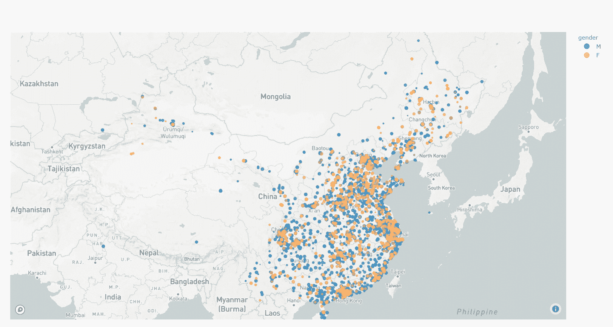
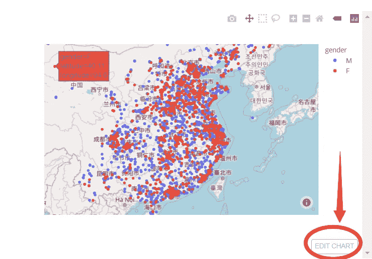

# 见见 Plotly Mapbox。地理数据可视化的最佳选择

> 原文：<https://towardsdatascience.com/meet-plotly-mapbox-best-choice-for-geographic-data-visualization-599b514bcd9a?source=collection_archive---------17----------------------->

## PLOTLY |地理|数据可视化|数据科学| PYTHON

## 探索性数据分析和交互式仪表板演示的逐步指南



使用 Plotly 的地理数据可视化示例(在本文中)

我遇到过几个包含地理数据的项目，我一直在寻找地理可视化的最佳工具。作为一名 Python 用户，我尝试过 Pyplot 的底图、GeoPandas、Folium 和 Bohem，但它们都没有给我满意的体验。

终于，在我找到 Plotly 之后，我的寻找结束了。更具体的说，Plotly 的 Mapbox 包。在今天的这篇文章中，我将演示一个使用 Plotly Mapbox 的地理数据可视化的快速入门，并展示为什么你也应该考虑使用它。

# 为什么是 Plotly？

*   视觉上吸引人。你必须努力让它看起来很丑😜。
*   选择控制的粒度。您有很大的自由来控制可视化效果。
*   互动很好玩。它对于 EDA 和仪表板演示都很方便。
*   不同语言(R、Python、Javascript)的不同产品线，稳定发布的版本。
*   学习速度不是很快。按理说，但是自己判断。
*   关注大数据。通过 [datashader](https://dash-gallery.plotly.host/dash-datashader/) ，Plotly 可以处理数百万行的数据可视化。
*   开源。它是免费的！！！

# Plotly Maxbox 适合你吗？

从我的经验来看，如果

*   您是 Python 用户
*   你熟悉数据可视化工具，如 plt，sns
*   您需要交互式数据可视化，或者您想尝试一下
*   你喜欢免费的东西

那么，Plotly Maxbox 极有可能是你的正确选择。

在我们进入代码之前，我想再提一件关于交互式数据可视化的事情。有些人认为交互式数据可视化仅仅是为了酷的效果，它仅仅是为了表现。对于其他应用，如探索性数据分析(EDA)，静态图就足够了。

然而，对于地理可视化而言，无论是数据科学家还是受众，通常都需要改变地图的比例(例如，通过放大和缩小)来充分理解信息；静态的情节是不够的。

事不宜迟，让我们进行地理可视化。

# 第一个例子:快速启动

```
# import packages
import pandas as pd
import plotly.express as px
import numpy as np# get data
url = '[https://raw.githubusercontent.com/kefeimo/DataScienceBlog/master/2.geo_plot/df_mapbox_demo.csv'](https://raw.githubusercontent.com/kefeimo/DataScienceBlog/master/2.geo_plot/df_mapbox_demo.csv')
df_plot_tmp = pd.read_csv(url)
df_plot_tmp.head()# two-line code
fig = px.scatter_mapbox(df_plot_tmp, lat="latitude", lon="longitude", color="gender", zoom=3, mapbox_style='open-street-map')
fig.show()
```

> **提示**:点击“编辑图表”按钮，有更好的交互体验。



# 第二个示例:使用地图框 tilemap

在上面的例子中，我们使用“open-street-map”作为后端 tilemap。(回想一下，我们定义了 mapbox_style='open-street-map '。)但实际上，我发现 Plotly 默认的 Mapbox 底图更有吸引力。为此，我们需要使用一个 Mapbox 访问令牌。(一个 Mapbox 访问令牌大概是这样的:PK . eyj 1 ijo ibxxxxxxxxxxxxxx .这里免费申请[公共访问令牌](https://studio.mapbox.com/)。)

```
mapbox_access_token =  'Your token...'
px.set_mapbox_access_token(mapbox_access_token)
fig = px.scatter_mapbox(df_plot_tmp, lat="latitude", lon="longitude", color="gender", zoom=3,
#                        mapbox_style='open-street-map',
                       )
fig.show()
```

> **温馨提示:**令牌错误会得到一个空剧情。(它就在那里，但你看不见。)要解决这个问题，请仔细检查您的令牌验证，或者返回使用 mapbox_style='open-street-map '。(此外，使用 mapbox 时，请确保互联网已连接。)

```
wrong_token = 'xxx'
px.set_mapbox_access_token(wrong_token)
fig = px.scatter_mapbox(df_plot_tmp, lat="latitude", lon="longitude", color="gender", zoom=3,
#                        mapbox_style='open-street-map',
                       )
fig.show()
```


# 第三个例子:使用参数

我们可以根据需要进一步指定参数(看看它与 seaborn 有多相似)。

**我认为值得一玩的东西有:**

*   颜色(类似于 seaborn 中的色调)
*   大小
*   缩放，居中，(控制渲染地块时的第一个视图)
*   宽度、高度

**而事情没有给我一个满意的结局是:**

*   文字(使用此功能时，散射会不知何故消失。“hover_name”也是一种选择)

**备注:**

*   没有形状控制
*   同样，当你使用颜色时，取决于它是连续的还是分类的，你可能想要进一步的颜色连续比例(类似于调色板)或者指定类别顺序，颜色离散顺序
*   当你玩 size 的时候，你也可以玩 size_max
*   通过设置渲染器，您可以选择在笔记本(默认)或另一个窗口(renderer='browser ')中打开绘图。

```
# px.set_mapbox_access_token(mapbox_access_token)
fig = px.scatter_mapbox(df_plot_tmp, lat="latitude", lon="longitude", 
                        color="gender", 
                        size='hour', size_max=6, 
                        category_orders={'gender':list(df_plot_tmp.gender.unique())},
                        color_discrete_sequence=['#2b83ba', '#fdae61'],
#                         hover_data=1,
#                         hover_name='hour',
#                         text='hour',

                        zoom=3.3,
#                         zoom=2.8,
                        center=dict(lon=105, lat=38),
                        width=900*1.5, height=500*1.5,)
fig.show()
fig.show(renderer="browser")
```

为了巩固我们的理解，让我们用 age_cate 作为颜色说明符。

在这个例子中

*   查看如何指定类别顺序
*   查看如何指定调色板(注意在 scatter_mapbox 中，颜色需要以十六进制指定，所以我们需要通过某种排序将颜色解析为十六进制)

> **提示**:虽然 Plotly 有自己的[调色板](https://plotly.com/python/builtin-colorscales/)，但是对于 python 来说，我发现选择调色板的简单方法是使用 seaborn sns.color_palette()，所有可用的调色板都可以在 [colorbrewer](https://colorbrewer2.org/) 中找到。

```
from matplotlib.colors import to_hex
import seaborn as sns# px.set_mapbox_access_token(mapbox_access_token)
fig = px.scatter_mapbox(df_plot_tmp, lat="latitude", lon="longitude", color="age_cate", 
#                         size="hour", size_max=15,
                        category_orders={'age_cate':['A22-', 'A23-26', 'A27-28', 'A29-31', 'A32-40', 'A40+']},
                        color_discrete_sequence=[to_hex(c) for c in sns.color_palette('BrBG_r', 6)],  

                        zoom=2.5,
                        center=dict(lon=105, lat=38, ),
                        width=900, height=600,)
fig.show()
```

接下来，玩连续/数字颜色。

```
# play with the color: continous/numerical
# px.set_mapbox_access_token(mapbox_access_token)
fig = px.scatter_mapbox(df_plot_tmp, lat="latitude", lon="longitude", color="hour", 
#                         size="hour",
                        color_continuous_scale=px.colors.cyclical.Twilight, 

                        zoom=2.5,
                        center=dict(lon=105, lat=38, ),
                       width=900,
                        height=600,)
fig.show()
```

# 您可能会遇到的问题

到目前为止，您应该已经掌握了使用 Plotly 进行交互式地理数据散点图的基本知识。现在让我们讨论一些常见的问题和潜在的迂回。

一个问题是关于重叠。

有时，数据集本身会导致重叠。您可能已经注意到坐标数据(即纬度、经度)为 0.01。在 tilemap 上绘图时，这很容易导致重叠。请注意，没有抖动选项。我们可能需要手动将抖动添加到数据中。(不知何故，我认为抖动对于交互式散射可视化来说不是微不足道的，因为抖动参数必须随着比例的改变而相应地改变(例如，放大和缩小)。如果要将抖动应用于交互式绘图，我们可能需要一种自适应抖动方法。)

在我看来，要克服重叠，一个现成的解决方案是调整散布大小(例如，减小散布大小以减轻重叠)。但是对于 px.scatter_mapbox，在 4.8.1 Plotly 版本中，我们不能用 int 来指定大小(不管纪录片里怎么说)。但是有一些方法可以解决这个问题，例如，在数据框中创建一个列来指定散布大小。

尝试以下代码:

**‘Hack’尺寸参数。**

```
# px.set_mapbox_access_token(mapbox_access_token)
fig = px.scatter_mapbox(df_plot_tmp, lat="latitude", lon="longitude", 
                        color="gender", 
                        size='size_for_plot', size_max=2, 
                        category_orders={'gender':list(df_plot_tmp.gender.unique())},
                        color_discrete_sequence=['#2b83ba', '#fdae61'],
#                         hover_data=1,
#                         hover_name='hour',
#                         text='hour',

                        zoom=2.8,
                        center=dict(lon=105, lat=38),
                        width=900, height=600,
                        title='modified scatter size')
fig.show()
```

**手动添加抖动**

```
# px.set_mapbox_access_token(mapbox_access_token)
fig = px.scatter_mapbox(df_plot_tmp, lat="lat_jitter", lon="lon_jitter", color="age_cate", 
#                         size="size_for_plot", size_max=3,
                        category_orders={'age_cate':['A22-', 'A23-26', 'A27-28', 'A29-31', 'A32-40', 'A40+']},
                        color_discrete_sequence=[to_hex(c) for c in sns.color_palette('BrBG_r', 6)],  

                        zoom=10,
                        center=dict(lon=116.4, lat=39.9, ),
                        width=900, height=600,
                        title='add jitter')
fig.show()
```

# 从这篇文章中学到什么

*   试试 Plotly Mapbox，因为它提供了吸引人的可视化效果，它很有趣，它是免费的，并不难开始。
*   px 代表 Plotly.express，从那里开始比较容易。
*   如何解决重叠的问题？

# 下一步是什么？

*   尝试其他 Mapbox 包，例如 px.choropleth_mapbox
*   看看 go ('go '代表' plotly.graph_objs ')
*   试试去吧。Scattermapbox()'，这给了你更多的控制

这是一个结合了散点图框和下拉列表的例子。(代码: [gender_dropbox.py](https://github.com/kefeimo/DataScienceBlog/blob/master/2.geo_plot/gender_dropbox.py) )