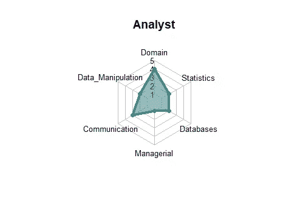
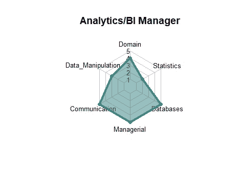
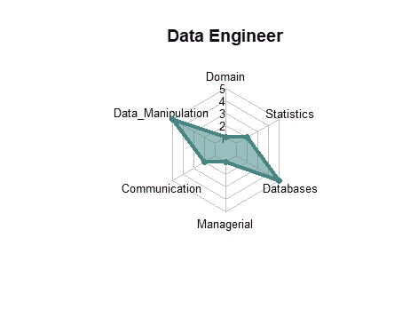
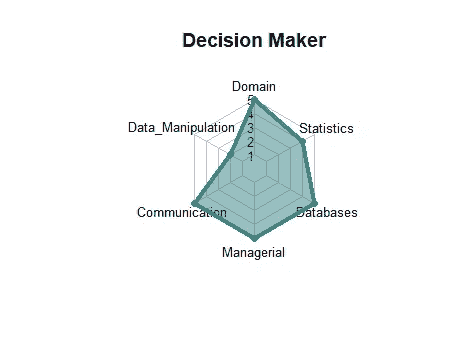
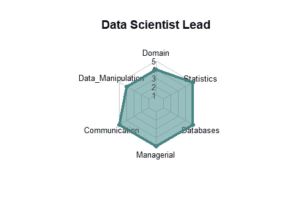
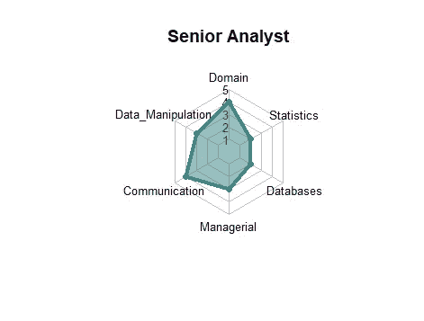
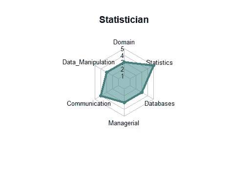

# 会见数据专家

> 原文：<https://towardsdatascience.com/meet-the-data-experts-22345ada9929?source=collection_archive---------56----------------------->

## 通过蜘蛛图展示数据分析专家的不同能力。

# 介绍

你有没有想过那些“数据人”每天都在做什么？可能是你的女儿、丈夫、同事或导师，但每次他们讨论他们的工作时，你的眼神都是闪烁其词。数据科学、数据分析以及所有这些“数据”术语都有模糊和重叠的定义。最重要的是，许多组织的招聘信息会将半打数据技能放在一起，用于所有的职位。这些往往是不现实的。这篇文章是我试图通过 BS 排序，并为每个“数据专家”分配适当的类别。他们主要受到谷歌、亚马逊、苹果和脸书招聘信息的影响。如果有人应该知道这些角色的正确定义，那就是科技巨头。

这些分类将帮助你了解每个人的优点和缺点，以及应该向每个人提出什么样的问题。它还将帮助任何有抱负的数据分析专业人士，他们希望了解哪种工作路径对他们最有意义。这些职位经常重叠，每个人都是独一无二的，但这应该作为一个指南，在定义这些角色时*方向*是正确的。

# **定义数据专家**

拥有数据专业知识的人有几十种不同的工作角色；然而，大多数职位倾向于与以下十个职位紧密匹配:

# **数据专家打分**

每项技能都按照 1-5 分的标准进行评分(5 分为最佳)。1 不代表这个人在这方面不熟练。这些分数与组织内的其他数据分析角色相关。让我们建立六个技能集，并对每个角色进行评分:

1.)**领域专业知识**——理解洞察和分析对业务的影响。

2.)**数据操作**——能够编写干净的代码或者配置一个能够接收、操作、分析、建模和可视化数据的工具。深度比广度更重要，因为技术技能很容易在工具之间转换。

3.)**沟通技巧**——向非技术观众解释复杂技术概念的能力。

4.)**管理能力**——需要情商、强大的社交技能，以及向团队每个成员传达明确职责的能力。必须是能够管理直接下属的领导。

5.)**数据库**——了解存储数据的系统，包括数据模型设计、数据库、数据仓库和数据管道。这包括 SQL 和 NoSQL 数据库以及云的知识。

6.)**统计** -统计和机器学习模型的知识，包括适当的假设、用例，以及可以在数据集之外做出的结论。这包括统计学和机器学习软件工具(如 R、Python 和 SAS)方面的知识。

# 可视化数据专家

图像来源:ggplot2 以呈现图表

**假设**
——分析师的职位靠近业务(例如业务分析师、政策分析师等)。).
-数据科学家图表显示了他们能力的上限(即“独角兽”)

# 解读图表

上述图表被称为蜘蛛(或雷达)图。点从“网”的中心移动到特定类别的边缘的时间越长，该类别的价值就越高。

从数据角色表和蜘蛛图中，您可以得出以下结论:

-分析师可以使用各种工具快速获得一些见解，但可能难以处理大数据。数据工程师往往拥有最强的计算机科学背景。
-不出所料，统计学家对机器学习和统计模型(即统计学)的理解是最好的。
——统计学家和应用机器学习工程师极其相似。
——“完美”的数据科学家可以做到这一切。然而，大多数数据科学家只是应用机器学习工程师或统计学家，只是名称上有所改变。
-你在组织层级中的位置越高，你往往对概念有更好的理解，但你的技能可能会在粒度级别下滑(例如，使用新库的数据争论)。

# 来源

这篇文章的主要灵感来自于谷歌首席决策科学家 Cassie Kozyrkov 写的一篇博客。数据分析角色和评分的定义主要受领先技术公司的空缺职位的影响，包括谷歌、亚马逊、脸书和苹果。

以下网站帮助我在 R 中创建了蜘蛛图:
[https://www . rdocumentation . org/packages/fmsb/versions/0 . 7 . 0/topics/radar chart](https://www.rdocumentation.org/packages/fmsb/versions/0.7.0/topics/radarchart)
[https://www.r-graph-gallery.com/142-basic-radar-chart.html](https://www.r-graph-gallery.com/142-basic-radar-chart.html)