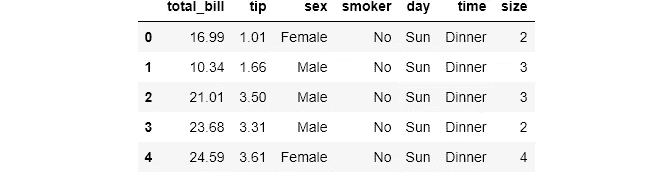
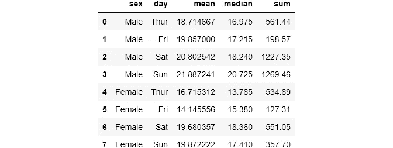
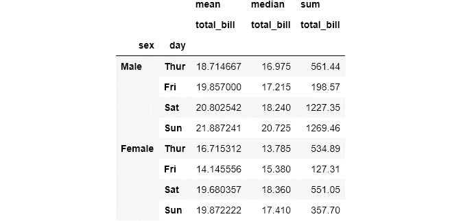
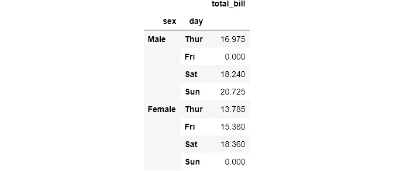
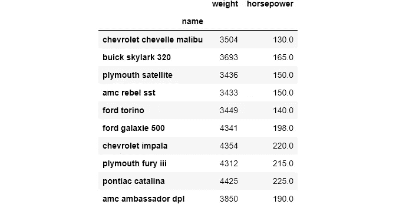
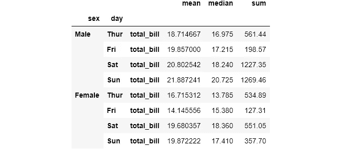
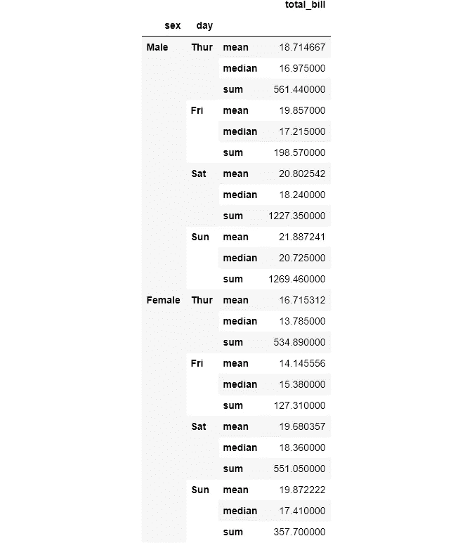
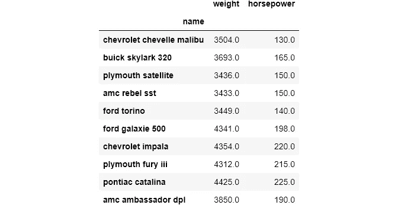
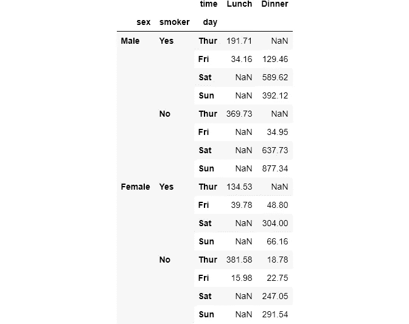
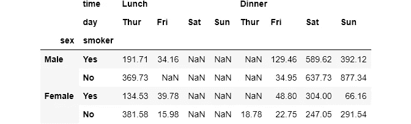

# 认识熊猫最难的功能，第一部分

> 原文：<https://towardsdatascience.com/meet-the-hardest-functions-of-pandas-part-i-7d1f74597e92?source=collection_archive---------15----------------------->

## 用熊猫重塑数据框

## 掌握`pivot_table()`、`stack()`、`unstack()`的时间和方式


来自 [Pexels](https://www.pexels.com/photo/fitness-power-man-person-17840/?utm_content=attributionCopyText&utm_medium=referral&utm_source=pexels) 的 [Binyamin Mellish](https://www.pexels.com/@binyaminmellish?utm_content=attributionCopyText&utm_medium=referral&utm_source=pexels) 照片

## 介绍

下面是最糟糕的情况:你在看付费课程，讲师在讲某个话题。然后，突然，他引入了一个全新的函数，说“这个函数/方法在这种情况下是完美的，它非常简单，所以只需查看其文档以了解更多细节”。你说 OK，去文档，连自己在看什么都不知道。

你感到沮丧，去读一些文章或 StackOverflow 线程，有时回来时感觉更糟。相信我，每个人都会这样。这篇文章专门讨论硬`pandas`函数的情况。

大多数资料没有涵盖`pandas`的一些高级功能的原因主要是它们非常具体。当您学习基本的方法和函数时，您将在它们自己的上下文中学习它们，就像在玩具数据集上一样。对于较难的函数，它们很难解释，并且很难创建它们有用的上下文。

这种功能通常在更有经验的科学家的工具箱中。当你以这样的方式使用它们时，它们会产生不同，函数用一行代码很优雅地解决了你遇到的问题。这个帖子讲的就是他们三个:`pivot_table()`、`stack()`和`unstack()`。

[](https://ibexorigin.medium.com/membership) [## 通过我的推荐链接加入 Medium-BEXGBoost

### 获得独家访问我的所有⚡premium⚡内容和所有媒体没有限制。支持我的工作，给我买一个…

ibexorigin.medium.com](https://ibexorigin.medium.com/membership) 

获得由强大的 AI-Alpha 信号选择和总结的最佳和最新的 ML 和 AI 论文:

[](https://alphasignal.ai/?referrer=Bex) [## 阿尔法信号|机器学习的极品。艾总结的。

### 留在循环中，不用花无数时间浏览下一个突破；我们的算法识别…

alphasignal.ai](https://alphasignal.ai/?referrer=Bex) 

## 可点击的目录(仅限网络)

1.[简介](#9b70)
2。[设置](#dce4)
3。 [Pandas pivot_table()，与 groupby()](#af38)
4 比较。[熊猫栈()](#cc49)
5。[熊猫解散()](#40fd)

> 每个函数第一次出现时，我都给它们的文档加了超链接。请查看更多详细信息。

## 设置

## Pandas pivot_table()，与 groupby()比较

> 应该有一种——最好只有一种——显而易见的方法来做这件事。

以上是引用 python 的禅宗。Python 希望一个问题只有一个明显的解决方案。但是，`pandas`刻意回避了这一点。往往在`pandas`中，一个操作有几种方式。

`[pivot_table()](https://pandas.pydata.org/pandas-docs/stable/reference/api/pandas.pivot_table.html)`就是一个例子。它是`groupby()`功能的完整替代，有时甚至是更好的替代。不同的是结果的形状。`groupby()`返回一个`Series`对象，而`pivot_table()`给出一个易于操作的数据框架。

让我们用这两个函数来解决一个问题并给出解决方案。我将从`seaborn`加载`tips`数据集:

```
tips = sns.load_dataset('tips')
tips.head()
```



我们想找出每个性别所有账单的总和:


让我们比较一下这两个函数的语法。在`groupby()`中，我们将想要分组的列放在括号中，在`pivot_table()`中，等价的参数是`index`。在`groupby()`中，为了选择要聚合的列，我们使用带括号的子集，而在`pivot_table()`中，我们将其传递给`values`。最后，为了选择聚合函数，我们在`groupby()`中使用方法链接，而`pivot_table()`提供了`aggfunc`参数。

当我写一篇关于 DS 和 ML 的项目设置的文章时，我研究了很多笔记本。我发现令人惊讶的是，许多人使用`groupby()`并使用`.reset_index()`函数将`groupby()`的结果转化为数据帧，让我们进一步探索以找出原因:

```
result = tips.groupby('sex')['total_bill'].sum().reset_index()
result
```


如果你使用`pivot_table()`，你不必使用`reset_index()`将结果转换成数据帧。`groupby()`结果不像数据帧那样容易处理。让我们看看如何按多列分组和用多个函数聚合:

```
tips.groupby(['sex', 'day'])['total_bill']\
            .agg([np.mean, np.median, np.sum]).reset_index()
```



```
tips.pivot_table(values='total_bill', 
                 index=['sex', 'day'], 
                 aggfunc=[np.mean, np.median, np.sum])
```



两个函数都返回多列的数据帧。但是，尽管对于单个列来说`pivot_table()`更好，但是对`groupby`结果使用`reset_index()`会给出更好的数据框架。也许这就是 Kagglers 更喜欢`groupby()`的原因。

在`pivot_table()`中，有时你可以用`columns`参数代替`index`(或者有时两者都用)将每组显示为一列。但是如果您向`columns`传递多个参数，结果将是一个只有一行的长数据帧。

`groupby()`和`pivot_table()`的另一个区别是`fill_value`参数。有时，当您按多个变量分组时，不会有匹配的结果单元格。在这种情况下，`groupby()`会放置`NaN` s，但在`pivot_table()`中，您可以控制这种行为:

```
tips.head()
```



你想在什么时候使用`pivot_table()`？正如我之前说过的，它有时可能是`groupby()`的更好选择。说到语法也是个人喜好。一个明显的例子是选择`pivot_table()`，因为它有一些`groupby()`中没有的其他参数。我已经报道了`fill_value`，但是还有其他类似`margins`的。你可以在[文档](https://pandas.pydata.org/pandas-docs/stable/reference/api/pandas.pivot_table.html)中了解更多信息😁。

> 请阅读文章的第二部分，了解计算分组汇总统计数据的函数之间的更多差异:

[](/meet-the-hardest-functions-of-pandas-part-ii-f8029a2b0c9b) [## 认识熊猫最难的功能，第二部分

### 掌握交叉表的时间和方式()

towardsdatascience.com](/meet-the-hardest-functions-of-pandas-part-ii-f8029a2b0c9b) 

## 熊猫栈()

使用时，`[stack()](https://pandas.pydata.org/pandas-docs/stable/reference/api/pandas.DataFrame.stack.html)`返回带有多级索引的整形数据帧。最内层是通过旋转数据框架的列来创建的。我们最好从一个例子开始。为了更好地理解，我将加载`cars`数据集并对其进行子集化:



让我们看看如何透视数据帧，使列现在成为索引:

当我们在这个数据帧上使用`stack()`函数时，结果会有多级索引，`name`为外层，`weight`，`horsepower`为内层:

这里，原始数据帧只有一个单级列名。这就是结果数据帧是`pandas.Series`而不是数据帧的原因。

记住`stack()`函数总是将列旋转到内部级别索引。如果没有剩余的列，意味着如果最终数据是一个系列，`stack()`将不起作用。我们来试试上面的`Series`:

```
stacked_cars.stack()AttributeError: 'Series' object has no attribute 'stack'
```

`stack()`的一个更复杂的例子是当列名作为多级索引给出时。让我们回到我们的一个数据透视表:


如您所见，列名有两个层次。您可以访问具有多级名称的列，如下所示:

让我们在这个数据帧上使用`stack()`,看看会发生什么:

```
multi_name.stack()
```



现在，`total_bill`这个内层列名变成了一个索引。您可以控制要堆叠的列级别。让我们看看如何堆叠外层列名:

```
multi_name.stack(level=0)
```



如您所见，使用不同的级别会产生不同形状的数据帧。默认情况下，`level`设置为 1。

## 熊猫解散堆叠()

顾名思义，`[unstack()](https://pandas.pydata.org/pandas-docs/stable/reference/api/pandas.DataFrame.unstack.html)`做的和`stack()`完全相反。它采用多级索引`Series`或数据帧，并将索引转换为列。如果我们拆分堆叠的汽车系列，我们将获得原始数据框架:

```
>>> print('Unstacked Dataframe:')
>>> stacked_cars.unstack()Unstacked Dataframe:
```



也许，拆垛最明显的用例是当我们使用`groupby()`函数时。虽然当我们按一个变量分组时，这一过程是不可能的，但拆分证明对按多个变量分组非常有用。让我们回到我们的`tips`数据集:

```
tips.head()
```


结果是一个具有 4 级索引的序列。这不是我们想要的。让我们拆分一下，以便更容易使用:

```
multiple_groups.unstack()
```



结果还是多级索引。这是因为`unstack()`一次只在一个索引级别上工作。让我们再次调用它来获得具有单一索引级别的数据帧:

```
multiple_groups.unstack().unstack()
```



我想你已经看到了`unstack()`和`groupby()`一起使用的效果。多级索引总是很难使用。除非万不得已，否则尽量避开它们。一种方法是使用`unstack()`。

虽然`stack()`不常用，但我还是向你展示了它的基本语法和一般用法，以便你更好地掌握`unstack()`。

## 包裹

这个帖子只有大约 3 个功能。在不久的将来，我计划为其他功能编写类似的文章，这些功能可能有点难以理解并集成到日常使用中。所以，请继续关注！

# 如果你喜欢这篇文章，请分享并留下反馈。作为一名作家，你的支持对我来说意味着一切！

阅读更多与主题相关的文章:

[](/meet-the-hardest-functions-of-pandas-part-ii-f8029a2b0c9b) [## 认识熊猫最难的功能，第二部分

### 掌握交叉表的时间和方式()

towardsdatascience.com](/meet-the-hardest-functions-of-pandas-part-ii-f8029a2b0c9b) [](/shape-tables-like-jelly-with-pandas-melt-and-pivot-f2e13e666d6) [## 认识熊猫最难的功能，第三部分

### 形状像果冻的桌子有熊猫旋转()和融化()

towardsdatascience.com](/shape-tables-like-jelly-with-pandas-melt-and-pivot-f2e13e666d6) [](/how-i-customarily-bin-data-with-pandas-9303c9e4d946) [## 我习惯如何将数据与熊猫绑定

### 您可能只使用了默认值

towardsdatascience.com](/how-i-customarily-bin-data-with-pandas-9303c9e4d946) [](/masteriadsf-246b4c16daaf) [## 掌握连接:Pandas 合并、连接、追加方法

### 从半连接/反连接到验证数据合并

towardsdatascience.com](/masteriadsf-246b4c16daaf) [](/from-kagglers-best-project-setup-for-ds-and-ml-ffb253485f98) [## 来自 Kagglers:DS 和 ML 的最佳项目设置

### 来自顶级 Kagglers 的项目成功最佳实践的集合

towardsdatascience.com](/from-kagglers-best-project-setup-for-ds-and-ml-ffb253485f98)