# 认识熊猫最难的功能，第二部分

> 原文：<https://towardsdatascience.com/meet-the-hardest-functions-of-pandas-part-ii-f8029a2b0c9b?source=collection_archive---------1----------------------->

## 用熊猫重塑数据框

## 掌握`crosstab()`的时间和方式

## 介绍

我记得自己在 DataCamp 上参加了一个名为“Seaborn 中级数据可视化”的课程。它为 DV 教授了非常棒的情节和方法。当谈到热图时，不知从哪里冒出来的讲师介绍了一个全新的`pandas`功能`crosstab()`。然后，赶紧说:“`crosstab()`是一个很有用的函数，可以计算交叉制表表……”

我在那里迷路了。显然，我的第一反应是查看该函数的文档。我刚刚开始觉得我可以处理 Matplotlib 之后的任何文档，但是…我错了。甚至这些例子都是在`numpy`阵列上给出的，而我本应该使用该死的函数创建热图🤦‍♂️.

在我练习过之后，我知道这也是其他人会为之奋斗的事情。所以，我在这里写了一整篇文章。

在本文的最后一部分，我谈到了为什么有些课程不教你`crosstab()`这样的高级功能。很难创建这样的函数有用的上下文，同时保持初学者的水平。此外，大多数课程使用小型或玩具数据集。此类功能的优势在更复杂的数据科学环境中更为明显，通常由更有经验的用户使用`pandas`。

在这篇文章中，我将教你如何使用`crosstab()`，以及你选择它而不是其他类似函数的情况。尽情享受吧！

 [## 通过我的推荐链接加入 Medium-BEXGBoost

### 获得独家访问我的所有⚡premium⚡内容和所有媒体没有限制。支持我的工作，给我买一个…

ibexorigin.medium.com](https://ibexorigin.medium.com/membership) 

获得由强大的 AI-Alpha 信号选择和总结的最佳和最新的 ML 和 AI 论文:

 [## 阿尔法信号|机器学习的极品。艾总结的。

### 留在循环中，不用花无数时间浏览下一个突破；我们的算法识别…

alphasignal.ai](https://alphasignal.ai/?referrer=Bex) 

## 可点击的目录(仅限网络)

∘ [简介](#c82f)
∘ [设置](#f5ba)
∘ [熊猫交叉表()，基础知识](#d10e)
∘ [熊猫交叉表()与 pivot_table()和 groupby()的比较](#1bf9)
∘ [熊猫交叉表()，进一步定制](#6f16)
∘ [熊猫交叉表()，多个分组](#7569)

> 你可以在 [this](https://github.com/BexTuychiev/medium_stories/tree/master/hardest_of_pandas2) GitHub repo 上下载这篇文章的笔记本。

## 设置

对于样本数据，我将使用 Seaborn 内置的`diamonds`数据集。它足够大，并且具有可以用`crosstab()`概括的变量:

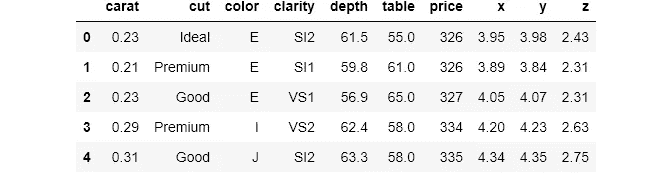

> 从现在开始，在每个函数的文档第一次出现时，我都使用了超链接。

## 熊猫`crosstab()`，基础知识

像许多计算分组汇总统计数据的函数一样，`[crosstab()](https://pandas.pydata.org/pandas-docs/stable/reference/api/pandas.crosstab.html)`处理分类数据。它可用于将两个或多个变量分组，并为每个组的给定值执行计算。当然，这样的操作使用`[groupby()](https://pandas.pydata.org/pandas-docs/stable/reference/api/pandas.DataFrame.groupby.html)`或`[pivot_table()](https://pandas.pydata.org/pandas-docs/stable/reference/api/pandas.pivot_table.html)`是可能的，但是正如我们将在后面看到的，`crosstab()`给你的日常工作流程带来了许多好处。

`crosstab()`函数接受两个或多个列表、`pandas`系列或 dataframe 列，并默认返回每个组合的频率。我总是喜欢从例子开始，这样你可以更好地理解定义，然后我会继续解释语法。

`crosstab()`总是返回一个数据帧，下面是一个例子。数据框是来自`diamonds`的两个变量的交叉列表:`cut`和`color`。交叉制表只是指取一个变量，将其分组显示为索引，取另一个变量，将其分组显示为列。

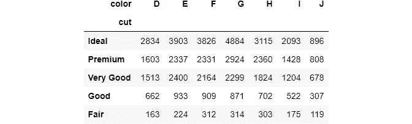

语法相当简单。`index`用于将变量分组并显示为索引(行)，与`columns`相同。如果没有给定聚合函数，每个单元格将计算每个组合中的观察值数量。例如，左上角的单元格告诉我们有 2834 颗 ***理想切割的*** 钻石，颜色代码为 ***D*** 。

接下来，对于每个组合，我们希望看到它们的平均价格。`crosstab()`提供`values`参数，以引入第三个数值变量进行汇总:

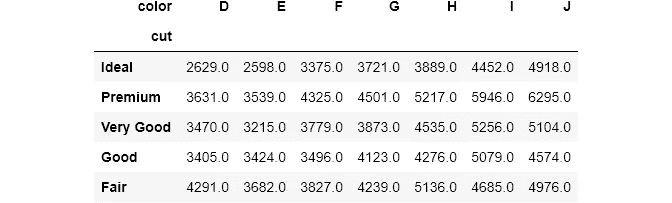

现在，每个单元格包含每种切割和颜色组合的平均价格。为了告诉我们要计算平均价格，我们将`price`列传递给`values`。请注意，您必须同时使用`values`和`aggfunc`。否则，您将得到一个错误。我还用`round()`把答案四舍五入了。

即使它有点高级，当您将它们传递到`seaborn`的热图中时，您将充分利用`crosstab()`表的好处。让我们在热图中查看上表:

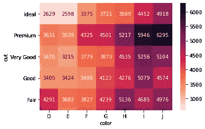

`seaborn`可以自动将`crosstab()`表格变成热图。我将注释设置为`True`，并用颜色条显示热图。`seaborn`还为列名和索引名添加样式(`fmt = 'g'`将数字显示为整数，而不是科学记数法)。

热图更容易解读。你不希望你的终端用户看着满是数字的表格时眼睛**流血。所以，我会在需要的时候把每个`crosstab()`结果放到热图中。为了避免重复，我创建了一个有用的函数:**

## 熊猫交叉表()与 pivot_table()和 groupby()的比较

在我们开始更有趣的东西之前，我想我需要澄清计算分组汇总统计的三个函数之间的区别。

我在文章的第一部分的[中提到了`pivot_table()`和`groupby()`的区别。对于`crosstab()`，三者的区别在于语法和结果的形状。让我们使用所有三个来计算最后一个`crosstab()`表:](/meet-the-hardest-functions-of-pandas-part-i-7d1f74597e92)

数据透视表的输出

交叉表的输出

我想你已经知道你的最爱了。`groubpy()`返回一个序列，而另外两个返回相同的数据帧。然而，可以将`groupby`系列转换成相同的数据帧，如下所示:

> 如果你不理解`pivot_table()`和`unstack()`的语法，我强烈建议你阅读文章的[第一部分](/meet-the-hardest-functions-of-pandas-part-i-7d1f74597e92)。

说到速度，`crosstab()`比`pivot_table()`快，但都比`groupby()`慢得多:

如你所见，即使与`unstack()`链接在一起，`groupby()`也比其他两个快 3 倍。这告诉我们，如果您只想分组和计算汇总统计数据，那么您应该使用相同的 ol' `groupby()`。当我链接其他方法如 simple `round()`时，速度差异甚至更大。

剩下的比较将主要是关于`pivot_table()`和`crosstab()`。如您所见，两个函数的结果形状是相同的。两者的第一个区别是`crosstab()`可以处理任何数据类型。

它可以接受任何类似数组的对象，如列表、`numpy`数组、数据框列(是`pandas`系列)。相比之下，`pivot_table()`只对数据帧有效。在一个有用的 StackOverflow [线程](https://stackoverflow.com/questions/36267745/how-is-a-pandas-crosstab-different-from-a-pandas-pivot-table)中，我发现如果你在一个数据帧上使用`crosstab()`，它会在后台调用`pivot_table()`。

接下来是参数。有些参数只存在于一个中，反之亦然。第一个最受欢迎的是`crosstab()`的`normalize`。`normalize`接受这些选项(来自文档):

*   如果通过`all`或`True`，将对所有值进行标准化。
*   如果通过,`index`将对每行进行标准化。
*   如果通过`columns`将对每一列进行标准化。

让我们看一个简单的例子:

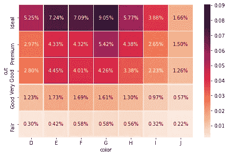

数量最多的钻石是带有 ***理想切工*** 和色码 ***G*** 的。

如果通过`all`，对于每个单元格，`pandas`将计算总量的百分比:

如果通过，`index`或`columns`，则按列或行执行相同的操作:

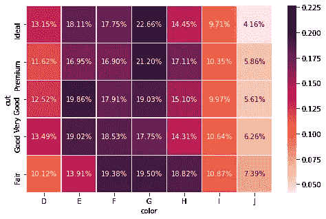

按行规范化。看来在几乎所有类型的钻石切工中，它们的最高编号都有颜色代码 ***G*** 。

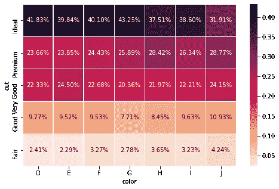

按列规范化。热图再次显示，在数据集中，对于每种颜色代码，理想切割的**钻石数量要高得多。**

在`crosstab()`中，您还可以使用`rownames`和`colnames`在函数中直接更改索引和列名。您不必在之后手动操作。当我们一次按多个变量分组时，这两个参数非常有用，稍后您将会看到。

参数`fill_value`只存在于`pivot_table()`中。有时，当您按许多变量分组时，不可避免地会有`NaN` s。在`pivot_table()`中，您可以使用`fill_value`将它们更改为自定义值:

但是，如果您使用`crosstab()`，您可以通过在数据帧上链接`fillna()`来实现同样的事情:

## 熊猫交叉表()，进一步定制

`crosstab()`的另外两个有用参数是`margins`和`margins_name`(两者也存在于`pivot_table()`中)。当设置为`True`时，`margins`计算每行和每列的小计。让我们看一个例子:

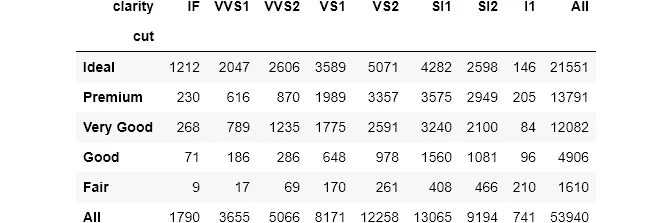

`pandas`自动添加最后一行和最后一列，默认名称为`All`。控制行为:

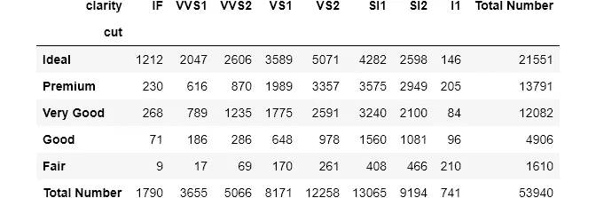

如果`normalize`被设置为`True`，右下角的单元格将始终包含观察的总数或 1:

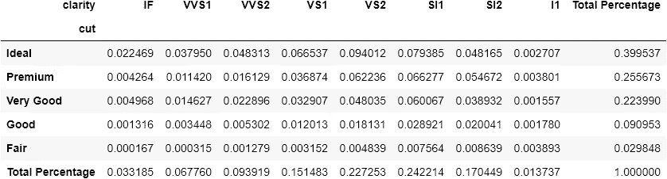

> 请注意，如果将`margins`设置为`True`，热图是没有用的。

## 熊猫`crosstab()`，多组

对于`index`和`columns`参数，可以传递多个变量。结果将是一个带有**多级索引**的数据帧。这次让我们插入所有的分类变量:

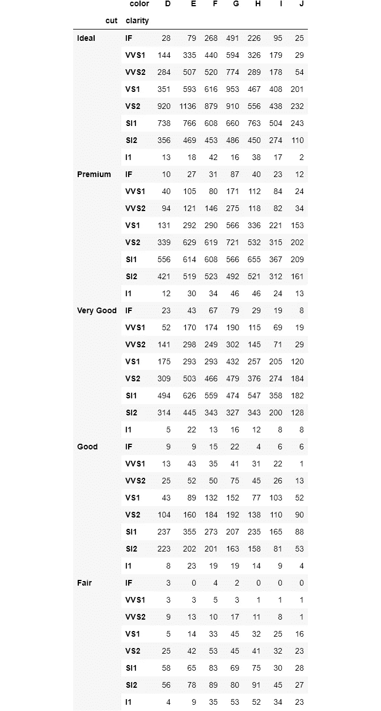

对于指数，我通过了`color`和`cut`。如果我将它们传递给`columns`，结果将是一个有 40 列的数据帧。如果您注意的话，多级索引如预期的那样被命名为`cut`和`clarity`。对于存在多级索引或列名的情况，`crosstab()`有方便的参数来更改它们的名称:

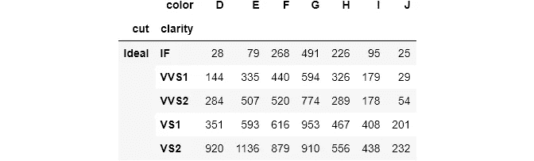

您传递一个相应名称的列表来将索引名称更改为`rownames`。对于控制列名的`colnames`,过程是相同的。

让我惊讶的一件事是，如果你把多个函数传递给`aggfunc`，`pandas`会抛出一个错误。再说一次，StackOverflow 上的人认为这是一个 bug，已经超过 6 年没有解决了。如果你有任何想法，请在评论中留下，这样我们都可以学习🙌。

最后要注意的是，在`pivot_table()`和`crosstab()`中，都有一个`dropna`参数，如果设置为`True`，则删除所有`NaN`的列或行。

# 如果你喜欢这篇文章，请分享并留下反馈。作为一名作家，你的支持对我来说意味着一切！

阅读更多与主题相关的文章:

 [## 认识熊猫最难的功能，第一部分

### 掌握 pivot_table()、stack()、unstack()的时机和方式

towardsdatascience.com](/meet-the-hardest-functions-of-pandas-part-i-7d1f74597e92)  [## 认识熊猫最难的功能，第二部分

### 掌握交叉表的时间和方式()

towardsdatascience.com](/meet-the-hardest-functions-of-pandas-part-ii-f8029a2b0c9b)  [## 认识熊猫最难的功能，第三部分

### 形状像果冻的桌子有熊猫旋转()和融化()

towardsdatascience.com](/shape-tables-like-jelly-with-pandas-melt-and-pivot-f2e13e666d6)  [## 掌握连接:Pandas 合并、连接、追加方法

### 从半连接/反连接到验证数据合并

towardsdatascience.com](/masteriadsf-246b4c16daaf)  [## 我习惯如何将数据与熊猫绑定

### 您可能只使用了默认值

towardsdatascience.com](/how-i-customarily-bin-data-with-pandas-9303c9e4d946)  [## 来自 Kagglers:DS 和 ML 的最佳项目设置

### 来自顶级 Kagglers 的项目成功最佳实践的集合

towardsdatascience.com](/from-kagglers-best-project-setup-for-ds-and-ml-ffb253485f98)