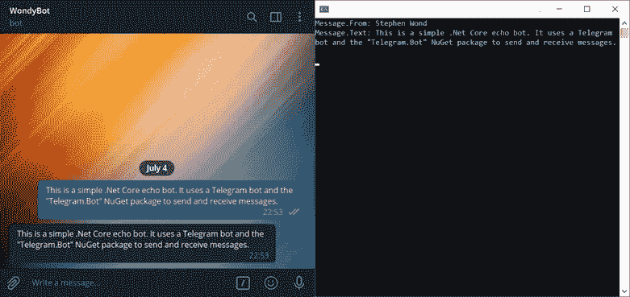
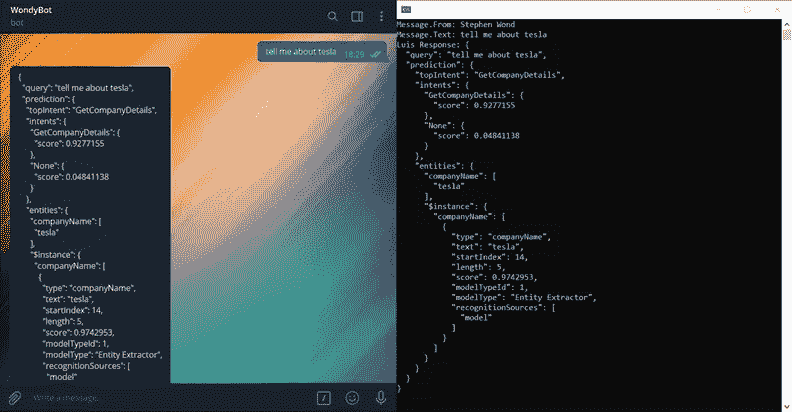
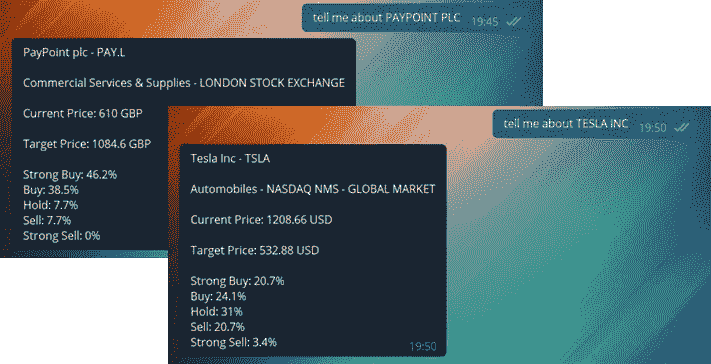
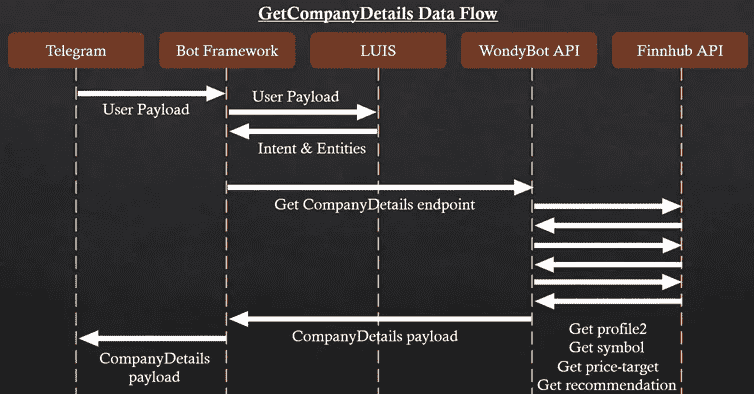
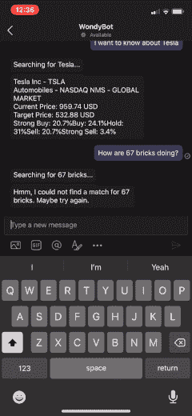

# 遇见奇妙机器人

> 原文：<https://towardsdatascience.com/meet-wondybot-ae5301261cf?source=collection_archive---------69----------------------->

[梁杰森](https://unsplash.com/@ninjason?utm_source=medium&utm_medium=referral)在 [Unsplash](https://unsplash.com?utm_source=medium&utm_medium=referral) 上的照片

## 这是一个软件开发人员如何构建聊天机器人来帮助管理股票投资组合的故事。由 LUIS、Bot Framework、Azure 等免费微软工具提供支持。

## 什么是奇妙机器人

简单来说，WondyBot 就是一个聊天机器人(不，真的)。我的梦想是创建一个聊天机器人，跟踪我的股票和股票投资组合，提醒我任何价格变化，给我公司的详细信息和新闻，分析和推荐新的潜在机会。关键是所有的功能都可以使用成熟的用户界面，比如 Telegram 和 Facebook Messenger。

这个概念很好，令人兴奋，所以我直接开始工作。这是我的第一个错误。我试图创造所有的功能，完美的第一次。我浪费了太多时间瞄准最终产品，而不是把它作为一个学习平台。我开始创建一个能够做任何事情的后端 API，然后我陷入了困境，因为我既没有知识也没有经验知道聊天机器人应该如何端到端地工作。

我后退了一步；我着手进行概念验证(POF)。

## WondyBot 1.0 (POF)

我想实现的第一部分是，根据要求，以电报形式返回公司简介。这包括 3 个关键要求:

1.  允许与电报机器人通信。
2.  理解用户的意图。
3.  检索上市公司的市场数据。

1 Telegram 可以让你创建一个免费的机器人，甚至不需要离开他们的应用程序，你所要做的就是和他们出色地命名为 [*的机器人父亲*](https://core.telegram.org/bots) "交谈。然后我利用 webhooks 和“ [*电报创建了一个. Net 核心控制台应用程序。Bot*](https://www.nuget.org/packages/Telegram.Bot/) " NuGet 包。我使用 [*这个演练*](https://www.c-sharpcorner.com/article/getting-started-with-telegram-chat-bot-and-net-core-3/) 让我的 C#代码与我的电报机器人对话，创建了一个简单的 echo 机器人:

Telegram Desktop(左)已经向命令行(右)发送了一条消息，在那里返回文本。*作者图片*

但是，本演练在尝试响应用户输入时使用了一组 IF/ELSE 语句。它给了我们一个起点，但是对用户来说会很痛苦，对开发者来说更是如此。

2 怎么才能绕过这个——进入[路易斯 T5！这是微软的自然语言理解产品。外面有几个，其中一个是 IBM Watson 我的朋友(](https://www.luis.ai/) [Stephen Chapendama](https://medium.com/u/f0493e7e1c22?source=post_page-----ae5301261cf--------------------------------) )在他的无代码聊天机器人尝试中走了这条路，你可以在这里 阅读它 [*。*](/how-i-tried-to-build-a-chatbot-named-thulani-to-manage-my-investment-portfolio-359f46b439d4)

那么，路易斯是怎么工作的？机器学习、自然语言处理和自然语言理解的神奇结合。使用 LUIS，您可以训练您的应用程序理解用户的自然语言，然后将意图和任何实体返回给您。你必须生成一个模型，其中包括给它用户输入的例子，但从那时起，它就像触及一个端点一样重要。 [*这个视频*](https://www.youtube.com/watch?v=MPa4RTnundo) 帮我搞定了 LUIS 的设置。

从 LUIS 端点返回的消息，包括意图(“GetCompanyDetails”)和实体(“companyName”)。*图片作者。*

正如你在上面看到的，LUIS 的回答是干净的(如果你已经用一个好的模型训练过它)。我们可以使用*意图*来调用一个方法，然后将*实体*作为变量传入。例如，像“ *GetCompanyDetails* ”这样的意图和像“ *companyName* ”这样的实体…

3 基于 [*这篇文章*](https://medium.com/@andy.m9627/the-ultimate-guide-to-stock-market-apis-for-2020-1de6f55adbb) ，我用 Finnhub 作为我的市场数据源。同样，您调用一个端点，API 返回一些数据，基本功能是免费的。我想返回一个更全面的公司简介，所以对公司详细信息的每个请求都涉及到对 Finnhub 的多次 API 调用。结合 Finnhub 数据和应用程序的其余部分，我可以生成以下输出:

我们如何通过 LUIS 和 Finnhub API 获取公司详细信息的示例。*图片作者。*

## WondyBot 2.0 (MVP)

我们的 POC 通过运行本地控制台应用程序为我们提供了简单的功能，但我们可以做得更好，对吗？对于这一部分，我们希望构建一个最小可行产品(MVP)，我们将遵循以下任务:

1.  允许用户和机器人之间的对话。
2.  将前端 Bot 和后端 API 分开。
3.  云中的主机。

1 没有办法问后续问题，比如“你是说…？”。坚持微软的主题，我研究了他们的 [*Bot 框架*](https://dev.botframework.com/) ，功能似乎非常适合。最大的吸引力之一是能够使用*通道*；处理与第三方应用程序(如 Telegram、Teams、Facebook Messenger)的所有连接。

最初的 [*微软的例子*](https://docs.microsoft.com/en-us/azure/bot-service/abs-quickstart?view=azure-bot-service-4.0) 对于 Bot 框架来说是如此容易直接在 Azure 中设置，不需要任何代码。然而，当谈到延长这一点，我不知所措。其他 [*微软示例*](https://github.com/Microsoft/BotBuilder-Samples/blob/master/README.md) ， [*YouTube 演练*](https://www.youtube.com/playlist?list=PLgF-CyaX1p3EGrRFze2DB5XWvBz1uwNhd) 甚至一个 [*Pluralsight 课程*](https://www.pluralsight.com/courses/microsoft-bot-framework-building-bots-getting-started-2019) 都无法让我通过编写一个 Bot 框架应用程序。也许我会在以后重新审视这一点…

最终偶然发现了来自微软的 [*Bot 框架作曲*](https://docs.microsoft.com/en-us/composer/) 。这是一个无代码的解决方案，而且它有 LUIS 的内置功能，让你可以直接发布到 Azure。我按照 [*这个教程*](https://www.youtube.com/watch?v=P-kKw2HGP3o&t=1767s) 让我在这里启动并运行。

转移到 Bot 框架意味着我能够干净地将我的关注点分开。我的意思是，我将原来的 Finnhub 功能重构为一个专用的 API，可以直接从 Bot 框架中调用。这与 MVC 架构有些相似之处，其中 **M** odel 是我们的专用 API，**V**view 是 Telegram UI，**C**controller 是 Bot 框架部分。

在我开发 API 的时候，我还添加了一种计算 Jaro-Winkler 距离的方法，使用了" [*F23。string similarity*](https://www.nuget.org/packages/F23.StringSimilarity/)“nu get 包。这使得用户不必完全按照列出的那样输入公司名称，也不必处理任何拼写错误。

WondyBot 2.0 中 GetCompanyDetails 函数的数据流。*作者图片*

3 我对 Azure 的体验比较基础。令人欣慰的是，微软团队已经使得从 Bot Framework Composer 和 Visual Studio 直接发布到 Azure 变得非常容易。

当从 Composer 部署到 Azure 时，您需要在发布应用程序之前执行一些初始步骤。 [*这个演练*](https://docs.microsoft.com/en-us/composer/how-to-publish-bot) 给你所有你需要的信息，不管你有没有 Azure 资源设置。

关于 API 到 Azure 的部署，在 Visual Studio 2019 内，可以设置连续部署。这使得部署代码更改变得快速而简单；您所要做的就是在源代码控制中提交您的主分支。对于这一部分，我的代码库在 GitHub 中，连接到 Azure DevOps 管道。这个来自微软的指南帮助了我。

尽管我在 Azure 中托管的所有东西都是免费的，但我在用默认设置设置资源时还是被发现了几次。如果你不确定，在你意外地积累了昂贵的账单之前，只需检查 Azure 中每个资源的服务计划。幸运的是，第一个月，微软会给你一些免费的学分。我的建议是，在这最初的一个月里，投入进去，尽可能多地玩。

完成所有这些步骤后，我就可以免费构建和托管这个 MVP 了。功能是基本的，但它确实完成了我们设定的目标:

向用户展示 WondyBot 的外观。*图片作者。*

## 接下来的步骤

WondyBot 的路线图是继续开发，增加额外的功能，如用户帐户和价格检查器。但是在我们看到这一点之前，我们需要解决当前机器人的一些问题。这些包括利用缓存来减少 FinnHub API 调用，以及为我们的。Net 核心 API。我将在接下来的几周内做出这些改变，随后会有帖子发布。

在这篇文章中，我们已经讲述了我如何制作我的第一个聊天机器人的基本步骤。在这篇文章中有很多链接，其中大部分都是有用的教程或例子，引导我到了这个阶段。我学到了很多，但我仍然觉得这只是第一步，我非常期待 WondyBot 的继续发展。

如果你正在尝试这样做，并且发现了一种新的或不同的做事方式，请在评论中告诉我们。