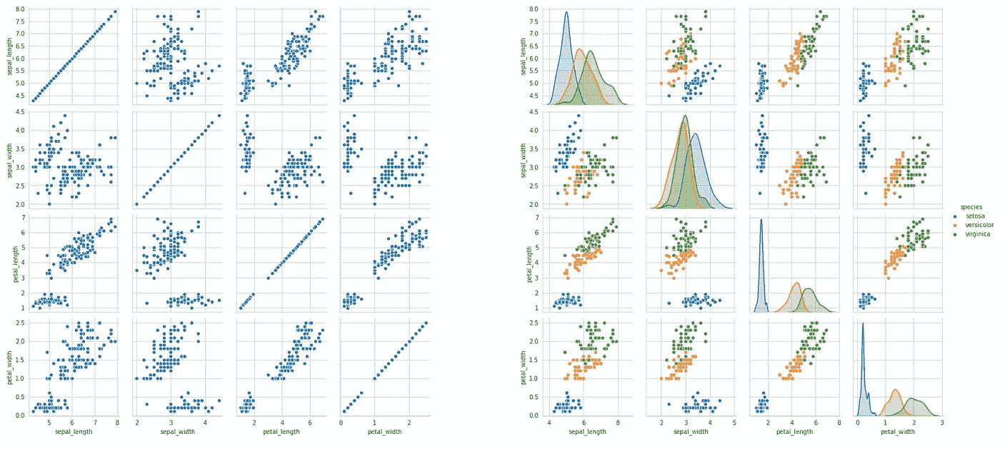
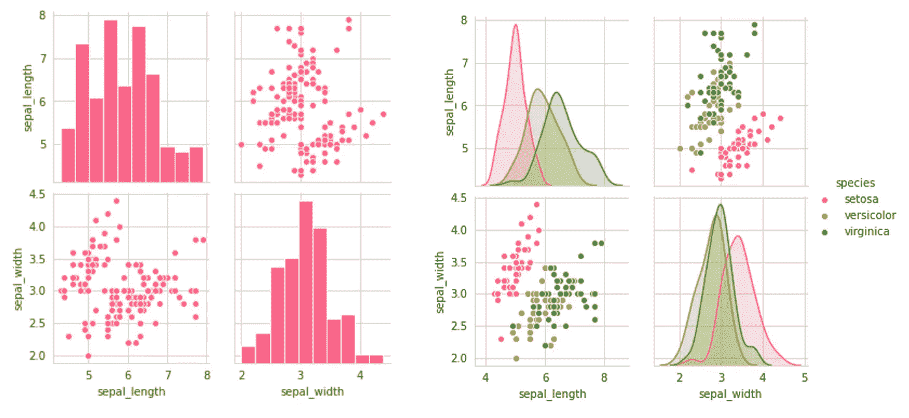
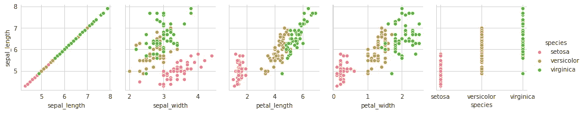
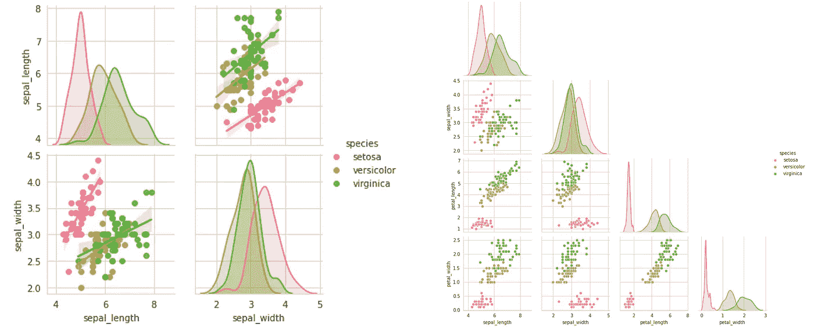
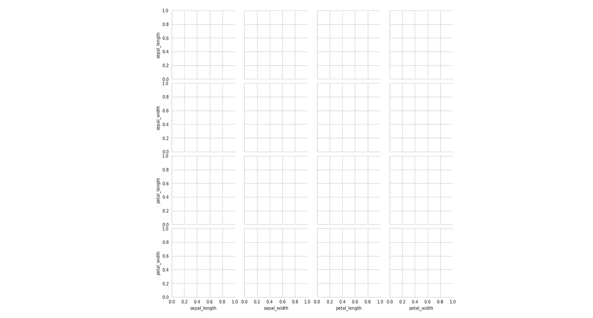
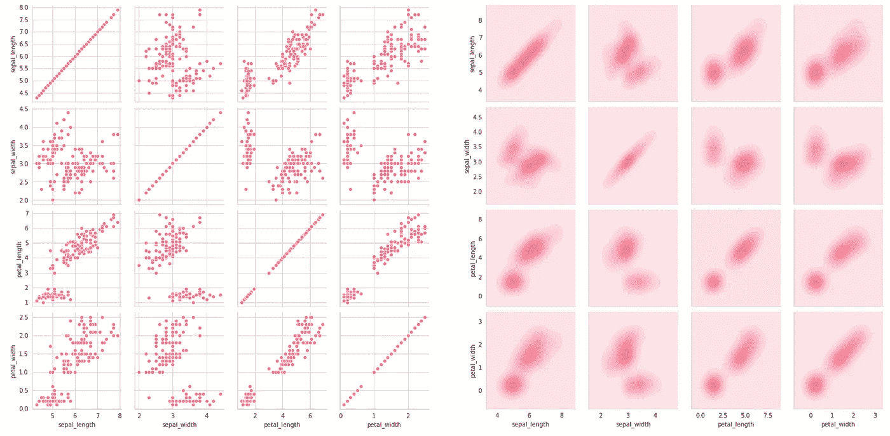
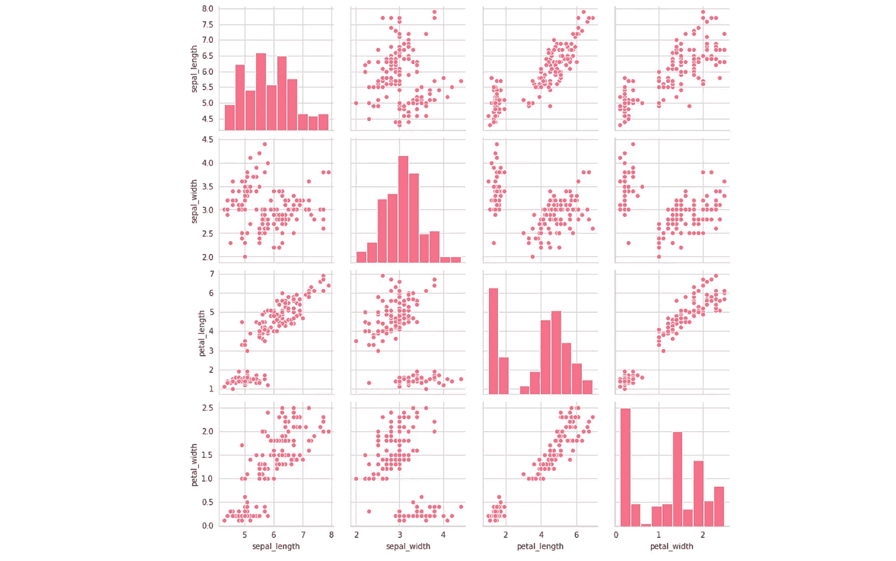
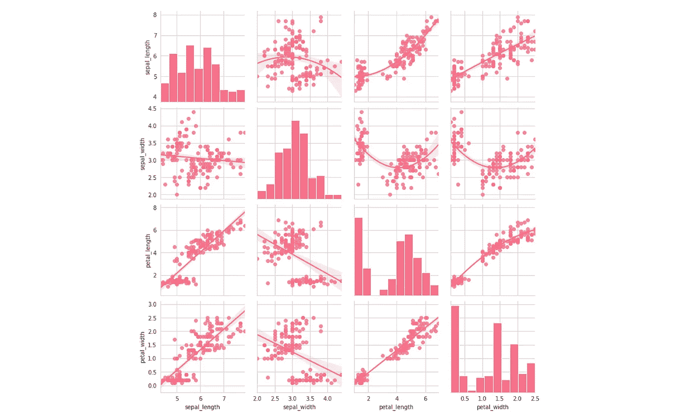
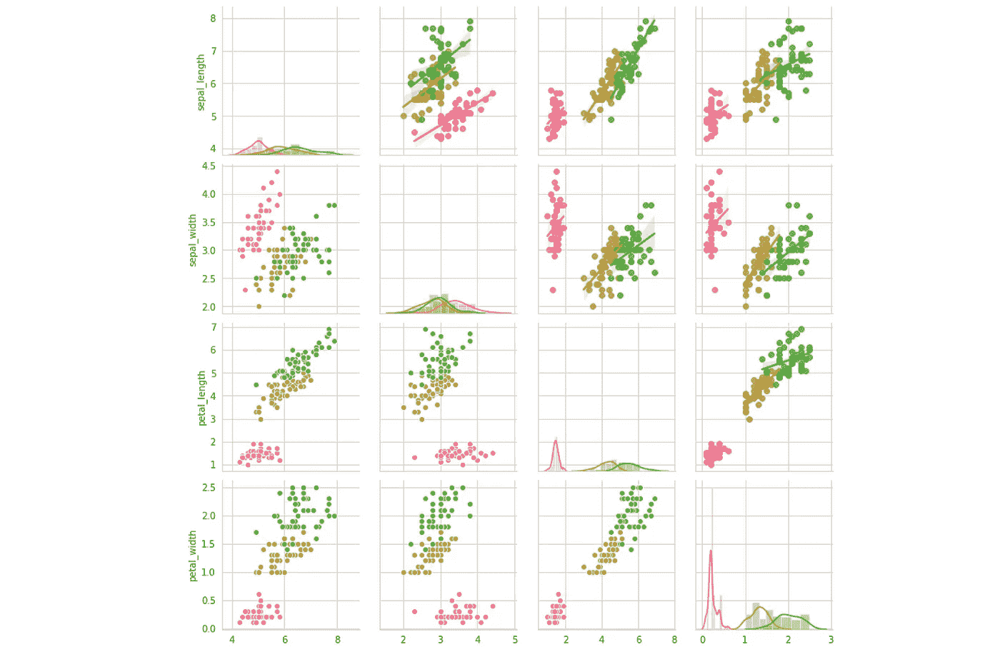

# 认识你新的最好的探索性数据分析朋友

> 原文：<https://towardsdatascience.com/meet-your-new-best-exploratory-data-analysis-friend-772a60864227?source=collection_archive---------28----------------------->

来源: [Unsplash](https://images.unsplash.com/photo-1427751840561-9852520f8ce8?ixlib=rb-1.2.1&ixid=eyJhcHBfaWQiOjEyMDd9&auto=format&fit=crop&w=1355&q=80)

## 轻松创作，丰富见解

可视化通常在数据科学和模型构建过程中发挥最小的作用，然而探索性数据分析的创造者 Tukey 特别提倡大量使用可视化来解决数字指标的局限性。

每个人都听说过——也理解——一张图片等于一千个单词，按照这种逻辑，数据的可视化至少相当于几十个统计指标，从四分位数到均值到标准差到均值绝对误差到峰度到熵。哪里有丰富的数据，当它被可视化时就能被最好地理解。

探索性数据分析是为了调查数据而创建的，强调可视化，因为它提供了更多的信息。这篇短文将介绍可视化 EDA 中最有用的工具之一，以及如何解释它。

Seaborn 的`pairplot`是神奇的:最简单地说，它为我们提供了数据中单变量和双变量关系的丰富信息可视化表示。例如，考虑下面两个用一行代码`sns.pairplot(data)`创建的`pairplot`(第二个添加了`hue=’species’`作为参数)。

基于这些观察到的属性，有如此多的关于数据的信息需要收集，无论是分类的成功(类之间有多少熵/重叠)、特征选择过程的潜在结果、方差，还是模型的最佳选择。pairplot 就像是多维空间的展开。

通常，人们会止步于一行代码对图，但是通过多几行甚至几个字的代码，我们可以收获更多的信息和见解。

首先，pairplots 可能会变得非常大。要选择要显示的变量子集，使用`vars`参数，该参数可以设置为一个变量名列表。例如，`sns.pairplot(data,vars=[‘a’,’b’])`将只给出两列`‘a’`和`‘b’`之间的关系，即`aa`、`ab`、`ba`和`bb`。或者，可以指定`x_vars`和`y_vars`(分别列出)作为每个轴的变量。

设置前两个图(设置`vars`参数)的结果是图的对称网格:

第三个图将 *y* 分量设置为仅一个变量`‘sepal_length’`，将 *x* 分量设置为数据的所有列。这将返回该列和所有其他列之间的交互。请注意，对于第一列(当它与自身配对时)和第五列(当它与分类变量配对时)，散点图不是合适的图。我们稍后将探讨如何处理这个问题。

通过在你的 pairplot 中添加一个`kind=’reg’`关键字，你可以得到数据的线性回归拟合。这是对数据的线性度和方差的一个很好的衡量，可以决定选择哪种类型的模型，有监督的和无监督的。此外，由于成对图是对称的，为了 a)消除图的混乱和 b)减少长时间的加载时间，设置`corner=True`删除右上半部分，这是一个重复。

回归图—左侧，角图—右侧

然而，`pairplot`在简单直观地显示变量之间的关系方面能力相对有限。它仅仅是一个访问`pairgrid`的接口，T5 才是“`pairplot`背后真正的生成器。通过`pairgrid`正确处理可视化可以产生有价值的结果。

seaborn 中的网格被初始化为一个变量，最常见的是`g`(用于网格)。例如，我们可以写`g=sns.PairGrid(data)`。当网格被初始化时，它们完全是空的，但是很快就会被可视化填充。网格是一种以高效和简洁的方式访问和可视化数据的跨特征方面的方法。

我们可以使用映射方法用数据填充网格。例如，调用`g.map(sns.scatterplot)`用散点图填充网格。我们也可以传入模型的参数:在`g.map(sns.kdeplot,shade=True)`中，shade 是`sns.kdeplot`的一个参数，但是它可以在映射中指定。由于这是一个网格，所有的数据都被整理出来；我们只需要调用情节的类型。

注意对角线仍然是散点图。我们可以通过对不在对角线上的图使用`g.map_offdiag(sns.scatterplot)`和对在对角线上的图使用`g.map_diag(plt.hist)`来改变这一点。请注意，我们可以使用其他库中的绘图对象。

我们可以做得更好。由于上半部分和下半部分是相同的，我们可以使用`g.map_upper`和`g.map_lower`改变上半部分和下半部分之间的绘图类型。在本例中，我们通过改变 seaborn 回归图中的`order`参数`regplot`，来比较二次回归和线性回归对相同数据的拟合。

要指定色调，我们可以将`hue=’species’`参数添加到 PairGrid 的初始化中。注意，我们不能做类似于`g.map(sns.scatterplot, hue=’species’)`的事情，因为映射只是数据的可视化，而不是数据的再处理。所有的数据都是在网格初始化时处理的，所以所有与数据相关的东西都必须在那时处理。

Pairgrids 通常用于构建复杂的图，但对于 EDA 而言，所涵盖的操作应该足够了。

通过多几行代码，您已经能够最大化从 pairplot 和 pairgrids 中获得的信息。这里有一些建议，可以让你从中获得尽可能多的洞察力。

*   寻找可用于提高模型性能的曲率和变换(例如 Tukey 的幂阶梯)。
*   根据功能在整行或整列中的表现来处理功能。例如，`petal_width`和`petal_length`在沿着它们指定的轴分离类方面表现很好，在所有其他特性方面也很好。对于`sepal_width`来说就不一样了，在那里沿着它们的轴有很多重叠。这意味着它提供的信息更少，这可能是我们运行特征重要性的好理由，如果它在预测能力方面提供的提升可以忽略不计，则删除它。
*   找出回归拟合中有多少数据点发生了变化(您也可以尝试不同的程度)，以直观地了解数据的稳定程度。如果数据点与拟合相差很大和/或拟合程度必须很高才能很好地拟合数据，使用标准化或规范化等方法可能会有所帮助。
*   花相当多的时间查看数据的可视化二元表示，玩比较和图表类型。你可以对你的数据做无数的操作，EDA 的目的不是给你答案，而是激发你采取特定行动的兴趣。数据每次都不一样；没有适合所有尺寸的标准程序。

*文章正文中的所有数字均由作者创作。*

感谢您的阅读，请在回复中告诉我您的想法！

如果你对最新的文章感兴趣，可以考虑订阅。如果你想支持我的写作，通过我的[推荐链接](https://andre-ye.medium.com/membership)加入 Medium 是一个很好的方式。干杯！

 [## 大多数人都不知道的 5 个鲜为人知的海边小镇

### 但是真的应该知道

medium.com](https://medium.com/analytics-vidhya/5-lesser-known-seaborn-plots-most-people-dont-know-82e5a54baea8)  [## 用一行代码彻底美化可视化效果:设计情节

### 制作吸引人的情节从未如此容易

medium.com](https://medium.com/analytics-vidhya/drastically-beautifying-visualizations-with-one-line-styling-plots-35a5712c4f54)