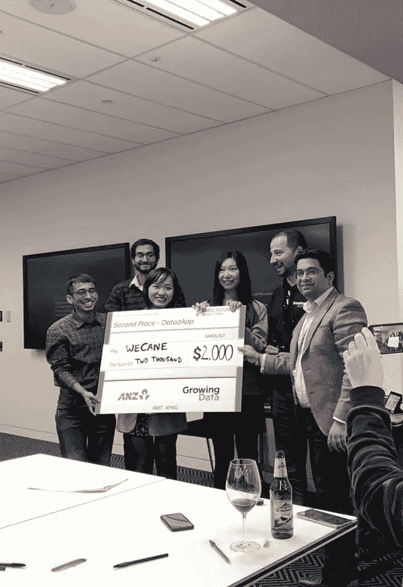
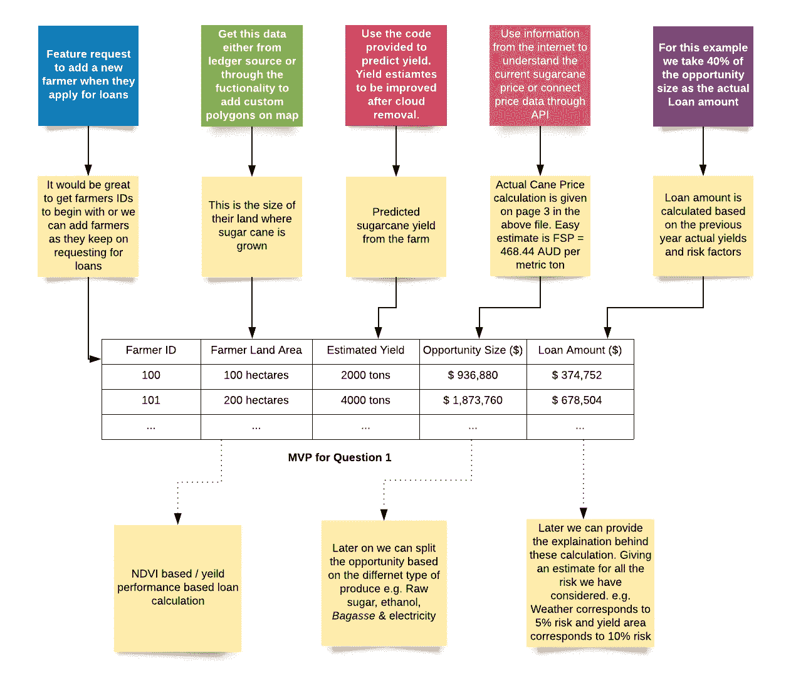

# 墨尔本 Datathon 2019 赢家乳品店

> 原文：<https://towardsdatascience.com/melbourne-datathon-2019-winners-dairy-6b1ecf1d8c4d?source=collection_archive---------68----------------------->

作者照片

> 免责声明:这是一个关于“WeCane”在墨尔本数据马拉松比赛的旅程中分享的经验的过期博客。读者可以期望了解我在提交中成功采取的步骤。

去年我有一个目标:赢得墨尔本数据马拉松比赛。

我的第一个任务是建立一个伟大的团队:

一个伟大的团队是这样的:团队成员有实现共同目标的正确动机、互补的技能组合以及良好的沟通和信任。为了建立一个团队，我需要了解我能带来什么价值，以及我们作为一个团队获胜所需的技能。

我对自己的分析思维、解决问题的技能和商业敏锐度充满信心，这些都是通过在各种项目和不同行业中的工作积累起来的。

我知道我可以将一个业务问题组织成一个技术问题，并创建一个具有合适价值主张的产品线框。以我的研究背景，我确信我可以找到合适的机器学习方法来解决任何数据问题。

我寻找的补充技能是软件开发技能、精致的视觉设计技能和数据工程技能，这些都是构建一个伟大的产品所需要的。

我联系了我信任的人，非常幸运的是，我的团队中有雷倩、Rohan Kirpekar 和 Anh Phuong Tran。王乐天、萨蒂扬·库马尔和胡厅也是该团队的一员，在构思、研究和数据工程方面做出了一定的贡献。我还要特别感谢 Deepak Kumar Singh 和 Akshit Vijay，他们在产品开发过程中向我们提供了咨询和帮助。

**队员介绍:**

*   *雷，软件开发人员，有十二年产品开发经验。*
*   *Rohan 是一名经验丰富的技术顾问，拥有计算机科学背景。*
*   *Anh 是一名热衷于数据可视化的数据分析师。*
*   *乐天是一名有心理学背景的数据工程师。*
*   *Satyam 是一名热情的数据分析师，有许多创造性的想法。*
*   *Ting 是一名商业分析师，拥有解决问题和提供咨询的经验。*

有了正确的团队和祝福我们的朋友的支持，我非常有信心我们拥有获胜的所有必要因素。

**第二步是确定具体的问题陈述并设计解决方案**

这部分是最让我兴奋的，因为我喜欢创造性地解决问题。我对处理新问题和研究任何可能的解决方案感到非常兴奋。给我们的问题陈述是构建一个使用时空数据(卫星数据)的应用程序，帮助昆士兰的甘蔗农。澳大利亚 95%的糖产于昆士兰州，甘蔗是仅次于小麦的第二大出口作物，为澳大利亚经济贡献了 25 亿美元。成长数据和 ANZ 银行是这份出色的问题陈述的设计者。

我喜欢这个问题陈述，因为我从事过卫星图像处理的工作，利用数据科学革新农业是我一生的使命。

没有太多的延迟，我们的团队开始工作；在我们最初的几次会议中，我们完全致力于构思和思考我们可以为农民或银行家建立的可能的解决方案。

我们尝试了各种想法，从土地剖面监测到依赖天气预报的产量计算。

只是在进行市场调查后，我们遇到了农业融资没有固定指导方针的主要问题，这导致银行的运营成本高，农民的贷款审批延迟。到 2024 年，全球糖需求预计将达到 1.996 亿吨。因此，为了满足日益增长的需求，向甘蔗种植者提供适当的融资至关重要。因此，我们的目标是建立一个解决融资问题的产品。

我们决定结合预测收益估计和贷款风险估计这两个想法来为解决方案应用程序创建 MVP。

作者照片

**第三步弄脏(脏)数据**

现在我们进入文章中数据科学有趣的部分。我不知道你是否曾经处理过卫星数据，但这是一种与任何其他数据格式完全不同的体验，你有图片，你有时间，然后你有云。那些该死的云，我们花了前两个月的大部分时间来识别和清除这些云，以创建一系列无云的图像，可用于产量预测。

我们首先用 python 从头开始创建云检测和移除的代码，进展并不顺利。在我们谷歌 StackOverflow 上的调试过程中，我们发现了令人难以置信的 python 库‘Sentinal Hub’。该库一手将我们的测试和原型制作时间减少了 10 倍。在找到这个库之前，我们面临着在我们的吝啬鬼笔记本电脑上处理大量高维数据的问题。我们还升级到使用 Colabs 免费 GPU，以减少实验不同设置的云检测和删除算法的时间。

在尝试了各种技术一段时间后，我们开始看到高质量的结果可以释放图像。下一步是将图像转换成用于建模的面板数据序列。

与此同时，我们不得不筛选出那些已经收获甘蔗的地区。因此，我们使用种植数据提供的代码来生成甘蔗掩膜，并且只使用 sentinal two 卫星所有波段的两年数据作为我们建模的输入数据。

为了提高产量预测的准确性，我们将每个卫星数据切片分成更小的 8x8 立方体，并存储像素和波段信息及其坐标。

雷是这个问题建模部分的主要负责人。她尝试了线性回归和 Arima 等经典回归模型，后来又尝试了 xgboost 和 Random forest 等决策树模型。

每种建模技术的性能:

1.)Arima 没有意识到数据的复杂性

2.)基于样条的线性回归—低估且无法确定数据结构的复杂性

3.)Xgboost —表现优于 Arima 和线性回归，但总是低估

4.)随机森林—能够了解数据结构的复杂性，预测值接近真实值

请参见下面我们解释建模实验和结果的演示:

Prezi 演示文稿嵌入|由作者创建

使用 2016-2017 年数据训练模型并测试 2018 年的实际产量，比较了预测的准确性。当模型的准确性在合理的误差范围内时，我们停止了进一步的实验。然后使用相同的建模技术在 2017-2018 数据集上训练模型，以预测 2019 年的值。

**第四步工具设计和开发**

我不会深入讨论这一部分的细节，但我可以给出我们在开发该工具时遵循的基本设计架构:

> 数据源(Sentinal hub)——如前所述，数据来自 Sentinal hub
> 
> Flask API(后端)—我们决定使用 flask API，因为所有的处理和分析都是在 python 中完成的，并且便于集成
> 
> HTML、Javascript、CSS(前端)
> 
> Heroku(部署)-原型应用的简单部署

要查看该工具的实际运行情况，请单击下面的链接

【https://sugarcaneapp.herokuapp.com/loan 号

**第五步演示**

来到决赛阶段是一个很大的荣誉，因为有这么多有才华的参与者的美丽作品。我非常钦佩我们决赛选手的创造力。

介绍分为两部分。一个是制作一个 5 分钟的视频来解释该工具，另一个是 10 分钟的演示来解释该工具的优点以及我们是如何构建该工具的。我们在一天前聚在一起练习我们的最后一次演讲，这很棒，尽管在演讲前的最后几分钟有些紧张，但我很高兴我们的表演完美无瑕。我要再次感谢我的团队成员雷、Anh 和 Rohan，感谢他们的辛勤工作和坚持不懈。

[https://www.youtube.com/watch?v=W9-CfppFx7g](https://www.youtube.com/watch?v=W9-CfppFx7g)

希望你喜欢这篇长文，并为你明年的数据马拉松参赛作品提供一些想法。

最后，我们仍在努力改变农民的生活，如果你感兴趣，请联系我们。迪帕克·辛格和我正在进行“Krishiguru”项目，我们的目标是提供可以用于农业部门更好决策的见解。

你可以在 https://www.facebook.com/KrishiGuruIndia 的脸书页面找到我们:。

**相关阅读:**

[数据通指南](https://medium.com/satellite-intelligence/datathon-guide-ac6539cfd623)

[墨尔本数据通网站](http://www.datasciencemelbourne.com/datathon/)

[第一名获奖者博客](https://medium.com/@qwe16165850/melbourne-datathon-2019-1st-place-solution-experience-share-f9b46c90d071)