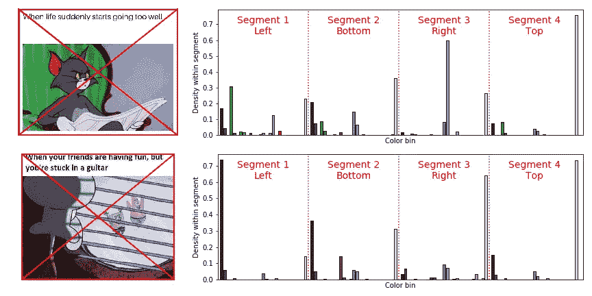
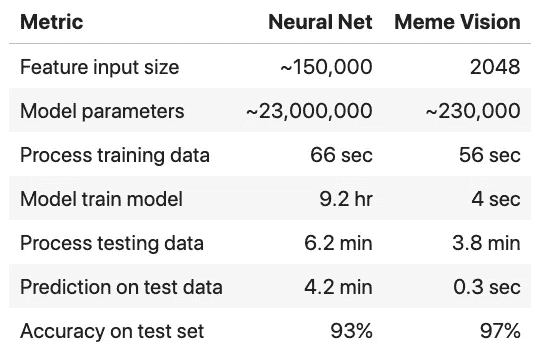
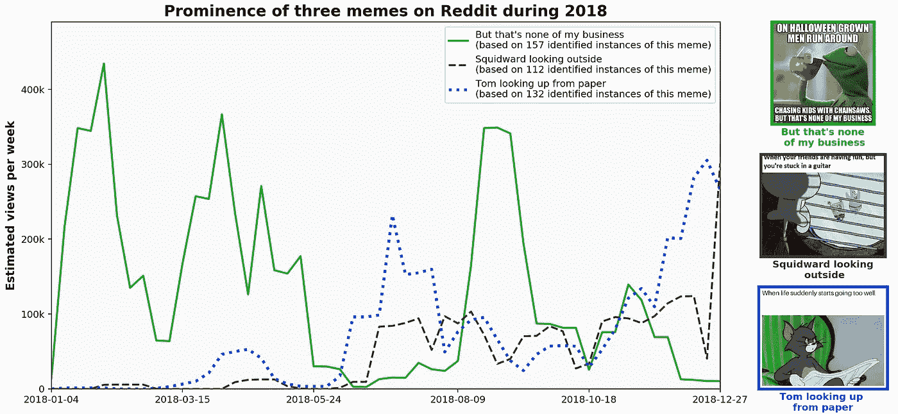

# 迷因视觉:对迷因进行分类的科学

> 原文：<https://towardsdatascience.com/meme-vision-framework-e90a9a7a4187?source=collection_archive---------36----------------------->

## 图像识别并不总是需要神经网络；使用更简单的模型可以实现效率和准确性

以电视节目中的角色为特色的迷因，在[公平使用原则](https://www.copyright.gov/title17/92chap1.html#107)下，出于教学目的在此复制是允许的

作为一个文化和科学的人，我决定建立一个识别迷因的模型。这个问题比[图像网](http://image-net.org/challenges/LSVRC/)竞赛简单得多，因此一个更简单的解决方案是合适的。我将通过比较“Meme Vision”框架和[ResNet-50](https://arxiv.org/abs/1512.03385)(2015 年 Image-Net 的获胜者)来证明这一点。

## 方法:模因愿景框架

在以前的文章中，我解释了径向直方图方法；

 [## 径向颜色直方图

### 当颜色、构图和计算对你的计算机视觉问题都很重要时——径向减少表示…

towardsdatascience.com](/radial-color-histograms-a3ab0441516) 

(TL；DR —它测量图像每个部分的颜色分布)

下面我们来看看这是如何将图像缩小到非常低的维度的。

基本径向颜色直方图示例，每个颜色通道有 3 个面元和 4 个段(给出 4*3 =108 个特征)

最终的迷因愿景模型使用了几个额外的步骤:

*   从 RGB 转换到 HSV-当在 HSV 调色板中查看时，颜色退化对计算机来说不是问题。
*   像素计数的对数转换有助于关注细微差异。
*   每个通道使用 8 个箱(而不是 3 个)来区分相似的颜色阴影，这将产生 2048 个特征(而不是 108 个)。
*   将这些特征馈入线性[支持向量机](https://en.wikipedia.org/wiki/Support_vector_machine)。

如何制作和测试你自己的 MemeVision 模型

使用此程序包处理的径向颜色直方图特征[。(下面用于比较的 ResNet-50 传输是使用 Tensorflow](https://github.com/gmorinan/radialColorHistogram) 实现的[)。](https://www.tensorflow.org/)

## 结果:Meme Vision vs ResNet-50 转移

将 Meme Vision 的性能与基于 ResNet-50 的神经网络进行比较(仅训练最后一层 80 个时期)。[所使用的数据集由 115 个标签下的 5716 个模因组成](https://www.kaggle.com/gmorinan/memes-classified-and-labelled) —我们只使用 20%进行训练，其余的作为测试集。

毫不奇怪，在迷因愿景框架下，训练和预测的速度要快几个数量级。准确性的差异并不重要，如果让神经系统训练更长时间，它肯定会胜过迷因视觉。

数据集:

 [## 迷因的分类和标签

### 从 Reddit 抓取图像和元数据，然后使用图像识别进行分类

www.kaggle.com](https://www.kaggle.com/gmorinan/memes-classified-and-labelled) 

## 结论:重点是什么？

首先，如果你在一年时间里从 Reddit 抓取了 40 万张图片(像我一样)，然后使用 meme Vision 模型对每个 Meme 进行分类(像我一样)，然后交叉引用与每个图片相关的元数据(像我一样)，那么你就能够计算出每个 Meme 随着时间推移的相对受欢迎程度(见下文)。我的下一篇文章将更深入地研究这种迷因流行度分析的结果，以及一个具有重大文化意义的惊人发现。

其次，也是这篇文章的重点，如果我开始使用一个更复杂的模型，我所做的事情会更难。不可否认，在一些困难的边缘情况下，需要一个神经网络来识别一个迷因(例如，迷因被转换成黑白的)。但迷因愿景的要点是速度——它可以用来快速采摘所有低垂的果实，将困难的案例留给更强大、更昂贵的模型。

所以下次你遇到问题时，你的第一个想法是考虑[实现由](https://arxiv.org/abs/1710.09829) [Geoffrey Hinton(深度学习的教父)](https://www.utoronto.ca/news/how-u-t-s-godfather-deep-learning-reimagining-ai)设计的胶囊网络……也许停下来想一想“我的问题真的像 Geoffrey Hinton 正在解决的那样复杂吗？”。

*这与我在* [*机医科技*](https://machinemedicine.com/) *的工作无关。*