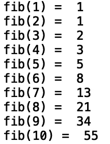
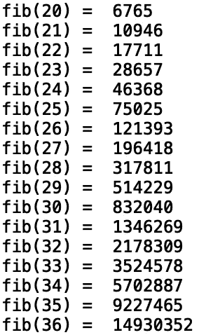
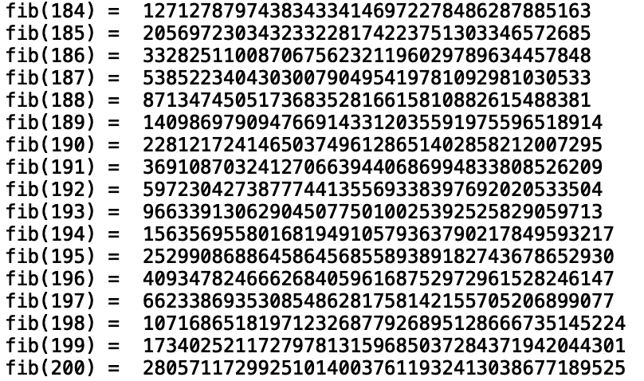

# Python 中的记忆化

> 原文：<https://towardsdatascience.com/memoization-in-python-57c0a738179a?source=collection_archive---------1----------------------->

## 记忆入门


[来源](https://www.pexels.com/photo/camera-photography-vintage-travel-46794/)

记忆化(Memoization)是唐纳德·米基(Donald Michie)在 1968 年引入的一个术语，它来自拉丁语单词备忘录(要记住)。记忆是计算机科学中使用的一种方法，通过存储(记住)过去的计算来加速计算。如果使用相同的参数进行重复的函数调用，我们可以存储以前的值，而不是重复不必要的计算。在这篇文章中，我们将使用记忆化来寻找斐波那契数列中的项。

我们开始吧！

首先，让我们定义一个递归函数，我们可以用它来显示斐波纳契数列中的第一个 *n* 项。如果你对递归不熟悉，可以看看这篇文章:[*Python 中的递归*](/recursion-in-python-b026d7dde906) *。*

提醒一下，斐波纳契数列是这样定义的，每个数字都是前两个数字的和。例如，斐波纳契数列的前 6 项是 1，1，2，3，5，8。我们可以将递归函数定义如下:

```
def fibonacci(input_value):
    if input_value == 1:
        return 1
    elif input_value == 2:
        return 1
    elif input_value > 2:
        return fibonacci(input_value -1) + fibonacci(input_value -2)
```

这里我们指定了基本情况，即如果输入值等于 1 或 2，则返回 1。如果输入值大于 2，则返回对前两个斐波那契值求和的递归函数调用。

现在，让我们打印前 10 个术语:

```
for i in range(1, 11):
     print("fib({}) = ".format(i), fibonacci(i))
```



这似乎运行良好。现在，让我们尝试显示前 200 个术语:

```
for i in range(1, 201):
     print("fib({}) = ".format(i), fibonacci(i))
```



我们将会发现，在 fib(20)之后，后续计算将会比之前的计算花费更长的时间。这是因为每次后续计算我们都在做重复的工作。

考虑递归函数如何计算每一项:

纤维(1) = 1

纤维(2) = 1

纤维(3) =纤维(1) +纤维(2) = 2

纤维(4) =纤维(3) +纤维(2) = 3

纤维(5) =纤维(4) +纤维(3) = 5

注意，对于 fib(5 ),我们重复 fib(4)和 fib(3)的计算。如果我们有办法在计算时记住/存储这些值，我们就会避免重复计算。这就形成了记忆法的动机。

现在让我们浏览一下实现记忆化方法的步骤。为了继续，让我们初始化一个字典:

```
fibonacci_cache = {}
```

接下来，我们将定义记忆函数。首先，我们检查作为字典键的输入是否存在于字典中。如果键存在，我们返回对应于输入/键的值:

```
def fibonacci_memo(input_value):
        if input_value in fibonacci_cache:
            return fibonacci_cache[input_value]
```

接下来，我们定义基本案例，它们对应于前两个值。如果输入值是 1 或 2，那么我们将该值设置为 1:

```
def fibonacci_memo(input_value):
    ... if input_value == 1:
        value = 1
    elif input_value == 2:
        value = 1
```

接下来，我们考虑递归情况。如果输入大于 2，我们将该值设置为等于前两项之和:

```
def fibonacci_memo(input_value):
    ...
    elif input_value > 2:           
        value =  fibonacci_memo(input_value -1) + fibonacci_memo(input_value -2)
```

最后，我们将该值存储在字典中并返回该值:

```
def fibonacci_memo(input_value):
    ...
    fibonacci_cache[input_value] = value
    return value
```

完整的功能是:

```
def fibonacci_memo(input_value):
    if input_value in fibonacci_cache:
        return fibonacci_cache[input_value]
    if input_value == 1:
            value = 1
    elif input_value == 2:
            value = 1
    elif input_value > 2:           
            value =  fibonacci_memo(input_value -1) + fibonacci_memo(input_value -2)
    fibonacci_cache[input_value] = value
    return value
```

现在，让我们尝试用新函数显示前 200 个术语:

```
for i in range(1, 201):
     print("fib({}) = ".format(i), fibonacci_memo(i))
```



在运行我们的脚本时，我们看到我们相当快地到达了序列中的第 200 项。

有一种更简单的方法可以用更少的代码实现记忆化。让我们考虑一下我们最初的递归函数:

```
def fibonacci(input_value):
    if input_value == 1:
        return 1
    elif input_value == 2:
        return 1
    elif input_value > 2:
        return fibonacci(input_value -1) + fibonacci(input_value -2)
```

我们可以从“functools”模块导入一个名为“lru_cache”的装饰器，它允许我们缓存我们的值。该名称代表“最近最少使用的缓存”。使用这个装饰器，我们可以获得与‘Fibonacci _ memo’方法相同的性能:

```
from functools import lru_cache[@lru_cache](http://twitter.com/lru_cache)(maxsize = 1000)
def fibonacci(input_value):
    if input_value == 1:
        return 1
    elif input_value == 2:
        return 1
    elif input_value > 2:
        return fibonacci(input_value -1) + fibonacci(input_value -2)for i in range(1, 201):
     print("fib({}) = ".format(i), fibonacci(i))
```


我们看到我们实现了相似的性能。我就讲到这里，但是我鼓励你自己去研究代码。

# 结论

总之，在这篇文章中，我们讨论了 python 中的记忆方法。首先，我们展示了在计算斐波纳契数列中的许多项之后，递归函数的简单实现是如何变得非常慢的。然后，我们定义了一个新方法，在这个方法中，我们将过去计算的值存储在一个字典中。这导致了计算的显著加速。然后我们讨论了“lru_cache”装饰器，它允许我们用更少的代码实现与“fibonacci_memo”方法相似的性能。如果你有兴趣了解更多关于记忆化的知识，我鼓励你去看看[苏格拉底的 YouTube 教程](https://www.youtube.com/watch?v=Qk0zUZW-U_M&t=302s)。我希望你觉得这篇文章有用/有趣。这篇文章中的代码可以在 [GitHub](https://github.com/spierre91/medium_code/blob/master/data_structures_and_algorithms/memo_fibonacci.py) 上找到。感谢您的阅读！