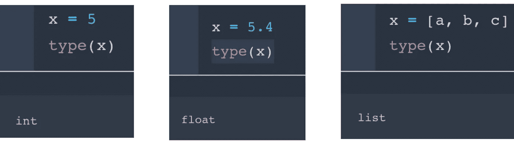
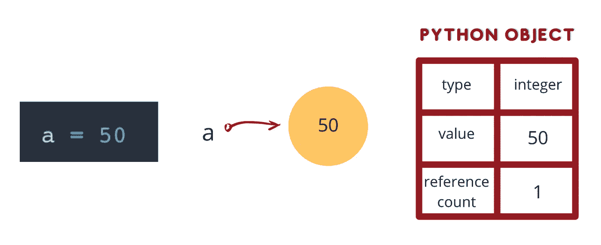
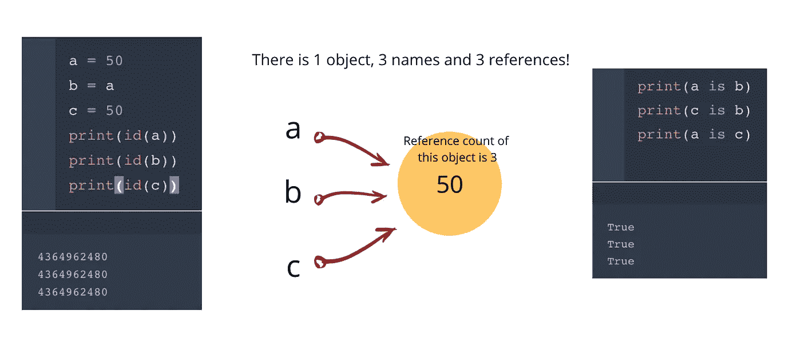
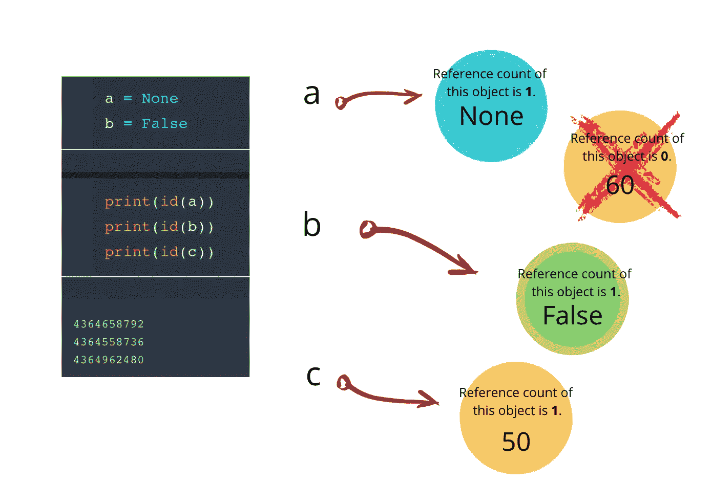
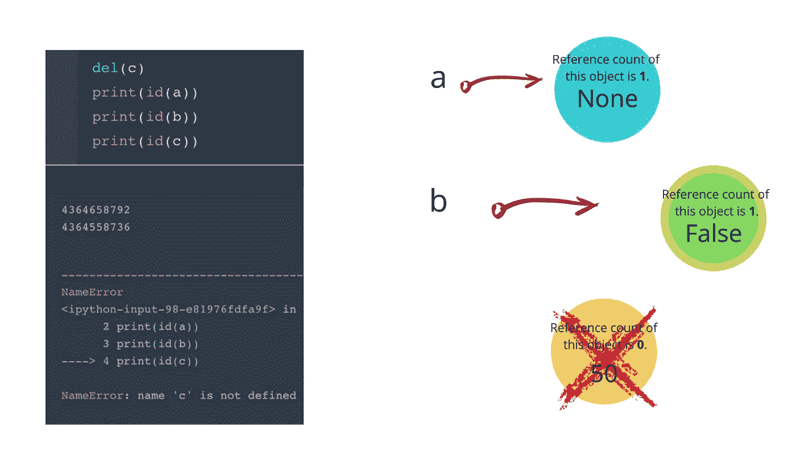
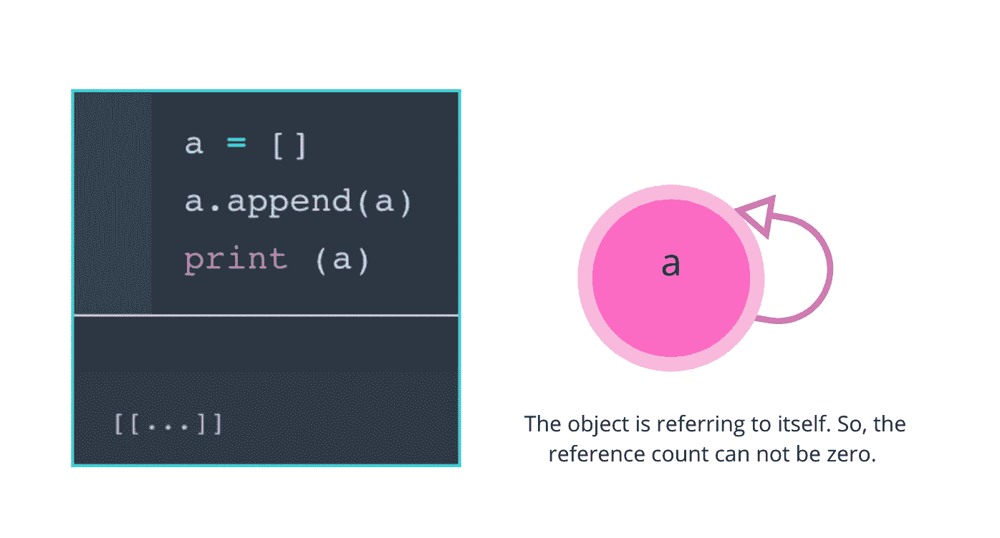
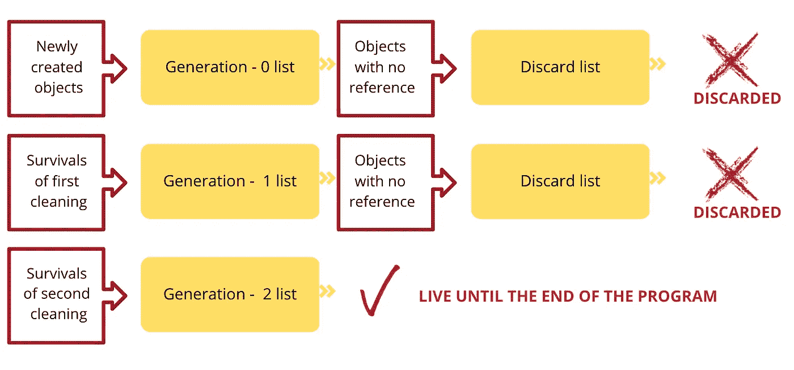

# Python 中的内存管理和垃圾收集

> 原文：<https://towardsdatascience.com/memory-management-and-garbage-collection-in-python-c1cb51d1612c?source=collection_archive---------2----------------------->

伯纳德·赫曼特在 [Unsplash](https://unsplash.com/@bernardhermant?utm_source=unsplash&utm_medium=referral&utm_content=creditCopyText) 上的照片

## 引用计数和分代垃圾收集

如果您在学习 Python 时有以下问题，那么您就来对地方了:

*   Python 中是如何管理内存的？
*   什么是垃圾收集？
*   哪些算法用于内存管理？
*   什么是循环引用？
*   Python 对象是如何存储在内存中的？

让我们看看我能否回答这些问题以及本文中的其他问题:

我从基础开始。

## Python 是一种动态类型语言。

当我们在 Python 中给变量赋值时，我们不声明变量的类型。它说明了程序运行时变量的种类。其他语言，如 C、C++、Java 等..在给变量赋值之前，有一个严格的变量声明。

正如你在下面看到的，我们只需要给一个对象分配一个变量，Python 就会检测这个对象的类型。

Python 动态检测对象的类型。图片由作者用 [Canva](https://www.canva.com/) 制作

## Python 对象是如何存储在内存中的？

在 C、C++和 Java 中，我们有变量和对象。Python 有名字，没有变量。Python 对象以名称和引用的形式存储在内存中。名称只是一个对象的标签，所以一个对象可以有多个名称。引用是指向一个对象的名称(指针)。

## 每个 Python 对象都有三样东西。

Python 对象有三样东西:类型、值和引用计数。当我们给一个变量命名时，它的类型会被 Python 自动检测出来，正如我们上面提到的。值在定义对象时声明。Reference count 是指向该对象的名称数。

每个 Python 对象都有三样东西。图片由作者用 [Canva](https://www.canva.com/) 制作

# 垃圾收集:

垃圾收集是在对象不再使用时释放内存。这个系统销毁未使用的对象，而*为新对象重用*它的内存槽。你可以把这想象成电脑中的回收系统。

Python 有一个自动化的垃圾收集。它有一个算法来释放不再需要的对象。Python 有两种方法从内存中删除不用的对象。

# 1.引用计数:

引用总是被计数并存储在内存中。

在下面的例子中，我们将 c 赋值为 50。即使我们赋一个新的变量，对象是一样的，引用计数增加 1！因为每个对象都有自己的 ID，所以我们打印对象的 ID 来查看它们是相同还是不同。

图片由作者用 [Canva](https://www.canva.com/) 制作

当我们像下面这样改变 **a** 的值时，我们创建了一个新对象。现在， **a** 指向 60，**b**c**指向 50。**

当我们将 **a** 改为 none 时，我们创建了一个 None 对象。现在前面的整数对象没有引用了，它被垃圾回收删除了。

我们将 **b** 分配给一个布尔对象。之前的整数对象没有被删除，因为它仍然有一个被 **c** 引用的对象。

图片由作者用 [Canva](https://www.canva.com/) 制作

现在我们删除 **c** 。我们将对 **c** 的引用计数减一。

图片由作者用 [Canva](https://www.canva.com/) 制作

如上所述， **del()** 语句并没有删除对象，它删除了对象的名字(和引用)。当引用计数为零时，对象被垃圾回收从系统中删除。

## 参考计数的商品和次品:

通过引用计数进行垃圾收集有优点也有缺点。比如容易实现。程序员不必担心删除不再使用的对象。但是，这种内存管理对内存本身是不利的！该算法总是计算对象的引用数，并将引用数存储在内存中，以保持内存的清洁，确保程序有效运行。

到目前为止，一切看起来都很好，但是…

## 有问题！

引用计数垃圾收集中最重要的问题是它在循环引用中不起作用。

## 什么是循环引用或引用循环？

这是一种物体指向自身的情况。最简单的循环引用是将一个列表附加到自身。

最简单的循环引用。图片由作者用 [Canva](https://www.canva.com/) 制作

单独的引用计数不能销毁具有循环引用的对象。如果引用计数不为零，则不能删除该对象。

这个问题的解决方案是第二种垃圾收集方法。

## 2.分代垃圾收集:

分代垃圾收集是一种基于跟踪的垃圾收集。它可以中断循环引用并删除未使用的对象，即使这些对象是自己引用的。

## 分代垃圾收集是如何工作的？

Python 跟踪内存中的每个对象。程序运行时会创建 3 个列表。第 0、1 和 2 代列表。

新创建的对象放在第 0 代列表中。为要丢弃的对象创建一个列表。检测到参考周期。如果一个对象没有外部引用，它将被丢弃。在此过程后幸存的对象被放入第 1 代列表中。相同的步骤适用于第 1 代列表。第 1 代列表中的幸存者被放入第 2 代列表中。第 2 代列表中的对象会一直保留在那里，直到程序执行结束。

分代垃圾收集。图片由作者用 [Canva](https://www.canva.com/) 制作

# 结论:

Python 是一种高级语言，我们不必手动进行内存管理。Python 的垃圾收集算法对于打开内存空间非常有用。垃圾收集在 Python 中以两种方式实现:引用计数和分代。当对象的引用计数达到 0 时，引用计数垃圾收集算法会立即清理该对象。如果你有一个循环，引用计数没有达到零，你等待分代垃圾收集算法运行并清理对象。虽然程序员不需要考虑 Python 中的垃圾收集，但是理解幕后发生的事情是很有用的。

希望我能回答文章开头的问题。对于您找不到答案的问题:

## 延伸阅读:

1.  Python 中的可变和不可变对象。

[这里的](https://medium.com/@307/mutable-and-immutable-objects-in-python-11412474b253)是一篇冷门却很棒的媒体文章

2.如何理解 Python 中的变量？

[这里](https://standupdev.com/wiki/doku.php?id=python_tuples_are_immutable_but_may_change)是一篇关于元组的有趣文章。

3.本地和全局命名空间。

这里是来自 realpython.com 的详细解释

4.跟踪垃圾收集。

[这里的](https://en.wikipedia.org/wiki/Tracing_garbage_collection)是指向“基于轨迹的算法”的维基百科链接。

5.堆栈和堆内存。

[这里](https://www.geeksforgeeks.org/how-are-variables-stored-in-python-stack-or-heap/)是 geekforgeeks 对“变量如何存储”的解释。

# 联系我

如果你想了解我的最新文章，请在 [Medium](https://seymatas.medium.com/) 上关注我。你可以在 [LinkedIn](https://www.linkedin.com/in/seyma-tas/) 上与我联系，并在**seymatas@gmail.com 给我发电子邮件！**

非常感谢您的任何建议和意见！