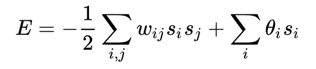
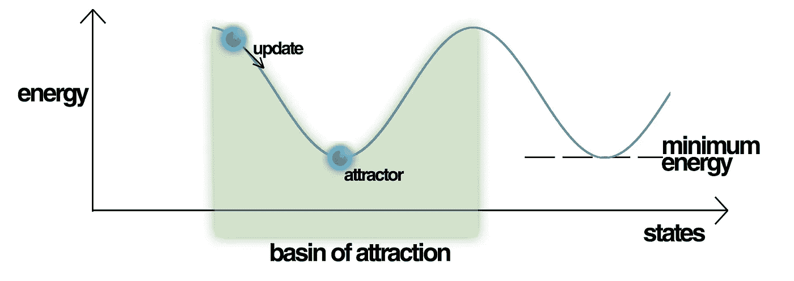

# 精神疾病和大脑动力学

> 原文：<https://towardsdatascience.com/mental-illness-and-the-dynamics-of-the-brain-cb41033fb650?source=collection_archive---------31----------------------->

## 神经网络如何帮助发展精神病学

由 [Unsplash](https://unsplash.com?utm_source=medium&utm_medium=referral) 上的[萨莎·弗里明德](https://unsplash.com/@sashafreemind?utm_source=medium&utm_medium=referral)拍摄的照片

我想我们现在都知道大脑是一个复杂的物体。

它由 800 亿个神经元连接而成，突触连接的数量惊人(估计有一千万亿个，这个数字太大了，隐喻已经没什么用处了)。每个突触都有自己复杂的子结构，信号从全身各处传入，各种化学物质四处漂浮，改变了传入信号的处理和重定向方式，不同的区域相互抑制和刺激，以在决定它们构成的人类的行为和感觉方面占据上风。

像大脑这样复杂的系统必须处理似乎无穷无尽的不同而复杂的任务，并且配备了如此大量的参数(突触连接、神经递质水平、外部刺激的结构、来自身体的感觉、短期和长期记忆)，这些参数必须平稳地相互作用以保证系统的功能，很明显，很多事情都可能出错。

当复杂性大量存在时，复杂的问题必然会出现。

此外，考虑到大脑是由进化的幻想虚构出来的，而不是由聪明的工程师以自上而下的方式建造的(就像计算机或智能手机一样)，新的大脑区域似乎是随机出现的，旧的区域被重新发挥功能以服务于新的目的，令人惊讶的是它的工作效果如此之好。

## 心理健康问题

越来越清楚的是，心理健康是一个非常重要的话题，而且它不会很快消失。据估计，在 T4，40%的人(在现代西方社会)会有心理健康问题，需要在一生中接受治疗。随着美国抑郁症发病率、阿片类药物致死率和自杀率的上升，预期寿命在很长一段时间内首次下降，这是一个无可回避的话题。

在我更深入地探讨这个问题之前，有一个警告:在适当理解精神疾病的原因时，有一条微妙的线要走，我认为我们的社会在很大程度上没有做到这一点。传统上，心理健康问题的原因与大脑没有太大关系。人们被认为被邪恶的灵魂和魔鬼所控制。有时他们被指责为缺乏品格(就像第一次世界大战中成千上万因怯懦而被处决的饱受炮弹惊吓和精神创伤的士兵一样)或缺乏职业道德，等等。

现在我并不支持对许多精神疾病如抑郁症的纯机械论观点。正如约翰·哈里的《失去的联系》*中所述，一个人抑郁可能有许多不同的原因，可能是现代社会越来越孤立，缺乏远见，创伤或悲伤没有得到处理。精神病发作同样与发病前的创伤事件密切相关。在某些情况下，精神“疾病”自然会出现(参见[关于“丧亲排除”的争议](https://www.ncbi.nlm.nih.gov/pmc/articles/PMC4204469/))，而将一切归咎于功能失调的大脑太容易了，是忽略了大脑背后的人的心理方面和情况。*

*但在其他情况下，我认为同样清楚的是，心理学的观点是没有用的，或者说并不总是找到正确治疗方法的最佳角度，至少一些精神疾病可以用大脑本身的功能障碍来最好地解释。治愈一个人的最佳方法是像对待任何其他疾病一样看待一种精神疾病:找出问题的生理根源，找到恢复健康功能的最佳干预措施，并通过药物或治疗手段应用这种干预措施。*

## *大脑是一个动力系统*

*让我们从两个核心假设开始:*

1.  *大脑是一个复杂的动力系统，伴随着所有的困难。*
2.  *神经动力学是大脑的计算语言。在大脑的动态、它执行的计算和它的涌现行为之间有一种因果关系。因此，动力系统的特性与认知有着内在的联系。*

*非线性动力系统伴随着一些反直觉的，难以预测的效应，这些效应是由许多相互作用的反馈回路引起的。这意味着，如果我们真的想对大脑中发生的事情进行建模，我们需要建立非线性动力学模型，这些模型可以捕捉[非线性神经动力学效应](https://arxiv.org/pdf/1809.06303.pdf)，如神经元尖峰脉冲、群体振荡(alpha/beta/gamma…)、相位编码(通过相对于相位移动信号来编码信息)、混沌活动模式，甚至只是随时间变化的行为。进一步值得注意的是，不仅网络动力学是动力系统，而且每个单独的神经元都可以被视为其自身的动力系统(参见[霍奇金-赫胥黎模型](https://en.wikipedia.org/wiki/Hodgkin%E2%80%93Huxley_model))，因此动力学在大脑的所有尺度上都起作用(单个神经元、几个神经元、大脑区域之间、在整个大脑的尺度上……)*

**

*天气是复杂非线性动力系统的另一个流行例子(混沌理论被洛伦兹有效地[发现，试图模拟天气)](https://en.wikipedia.org/wiki/Lorenz_system)*

*这一切听起来非常复杂，但我们没有选择:很可能大脑中的许多功能障碍都与改变的大脑动力学有关，所以如果我们想了解疾病，我们需要了解动力学。*

*幸运的是，机器学习提供了一些有前途和可扩展的方法来帮助我们建立非线性动态模型。*

## *递归神经网络*

*递归神经网络(RNNs)是人工神经网络(ann)的一个亚型，由一组称为神经元的连接的有向单元形成。这些神经元可以根据各自连接的强度相互连接并传递输入。然后，该单元的输入之和通过激活函数运行，以给出其输出。*

*rnn 还包括时间序列，允许它们通过在单元之间通信来展现动态。rnn 并不局限于建模大脑:可以证明它们是动态通用的，这意味着它们可以在非常一般的条件下 ***模拟任何其他动态系统*** 。我已经更详细地描述了它们的近似能力有多强:*

* [## 递归神经网络的力量

### …以及它们如何让我们在给定正确数据的情况下学习几乎任何动态系统

towardsdatascience.com](/the-power-of-recurrent-neural-networks-1ef056dae2a5) 

这使它们成为研究一般动力系统的有力工具。为了更好地理解这是如何工作的，让我们看一个简单的例子。

## Hopfield 网络

Hopfield 网络是 RNN 的一个非常简单的版本，由 John Hopfield 在 1982 年推广开来。

它由一组二元阈值单元组成，这些单元都用权重 ***w_ij*** 相互连接，权重可以是正的(兴奋性)，也可以是负的(抑制性)。可以被认为是要么发射要么不发射的神经元(每个单元要么具有值“1”要么具有值“0”，因此得名二进制单元)。

它们的放电取决于通过所有其他神经元流入它们的输入是否超过它们的阈值。整个网络的状态由神经元列表来表征，这些神经元具有相应的数字 1 或 0 编码，如果它们正在放电或不放电(假设对于四个单元，它可能是 0010)。

当神经元相互“交谈”时，它们的激活会随着时间而变化(因此对于下一个时间步，网络的激活可以用 0100 来表征，然后是 1100，依此类推)。

## Hopfield 网络中的学习

照片由 Jordane Mathieu 在 [Unsplash](https://unsplash.com?utm_source=medium&utm_medium=referral) 上拍摄

> 混合着面包屑的热乎乎的液体刚接触到我的味觉，我就打了一个寒颤，我停下来，全神贯注于正在发生在我身上的不寻常的事情[……]突然，记忆显露了出来。味道是周日早上在康布雷，当我去她的卧室向她说早上好时，我的阿姨 Léonie 给我的一小块玛德琳，先在她自己的一杯茶或 tisane 里蘸一下。在我品尝它之前，小玛德琳的景象没有让我想起任何事情。全都来自我的一杯茶。
> **马赛尔·普鲁斯特*，*对时间的研究**

关于 Hopfield 网络的巧妙之处在于，它们形成了一个非线性动态系统，该系统总是收敛于 ***稳定吸引子状态，即它们的动态不再随时间变化的状态。***

这意味着，例如，在运行一段时间后，网络永远保持在 1100，单元 1 和 2 启动，单元 3 和 4 不启动。

Hopfield 网络的一个很酷的地方是，你可以教它们根据你开始时的某个初始状态(比如模式 0101)收敛到一个期望的最终状态。当学习模式时，Hopfield 网络节点通过一组学习规则递增更新。这些学习规则可以相当简单: ***赫比学习*** 【一起放电的神经元】可以用来训练一个 Hopfield 网络。

网络在训练期间进入的吸引子状态然后与网络被训练的输入模式相关联。这意味着你可以有效地 ***在网络的动态中存储信息*** (可以存储的不同模式的数量与网络的规模成比例)。更好的是:在训练阶段之后，我们可以向网络“展示”它所学习的 (更多细节[在此](/hopfield-networks-are-useless-heres-why-you-should-learn-them-f0930ebeadcd))模式的一个 ***不完整版本，并且它仍然设法 ***恢复相同的吸引子状态*** 。***

如果这还没有让你想起什么(呵呵)，这有点像 ***联想记忆*** 。想象在人群中瞥见一张脸，闻到一股熟悉的气味。

就像普鲁斯特著名的*玛德琳的形象一样，整个记忆世界被一个微妙的线索重新激活(这也让你想起 30 秒前你看到了一张玛德琳的照片)。*

## *能源景观*

*从物理学的角度来看，我们可以认为有一个描述网络所有可能状态的能量图。*

**

*Hopfield 网络的能量函数(物理学家可能会非常高兴地注意到，这与[伊辛模型哈密顿量](https://en.wikipedia.org/wiki/Ising_model)极其相似)。*

*网络的能量景观由学习过程以这样的方式形成，即最终状态对应于该景观的最小值。想想另一个简单的动力系统:一个球在一片丘陵和山谷中滚动。过了一段时间，当球的速度用尽时，它会停在谷底。根据球的起始位置，它会在一个局部最小值中结束。 ***这个谷(=吸引子)，基于起点，就是网络记得的。****

**

*网络在训练期间通过的能量景观。由 SA 记入 Mrazvan22 / CC*

*在更复杂的景观中， ***几个亚稳态最小值可以共存*** 。在 ***嘈杂的系统*** 中，如大脑，总有一些能量流入流出(这样球会不断地摆动)，这些通过跃迁概率连接起来(这有点像量子阱势中的隧道，其中物体可能突然看起来从一个山谷“跳跃”到另一个山谷)，这取决于能量景观的形状及其山谷的深度/浅度。*

**

*这个网络在能源格局中“滚动”，直到达到最小值。照片由 [Waranont (Joe)](https://unsplash.com/@tricell1991?utm_source=medium&utm_medium=referral) 在 [Unsplash](https://unsplash.com?utm_source=medium&utm_medium=referral) 上拍摄*

*所有这些关于能量景观和吸引子的讨论可能看起来过于抽象，但我认为它们提供了一个相对直观的例子，说明大脑可能如何使用网络动力学进行编码。正如我们将看到的，它们与实际的认知功能有关:像不动点和线吸引子这样的神经网络的吸引子状态被认为[在工作记忆](https://www.nature.com/articles/nn1100_1184)中起作用，并且与海马中的[模式完成有关，并且也被用于建模，例如](https://www.ncbi.nlm.nih.gov/pubmed/15879220)[决策](https://www.ncbi.nlm.nih.gov/pubmed/19497888)。应该注意的是，如果你以一种聪明的方式塑造吸引子的景观，原则上你也可以实现复杂的思想或行为序列。*

*令我着迷的是，在机器学习和神经科学的交汇处，非常抽象的概念如何通过应用于我们自己的大脑如何工作的问题而突然变得易于理解。*

## *精神疾病和网络动力学*

*现在让我们回到正在讨论的话题，从动力系统的角度考虑什么样的神经功能和结构异常可能是精神疾病的基础[。](https://arxiv.org/pdf/1809.06303.pdf)*

*网络的能量景观，以及因此其吸引物盆地的浅度由网络参数调节。网络参数的神经科学等价物是受体密度、神经递质水平、随机通道状态转换等…*

*因此，改变它们就改变了吸引子的动力学，从而改变了 ***认知功能*** 。例如，多巴胺 D1 水平被认为增加了吸引子 的 ***稳定性，而[多巴胺 D2 则是 ***做着相反的***](https://www.ncbi.nlm.nih.gov/pubmed/18620336) 。[因此，多巴胺可以在认知灵活性和工作记忆和目标定向之间进行调节](https://arxiv.org/pdf/1809.06303.pdf)，认知灵活性由平坦的吸引子盆地支持，吸引子盆地使状态之间的移动变得容易，因此，在认知表征之间移动，工作记忆和目标定向通过将认知状态保持在深盆地中来保护它们。****

*让我们自己的网络动力学跳跃到更有雄心的思路，从长远来看，我们可能会发现如何将网络属性与个性类型和涌现现象联系起来，如创造性思维。这也可以被带入[贝叶斯大脑假说](/the-bayesian-brain-hypothesis-35b98847d331)的背景中，其中能源景观中盆地的深度与源于对世界的高级信念的预测精度相关(甚至可以帮助解释为什么[迷幻药在治疗精神疾病方面显示出前景](https://medium.com/swlh/the-challenges-of-psychedelic-research-d33a916af9db))。*

*例如，如果多巴胺能调节出现问题，认知功能会发生什么？*

*在精神分裂症中，[多巴胺能功能在大脑的某些部分被强烈改变](https://www.ncbi.nlm.nih.gov/pubmed/18620336)。非常平坦的山谷，可以适度地鼓励创造性思维和认知灵活性，在病理情况下会导致几乎完全由噪音驱动的*漫无目的的思想漫游，甚至导致幻觉。**

**已经调查了其他例子:[这篇论文](https://www.ncbi.nlm.nih.gov/pubmed/18714326)指出了 OCD(强迫症)中的强迫观念和强迫行为与过度深层吸引器之间的联系，这可能是由异常高的谷氨酸水平引起的[。](https://www.ncbi.nlm.nih.gov/pubmed/21963369)**

**一些精神疾病的特征是看起来不可能“接近”一个人，通过外部干预和刺激改变他或她的精神状态。我们可以再次从吸引子状态的角度来考虑这个问题:如果 ***大脑的动态状态被困在相当于马里亚纳海沟*** 的神经底部，那么需要很大的努力才能再次从那里出来。**

**从网络动力学的角度来看，可以有效地研究的精神疾病的列表很长，包括广泛传播的问题，如 [ADHD](https://www.ncbi.nlm.nih.gov/pubmed/18824195) 、[抑郁期间的沉思](https://www.ncbi.nlm.nih.gov/pubmed/24124416)或 [PTSD、](https://www.researchgate.net/publication/230663639_Lanius_RA_Brand_B_Vermetten_E_Frewen_PA_Spiegel_D_The_dissociative_subtype_of_posttraumatic_stress_disorder_rationale_clinical_and_neurobiological_evidence_and_implications_Depress_Anxiety_29_701-708)，在所有这些问题中，吸引子动力学在某种程度上被推出了健康且功能良好的平衡。**

## **这对治疗意味着什么**

**所有这一切不仅有趣，而且对治疗具有重要意义:如果我们理解了导致疾病的动力学变化，这可能会开辟全新的途径，以改变网络参数为基础进行有时天真地违反直觉的干预，从而恢复相关的动力学。**

**例如，由 D2 受体亲和力引起的改变可以通过改变突触钠电流来进行修正，就像直接处理多巴胺受体一样有效，而从药理学的角度来看，这些类型的 ***干预可能更简单、更便宜*** 。**

**精神健康方面的一个问题是，许多药物都是以一种暗箱操作的方式服用的(以非常受欢迎的锂为例，这种药物[已经使用了 50 年](https://www.sciencealert.com/finally-scientists-think-they-know-how-lithium-treats-bipolar-disorder)，没有人真正知道它为什么有效)。**

**拥有问题的实际 ***因果模型*** 总是一个好主意，因此我们可以闭环到大脑活动的递归神经网络模型:虽然我们需要注意构建过于简单的模型，但从大脑数据(如 fMRI、EEG 或尖峰脉冲串)中学习神经网络模型以提取其潜在的动力学是朝着更深入地理解问题的动力学根源迈出的有希望的一步，为更有效的治疗铺平了道路。**

## **诊断和预后**

****

**照片由[欧文比尔德](https://unsplash.com/@owenbeard?utm_source=medium&utm_medium=referral)在 [Unsplash](https://unsplash.com?utm_source=medium&utm_medium=referral) 拍摄**

**最后，神经网络不仅有助于对大脑本身进行建模，还可能以不同的方式派上用场:RNNs 允许对任何类型的时间序列数据进行预测。**

**如果所讨论的时间序列指的是，比如说，一个病人的病史或在不同时间测量的一些神经数据，[它可以用来预测](https://www.nature.com/articles/s41380-019-0365-9)疾病的轨迹。这对于发现早期干预非常重要，而且对于预测某个患者的干预效果也非常重要。考虑到智能手机可以收集的潜在有用数据的巨大财富，[人们正在尝试将](https://academic.oup.com/schizophreniabulletin/article-abstract/45/2/272/5213067)与 RNNs 整合并分析它们，以使它们对精神病学有用。**

**深度神经网络也被用于诊断(不仅用于精神疾病，还用于其他疾病，如[癌症诊断](https://www.youtube.com/watch?v=x0-zGdlpTeg)等等)。有理由乐观地认为，它们将在未来的医学中发挥重要的、有希望是有益的作用。**

**正如我在开始时提到的，我不认为精神疾病总是从一个纯粹的“简化论者”的角度得到最好的解决，毫无疑问有重要的心理因素在起作用。但我也相信，动态的“硬科学”视角会非常有帮助。我认为，我们面临的挑战是找到正确的平衡，从长远来看，这将为我们提供最佳和最有效的疗法，最终实现我们所有人的愿望:减少精神疾病造成的巨大痛苦，并将我们的社会变成更幸福、更健康的地方。***