# 使用机器学习的在线零售卖家的 Mercari 价格推荐

> 原文：<https://towardsdatascience.com/mercari-price-recommendation-for-online-retail-sellers-979c4d07f45c?source=collection_archive---------23----------------------->

## 作为自我案例研究的一部分，对 Kaggle 中的 mercari 数据集进行回归实验和二次研究——使用 Python 的应用人工智能课程

# 目录

1.  商业问题
2.  使用机器学习/深度学习来解决业务问题
3.  评估指标(RMSLE)
4.  探索性数据分析
5.  特征工程(生成 19 个新特征)
6.  现有解决方案
7.  我的改进模型实验
8.  摘要、结果和结论
9.  未来的工作
10.  链接到我的个人资料— Github 代码和 Linkedin
11.  参考


图片来源—[https://unsplash.com/photos/Q1p7bh3SHj8](https://unsplash.com/photos/Q1p7bh3SHj8)

# 1.商业问题

本案例研究基于 2018 年由在线购物应用 [**Mercari**](https://www.mercari.com/) 举办的一场 Kaggle 比赛。链接到卡格尔比赛—[https://www.kaggle.com/c/mercari-price-suggestion-challenge](https://www.kaggle.com/c/mercari-price-suggestion-challenge)。

你可以在我的 github 档案中找到我的全部代码(链接在这篇博客的末尾)。

Mercari 是一个在线销售应用程序(与印度的 Quikr 非常相似)。卖家在商店上传他们想要出售的二手/翻新产品。当他们在 Mercari 应用程序上上传产品时，他们想知道他们应该卖多少钱。这有助于卖家在实际销售之前对产品进行定价/估价。

卖家上传商品信息，如**商品名称(文本格式)**、**商品描述(文本格式)、商品品牌、商品类别、商品状况、发货状态**。当他们在 Mercari 应用程序上上传这些产品信息时，作为回报，他们会得到**推荐** **价格**。

本案例研究的目标是在给定产品属性的情况下，预测产品列表的价格。

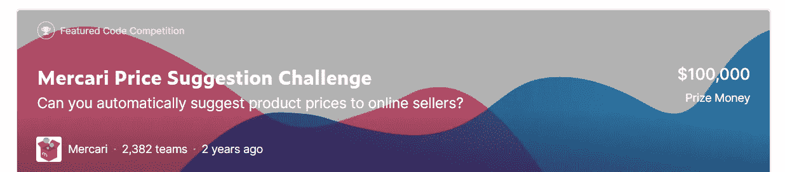

来源—[https://www . ka ggle . com/c/mercari-price-suggestion-challenge/](https://www.kaggle.com/c/mercari-price-suggestion-challenge/)

# 2.使用机器学习/深度学习来解决业务问题

使用机器学习技术可以最好地解决这个问题，这基本上是一个**回归建模**任务，它基本上查看相似的历史产品信息/属性以及销售价格，并相应地建议价格。

让我们查看一行训练数据并理解它的字段。(整个训练数据包含~**140 万个**物品清单)

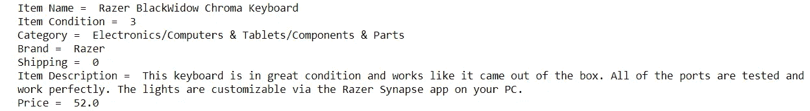

样品项目列表

数据集由以下字段组成—

1.  **名称** —这是卖家正在列出的产品的**项目名称/产品名称**。(文本格式)
2.  **项目条件 id** —包含(1，2，3，4，5)之一的值。基本上，它是一个代表物品状况的数字，范围从 1 到 5。
3.  **类别** —包含项目的 [**产品类别分类**](https://www.bigcommerce.com/blog/product-taxonomy/#what-is-product-taxonomy) 作为三级层次结构(用'/'分隔符分隔)。在上面的例子中，电子产品为 1 级，计算机&平板电脑为 2 级，组件&零件为 3 级。
4.  **品牌** —所列商品的品牌。60%的行是空的。
5.  **发货** —包含布尔型— 1，0。‘1’表示运费由卖家支付，‘0’表示卖家不支付。
6.  **物品描述—** 包含物品的详细文字描述。其中包含尽可能多的关于产品状况、特性和所有其他相关信息的信息。自然，我们可以想象这些信息与我们非常相关，因为价格取决于功能、某些功能的工作条件等。这将是一个有趣的 [**深度 NLP**](https://cs224d.stanford.edu/) 任务来解决。
7.  **价格**(待预测)—这是我们案例中待预测的价格。包含 0 到 2009 之间的浮点值。

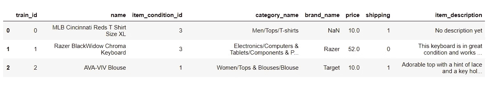

熊猫数据框——训练数据截图

# 3.评估指标(RMSLE)

注意——这里不是 RMSE。是 RMSLE

比赛使用的评估标准基本上是一个分数。 **RMSLE** 代表**均方根对数误差**。我找到了一篇很棒的博文，这篇博文解释了 RMSE 和 RMSLE 之间的差异，以及在什么情况下 RMSLE 更适合用作回归任务的评估指标—[**https://medium . com/analytics-vid hya/root-mean-square-log-error-RMSE-vs-RM LSE-935 c6cc 1802 a**](https://medium.com/analytics-vidhya/root-mean-square-log-error-rmse-vs-rmlse-935c6cc1802a)

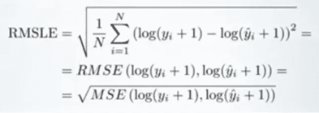

来源——towardsdatascience.com

代码— RMSLE 分数

总结一下这篇博文中关于为什么在这里使用 RMSLE 作为衡量标准的几点

1.  **当你低估而不是高估时，RMSLE 的惩罚更多—** 换句话说，RMSLE 用在这个项目中，意思是如果你对某些项目给出更高的价格建议是可以的，但如果你低估了实际价格，这是不可接受的。如果我们预测不足，RMSLE 将显著增加，相比之下，如果我们预测过量，RMSLE 将显著增加。我认为这对于这个案例研究来说是有商业意义的，因为我们可能会对某些物品给出比实际价格更高的估价，但如果我们低估了一件物品的价格，这就不好了，因为买家可能不想在这种情况下出售。
2.  **RMSLE 可以缓冲数据中异常值的影响** —如果您在 RMSE 进行评估，由于 RMSE 的平方误差惩罚，数据集中某些具有非常高价格值的项目实际上可能会扭曲模型，而 RMSLE 对高价值汽车的惩罚仅比低价值汽车略高，因为 RMSLE 在度量中有一个对数项来缓冲这种影响。
3.  **RMSLE** **只考虑相对误差**而不考虑绝对误差(因为对数项)，所以 9 对 10 的预测和 900 对 1000 的预测都具有相同的**相对误差。**

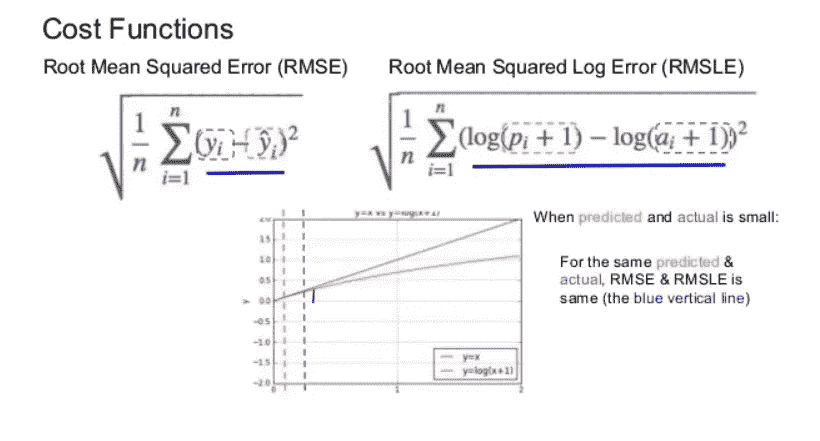

来源—[https://www . ka ggle . com/c/ASHRAE-energy-prediction/discussion/113064](https://www.kaggle.com/c/ashrae-energy-prediction/discussion/113064)

# 4.探索性数据分析

我们总是建议，在开始预测建模之前，首先要很好地理解数据。这是一项极其重要的任务。让我们浏览一下数据，获得一些信息和见解:

## 物品列表的价格分布

这里的价格遵循一个 [**对数正态分布**](https://en.wikipedia.org/wiki/Log-normal_distribution) 。从一个现有的 Kaggle 内核中，我发现 Mercari 只允许 3 到 2000 之间的价格列表。因此，我们将筛选这些项目列表。如果你看到下面的图表，即使 **99.9 百分位**值也在 400 左右。拐点出现在那之后。我们可以构建价格板(根据 **5 百分位板)**来更好地分析商品列表的价格分布。

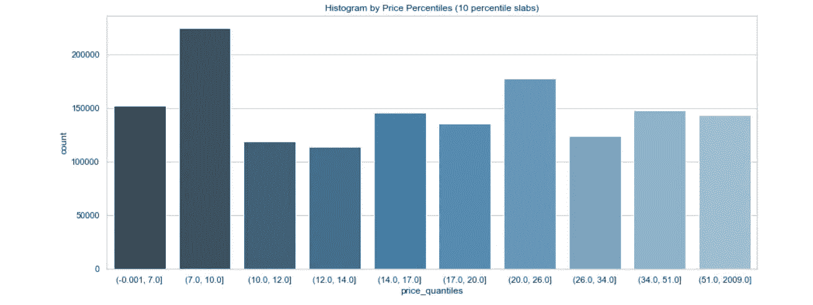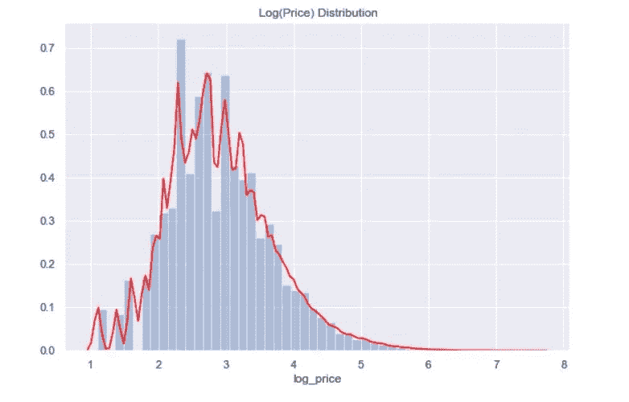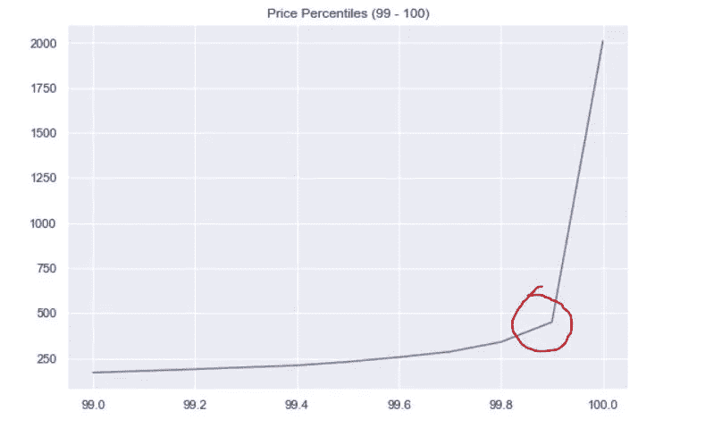

## 项目条件、运输状态的价格差异

**发货状态**是二进制— (1，0)。1 代表运费由卖方支付。0 表示运费不是由卖家支付。我们可以查看一下 [**小提琴的剧情**](https://en.wikipedia.org/wiki/Violin_plot) 下面的剧情。我们可以看到,“0”的价格比“1”的价格略高(尽管我认为情况会相反，因为我的假设是，如果卖家已经支付了运费，那么价格应该会略高)。但是 [**的差异有统计学意义**](https://en.wikipedia.org/wiki/Statistical_significance) **吗？** —我们可以进行单向 [**ANOVA**](https://en.wikipedia.org/wiki/One-way_analysis_of_variance) 测试，以达到 5%的显著性，这表明装运状态下的价格差异确实具有统计显著性。

代码—统计检验


数据分析——运输状态中的价格变化

下面对**项目条件**进行了类似的分析。这里的价格差异在统计上也很显著。在这两个特征中没有发现缺失值。

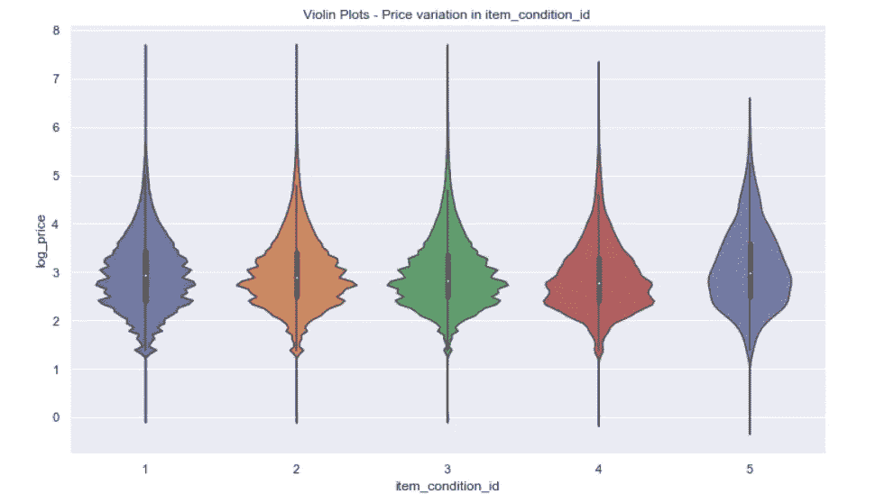

数据分析-项目条件 ID 中的价格变化

## 不同类别的价格差异

此处的类别功能出现在“/”分隔值中。大多数类别有 3 级分隔符。(见下图)。因此，这里的命名法是**第 1 类/第 2 类/第 3 类**，其中**第 1 类**是高级类别，后面跟着**第 2 类** & **第 3 类**是次级类别。

代码片段—拆分类别级别

```
**import seaborn as sns**
sns.set(rc={'figure.figsize':(8,6)}, style = 'whitegrid')
sns.barplot(x = "count", y="cat1", data=df_cat1_counts,palette="Blues_d")
```

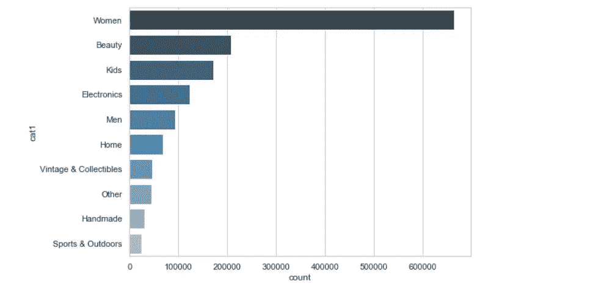

按类别级别 1 盘点物料

让我们使用 [**词云**](https://www.geeksforgeeks.org/generating-word-cloud-python/) 来看看本专栏中出现了哪些类型的词。此外，让我们使用 violin plots 分析跨类别的价格分布。

```
sns.set(rc={'figure.figsize':(19,7)})
sns.violinplot(x="cat1", y="log_price", data = df_train)
plt.title('Violin Plots - Price variation in cat1')
plt.show()
```

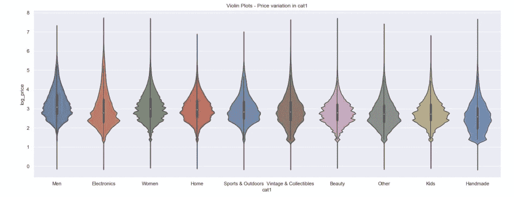

类别价格-小提琴图

```
**import** **matplotlib.pyplot** **as** **plt**
**from** **wordcloud** **import** **WordCloud** wordcloud = WordCloud(collocations=**False**).generate(text_cat)
plt.figure(figsize = (12,6))
plt.imshow(wordcloud, interpolation='bilinear')
plt.axis("off")
plt.title('WordCloud for Category Name')
plt.show()
```

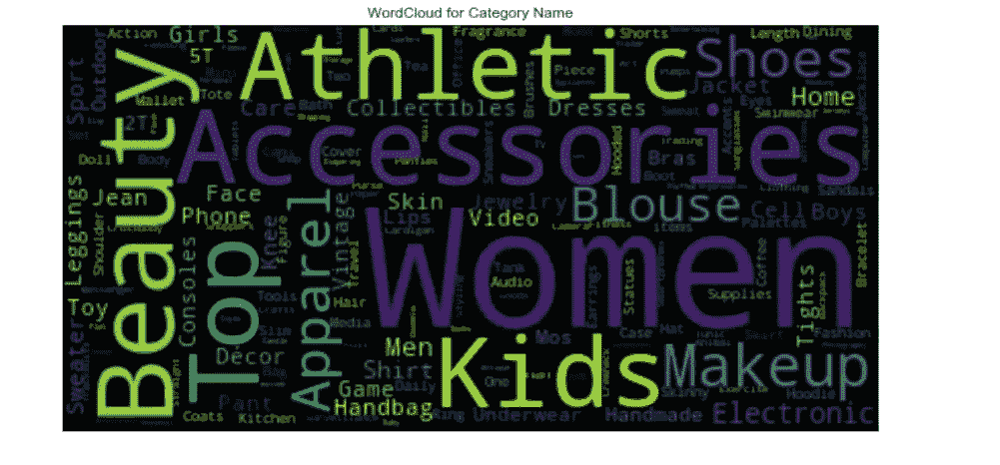

类别名称— Wordcloud

## 不同品牌的价格差异

该功能包含约 4800 个品牌(其中 **60%的行缺少**)。数据框架中列出了顶级品牌(按数量排列)。我们可以看到，前 1000 个品牌(约 25%的顶级品牌)约占产品列表的 97%。(接近一个 [**幂律分布**](https://en.wikipedia.org/wiki/Power_law) )

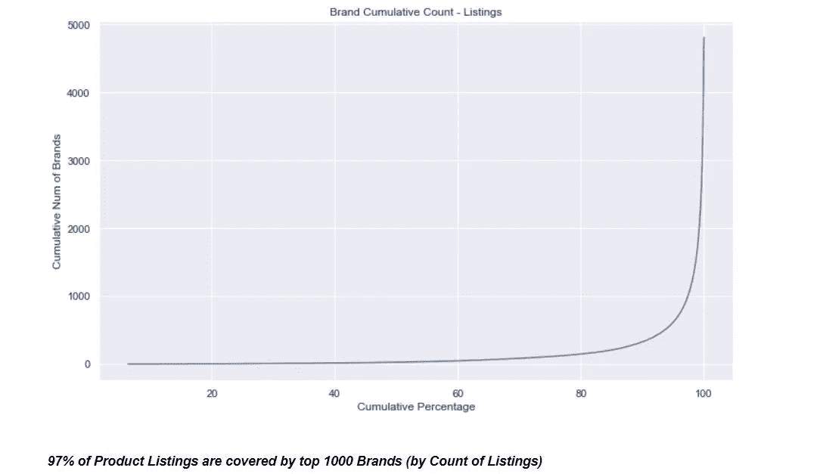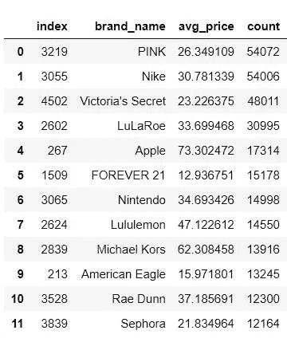

不同的品牌有不同的价格分布(如预期)。品牌应该出现在最相关的特征中，因为产品的价格是产品品牌的一个非常重要的功能。如下图所示，遵循长尾偏态分布。

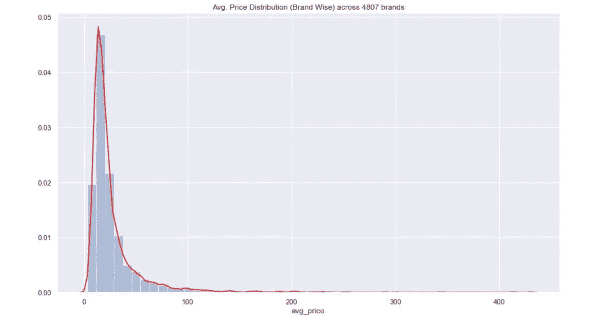

4800 个品牌的平均价格分布

## 了解项目名称和项目描述的内容

让我们通过绘制他们的文字云来理解。(但是经过一些**文本预处理**

```
**# reference - Applied AI Course (Code for Text Preprocessing)
import re
from tqdm import tqdm_notebook****def** decontracted(phrase):
    phrase = re.sub(r"won't", "will not", phrase)
    phrase = re.sub(r"can\'t", "can not", phrase)
    phrase = re.sub(r"n\'t", " not", phrase)
    phrase = re.sub(r"\'re", " are", phrase)
    phrase = re.sub(r"\'s", " is", phrase)
    phrase = re.sub(r"\'d", " would", phrase)
    phrase = re.sub(r"\'ll", " will", phrase)
    phrase = re.sub(r"\'t", " not", phrase)
    phrase = re.sub(r"\'ve", " have", phrase)
    phrase = re.sub(r"\'m", " am", phrase)
    **return** phrase**def** text_preprocess(data):
    preprocessed = []
    **for** sentance **in** tqdm_notebook(data):
        sent = decontracted(sentance)
        sent = sent.replace('**\\**r', ' ')
        sent = sent.replace('**\\**"', ' ')
        sent = sent.replace('**\\**n', ' ')
        sent = re.sub('[^A-Za-z0-9]+', ' ', sent)
        *# https://gist.github.com/sebleier/554280*
        sent = ' '.join(e **for** e **in** sent.split() **if** e **not** **in** stopwords)
        preprocessed.append(sent.lower().strip())
    **return** preprocessed
```

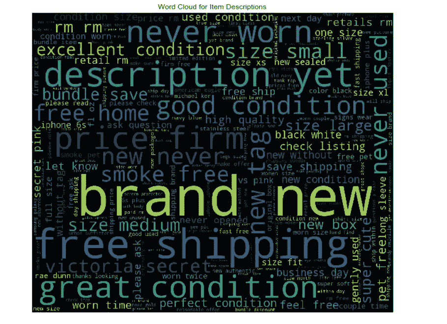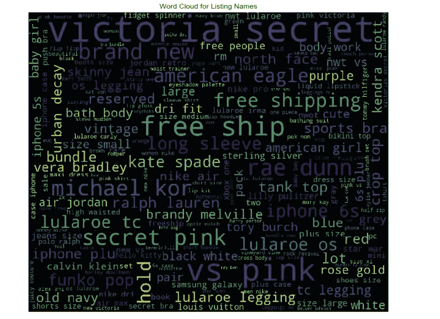

上面的图表看起来不错——它给出了最常出现的单词的信息。

## 使用潜在狄利克雷分配(LDA)的主题建模

让我们也做一些 [**的题目造型使用潜狄利克雷分配**](https://en.wikipedia.org/wiki/Latent_Dirichlet_allocation) **。**不涉及细节，这基本上是一个无监督的算法，在整个文本语料库中找到句子谈论的主题。这个分析的灵感来自于这个 Kaggle 内核— [**链接**](https://www.kaggle.com/thykhuely/mercari-interactive-eda-topic-modelling) 。

让我们来看一些由生成的**主题(通过将相似的单词/句子分组到主题中 LDA 算法就是这样做的)。在我们的例子中，当应用于**项目描述**特性时，LDA 做得相当不错。**

LDA 代码

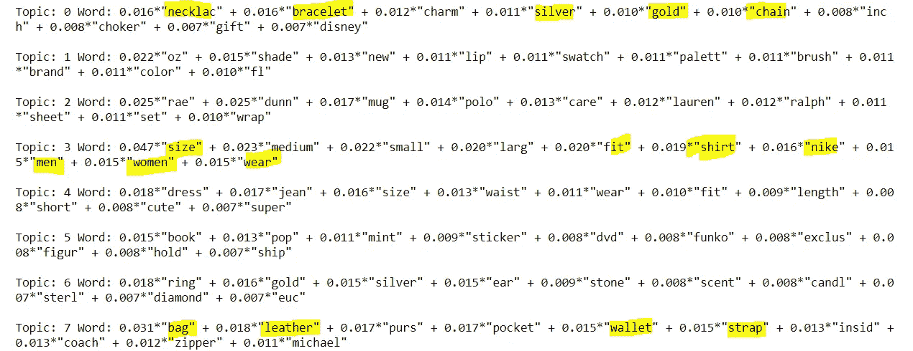

LDA 的结果

话题 0 最有可能指的是**珠宝**——(项链、手链、链子、黄金)。同样，主题 3 指的是**服装**——(衬衫、耐克、男士、女士)。主题 7 指的是**配饰—** (皮革、包、钱包)等。因此，我们很好地理解了“项目描述”专栏所谈论的内容，以及其中呈现的各种主题的摘要。这个特征将是一个非常重要的价格预测器，因为它包含了与物品状况、新度、产品的详细特征等相关的信息。

我的第一直觉是，这将是一个深度 NLP 任务，需要使用某种形式的 [**LSTM 神经网络**](https://en.wikipedia.org/wiki/Long_short-term_memory) 来解决。

# 5.特征工程(生成新特征)

这是 ML 系统中最重要的部分之一。受此启发 Kaggle 内核 [**链接**](https://www.kaggle.com/gspmoreira/cnn-glove-single-model-private-lb-0-41117-35th) **。**产生了一些新特征。

## 特征工程(集合 1)-情感得分

这里的假设是，商品描述中传达的情感越好，买家愿意为该商品支付的价格越高。我预计商品描述的情感分数和价格之间存在正相关关系。

```
**from** **nltk.sentiment.vader** **import** **SentimentIntensityAnalyzer** def generate_sentiment_scores(data):
    sid = SentimentIntensityAnalyzer()
    scores = []
    for sentence in tqdm_notebook(data): 
        sentence_sentiment_score = sid.polarity_scores(sentence)
        scores.append(sentence_sentiment_score['compound'])
    return scores
```

## 特征工程(集合 2)-分组价格统计

我借用了这个 Kaggle 内核的这段代码片段— [**链接**](https://www.kaggle.com/gspmoreira/cnn-glove-single-model-private-lb-0-41117-35th) 。这基本上是通过将(**类别、品牌、运输**)特征组合在一起并生成价格统计数据来获得价格统计数据的，这些价格统计数据是**平均值**、**中值**、**标准值。偏差**、[、**变异系数**、**基于 2 个标准的预期价格范围**。偏离平均值等。这是有意义的，因为我们基本上是在查看一组商品的**历史价格，并将它们输入到特性集中，假设它们可能与当前价格密切相关。**](https://en.wikipedia.org/wiki/Coefficient_of_variation)

特征生成的代码

## 特征工程(集合 3)-项目描述文本统计

我再次借用上面发布的同一 Kaggle 内核链接中的这段代码。代码基本上从**项目描述**栏创建新功能，如字数、特殊字符数、数字数等。

代码-描述特征

## Co 将新生成的功能与价格相关联

最重要的问题是，这些新功能是否与价格密切相关——为此，我们可以绘制相关热图。

```
***#ref =*** [***https://datatofish.com/correlation-matrix-pandas/***](https://datatofish.com/correlation-matrix-pandas/)# df_corr contains all the newly generated features
corrMatrix  = df_corr.corr()
plt.figure(figsize = (18,9))
sns.heatmap(corrMatrix, annot=**True**)
plt.show()
```

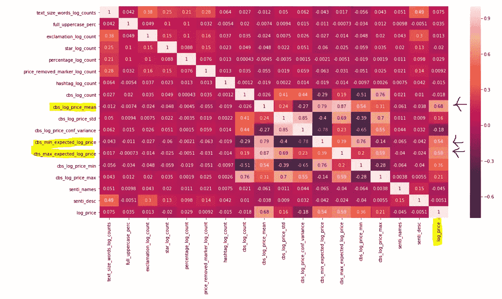

关联热图(新生成的要素)

正如我们从上面的热图中看到的，3 个特征与价格输出有很强的相关性，相关性> **0.5。**生成的平均、最小预期、最大预期价格特征似乎最为显著。我们将只保留这 3 个新功能。

# 6.现有解决方案

有许多不同方法的核心，其中一些包括—

1.  **CNN 带手套进行单词嵌入——**内核[链接](https://www.kaggle.com/gspmoreira/cnn-glove-single-model-private-lb-0-41117-35th)。这使用 CNN 模型对项目名称、项目描述以及分类特征进行单词嵌入，以使其通过密集 MLP。模型给出的 RMSLE 得分为 0.41(第 35 位)
2.  **稀疏的 MLP —** 内核[链接](https://www.kaggle.com/lopuhin/mercari-golf-0-3875-cv-in-75-loc-1900-s)。这使用稀疏 MLP 通过文本的 Tfidf 矢量化和分类要素的一次热编码来生成输出。模型给出的均方根误差为 0.38(第一名)
3.  **岭模型—** 内核[链接](https://www.kaggle.com/apapiu/ridge-script)。对 Tfidf 文本要素使用简单的岭回归来生成预测。模型给出的均方根误差为 0.47
4.  **LGBM 模型—** 内核[链接](https://www.kaggle.com/tunguz/more-effective-ridge-lgbm-script-lb-0-44823)。使用 LightGBM 回归器给出 0.44 的输出分数。

# 7.我的改进模型实验

## **数据准备**

我们可以使用原始训练数据拆分成训练/测试，测试数据大小为 25%。

```
**from sklearn.model_selection import train_test_split** df_train = pd.read_csv('train.tsv',sep = '**\t**')
df_train_model,df_test_model = train_test_split(df_train,test_size = 0.25)
```

## 数据编码

输入特征包括分类和文本特征，以及 3 个新生成的数字特征。分类编码包括一个热门编码器，标签二进制化器。文本编码涉及 Tfidf 和 Count (BOW)矢量器。数字编码涉及使用 StandardScaler 进行标准化。

如 ed a 部分所述，输出变量——价格涉及对数变换。

```
**import numpy as np**
y_train  = np.log1p(df_train['price'])
```

## 用 GridSearchCV 改进岭回归

我们可以从用 L2 正则化建立一个简单的线性模型开始，这基本上被称为岭回归。该模型在测试数据上给出了 0.474 的 RMSLE。请注意，solver = 'lsqr '用于更快的训练，训练该模型不到一分钟。

```
**%%time
from** **sklearn.linear_model** **import** **Ridge** ridge_model = Ridge(solver = "lsqr", fit_intercept=**False**)
ridge_model.fit(X_train, y_train)
preds = np.expm1(ridge_model.predict(X_test))
```

我们可以尝试在这个模型上使用[**GridSearchCV**](https://scikit-learn.org/stable/modules/generated/sklearn.model_selection.GridSearchCV.html)**看看是否可以提高分数。**

```
**from** **sklearn.model_selection** **import** **GridSearchCV**
parameters = {'alpha':[0.0001,0.001,0.01,0.1,1,10,100,1000,10000],
              'fit_intercept' : [False],
              'solver' : ['lsqr']}

gs_ridge = GridSearchCV(estimator = Ridge(),
                        param_grid = parameters,
                        cv = 3, 
                        scoring = 'neg_mean_squared_error',
                        verbose = 100,
                        return_train_score = True,
                        n_jobs = -2)
gs_ridge.fit(X_train, y_train)
```

**正如我们在下面看到的，当使用三重交叉验证时，alpha=10 给出最低的交叉验证分数。但是在使用这个模型的时候。RMSLE 仅从 **0.474** 降低到 **0.472** ，这并不是非常显著的改进。注意在下面的图表中，使用了 10 的对数标度，因为在进行网格搜索时，所有的超参数α值都是 10 的幂。**

**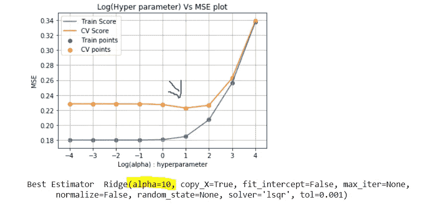**

**超参数图**

## **LightGBM 回归模型的超参数调整**

**代码片段— LGBM 模型**

```
lgbm_params_1 = {'n_estimators': 900, 
                 'learning_rate': 0.15,
                 'max_depth': 5,
                 'num_leaves': 31, 
                 'subsample': 0.9,
                 'colsample_bytree': 0.8,
                 'min_child_samples': 50,
                 'n_jobs': -2}
```

**我们可以通过调整超参数来改进模型，通过**增加估计器**、**降低学习速率**、**不限制最大深度、增加叶子数量等来稍微过度拟合。**通过调整这些，模型从 **0.50 提高到 0.47** ，这确实是一个显著的进步，尤其是在 Kaggle 比赛中，而且得分是以对数标度(RMSLE)进行的。尽管这个模型有点过度拟合，我们可以通过在最后建立一个集合来减少模型的方差，正如我们将看到的。LightGBM 的主要问题是培训时间——在我的 16 GB RAM 的桌面上运行需要将近 2-3 个小时。**

```
lgbm_params_2 = {'n_estimators': 1500,
                 'learning_rate': 0.05,
                 'max_depth': -1,
                 'num_leaves': 50,
                 'subsample': 0.8,
                 'colsample_bytree': 0.8,
                 'min_child_samples': 50,
                 'n_jobs': -1}
```

## **LSTM 神经网络(第 1 版)**

**这是第一个直觉，我们可以安全地假设该模型将工作良好，因为我们的大部分数据都以文本的形式出现在项目名称和项目描述中。此外，所有新生成的 17 个数字特征都已作为输入传递给数字特征。我的假设是，如果这些特征相关或不相关，神经网络会自己学习——所以不会损害模型。**

**下面附上的是第一个 LSTM 模型-正如您在下面看到的，文本和分类特征首先通过嵌入层，然后展平以连接成密集的神经网络结构。**

```
**from** **tensorflow.keras.utils** **import** **plot_model
from** **IPython.display** **import** **Image**
plot_model(baseline_lstm_model, to_file='baseline_lstm_model.png', show_shapes=True, show_layer_names=True)
Image(filename='baseline_lstm_model.png')
```

**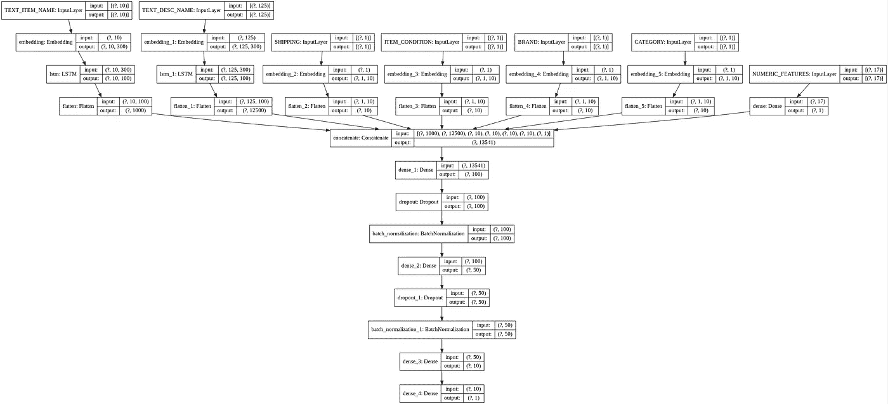**

**LSTM 模型 1**

**上述模型在 60 个周期后给出的 RMSLE 为 **0.48** ，当与 adam optimizer 一起使用时，val 损失未能显著改善。下面是生成上述 LSTM 模型 1 的代码。**

## **LSTM 网络文本句子填充长度的选择**

**我们可以通过绘制句子长度的分布来选择句子长度。**

**代码片段—填充长度选择**

**从代码中我们可以看到，在项目描述列中只有 0.59%的行的句子长度超过 125。这意味着几乎所有的句子长度都属于这个范畴，我们可以用它来选择句子长度。**

```
**>>>select_padding(train_desc,tokenizer_desc,"Item Descriptions",125)****Output :**
Total number of words in the document are  138419
0.5927708414700212  % of rows have sentence length >  125
```

**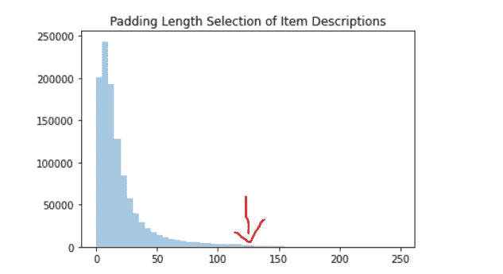**

**直方图—句子长度**

## **LSTM 神经网络(第 2 版)**

**在这个模型中，我们将名称、描述、品牌、类别中的文本连接起来，并创建了一个文本特征。我还选择了与价格高度相关的 3 个数字特征作为数字输入。该模型给出的均方根误差为 **0.47****

**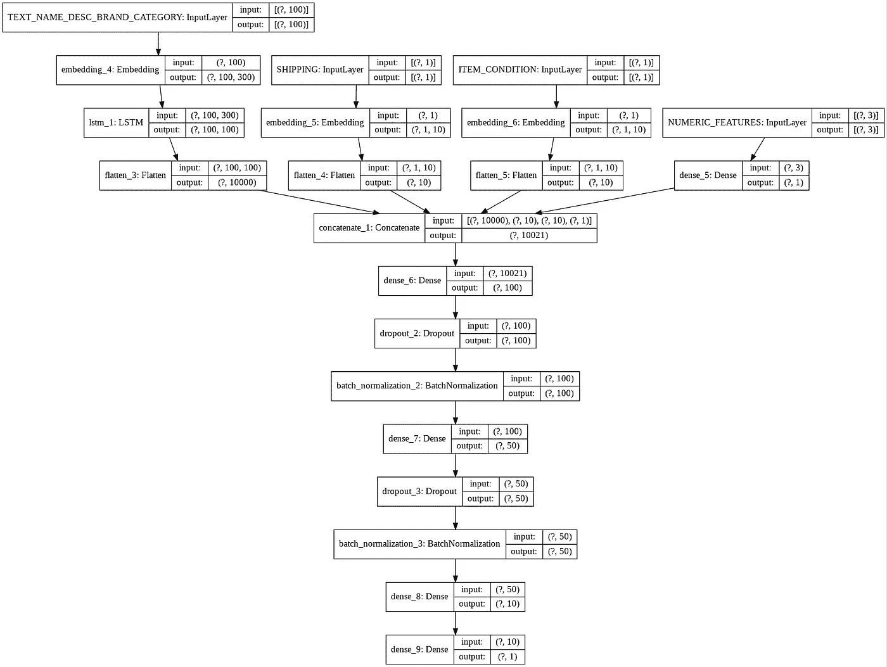**

**LSTM 模型 2**

## **通过添加更多层来构建稀疏 MLP 模型的 2 个变体**

**获胜者的解决方案模型使用简单的 MLP 模型，其中要素的稀疏输入表示只有 4 个图层。与 LSTM/LGBM 模型相比，该模型能够以更好的方式学习特征交互，因此结果良好。为了避免过度拟合，我在实验中在此基础上增加了几层，同时加入了辍学和批处理规范化。在构建了两个这样的模型之后，我们可以使用某种形式的组装来组合它们。**

**正如你在上面看到的，这个模型非常简单。三款 MLP 车型的 RMSLE 得分分别为 **0.415、0.411** 。**

## **最终集合模型**

**在构建了许多这样的模型之后，我们可以以某种方式将它们组合起来，以提供更好的性能。我们可以使用交叉验证方法来获得最佳的集成模型组合。然而，对于我的最终模型，我决定只使用山脊模型和 MLP 模型，因为它们训练起来更快(< 15 mins), whereas LSTM and LGBM models individually took > 3 小时)。**

**在上面的方法中，我们在这里所做的是获取我们想要集成的 2 个模型的预测，并以给出最佳 RMSLE 的方式为每个模型分配权重——我们可以使用交叉验证来找到这一点。当我们对(2 个岭模型+ 2 个 MLP 模型)的集合进行此操作时，我们得到的 RMSLE 为 **0.408** ，显著低于所有单个模型。**

```
preds_final=ensemble_generator(preds_final_ridges,preds_final_mlps)
```

**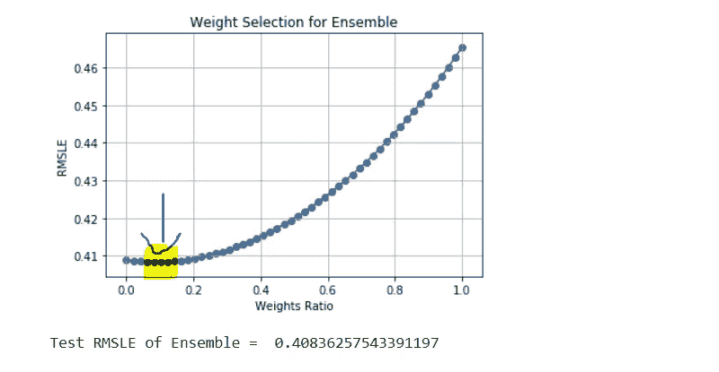**

**集成的权重选择**

**岭型车型的大约 **0.1** 权重和 MLP 车型的剩余 **0.9** 权重给出了最好的分数。**

```
preds_f = 0.1*preds_ridge + 0.9*preds_mlps
```

# **8.摘要、结果和结论**

**下面是所有训练模型和获得的 RMSLE 分数的总结。正如我们所见，合奏模型是赢家。**

**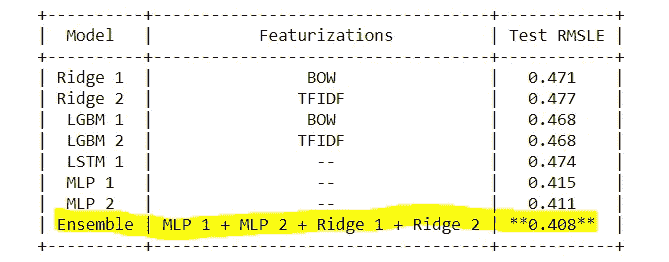**

**模型摘要**

**在 Kaggle 中对看不见的测试数据集进行最终提交给出了 RMSLE 分数 **0.39** ，这将在 **top 1%排行榜**中出现。**

******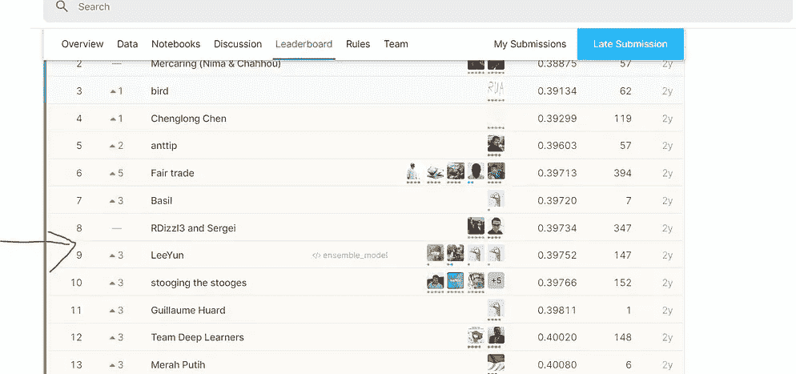**

**Kaggle 提交**

## **可视化预测和误差**

**从下图可以看出，大约 55%的点有误差< 5 and ~76% of points have errors < 10\. This is one of the way we can visualize the distribution of errors. Here **误差=(实际—预测)**。**

**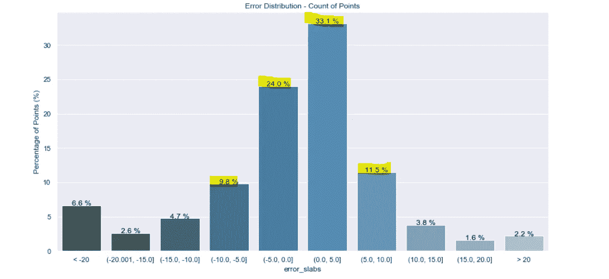**

**柱状图——误差分布**

**我们可以做的另一个图是绘制**对数(绝对误差)**图，因为我们已经完成了对数标度的价格建模。在下图中，x 轴是**对数(Abs 误差)**，左边的 y 轴代表该误差的点数(蓝色 histgoram)。橙色线给出了右侧 y 轴上的累积点数。我们可以看到，~ **99%的点都有 Log(Abs 误差)< 4** 。**

**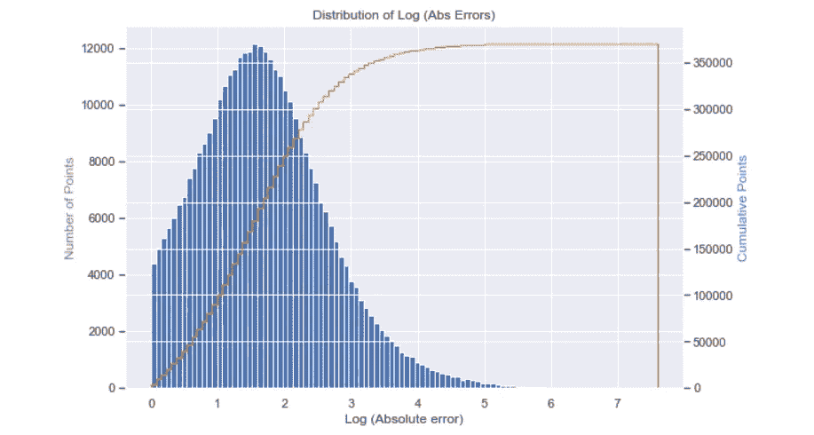**

# **9.未来的工作**

**我们可以在这方面做更多的实验来进一步改进预测—**

*   **使用 **hyperas** 库来微调神经网络架构，以进一步提高性能**
*   **对文本数据使用其他矢量化方法，如 **DictVectorizer()** 生成文本特征**
*   **对文本数据上的单词嵌入使用卷积层**

# **10.链接到我的个人资料— github 代码和 linkedin**

**你可以在 github [**链接**](https://github.com/debayanmitra1993-data/Mercari-Price-Recommendation) 找到我的完整代码。如果你想讨论，可以在我的 linkedin 个人资料 [**链接**](https://www.linkedin.com/in/debayan-mitra-63282398/) 上联系我。你也可以帮我接通 debayanmitra1993@gmail.com 的电话。**

# **11.参考**

*   **[https://www . Applied ai course . com/course/11/Applied-Machine-learning-course](https://www.appliedaicourse.com/course/11/Applied-Machine-learning-course)**
*   **[https://medium . com/unstructured/how-I-lost-a-silver-medal-in-kaggles-mercari-price-suggestion-challenge-using-CNN-and-tensor flow-4013660 fcded](https://medium.com/unstructured/how-i-lost-a-silver-medal-in-kaggles-mercari-price-suggestion-challenge-using-cnns-and-tensorflow-4013660fcded)**
*   **[https://www . ka ggle . com/thykhuely/mercari-interactive-EDA-topic-modeling](https://www.kaggle.com/thykhuely/mercari-interactive-eda-topic-modelling)**
*   **[https://www . ka ggle . com/valkling/mercari-rnn-2 ridge-models-with-notes-0-42755](https://www.kaggle.com/valkling/mercari-rnn-2ridge-models-with-notes-0-42755)**
*   **[https://www . ka ggle . com/lopu hin/mercari-golf-0-3875-cv-in-75-loc-1900-s](https://www.kaggle.com/lopuhin/mercari-golf-0-3875-cv-in-75-loc-1900-s)**
*   **[https://www.kaggle.com/apapiu/ridge-script](https://www.kaggle.com/apapiu/ridge-script)**
*   **[https://www . ka ggle . com/tunguz/more-effective-ridge-lgbm-script-l b-0-44823](https://www.kaggle.com/tunguz/more-effective-ridge-lgbm-script-lb-0-44823)**
*   **[https://www . ka ggle . com/gspmoreira/CNN-glove-single-model-private-l b-0-41117-35 号](https://www.kaggle.com/gspmoreira/cnn-glove-single-model-private-lb-0-41117-35th)**
*   **[https://www.youtube.com/watch?v=QFR0IHbzA30](https://www.youtube.com/watch?v=QFR0IHbzA30)**