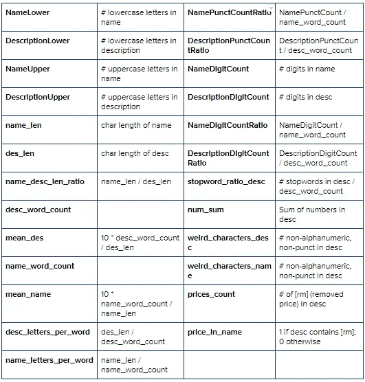

# 基于机器学习回归的价格预测——案例研究

> 原文：<https://towardsdatascience.com/mercari-price-suggestion-97ff15840dbd?source=collection_archive---------0----------------------->

## 电子商务中的人工智能

## *Mercari 价格建议挑战*

> 这篇文章详细描述了我解决回归问题的方法，这也是一个流行的 Kaggle 竞赛。希望你觉得有用并喜欢阅读:)


图片来自[咖啡豆](https://pixabay.com/users/coffeebeanworks-558718/?utm_source=link-attribution&utm_medium=referral&utm_campaign=image&utm_content=3124413)来自 [Pixabay](https://pixabay.com/?utm_source=link-attribution&utm_medium=referral&utm_campaign=image&utm_content=3124413)

人工智能是当今所有主要电子商务公司不可或缺的一部分。随着过去二十年信息产业的发展和人工智能领域的广泛研究，企业已经开始探索使用最先进的机器学习算法和深度神经网络来自动化各种活动的方法。许多 IT 巨头和初创企业已经在这一领域迈出了一大步，并拥有专门的团队和资源来研发尖端的人工智能应用。今天的在线零售平台广泛由人工智能驱动的算法和应用程序驱动。从仓库的库存管理和质量检查到网站上的产品推荐和销售统计数据，所有活动都在不同程度上使用了机器学习。

# **业务问题和挑战**


图片来源: [Movas Global](https://www.kindpng.com/userpngs/5765/) 通过 [KindPNG](https://www.kindpng.com/)

Mercari 是日本最大的社区购物网站。为了实现一个节约使用全球资源、人人都能过上富裕生活的社会，该公司在日本和美国开发了一个跳蚤市场应用程序“Mercari ”,让个人能够轻松、安全地买卖商品。Mercari 面临的挑战是建立一种算法，在其应用程序上自动向卖家建议正确的产品价格。

预测产品的价格是一项艰巨的挑战，因为非常相似的产品有微小的差异，如不同的品牌名称、附加规格、质量、产品需求等。会有非常不同的价格。例如，其中一件毛衣售价 335 美元，另一件售价 9.99 美元。你能猜出哪个是哪个吗？


图片来源:[https://www . ka ggle . com/c/mercari-price-suggestion-challenge/overview](https://www.kaggle.com/c/mercari-price-suggestion-challenge/overview)

当产品种类繁多时，价格预测变得更加困难，这在大多数在线购物平台上都很常见。Mercari 的卖家可以在应用程序上列出几乎任何东西。预测在线平台上几乎所有商品的价格都极具挑战性。

> **让我们从机器学习的角度来看这个问题。**

# ML 问题

Mercari 提供了用户输入的产品文本描述，包括产品类别名称、品牌名称和商品状况等细节。使用这些数据，我们必须想出一个模型，尽可能准确地预测 Mercari 上列出的产品的价格。这看起来像一个标准的回归问题。

# 性能指标和业务限制

我们必须有一个尺度来衡量我们的模型性能的好坏。在机器学习术语中，我们将这种尺度称为性能度量或简称为度量。有各种度量来测量回归模型的性能，*例如平均绝对误差、均方误差、均方对数误差、* *最大残差、中值绝对误差、决定系数(R)等*。
对于这个问题， *Kaggle* 使用**均方根对数误差(RMSLE)** 。RMSLE 越小，我们的模型越好。RMSLE 的计算公式为


图片来源:[https://www . ka ggle . com/c/mercari-price-suggestion-challenge/overview/evaluation](https://www.kaggle.com/c/mercari-price-suggestion-challenge/overview/evaluation)

*   最准确地预测价格是我们的首要商业目标。
*   在这个问题中没有低延迟限制。一旦产品在应用程序上列出，我们不需要立即建议它的价格。然而，我们也不能花几个小时或几天来预测价格。

# 现有方法

1.  [**第 18 位解**](https://www.kaggle.com/c/mercari-price-suggestion-challenge/discussion/50252) **:** 总体思路是先训练一个 FM_FTRL 模型，再训练一个 LightGBM 模型，用两者的系综得到最终的预测。
2.  [**Mercari Golf:0.3875 CV in 75 LOC，1900s**](https://www.kaggle.com/lopuhin/mercari-golf-0-3875-cv-in-75-loc-1900-s)**:**4 个 MLP 模型的集合，每个模型具有相同的架构，但显然在 2 个不同的数据集上进行训练。

> **了解了约束、业务目标和我们需要解决的问题后，是时候动手了。**

# 1.数据概述

数据可以从 [Kaggle](https://www.kaggle.com/c/mercari-price-suggestion-challenge/data) 竞赛页面下载。有两个文件 *train.tsv* 和 *test.tsv* 和一个 Kaggle 提交模板 *sample_submission.csv.* 解压缩后数据总大小为 1.03 GB。

这些文件由产品列表组成。这些文件用制表符分隔。 *train.tsv* 有 1482535 行， *test.tsv* 有 3460725 行。训练和测试文件都有以下数据字段

*   `train_id`或`test_id` -列表的 id
*   `name` -清单的标题
*   `item_condition_id` -卖方提供的物品的状况
*   `category_name` -清单的类别
*   `brand_name`
*   `price` -物品的销售价格。这是我们将要预测的目标变量。单位是美元。该列在`test.tsv`中不存在，因为这是我们将要预测的。
*   `shipping` - **1** 如果运费由卖方支付，0 如果由买方支付
*   `item_description` -物品的完整描述

> 数据表中的**行**称为**数据点**，而**列**称为**特征/变量**。在这篇博客中，我将交替使用**行**和**数据点**这两个词。与**栏**和**特征/变量相同。**

以下是来自训练数据的样本。


我们看到数据中有一些*空值* (NaN)。我们会用*‘失踪’来代替这些。*同样，我们将列`category_name` 中的三个值的列表拆分成三个新列`gencat_name, subcat1_name, subcat2_name`。*例如，一个带有 category_name=* ***【男士、上衣、t 恤】*** *的数据点会有 gencat_name=* ***男士*** *，subcat1_name=* ***上衣*** *，以及 subcat2_name=* ***T 恤***

# 2.探索性数据分析

让我们从一个机器学习工程师的角度来看看训练数据，看看我们是否能得出一些有用的推论。这将使我们对解决问题的方法有一个合理的想法。

## 2.1.基础 EDA:分析训练数据列

**名称**

```
**train.name.describe()**count     1481661
unique    1224596
top        Bundle
freq         2232
Name: name, dtype: object
```

原始数据(预处理前)中有 1，224，596 个唯一的产品名称。最常见的产品名称是*“Bundle”、*，出现在 2232 个数据点中。

**项目条件标识**


**不同项目条件下的产品数量**

大多数物品处于*状态 1*T42 状态。很少有项目处于*状态 5。*

**品牌名称**

```
**train.brand_name.describe()**count     1481661
unique       4808
top       missing
freq       632336
Name: brand_name, dtype: object
```


**按产品数量排名的前 15 大品牌**

*brand_name* 缺失大量(42.68 %)数据点。

**gencat_name**


**产品类别计数**

*   这些产品分布在 10 个大类中。这一栏对于一些产品是空白的，这些已经被放入一个单独的类别*中不见了。*
*   大量的产品属于女性产品。这可能是因为通常情况下，女性比男性更倾向于购物。
*   6314 个数据点，即 0.43 %的列车数据缺少 gencat_name 。

**subcat1_name，subcat2_name**

```
**train.subcat1_name.describe()         train.subcat2_name.describe()**count              1481661            count                  1481661
unique                 114            unique                     871
top       Athletic Apparel            top    Pants, Tights, Leggings
freq                134321            freq                     60152
```

除了 10 个大类之外，还有 114 个产品子类，这些产品又可能属于 871 个子类。简而言之， *subcat1_name* 从更广的意义上讲述了物品的类别，而 *subcat2_name* 则更深入一层，给出了关于物品具体是什么的更多细节。回想一下示例 ***【男士、上衣、t 恤】***下图显示了按商品数量排列的前 15 个子类别。


**属于不同子类别的产品数量**

**价格**

这是我们训练数据中的目标变量或“y”。我们需要对测试数据进行预测。它的价值范围很广，从 3 美元到 2009 美元不等。然而，大多数商品的价格都低于 200 美元，正如下面的图表和百分位值所示。


**价格分布:PDF** (左)**、箱线图**(右)

```
0 percentile value is 3.0
10 percentile value is 7.0
20 percentile value is 10.0
30 percentile value is 12.0
40 percentile value is 14.0
50 percentile value is 17.0
60 percentile value is 20.0
70 percentile value is 26.0
80 percentile value is 34.0
90 percentile value is 51.0
100 percentile value is  2009.0
```

```
90 percentile value is 51.0
91 percentile value is 55.0
92 percentile value is 58.0
93 percentile value is 62.0
94 percentile value is 67.0
95 percentile value is 75.0
96 percentile value is 85.0
97 percentile value is 99.0
98 percentile value is 122.0
99 percentile value is 170.0
100 percentile value is  2009.0
```

*   97%的数据点价格低于 100 美元。
*   极少数(仅 1%)数据点的价格超过 170 美元。

## 2.2.单变量分析:特征**(列)**和目标变量‘y’之间的相关性

让我们根据不同数据列的值来探究商品价格是否有任何趋势。这将有助于我们决定哪些列在确定商品价格时比其他列更有用。

**价格随项目条件的变化**

我用简单的箱线图来观察一个物品的价格是如何随着物品的状况而变化的。
注意，在箱线图中，方框的下边界表示 25ᵗʰ百分位，上边界表示 75ᵗʰ百分位，方框内的线表示 50ᵗʰ百分位或中位数。


*   根据物品的情况，价格会有轻微的变化。
*   当我们从条件 1 到条件 4 时，中间价格下降。
*   条件 5 中的项目似乎有更高的价格，可能是因为它们是昂贵的项目，如电子产品。

**价格随项目类别(gencat_name)的变化**

观察下图中各种类别的箱线图和平均价格，我们可以说属于不同产品类别的商品价格存在一些差异。


**价格随项目子类别(subcat1_name)的变化**


**属于不同子类别的项目的中间价格**

某些类别产品的价格差异很大。例如，属于*电脑、平板电脑、照相机、摄影、婴儿车、乐器、*等的物品。与属于*纸制品、儿童、办公用品、交易卡、*等的物品相比是昂贵的。

> 这表明类别和子类别将成为决定商品价格的重要因素。

# 3.清理数据:预处理

## **3.1。预处理文本特征**

我已经做了一些基本的文本预处理，如删除非字母数字字符，正则表达式，停用词等。从*名称*和*项目 _ 描述*。代码如下。

## 3.2.预处理类别

这类似于文本预处理。我已经删除了空格，并将符号' & '(和)替换为' _ '(下划线)。我做这种清理是为了获得精确的一键分类编码，这将在特征部分解释。

## 3.3.预处理价格:删除无效条目

```
Removed 874 rows
```

# 4.从数据中提取特征

机器只理解数字，它不直接理解我们人类可以阅读的字母或文本。这意味着我们需要将文本和分类数据转换成数字。这个过程被称为特征提取或特征化。有几种与不同类型的数据相关的特征提取技术，我们将在本节中看到其中的一些。

## 4.1.手工制作的特征:特征工程

基于我的直觉和对现有方法的研究，我提出了以下特征，我认为这些特征在确定一件物品的价格时会很有用。使用这些特性没有标准规则，这些纯粹是基于直觉的想法，可能因问题而异。因此，这些被称为手工制作的特征或工程特征。
下表提供了特性的名称。描述这些特性的含义及其计算方式。



> 我们来看看上面的功能是不是真的有用。

**对一些工程特征的单变量分析**

使用 seaborn regplot 绘制了以下图，该图试图拟合一个简单的线性模型，并绘制了单变量(特征与目标)散点图上的拟合直线/平面方程。

```
example code:
sns.regplot(x=’brand_mean_price’, y=’price’, data=train,
            scatter_kws={‘alpha’:0.3}, line_kws={‘color’:’orange’})
```


> 诸如 **brand_mean_price、brand_median price、subcat2_mean_price、subcat2_median_price** 等特征显示出强烈的线性趋势。因此，它们在确定商品价格时似乎是有用的。

## 4.2.训练，交叉验证的测试分割

出于交叉验证的目的(检查训练的模型是否在看不见的数据上工作良好)，我将我们的数据以 90:10 的比例分成 train 和 cv。我将在列车上训练我们的模型，并在 cv 上验证它们。
*注意，已经使用 NumPy 的 log1p()函数将目标变量 price 转换为对数标度。这样做是为了我们可以使用均方根误差作为度量，而不是显式定义复杂的度量 RMSLE。(因为 RMSLE 只不过是对数值的 RMSE)*

```
Train size: (1332967, 58), CV size: (148108, 58), Test size: (3460725, 58)
```

## 4.3.将分类特征转换为数字:一键编码

一键编码是一种矢量化方案，其中分类变量中的每个类别都被转换为长度等于数据点数的向量。对于属于与向量相对应的类别的每个数据点，向量包含值 1，否则包含 0。为了更好地理解，请看下面的例子。


图片来源: [DanB](https://www.kaggle.com/dansbecker) via [Kaggle](https://www.kaggle.com/dansbecker/using-categorical-data-with-one-hot-encoding)

我已经将所有分类变量( *brand_name，gencat_name，subcat1_name，subcat2_name* )转换为它们的独热编码向量。示例代码如下所示:

> 请注意，分类变量 **item_condition_id** 和 **shipping** 已经包含数值，无需将其转换为向量。

## 4.4.将文本特征转换为数字:TF-IDF 矢量器

TF-IDF(术语频率-逆文档频率)是一种统计度量，用于评估单词与文档集合中的文档的相关程度。这是通过将两个度量相乘来实现的:一个单词在一个文档中出现的次数，以及该单词在一组文档中的逆文档频率。你可以在这里阅读更多关于 TF-IDF 和它的数学细节。

在计算语言学和概率领域中，一个 ***n* -gram** 是来自给定文本或语音样本的 *n* 项的连续序列。这些项目可以是音节、字母、单词等。这取决于应用(在我们的例子中是单词)。尺寸为 1 的 *n* 克称为“一克”，尺寸为 2 的称为“二克”，依此类推。

我已经将 *name* 和 *item_description* 编码成一元、二元和三元的 TF-IDF 向量。请注意，一起使用 1，2，3-gram 将导致 TF-IDF 矢量器的字典中有大量的单词，并且使用所有这些单词将导致非常高维的向量。为了避免这种情况，我将*名称*的维度数量限制为 **250k** ，将*项目 _ 描述*向量的维度数量限制为 **500k** 。

# 5.为模型准备数据

## 5.1.数字特征的列规范化

规范化的主要目的是将不同列中的数字数据缩小到相同的比例，以便模型不会因少数列中的巨大差异而出现偏差。我在这里使用了最小-最大归一化(代码如下)。

## 5.2.将所有特征合并到一个稀疏矩阵中

我们将为我们的模型提供一个输入矩阵 X_train，它包含我们在上一节中提取的所有特征，以及一组相应的目标值 y_train。因此，我们需要首先通过并排连接所有的特征向量来构建 X_train。

```
Train size: (1332967, 755695), CV size: (148108, 755695), Test size: (3460725, 755695)
```

> 现在，我们的数据可以输入到模型中了。开始建模吧。

# 6.建模:机器学习模型

我将逐一训练以下回归模型，并评估它们在验证数据上的性能:

*   [**岭回归**](https://scikit-learn.org/stable/modules/generated/sklearn.linear_model.Ridge.html)**r**:L2 正则化的线性最小二乘
*   [**SVM 回归**](https://scikit-learn.org/stable/modules/generated/sklearn.svm.SVR.html)**r**:RBF 核支持向量回归。

*   [**LightGBM 回归器**](https://lightgbm.readthedocs.io/en/latest/pythonapi/lightgbm.LGBMRegressor.html#lightgbm.LGBMRegressor) :使用基于树的学习算法的梯度推进模型。

*要了解这些型号的更多信息并阅读文档，请单击型号名称。*

## 6.1.里脊回归

岭是具有 l2 正则化的线性最小二乘模型。换句话说，就是用 l2 正则化的线性回归。
山脊模型的过拟合或欠拟合取决于参数 *alpha* ，可通过如下所示的超参数调谐将其调谐至正确的值。

```
RMSLE for alpha =  1 is 0.45166601980352833
RMSLE for alpha =  2 is 0.44431546233122515
RMSLE for alpha =  3 is 0.4424425182737627
RMSLE for alpha =  3.5 is 0.44171501703551286
RMSLE for alpha =  4 is 0.44154616529145424
RMSLE for alpha =  4.5 is 0.4415286167861061
RMSLE for alpha =  5 is 0.44161632764828285
RMSLE for alpha =  6 is 0.4421832813533032
RMSLE for alpha =  7 is 0.44267468278758176
```


**使用最佳超参数训练模型并测试**

```
Best alpha:  4.5                            **Train RMSLE: 0.383449898
Cross validation RMSLE:  0.441528616**
```

## SelectKBest:从分类和文本特征中选择前 48k 个特征

当数据是高维的时候，我们将进一步尝试的模型需要花费大量的时间来训练。因此，我只从文本 TF-IDF 向量和分类 one-hot 编码向量中选择前 48，000 个特征。

我将这些与数字特征、岭模型的预测(y_pred 用作特征)连接起来，并在我的模型中使用它们。

```
Train size: (1332967, 48049), CV size: (148108, 48049), Test size: (3460725, 48049)
```

## 6.2.SVM 回归

SVR 是线性回归的高级版本。它在 d 维空间中找到一个超平面，该超平面清楚地对数据点进行分类。

类似于线性回归中的α，SVR 中的 C 是通过超参数调整找到的。

```
Best C:  0.3
SVR(C=0.3, epsilon=0.1, gamma='scale',kernel='rbf', max_iter=200)**Train RMSLE: 0.441563037
Cross validation RMSLE:  0.457637217**
```

## 6.3.随机森林回归

用较高的 N 估计值(N)训练随机森林回归方程花费了大量的时间，却没有给出任何结果。由于这个原因，我们用较少的估计量来训练它。正如你所猜测的，结果并不令人满意。

```
**RMSLE for N=10 is 0.487657647**	 elapsed time:0:46:21.136700
**RMSLE for N=20 is 0.472606976**	 elapsed time:2:02:11.229545
```

## 6.4.LightGBM 回归

Light GBM 是一个基于决策树算法的快速、分布式、高性能梯度提升框架，用于排序、分类和许多其他机器学习任务。由于它是基于决策树算法的，所以它以最适合的方式在叶子上分割树，而其他 boosting 算法在深度上分割树。因此，当在浅色 GBM 中生长在相同的叶子上时，叶子方式的算法可以比深度方式的算法减少更多的损失，因此导致更好的准确性。而且，它出奇的快，因此有了‘光’这个词。

LightGBM 的超参数调整已经通过使用 RandomizedSearchCV 的三重交叉验证完成。

```
{'colsample_bytree': 0.44583275285359114, 'learning_rate': 0.09997491581800289, 'max_depth': 12, 'min_child_weight': 1.7323522915498704, 'n_estimators': 1323, 'num_leaves': 123}
```

```
**Train RMSLE: 0.319789825
Cross validation RMSLE:  0.424231390**
```

## 6.5.比较模型的性能


*   LGBM 的验证分数(RMSLE=0.42423)是上述所有模型中最好的。
*   我把 Ridge 和 LGBM 的预测提交给了 Kaggle。我们用 Ridge 得到了最好的分数，RMSLE=0.45444
*   LGBM 评分(RMSLE=0.45785)与 Ridge 评分非常接近。

# 7.最终解决方案:使用多层感知器进行回归

经典的机器学习模型似乎工作得相当好，但我们应该有更好的性能才能获得好的 Kaggle 分数。大多数现有方法采用了一些或其他深度学习模型，如卷积神经网络(CNN)、递归神经网络(RNNs)或两者的组合。深度学习模型的性能似乎明显优于经典的 ML 模型，这鼓励我尝试一个基本的深度学习模型，MLP。

## **7.1。预处理**

我对训练和测试数据做了如下处理:

*   标准文本预处理(词干提取、填充 NAs)
*   将**名称**、**品牌名称**串联成一列，**名称。**
*   将**名称**、**项目 _ 描述**、**类别 _ 名称**串联成一列，**文本**。

## 7.2.**矢量化**

*   **名称**的 Tfidf 1-gram 矢量化。
*   对**文本**进行 1-gram、2-gram 矢量化处理。
*   分类特征的一键编码**项目 _ 条件 _id** ，**发货**。

## 7.3。MLP 模型建筑

选择 MLP 而不是 CNN 或 RNN 的原因是:

*   快速训练，可以 afford 隐藏大小 256，而不是 32-64 的 RNN 或 Conv1D。
*   MLP 捕捉文本和分类特征之间的相互作用。
*   巨大的方差给出了单一模型类型的强集合。

我已经训练了完全相同架构的 4 个高方差模型，并最终对这些模型进行集成以获得最终预测。这和 RandomForest 的[套袋](https://en.wikipedia.org/wiki/Bootstrap_aggregating)差不多。对于 4 个模型中的 2 个，我通过将所有非零值设置为 1 来二进制化输入数据。这就像用二进制 CountVectorizer 而不是 TF-IDF 获得一个额外的数据集。


我使用 Adam optimizer，学习率为 0.003，初始批量大小为 512，并为 2 个时期训练模型，在每个时期将批量大小加倍。对于二进制输入，我以同样的方式训练了 3 个时期。

## 7.3.模型性能评估和 Kaggle 提交

有了上面的模型，我得到了一个验证 RMSLE= **0.3848** ，相比我之前所有的模型有了很大的提升。

> **在私人排行榜上，使用该模型在 Kaggle 上的最终提交分数为 0.39446。
> 虽然比赛很久以前就结束了，但将这个分数放在排行榜上使我在私人和公共 LB 中都处于第 5 位(前 0.2%)。**


# 对现有方法的改进

*   为了获得更好的结果，我对 MLP 架构以及学习速度和批量大小等参数做了一些修改。对于非二进制数据的模型，我还将历元数从 3 改为 2，因为它从第 3 个历元开始过度拟合。
*   我没有采用简单的平均值，而是采用了 4 个模型/运行预测的加权平均值。
*   为了简化代码，也因为我使用了 Google Colab( *使用 GPU 的训练比使用多核 CPU*更快)，我一个接一个地训练模型，不像原始内核中的池处理。

与源代码内核中的 0.3875 相比，我得到的验证 RMSLE 是 0.3848。

## 不太顺利的事情

*   随机森林花了太多的时间来训练，因此我不得不放弃这个模型。
*   在 MLP，我也尝试使用辍学(0.1，0.2，0.3，..0.5)，但模型表现更好，没有辍学，因此删除他们。(*我得到了一个验证 RMSLE 为 0.3872 的退出数据*)。
*   我还试验了不同的激活单元(*‘tanh’，‘sigmoid’，‘linear’，‘relu’*)。“relu”的表现明显好于其他所有产品。

# 未来的工作

*   使用深度学习是有成效的，并在测试数据上取得了非常好的成绩。可以尝试 LSTMs、卷积神经网络等更复杂的模型。
*   我们可以通过在隐藏层中添加额外的层和更多的单元来试验更复杂的 MLP。
*   其他矢量化方案，如 [Wordbatch](https://github.com/anttttti/Wordbatch) 可以用 ML 模型进行试验。
*   像 [FTRL](https://datatable.readthedocs.io/en/latest/ftrl.html) 和 [FM_FTRL](https://medium.com/@dhirajreddy13/factorization-machines-and-follow-the-regression-leader-for-dummies-7657652dce69) 这样的回归模型也可以尝试。

# 结论

做这个案例研究既有趣又是一次很好的学习经历。感谢你阅读我的博客，我希望这能给你带来一些价值。我在这个博客中包含了最少的代码。完整代码请参考我的 GitHub 资源库中的 ipython 笔记本[Mercari-Price-Suggestion-Challenge](https://github.com/aruns2120/Mercari-Price-Suggestion-Challenge)。我希望听到您的反应、建议或疑问。你可以在 LinkedIn 上和我联系。这是我的简介。

# 参考

1.  [https://blog . explorative . io/a-practical-guide-of-explorative-data-analysis-with-linear-regression-part-1-9f3a 182 D7 a 92](https://blog.exploratory.io/a-practical-guide-of-exploratory-data-analysis-with-linear-regression-part-1-9f3a182d7a92)
2.  [https://www . ka ggle . com/c/mercari-price-suggestion-challenge/overview](https://www.kaggle.com/c/mercari-price-suggestion-challenge/overview)
3.  [https://www . ka ggle . com/c/mercari-price-suggestion-challenge/discussion/50252](https://www.kaggle.com/c/mercari-price-suggestion-challenge/discussion/50252)
4.  [https://www . ka ggle . com/lopu hin/mercari-golf-0-3875-cv-in-75-loc-1900-s](https://www.kaggle.com/lopuhin/mercari-golf-0-3875-cv-in-75-loc-1900-s)
5.  [https://www . Applied ai course . com/course/11/Applied-Machine-learning-course](https://www.appliedaicourse.com/course/11/Applied-Machine-learning-course)